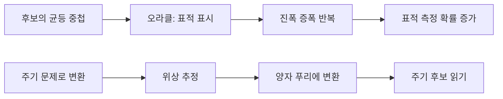

> [!abstract] 이 노트의 질문
> Grover와 Shor는 모두 양자 회로를 쓰지만, 하나는 **표적 상태의 진폭을 키우는 검색**이고 다른 하나는 **숨겨진 주기를 읽는 인수분해 경로**다. 공통 게이트보다 정보 목표의 차이부터 분리한다.

## 1. 두 알고리즘을 한 표로 섞지 않기

<Tabs>
<Tab label="Grover">

여러 후보 중 정답 상태 $|\omega\rangle$를 더 잘 측정되도록 만든다. 초기 균등 중첩에서 출발해 오라클과 증폭을 반복한다.

</Tab>
<Tab label="Shor">

인수분해 문제를 주기 찾기 문제로 바꾼 뒤, 양자 위상 추정과 푸리에 변환으로 주기 정보를 뽑는 흐름을 제시한다.

</Tab>
<Tab label="공통 기반">

두 흐름 모두 제어 게이트·위상·푸리에 또는 간섭의 해석을 요구한다. 그러나 같은 회로 부품을 쓴다고 같은 문제를 푸는 것은 아니다.

</Tab>
</Tabs>



> [!note] 비교의 기준
> Grover의 핵심은 “어느 상태를 더 자주 읽게 할까”이고, Shor 파트의 핵심은 “어떤 주기 정보를 읽어 낼까”다. 이 둘을 단순히 속도 표 하나로 합치면 알고리즘의 목적이 사라진다.

## 2. Grover — 표적 방향으로의 진폭 회전

```html preview h=185
<div style="font-family:system-ui,sans-serif;padding:14px;color:var(--foreground);background:var(--card);border:1px solid var(--border);border-radius:var(--radius)">
<svg viewBox="-45 0 765 138" width="100%" role="img" aria-label="제어 비트가 연산 적용 여부를 결정하는 독자 제작 회로 개념도">
  <text x="18" y="23" font-size="15" font-weight="700" fill="currentColor">제어 연산은 “조건이 참일 때만 바꾼다”는 양자식 표현이다</text>
  <g transform="translate(65 53)" font-family="system-ui,sans-serif">
    <text x="-31" y="18" font-size="13" fill="currentColor">제어</text><line x1="18" y1="14" x2="505" y2="14" stroke="var(--border)" stroke-width="3"/><circle cx="245" cy="14" r="10" fill="var(--chart-5)"/>
    <text x="-31" y="76" font-size="13" fill="currentColor">대상</text><line x1="18" y1="72" x2="505" y2="72" stroke="var(--border)" stroke-width="3"/><line x1="245" y1="14" x2="245" y2="72" stroke="var(--chart-5)" stroke-width="3"/><rect x="220" y="47" width="50" height="50" rx="10" fill="var(--chart-1)"/><text x="245" y="79" text-anchor="middle" font-size="18" font-weight="700" fill="white">U</text>
    <path d="M532 43h46" stroke="var(--chart-2)" stroke-width="3"/><path d="M578 43l-10-7v14z" fill="var(--chart-2)"/><text x="592" y="48" font-size="14" font-weight="700" fill="var(--chart-2)">조건부 변화</text>
  </g>
</svg>
</div>
```

강의는 오라클에서 위상을 다루기 위한 기초로 제어 게이트와 $HXH=Z$ 항등식을 먼저 복습한다. 이는 계산 기준의 X 연산을 기준 변환을 통해 위상 연산으로 읽을 수 있다는 점을 다시 보여 준다.

```html preview h=200
<div style="font-family:system-ui,sans-serif;padding:14px;color:var(--foreground);background:var(--card);border:1px solid var(--border);border-radius:var(--radius)">
<svg viewBox="0 0 720 150" width="100%" role="img" aria-label="Grover 반복이 표적 상태의 측정 가능성을 점차 키우는 독자 제작 도식">
  <text x="18" y="23" font-size="15" font-weight="700" fill="currentColor">Grover 반복의 핵심은 표적의 진폭만 선택적으로 키우는 것이다</text>
  <g transform="translate(44 48)" font-family="system-ui,sans-serif">
    <text x="0" y="18" font-size="13" fill="var(--muted-foreground)">반복 전</text><rect x="0" y="31" width="154" height="18" rx="9" fill="var(--border)"/><rect x="0" y="31" width="31" height="18" rx="9" fill="var(--chart-5)"/><text x="0" y="73" font-size="12" fill="currentColor">표적 확률 작음</text>
    <path d="M172 40h81" stroke="var(--muted-foreground)" stroke-width="3"/><path d="M253 40l-10-7v14z" fill="var(--muted-foreground)"/><text x="184" y="27" font-size="12" fill="var(--muted-foreground)">오라클 + 확산</text>
    <text x="271" y="18" font-size="13" fill="var(--muted-foreground)">반복 후</text><rect x="271" y="31" width="154" height="18" rx="9" fill="var(--border)"/><rect x="271" y="31" width="104" height="18" rx="9" fill="var(--chart-5)"/><text x="271" y="73" font-size="12" fill="currentColor">표적 확률 증가</text>
    <path d="M444 40h81" stroke="var(--muted-foreground)" stroke-width="3"/><path d="M525 40l-10-7v14z" fill="var(--muted-foreground)"/>
    <g transform="translate(546 8)"><circle cx="42" cy="32" r="31" fill="var(--chart-5)"/><path d="M30 32l9 9 18-22" fill="none" stroke="white" stroke-width="6" stroke-linecap="round" stroke-linejoin="round"/><text x="42" y="86" text-anchor="middle" font-size="13" font-weight="700" fill="currentColor">측정</text></g>
  </g>
</svg>
</div>
```

```html preview h=305px
<div style="font-family:system-ui,sans-serif;padding:18px;color:var(--foreground);border:1px solid var(--border);border-radius:var(--radius)">
  <div style="display:flex;justify-content:space-between;align-items:center;gap:12px;flex-wrap:wrap">
    <div>
      <div style="font-size:16px;font-weight:700">Grover 반복의 방향 변화</div>
      <div style="font-size:13px;color:var(--muted-foreground);margin-top:4px">강의의 2차원 상태공간 회전 그림을 조작 가능한 모형으로 다시 본다.</div>
    </div>
    <div id="iteration" style="font-weight:700;color:var(--chart-1)"></div>
  </div>
  <input id="steps" type="range" min="0" max="5" value="1" step="1" style="width:100%;margin:13px 0;accent-color:var(--primary)">
  <svg viewBox="0 0 600 175" width="100%" role="img" aria-label="Grover 반복의 표적 방향 회전">
    <line x1="75" y1="145" x2="315" y2="145" style="stroke:var(--border);stroke-width:2"/>
    <line x1="195" y1="20" x2="195" y2="160" style="stroke:var(--border);stroke-width:2"/>
    <circle cx="195" cy="145" r="94" style="fill:none;stroke:var(--border);stroke-width:2"/>
    <line x1="195" y1="145" x2="195" y2="38" style="stroke:var(--chart-2);stroke-width:4"/>
    <text x="205" y="42" style="fill:var(--chart-2);font-size:14px">표적 |ω⟩</text>
    <line id="state" x1="195" y1="145" x2="272" y2="91" style="stroke:var(--chart-1);stroke-width:5;stroke-linecap:round"/>
    <circle id="stateTip" cx="272" cy="91" r="6" style="fill:var(--chart-1)"/>
    <text x="365" y="73" style="fill:var(--foreground);font-size:15px;font-weight:700">해석</text>
    <text id="message" x="365" y="102" style="fill:var(--muted-foreground);font-size:14px"></text>
  </svg>
</div>
<script>
  (function () {
    var slider = document.getElementById('steps');
    var state = document.getElementById('state');
    var tip = document.getElementById('stateTip');
    var output = document.getElementById('iteration');
    var message = document.getElementById('message');
    function draw() {
      var step = Number(slider.value);
      var deg = 38 + step * 9;
      var rad = deg * Math.PI / 180;
      var x = 195 + 94 * Math.cos(rad);
      var y = 145 - 94 * Math.sin(rad);
      state.setAttribute('x2', x.toFixed(1));
      state.setAttribute('y2', y.toFixed(1));
      tip.setAttribute('cx', x.toFixed(1));
      tip.setAttribute('cy', y.toFixed(1));
      output.textContent = '반복 ' + step;
      message.textContent = step === 0 ? '균등 중첩에서 시작' : '표적 방향과의 각도가 줄어드는 모형';
    }
    slider.addEventListener('input', draw);
    draw();
  }());
</script>
```

<details>
<summary>회전 횟수를 무한히 늘리면 항상 더 좋아질까?</summary>

강의 슬라이드는 반복마다 상태 벡터가 일정 각도로 표적 방향을 향해 회전하고, 최적 횟수 부근에서 표적과 거의 일치한다고 설명한다. 따라서 이 그림은 “반복할수록 무조건 좋다”가 아니라 **목표에 가까워지는 구간과 최적 반복 횟수**를 구분해서 읽어야 한다.

</details>

```html preview h=190
<div style="font-family:system-ui,sans-serif;padding:14px;color:var(--foreground);background:var(--card);border:1px solid var(--border);border-radius:var(--radius)">
<svg viewBox="0 0 720 142" width="100%" role="img" aria-label="후보 입력을 제약 판정 상자에 통과시켜 표적에 표시를 남기는 독자 제작 오라클 도식">
  <text x="18" y="23" font-size="15" font-weight="700" fill="currentColor">오라클은 해답을 말하지 않고 “표적 여부”만 표시한다</text>
  <g transform="translate(46 48)" font-family="system-ui,sans-serif">
    <g><rect width="150" height="56" rx="12" fill="var(--card)" stroke="var(--border)"/><text x="75" y="24" text-anchor="middle" font-size="14" font-weight="700" fill="currentColor">후보 |x⟩</text><text x="75" y="43" text-anchor="middle" font-size="11" fill="var(--muted-foreground)">여러 가능성의 중첩</text></g>
    <path d="M165 28h80" stroke="var(--muted-foreground)" stroke-width="3"/><path d="M245 28l-11-8v16z" fill="var(--muted-foreground)"/>
    <g transform="translate(260)"><rect width="165" height="56" rx="12" fill="var(--chart-4)"/><text x="82" y="25" text-anchor="middle" font-size="16" font-weight="700" fill="white">제약 판정</text><text x="82" y="43" text-anchor="middle" font-size="11" fill="white">f(x) = 표적 여부</text></g>
    <path d="M444 28h80" stroke="var(--muted-foreground)" stroke-width="3"/><path d="M524 28l-11-8v16z" fill="var(--muted-foreground)"/>
    <g transform="translate(539)"><rect width="120" height="56" rx="12" fill="var(--card)" stroke="var(--chart-5)" stroke-width="2"/><text x="60" y="24" text-anchor="middle" font-size="14" font-weight="700" fill="currentColor">위상 표시</text><text x="60" y="43" text-anchor="middle" font-size="11" fill="var(--chart-5)">표적만 구별</text></g>
  </g>
</svg>
</div>
```

> [!tip] 오라클은 정답을 출력하는 상자가 아니다
> 이 강의의 오라클 예시는 XOR 구조로 제약을 계산한다. Grover의 역할은 오라클이 표시한 표적을 측정에서 두드러지게 만드는 것이며, 오라클 자체의 문제 정의를 대신하지 않는다.

## 3. Shor — 주기를 읽어 인수분해 경로로 연결하기

강의는 인수분해의 양자 부분을 위상 추정과 양자 푸리에 변환으로 나누고, 숨겨진 주기 정보를 효율적으로 추출하는 흐름으로 설명한다.

```html preview h=195
<div style="font-family:system-ui,sans-serif;padding:14px;color:var(--foreground);background:var(--card);border:1px solid var(--border);border-radius:var(--radius)">
<svg viewBox="0 0 720 145" width="100%" role="img" aria-label="주기적 패턴을 주파수 표현으로 바꾸어 반복 간격을 읽는 독자 제작 도식">
  <text x="18" y="23" font-size="15" font-weight="700" fill="currentColor">푸리에 변환은 반복되는 패턴을 “주기 후보”로 읽기 좋게 바꾼다</text>
  <g transform="translate(35 48)">
    <rect width="223" height="72" rx="10" fill="var(--card)" stroke="var(--border)"/><path d="M14 40 C28 8 42 8 56 40 S84 72 98 40 S126 8 140 40 S168 72 182 40 S210 8 214 30" fill="none" stroke="var(--chart-1)" stroke-width="4"/><text x="112" y="62" text-anchor="middle" font-size="12" fill="var(--muted-foreground)">반복되는 입력 패턴</text>
    <path d="M244 36h83" stroke="var(--muted-foreground)" stroke-width="3"/><path d="M327 36l-11-8v16z" fill="var(--muted-foreground)"/><rect x="341" y="11" width="58" height="50" rx="11" fill="var(--chart-4)"/><text x="370" y="42" text-anchor="middle" font-size="16" font-weight="700" fill="white">QFT</text>
    <path d="M417 36h83" stroke="var(--muted-foreground)" stroke-width="3"/><path d="M500 36l-11-8v16z" fill="var(--muted-foreground)"/>
    <rect x="514" width="160" height="72" rx="10" fill="var(--card)" stroke="var(--border)"/><line x1="529" y1="58" x2="659" y2="58" stroke="var(--border)" stroke-width="2"/><rect x="546" y="35" width="17" height="23" rx="3" fill="var(--chart-2)"/><rect x="589" y="10" width="17" height="48" rx="3" fill="var(--chart-5)"/><rect x="632" y="31" width="17" height="27" rx="3" fill="var(--chart-3)"/><text x="594" y="92" text-anchor="middle" font-size="12" fill="var(--muted-foreground)">두드러진 주파수 후보</text>
  </g>
</svg>
</div>
```

```html preview h=265px
<div style="font-family:system-ui,sans-serif;padding:18px;color:var(--foreground);border:1px solid var(--border);border-radius:var(--radius)">
  <div style="font-size:16px;font-weight:700">Shor 파트의 정보 이동</div>
  <div style="font-size:13px;color:var(--muted-foreground);margin:4px 0 14px">강의에서 제시한 “주기 → 푸리에 변환 → 읽기”의 논리적 순서다.</div>
  <svg viewBox="0 0 760 145" width="100%" role="img" aria-label="Shor의 주기 추출 흐름">
    <rect x="25" y="48" width="155" height="56" rx="10" style="fill:var(--card);stroke:var(--chart-4);stroke-width:3"/>
    <rect x="300" y="48" width="155" height="56" rx="10" style="fill:var(--card);stroke:var(--chart-1);stroke-width:3"/>
    <rect x="575" y="48" width="155" height="56" rx="10" style="fill:var(--card);stroke:var(--chart-2);stroke-width:3"/>
    <path d="M188 76 L288 76 M463 76 L563 76" style="stroke:var(--muted-foreground);stroke-width:3;fill:none"/>
    <text x="102" y="70" text-anchor="middle" style="fill:var(--foreground);font-size:15px;font-weight:700">주기성</text>
    <text x="102" y="90" text-anchor="middle" style="fill:var(--muted-foreground);font-size:12px">함수의 반복 구조</text>
    <text x="377" y="70" text-anchor="middle" style="fill:var(--foreground);font-size:15px;font-weight:700">QFT</text>
    <text x="377" y="90" text-anchor="middle" style="fill:var(--muted-foreground);font-size:12px">푸리에 기준으로 변환</text>
    <text x="652" y="70" text-anchor="middle" style="fill:var(--foreground);font-size:15px;font-weight:700">주기 후보</text>
    <text x="652" y="90" text-anchor="middle" style="fill:var(--muted-foreground);font-size:12px">고전적 후처리로 연결</text>
  </svg>
</div>
```

> [!important] 속도 그림의 해석 범위
> 원본 QFT 슬라이드는 고전 DFT와 QFT의 계산량 곡선을 나란히 제시한다. 이 노트는 그 그림을 **강의가 제시한 QFT 단계의 계산상 이점**으로만 읽으며, 전체 Shor 구현·하드웨어·오류 보정까지 자동으로 지수적 우위가 증명된다는 주장으로 확장하지 않는다.

<details>
<summary>이 노트가 Shor의 완전한 실행 증거를 주장하지 않는 이유</summary>

원본 PDF는 59쪽이지만 렌더된 자산은 42쪽까지만 있다. 또한 확인한 자산은 알고리즘 흐름과 QFT 설명을 보일 뿐, 특정 입력의 전 과정을 실행해 인수를 출력한 결과를 보이지 않는다. 따라서 여기서는 주기 추출의 구조만 정리한다.

</details>

## 4. 한 번에 회수하기

- Grover는 오라클이 표시한 표적 상태 쪽으로 진폭을 증폭한다.
- Shor 파트는 주기 정보를 위상 추정과 QFT로 읽어 인수분해 경로에 쓴다.
- 두 알고리즘의 차이는 게이트 이름보다 **무엇을 측정 가능하게 만드는가**에서 가장 선명하다.
