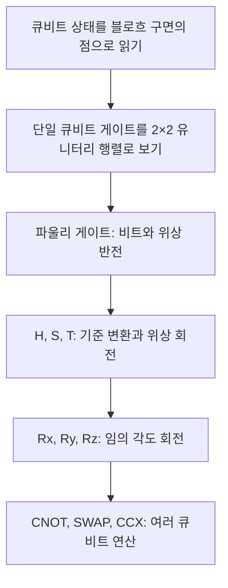
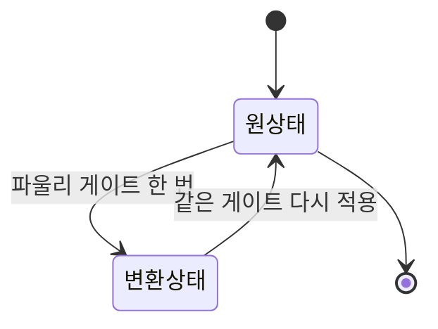
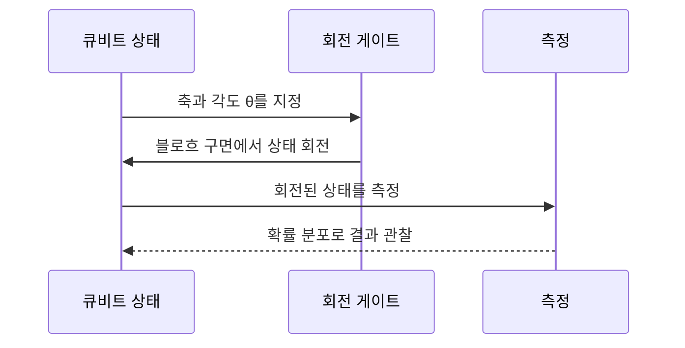

> [!abstract] 이 문서가 답하는 질문
> 양자 게이트를 행렬의 기호 목록으로 외우지 않고, 블로흐 구면의 회전과 큐비트 사이의 조건부 작용으로 어떻게 읽을 수 있는가?

## 전체 지도



이 강의는 **상태의 시각화 → 단일 큐비트 연산 → 다중 큐비트 연산**의 순서로 전개된다. 게이트를 하나의 독립된 기호로 보기보다, 상태를 어느 축으로 얼마나 회전시키는지와 다른 큐비트에 어떤 의존성을 만드는지를 함께 읽는 것이 핵심이다.

## 1. 블로흐 구면과 게이트의 공통 언어

블로흐 구면은 큐비트의 상태를 3차원 구 위의 한 점으로 표현한다. 북극은 \(\lvert 0\rangle\), 남극은 \(\lvert 1\rangle\), 적도에는 \(\lvert +\rangle\), \(\lvert -\rangle\) 같은 중첩 상태가 놓인다. 강의는 브라–켓 표기법을 이 시각화와 연결한다.

> [!info] 상태를 읽는 기준
> Z축의 두 극점은 계산 기저 \(\lvert 0\rangle, \lvert 1\rangle\)이고, X축의 적도 지점은 \(\lvert +\rangle, \lvert -\rangle\)로 표시된다. 따라서 같은 상태도 어느 기저에서 보느냐에 따라 다른 모습으로 설명할 수 있다.


이미지의 세 축은 게이트를 “상태 벡터의 회전”으로 읽는 방법을 보여준다. X축 회전은 \(\lvert 0\rangle\)과 \(\lvert 1\rangle\)을 서로 바꾸는 방향이고, Z축 회전은 적도에서 위상을 바꾸는 방향이며, Y축 회전은 복소 평면의 회전으로 설명된다.

모든 단일 큐비트 게이트는 2×2 유니터리 행렬로 표현된다. 유니터리라는 조건은 노름을 보존하고, 정보 손실 없이 역연산을 정의할 수 있음을 뜻한다.

$$
U^\dagger U = I
$$

> [!important] 회전과 가역성
> 행렬 표현은 단순한 계산 표기가 아니다. ==유니터리 조건== 때문에 양자 게이트는 상태의 길이를 보존하고 되돌릴 수 있다. 두 번 적용하면 원상태로 돌아오는 파울리 게이트는 이 성질을 가장 직관적으로 보여준다.

## 2. 파울리 게이트: 180° 회전의 세 방향

파울리 게이트 \(X, Y, Z\)는 각각 X·Y·Z축을 기준으로 180° 회전을 만든다. 강의의 요약은 세 게이트의 차이를 비트 정보와 위상 정보의 변화로 정리한다.

| 게이트 | 회전축과 각도 | 상태에 주는 변화 | 읽을 때의 질문 |
| --- | --- | --- | --- |
| \(X\) | X축, 180° | Bit Flip | \(\lvert 0\rangle\leftrightarrow\lvert 1\rangle\)인가? |
| \(Y\) | Y축, 180° | Bit & Phase Flip | 비트와 위상이 함께 바뀌는가? |
| \(Z\) | Z축, 180° | Phase Flip | 적도에서 위상만 반전되는가? |


> [!tip] 자기 자신이 역연산
> \(X^2=Y^2=Z^2=I\)로 읽을 수 있다. 같은 파울리 게이트를 두 번 적용하면 처음 상태로 돌아오므로, 회로를 단순화할 때 연속된 동일 게이트를 지울 수 있다.



## 3. H, S, T: 기준을 바꾸고 위상을 조절하기

Hadamard \(H\) 게이트는 Z축의 계산 기저를 X축의 기저로 바꾸는 기준 변환으로 설명된다. 같은 변환을 두 번 적용하면 원래 기준으로 돌아온다.

$$
H^2 = I
$$

강의는 기준을 바꿔 게이트를 다시 읽는 관계도 제시한다.

$$
HZH = X,\qquad HXH = Z
$$

<Tabs>
  <Tab label="Hadamard H">
    <p><strong>역할:</strong> 계산 기저와 X 기저 사이를 변환한다.</p>
    <p><strong>핵심 관계:</strong> $H^2=I$이므로 동일한 기준 변환을 두 번 적용하면 항등 연산이 된다.</p>
  </Tab>
  <Tab label="위상 회전 S·T">
    <p><strong>S:</strong> Z축 기준 $90^\circ$ 회전이며 $\sqrt{Z}$ 게이트로 설명된다.</p>
    <p><strong>T:</strong> Z축 기준 $45^\circ$ 회전이다. 강의는 범용 양자 연산과 FTQC에서의 중요성을 강조한다.</p>
  </Tab>
</Tabs>

<details>
<summary>H를 두 번 적용하면 왜 I인가</summary>

Hadamard 행렬은 다음과 같이 쓸 수 있고, 행렬 곱을 계산하면 대각 원소가 1인 항등 행렬이 된다.

$$
H=\frac{1}{\sqrt{2}}
\begin{bmatrix}
1 & 1\\
1 & -1
\end{bmatrix},
\qquad
H H = I
$$

이 관계는 “기준을 바꾸는 관점”을 한 번 더 되돌리는 것으로 해석할 수 있다.

</details>

> [!note] 위상 회전의 범위
> \(S^\dagger\)는 \(S\)의 반대 방향 \(-\pi/2\) 회전이다. \(T\)는 \(\pi/4\) 회전이며, 강의는 \(H,S,\mathrm{CNOT}\)만으로는 모든 양자 연산을 만들 수 없고 T 게이트가 추가되어야 범용성이 생긴다고 설명한다.

## 4. 임의 각도 회전과 PQC

\(X,Z,S,T\)처럼 고정된 각도만으로는 최적화나 양자 머신러닝에서 필요한 미세 조정을 표현하기 어렵다. 강의는 파라미터 \(\theta\)를 갖는 Parameterized Quantum Circuit(PQC)을 이 문제의 해법으로 소개한다.

| 회전 게이트 | 기준 축 | 강의에서 강조한 용도 |
| --- | --- | --- |
| \(R_x(\theta)\) | X축 | X축을 기준으로 임의 각도 회전 |
| \(R_y(\theta)\) | Y축 | \(\lvert 0\rangle\)에서 확률을 직관적으로 조절 |
| \(R_z(\theta)\) | Z축 | 위상 방향을 임의 각도로 조절 |



```html preview
<div style="font-family:system-ui,sans-serif;padding:20px;color:var(--foreground)">
  <h3 style="margin:0 0 14px;font-size:15px;font-weight:600">강의에 나온 대표 회전각</h3>
  <div id="angles" style="display:flex;gap:10px;align-items:flex-end;height:150px"></div>
  <script>
    var data = [['X',180],['Y',180],['Z',180],['S',90],['T',45]];
    var max = 180;
    document.getElementById('angles').innerHTML = data.map(function (d, i) {
      return '<div style="flex:1;display:flex;flex-direction:column;align-items:center;gap:6px;height:100%;justify-content:flex-end">' +
        '<span style="font-size:12px;font-weight:600">' + d[1] + '°</span>' +
        '<div style="width:100%;height:' + (d[1] / max * 100) + '%;background:var(--chart-' + (i % 5 + 1) + ');border-radius:var(--radius) var(--radius) 0 0"></div>' +
        '<span style="font-size:12px;color:var(--muted-foreground)">' + d[0] + '</span>' +
        '</div>';
    }).join('');
  </script>
</div>
```

> [!example] Ry를 먼저 떠올릴 때
> 강의는 \(\lvert 0\rangle\)에서 \(R_y(\theta)\)를 적용하면 상대 위상 없이 확률을 조절하기 쉽다고 설명한다. 따라서 “확률을 바꾸는가, 위상을 바꾸는가?”를 먼저 물으면 세 회전 게이트를 구분하기 쉽다.

## 5. 다중 큐비트: 조건부 작용에서 정보 이동까지

### CNOT(CX): 제어 큐비트가 만드는 의존성

CNOT은 Control이 1일 때만 Target을 반전시키는 조건부 논리 연산이다. 진리표는 고전 XOR와 같은 입력·출력 관계를 보여준다.

| 입력 \((C,T)\) | 출력 \((C,T)\) |
| --- | --- |
| \((0,0)\) | \((0,0)\) |
| \((0,1)\) | \((0,1)\) |
| \((1,0)\) | \((1,1)\) |
| \((1,1)\) | \((1,0)\) |

```python
def cnot(control, target):
    """슬라이드의 if(Control == 1) 규칙을 옮긴 의사코드."""
    if control == 1:
        target = 1 - target
    return control, target
```

제어 큐비트가 중첩 상태일 때 CNOT을 통과하면 두 큐비트의 측정 결과가 강하게 상관된 얽힘 상태가 될 수 있다.


\[
|\psi_{\mathrm{entangled}}\rangle =
\frac{1}{\sqrt{2}}\left(\lvert 00\rangle+\lvert 11\rangle\right)
\]

> [!warning] 얽힘을 “복사”로 이해하지 않기
> 강의의 설명처럼 얽힘은 두 단일 큐비트 상태의 곱으로 분해되지 않는 상관 구조다. 한 큐비트의 내용을 복사해 두 곳에 붙이는 과정이 아니라, 두 큐비트의 상태가 하나의 결합된 상태로 기술되는 것이다.

### SWAP과 CCX

SWAP은 두 큐비트의 확률 진폭과 위상 정보를 서로 맞바꾼다. 실제 하드웨어의 연결성이 제한될 때 멀리 있는 큐비트 사이의 연산을 위해 상태를 옆으로 전달하는 데 사용되며, 강의는 SWAP이 3개의 CNOT으로 구성되어 비용이 크다고 설명한다.

| 게이트 | 입력 조건 | 결과·역할 | 회로 비용 관점 |
| --- | --- | --- | --- |
| SWAP | 두 큐비트 | \(q_0,q_1\)의 상태를 교환 | CNOT 3개로 구성 |
| CCX | 두 Control 큐비트가 모두 1 | Target만 반전 | 가역 논리와 범용성 |

> [!caution] 원본 표기 오류
> 부록의 CCX 게이트 제목과 본문에는 To3oli와 ToIoli 표기가 보인다. 이 표기는 원본에 있는 그대로이며, 이 문서에서는 오류를 임의로 고치지 않고 CCX의 조건부 동작만 설명한다.

## 핵심 정리

| 층위 | 기억할 문장 |
| --- | --- |
| 시각화 | 블로흐 구면의 축과 회전으로 큐비트 상태 변화를 읽는다. |
| 단일 큐비트 | 파울리 게이트는 180° 반전, H·S·T는 기준과 위상을 조절한다. |
| 매개변수 | \(R_x,R_y,R_z\)는 PQC에서 임의 각도 \(\theta\)를 제공한다. |
| 다중 큐비트 | CNOT은 조건부 작용, SWAP은 상태 교환, CCX는 두 제어의 조건부 반전이다. |

> [!question]- 스스로 점검
> **Q1.** \(H Z H\)와 \(H X H\)가 각각 어떤 게이트와 같은 효과를 내는가?
>
> **A1.** \(HZH=X\), \(HXH=Z\)이다.
>
> **Q2.** CNOT의 Control이 0일 때 Target은 어떻게 되는가?
>
> **A2.** Target은 그대로 유지된다. Control이 1일 때만 Target이 반전된다.

## 출처

- [1. 양자 기초 게이트 설명_Jun.2026.pdf](<../sources/1. 양자 기초 게이트 설명_Jun.2026.pdf>)

슬라이드 근거는 본문에 실제로 임베드한 렌더 이미지 세 장으로 제한했다.
