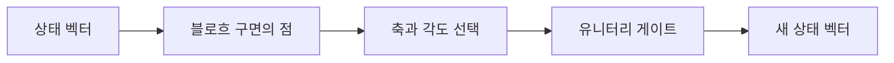
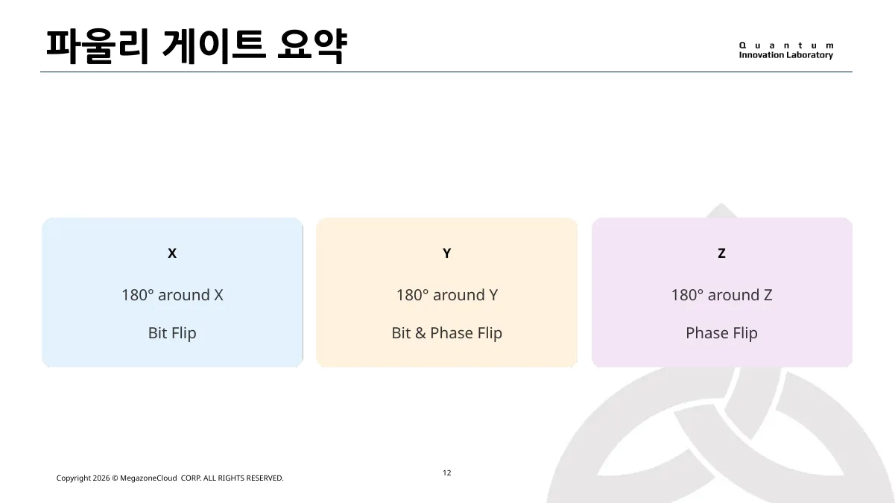
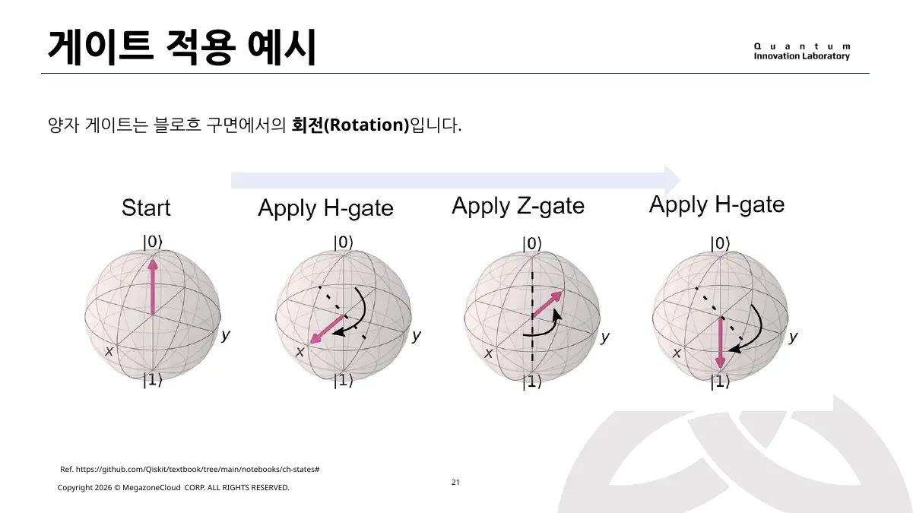
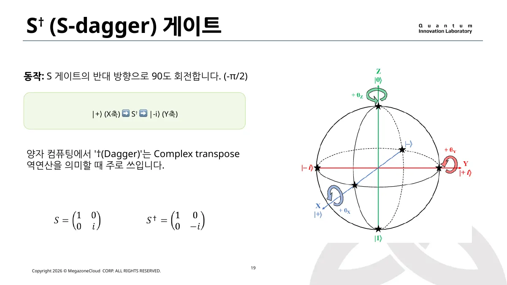
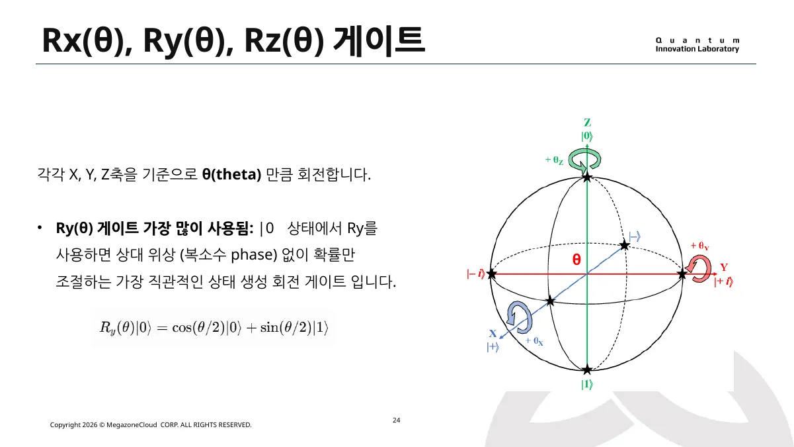
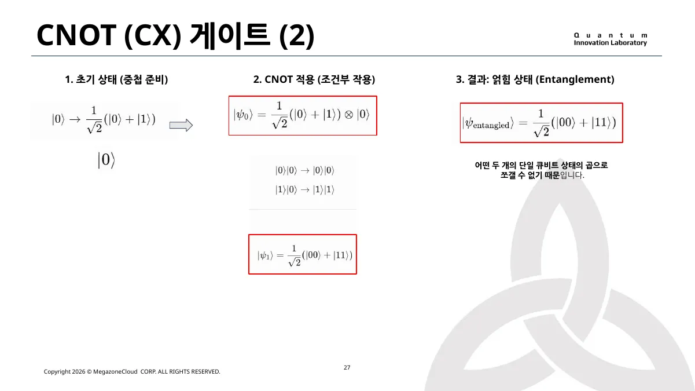

> [!abstract] 이 노트의 질문
> 게이트는 비트를 바꾸는 명령이 아니라, **큐비트 상태 벡터를 회전시키는 가역 연산**이다. 블로흐 구면의 좌표·기준·두 큐비트의 조건부 작용을 한 흐름으로 연결한다.

## 1. 먼저 잡을 관점 — 상태는 구면 위의 점이다

단일 큐비트는 블로흐 구면 위의 한 점으로 생각할 수 있다. 북극은 $|0\rangle$, 남극은 $|1\rangle$, 적도 위의 $|+\rangle$와 $|-\rangle$는 중첩 상태를 나타낸다. 이때 게이트는 그 점을 X·Y·Z축을 기준으로 회전시키는 연산이다.

> [!note] 행렬로 읽기
> 원본 강의는 모든 단일 큐비트 게이트를 $2 \times 2$ 유니터리 행렬로 소개한다. 유니터리라는 조건은 ==길이 보존==, ==정보 손실 없음==, ==역연산 가능==을 한꺼번에 뜻한다.



## 2. 파울리 게이트 — 세 축의 180도 회전



<Tabs>
<Tab label="X: 비트 반전">

$X$는 X축 기준의 180도 회전이다. 계산 기준에서는 $|0\rangle$과 $|1\rangle$을 맞바꾸므로 비트 반전으로 읽힌다.

$$
X|0\rangle=|1\rangle,\qquad X|1\rangle=|0\rangle
$$

</Tab>
<Tab label="Z: 위상 반전">

$Z$는 Z축 기준의 180도 회전이다. 계산 기준의 확률은 그대로 두지만, 중첩 상태에서는 상대 위상을 바꾼다.

$$
Z|+\rangle=|-\rangle
$$

</Tab>
<Tab label="Y: 두 효과의 결합">

$Y$는 Y축 기준의 180도 회전이다. 강의의 요약처럼 비트 반전과 위상 반전을 함께 일으키는 연산으로 볼 수 있다.

</Tab>
</Tabs>

<details>
<summary>왜 같은 파울리 게이트를 두 번 적용하면 되돌아올까?</summary>

파울리 게이트는 자기 자신의 역행렬이다. 따라서 $X^2=Y^2=Z^2=I$ 이고, 같은 게이트를 연속 두 번 적용하면 원래 상태로 돌아온다. 이 성질은 회로에서 서로 상쇄되는 게이트를 찾는 출발점이다.

</details>

> [!tip] 암기보다 회전축
> “X는 값, Z는 위상”으로 외우기보다, **어느 축을 기준으로 180도 회전하는가**를 먼저 잡으면 중첩 상태에서의 차이까지 설명할 수 있다.

## 3. 기준을 바꾸는 H, 위상을 누적하는 S·T

H 게이트는 계산 기준의 $|0\rangle,|1\rangle$를 X축 기준의 $|+\rangle,|-\rangle$로 옮긴다. 즉 관측값을 바꾸기 전에 ==어떤 기준으로 상태를 읽을지==를 바꾸는 연산이다.



$$
HZH=X,\qquad HXH=Z
$$

<details>
<summary>두 식이 말하는 것</summary>

$H$를 앞뒤에 두면 Z축의 위상 반전이 X축의 비트 반전으로 보인다. 반대로 X축의 반전도 Z 기준에서는 위상 반전으로 읽힌다. 같은 행렬 효과라도 **기준이 달라지면 해석이 달라진다**는 것이 핵심이다.

</details>



> [!important] S와 T의 역할
> $S$는 Z축 기준 $\pi/2$ 회전, $T$는 $\pi/4$ 회전이다. 강의는 H·S·CNOT만으로는 모든 양자 연산을 만들 수 없고, T가 더해져야 범용적인 연산 구성이 가능하다고 설명한다.

## 4. 임의 회전 — 학습 가능한 각도 만들기

고정된 180도·90도·45도 회전만으로는 미세한 상태 조절이 어렵다. $R_x(\theta)$, $R_y(\theta)$, $R_z(\theta)$는 각도 $\theta$를 받아 임의의 회전을 만들며, 이 구조가 매개변수화 양자 회로의 출발점이 된다.



$$
R_y(\theta)|0\rangle
= \cos(\theta/2)|0\rangle + \sin(\theta/2)|1\rangle
$$

```html preview h=330px
<div style="font-family:system-ui,sans-serif;padding:18px;color:var(--foreground);border:1px solid var(--border);border-radius:var(--radius)">
  <div style="display:flex;justify-content:space-between;gap:16px;align-items:center;flex-wrap:wrap">
    <div>
      <strong style="font-size:16px">R_y(θ) 상태 회전</strong>
      <div style="font-size:13px;color:var(--muted-foreground);margin-top:4px">슬라이더로 θ를 바꾸면 두 진폭이 함께 변한다.</div>
    </div>
    <div id="readout" style="font-weight:700;color:var(--chart-1)">θ = 90°</div>
  </div>
  <svg viewBox="0 0 420 155" width="100%" role="img" aria-label="Ry 회전에 따른 진폭 시각화" style="margin-top:12px">
    <line x1="45" y1="125" x2="375" y2="125" style="stroke:var(--border);stroke-width:2"/>
    <rect id="amp0" x="95" y="45" width="80" height="80" rx="8" style="fill:var(--chart-1)"/>
    <rect id="amp1" x="245" y="45" width="80" height="80" rx="8" style="fill:var(--chart-2)"/>
    <text x="135" y="145" text-anchor="middle" style="fill:var(--foreground);font-size:14px">|0⟩ 진폭</text>
    <text x="285" y="145" text-anchor="middle" style="fill:var(--foreground);font-size:14px">|1⟩ 진폭</text>
    <text id="v0" x="135" y="38" text-anchor="middle" style="fill:var(--foreground);font-size:13px"></text>
    <text id="v1" x="285" y="38" text-anchor="middle" style="fill:var(--foreground);font-size:13px"></text>
  </svg>
  <input id="theta" type="range" min="0" max="180" value="90" style="width:100%;accent-color:var(--primary)">
</div>
<script>
  (function () {
    var slider = document.getElementById('theta');
    var amp0 = document.getElementById('amp0');
    var amp1 = document.getElementById('amp1');
    var v0 = document.getElementById('v0');
    var v1 = document.getElementById('v1');
    var readout = document.getElementById('readout');
    function draw() {
      var deg = Number(slider.value);
      var rad = deg * Math.PI / 180;
      var a0 = Math.cos(rad / 2);
      var a1 = Math.sin(rad / 2);
      amp0.setAttribute('height', String(80 * Math.abs(a0)));
      amp0.setAttribute('y', String(125 - 80 * Math.abs(a0)));
      amp1.setAttribute('height', String(80 * Math.abs(a1)));
      amp1.setAttribute('y', String(125 - 80 * Math.abs(a1)));
      v0.textContent = a0.toFixed(2);
      v1.textContent = a1.toFixed(2);
      readout.textContent = 'θ = ' + deg + '°';
    }
    slider.addEventListener('input', draw);
    draw();
  }());
</script>
```

> [!caution] 이 시각화의 범위
> 위 인터랙션은 $R_y(\theta)|0\rangle$만 다룬다. 일반 상태의 상대 위상까지 표시하지 않으므로, $R_z$나 복소 위상 효과를 같은 그림으로 일반화하면 안 된다.

## 5. CNOT — 조건부 작용에서 얽힘으로

CNOT은 제어 큐비트가 1일 때만 타깃에 X를 적용한다. 제어 큐비트가 이미 중첩이면, 조건부 작용 뒤 두 큐비트의 상태는 서로 독립적으로 쪼갤 수 없게 될 수 있다.



$$
\frac{1}{\sqrt2}(|0\rangle+|1\rangle)\otimes|0\rangle
\xrightarrow{\mathrm{CNOT}}
\frac{1}{\sqrt2}(|00\rangle+|11\rangle)
$$

```html preview h=265px
<div style="font-family:system-ui,sans-serif;padding:18px;color:var(--foreground);border:1px solid var(--border);border-radius:var(--radius)">
  <div style="font-weight:700;font-size:16px">CNOT의 조건부 흐름</div>
  <svg viewBox="0 0 700 145" width="100%" role="img" aria-label="CNOT 제어와 타깃 큐비트 회로">
    <line x1="55" y1="45" x2="640" y2="45" style="stroke:var(--foreground);stroke-width:2"/>
    <line x1="55" y1="105" x2="640" y2="105" style="stroke:var(--foreground);stroke-width:2"/>
    <text x="18" y="50" style="fill:var(--foreground);font-size:15px">control</text>
    <text x="25" y="110" style="fill:var(--foreground);font-size:15px">target</text>
    <circle cx="270" cy="45" r="10" style="fill:var(--chart-1)"/>
    <line x1="270" y1="45" x2="270" y2="105" style="stroke:var(--chart-1);stroke-width:3"/>
    <circle cx="270" cy="105" r="22" style="fill:var(--card);stroke:var(--chart-2);stroke-width:4"/>
    <line x1="255" y1="105" x2="285" y2="105" style="stroke:var(--chart-2);stroke-width:3"/>
    <line x1="270" y1="90" x2="270" y2="120" style="stroke:var(--chart-2);stroke-width:3"/>
    <text x="355" y="82" style="fill:var(--muted-foreground);font-size:14px">control = 1일 때 target에 X 적용</text>
    <path d="M530 45 C570 45 570 105 610 105" style="fill:none;stroke:var(--chart-3);stroke-width:4;stroke-linecap:round"/>
    <text x="515" y="30" style="fill:var(--chart-3);font-size:13px">중첩이면 상관 생성 가능</text>
  </svg>
</div>
```

> [!example] 연결해서 읽기
>
> 1. H로 제어 큐비트를 중첩으로 준비한다.  
> 2. CNOT을 적용한다.  
> 3. 결과가 $|00\rangle$와 $|11\rangle$의 합으로 남아 있으면, 이를 두 단일 큐비트 상태의 곱으로 분해할 수 없다.

## 6. 한 장으로 회수하기

- X·Y·Z는 서로 다른 축의 180도 회전이다.
- H는 기준을 바꾸므로 비트 반전과 위상 반전의 해석을 교환할 수 있다.
- $R_y(\theta)$는 각도를 매개변수로 받아 상태 생성 비율을 조절한다.
- CNOT은 조건부 작용을 통해 두 큐비트의 상관과 얽힘을 만들 수 있다.
