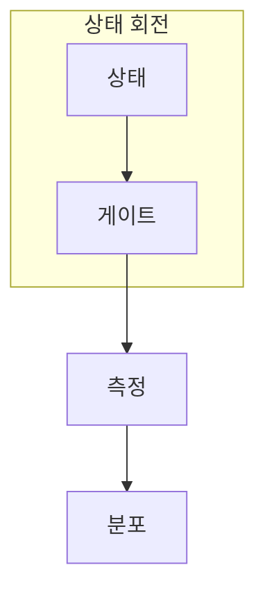

> [!question] 학습 질문
> 게이트는 언제 단순한 0·1 반전이 아니라, 측정 전에는 보이지 않는 **상태의 회전**이 되는가?

## 게이트를 읽는 최소 흐름



게이트는 상태 벡터에 작용하는 유니터리 연산이다. 따라서 길이를 보존하고 역연산이 존재한다. 계산 기저에서 보이는 값의 교환은 이 회전이 측정으로 드러난 한 모습일 뿐이다.

$$
U^\dagger U = I,\qquad |\psi'\rangle = U|\psi\rangle
$$

## 한 축과 한 각도: $R_y(\theta)$

$R_y$는 Y축을 기준으로 상태를 회전시킨다. $|0\rangle$에서 출발하면 각도는 두 측정 결과의 확률을 바꾼다.

$$
R_y(\theta)|0\rangle
= \cos(\theta/2)|0\rangle + \sin(\theta/2)|1\rangle
$$

```html preview h=330px
<div style="font-family:system-ui,sans-serif;padding:18px;color:var(--foreground);border:1px solid var(--border);border-radius:var(--radius);background:var(--card)">
  <div style="display:flex;justify-content:space-between;gap:12px;align-items:baseline;flex-wrap:wrap">
    <div>
      <strong style="font-size:16px">R_y(θ) 확률 시뮬레이터</strong>
      <div style="font-size:13px;color:var(--muted-foreground);margin-top:4px">각도를 움직여 측정 분포가 어떻게 바뀌는지 확인한다.</div>
    </div>
    <output id="ry-readout" aria-live="polite" style="font-weight:700;color:var(--chart-1)">θ = 90°</output>
  </div>
  <label for="ry-angle" style="display:block;font-size:13px;font-weight:600;margin:18px 0 6px">회전각 θ</label>
  <input id="ry-angle" type="range" min="0" max="180" value="90" style="width:100%;accent-color:var(--primary)">
  <div style="display:grid;grid-template-columns:repeat(2,minmax(0,1fr));gap:14px;margin-top:18px">
    <div style="min-width:0">
      <div style="display:flex;justify-content:space-between;font-size:13px"><span>|0⟩</span><strong id="p0">50.0%</strong></div>
      <div style="height:132px;background:var(--background);border:1px solid var(--border);border-radius:var(--radius);display:flex;align-items:flex-end;margin-top:7px;overflow:hidden">
        <div id="bar0" style="width:100%;height:50%;background:var(--chart-1);transition:height 120ms ease"></div>
      </div>
    </div>
    <div style="min-width:0">
      <div style="display:flex;justify-content:space-between;font-size:13px"><span>|1⟩</span><strong id="p1">50.0%</strong></div>
      <div style="height:132px;background:var(--background);border:1px solid var(--border);border-radius:var(--radius);display:flex;align-items:flex-end;margin-top:7px;overflow:hidden">
        <div id="bar1" style="width:100%;height:50%;background:var(--chart-2);transition:height 120ms ease"></div>
      </div>
    </div>
  </div>
</div>
<script>
(function () {
  var angle = document.getElementById('ry-angle');
  var readout = document.getElementById('ry-readout');
  var p0 = document.getElementById('p0');
  var p1 = document.getElementById('p1');
  var bar0 = document.getElementById('bar0');
  var bar1 = document.getElementById('bar1');
  function render() {
    var deg = Number(angle.value);
    var rad = deg * Math.PI / 180;
    var zero = Math.pow(Math.cos(rad / 2), 2) * 100;
    var one = 100 - zero;
    readout.textContent = 'θ = ' + deg + '°';
    p0.textContent = zero.toFixed(1) + '%';
    p1.textContent = one.toFixed(1) + '%';
    bar0.style.height = zero + '%';
    bar1.style.height = one + '%';
  }
  angle.addEventListener('input', render);
  render();
}());
</script>
```

이 도구는 일반 상태의 상대 위상이나 측정 후 상태 갱신을 모델링하지 않는다. 여기서 읽을 수 있는 것은 오직 $|0\rangle$에서 시작한 $R_y$ 회전의 **측정 확률 변화**다.

## X·Z·H: 값과 위상을 같은 기준으로 보지 않기

<svg viewBox="0 0 720 190" width="100%" role="img" aria-label="계산 기저와 X 기저 사이를 H 게이트가 연결하고 Z 위상 반전이 기저에 따라 다르게 읽히는 기하 도표" style="max-width:720px;height:auto;display:block;margin:1rem auto">
  <rect x="28" y="50" width="178" height="90" rx="14" style="fill:var(--card);stroke:var(--border);stroke-width:2" />
  <text x="117" y="84" text-anchor="middle" style="fill:var(--foreground);font:600 17px system-ui">계산 기저</text>
  <text x="117" y="112" text-anchor="middle" style="fill:var(--muted-foreground);font:14px system-ui">|0⟩ · |1⟩</text>
  <path d="M226 95H298" style="stroke:var(--chart-1);stroke-width:4;fill:none" />
  <path d="M298 95l-14-9v18z" style="fill:var(--chart-1)" />
  <rect x="312" y="63" width="78" height="64" rx="12" style="fill:var(--chart-1)" />
  <text x="351" y="103" text-anchor="middle" style="fill:var(--primary-foreground);font:700 24px system-ui">H</text>
  <path d="M408 95H480" style="stroke:var(--chart-1);stroke-width:4;fill:none" />
  <path d="M480 95l-14-9v18z" style="fill:var(--chart-1)" />
  <rect x="494" y="50" width="198" height="90" rx="14" style="fill:var(--card);stroke:var(--border);stroke-width:2" />
  <text x="593" y="84" text-anchor="middle" style="fill:var(--foreground);font:600 17px system-ui">X 기저</text>
  <text x="593" y="112" text-anchor="middle" style="fill:var(--muted-foreground);font:14px system-ui">|+⟩ · |-⟩</text>
  <text x="360" y="169" text-anchor="middle" style="fill:var(--muted-foreground);font:14px system-ui">H는 상태의 관측 기준을 바꾸므로, Z 위상 변화는 다른 기준에서 X 변화로 읽힌다.</text>
</svg>

$X$는 계산 기저에서 $|0\rangle$과 $|1\rangle$을 바꾸지만, $Z$는 중첩 상태의 상대 위상을 바꾼다. H를 앞뒤에 두면 이 해석이 교환된다.

$$
X|0\rangle = |1\rangle,\qquad Z|+\rangle = |-\rangle,\qquad HZH = X
$$

<details>
<summary>H가 기준을 바꾼다는 말의 짧은 확인</summary>

$H$는 자기 자신의 역행렬이므로 $H^2=I$다. 따라서 상태를 H로 X 기저에 옮겨 Z를 적용하고 다시 H로 되돌리면, 계산 기저에서는 X를 적용한 것과 같은 결과가 남는다. 이 등식은 “값”과 “위상”이 절대적인 라벨이 아니라 **읽는 기저에 의존하는 설명**임을 보여 준다.

</details>

```html preview h=210px
<div style="font-family:system-ui,sans-serif;padding:18px;color:var(--foreground);border:1px solid var(--border);border-radius:var(--radius);background:var(--card)">
  <strong style="font-size:16px">게이트를 구별하는 관측 질문</strong>
  <div style="display:grid;grid-template-columns:repeat(auto-fit,minmax(150px,1fr));gap:12px;margin-top:14px">
    <div style="padding:14px;border:1px solid var(--border);border-radius:var(--radius)"><div style="font-weight:700;color:var(--chart-1)">X</div><div style="font-size:13px;margin-top:5px">계산 기저에서 0과 1이 바뀌는가?</div></div>
    <div style="padding:14px;border:1px solid var(--border);border-radius:var(--radius)"><div style="font-weight:700;color:var(--chart-4)">Z</div><div style="font-size:13px;margin-top:5px">중첩의 상대 위상이 바뀌는가?</div></div>
    <div style="padding:14px;border:1px solid var(--border);border-radius:var(--radius)"><div style="font-weight:700;color:var(--chart-2)">H</div><div style="font-size:13px;margin-top:5px">상태를 읽는 기저가 바뀌는가?</div></div>
  </div>
</div>
```

> [!caution] 해석의 경계
> X·Z·H를 “값 게이트”, “위상 게이트”, “중첩 게이트”처럼 고정된 별명으로만 외우면, 다른 기저에서 보이는 효과를 놓치기 쉽다.

## CNOT: 조건부 작용이 상관으로 이어질 때

CNOT은 제어 큐비트가 1일 때만 타깃에 X를 적용한다. 제어 큐비트를 H로 먼저 중첩시키면 결과는 각 큐비트의 독립 상태 곱으로 분해되지 않을 수 있다.

$$
\frac{1}{\sqrt2}(|0\rangle+|1\rangle)\otimes|0\rangle
\xrightarrow{\mathrm{CNOT}}
\frac{1}{\sqrt2}(|00\rangle+|11\rangle)
$$

- X·Y·Z: 서로 다른 축의 180도 회전
- H: 관측 기준을 바꾸는 변환
- $R_y(\theta)$: 회전각을 조절하는 매개변수 게이트
- CNOT: 조건부 작용으로 두 큐비트의 상관을 만들 수 있는 게이트

## 확인

$R_y(0)|0\rangle$와 $R_y(180^\circ)|0\rangle$의 측정 분포가 각각 어떻게 되는지, 위 시뮬레이터와 식을 함께 사용해 설명해 보자.
