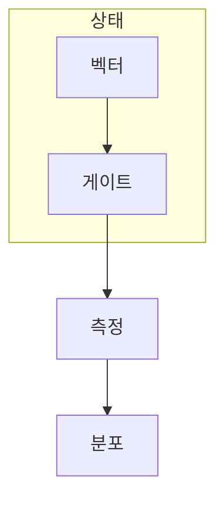

> [!abstract] 한 줄 요약
> 게이트는 ==측정값을 직접 고치는 명령==이 아니라, 측정 전에 큐비트 상태를 가역적으로 바꾸는 연산이다.

## 이 노트의 지도



## 1. 상태를 보존하며 바꾸는 연산

단일 큐비트 상태 $\vert \psi\rangle$에 게이트$U$를 적용하면 새 상태는$U\vert \psi\rangle$가 된다. 유니터리 조건은 전체 확률을 보존하고, 적용 전 상태로 되돌릴 역연산이 있음을 뜻한다.

$$
U^\dagger U = I,\qquad |\psi'\rangle = U|\psi\rangle
$$

<details>
<summary>계산 기저에서만 보이는 “반전”</summary>

X 게이트는 계산 기저에서 $\vert 0\rangle$과$\vert 1\rangle$을 바꾸므로 비트 반전처럼 보인다. 그러나 중첩 상태까지 포함하면 X는 블로흐 구면의 한 축을 기준으로 한 회전으로 이해하는 편이 정확하다.

</details>

<Tabs>
  <Tab label="X">
  계산 기저의 두 상태를 교환한다.

  $X\vert 0\rangle=\vert 1\rangle$
  </Tab>
  <Tab label="Z">
  계산 기저의 확률은 유지하면서 상대 위상을 바꾼다.

  $Z\vert +\rangle=\vert -\rangle$
  </Tab>
  <Tab label="H">
  계산 기저와 X 기저를 연결한다.

  $H\vert 0\rangle=\vert +\rangle$
  </Tab>
</Tabs>

> [!tip] 읽는 기준을 먼저 정한다
> X·Z·H를 고정된 별명으로 외우기보다, **어떤 기저에서 상태를 읽는지**를 먼저 말하면 값 변화와 위상 변화의 차이를 구분할 수 있다.

## 2. 회전각이 바꾸는 측정 분포

$R_y(\theta)$는 회전각$\theta$로 중첩의 비율을 제어한다.$\vert 0\rangle$에서 시작한 경우 두 결과의 확률은 아래처럼 변한다.

$$
R_y(\theta)|0\rangle =
\cos(\theta/2)|0\rangle+\sin(\theta/2)|1\rangle
$$

```html preview
<div style="font-family:system-ui,sans-serif;padding:20px;color:var(--foreground)">
  <label for="amt" style="font-size:14px;font-weight:600">회전각 θ</label>
  <div id="out" style="font-size:30px;font-weight:700;color:var(--chart-1);margin:6px 0">90°</div>
  <input id="amt" type="range" min="0" max="180" step="1" value="90"
    style="width:100%;accent-color:var(--primary)" />
  <p style="font-size:13px;color:var(--muted-foreground)">각도를 조정해 $R_y(\theta)$의 입력값을 바꾼다.</p>
  <script>
    var amt = document.getElementById('amt');
    var out = document.getElementById('out');
    amt.addEventListener('input', function () {
      out.textContent = 'θ = ' + Number(amt.value) + '°';
    });
  </script>
</div>
```

> [!caution] 이 차트의 범위
> 이 비교는 $\vert 0\rangle$에서 시작하는$R_y(90^\circ)$만 나타낸다. 일반 상태의 복소 위상이나 측정 뒤 상태 갱신까지 뜻하지는 않는다.

## 3. 조건부 작용과 두 큐비트 상관

CNOT은 제어 큐비트가 1일 때만 타깃에 X를 적용한다. 제어를 H로 먼저 중첩시키면, 결과는 두 단일 큐비트 상태의 곱으로 분해되지 않을 수 있다.

$$
\frac{1}{\sqrt2}(|0\rangle+|1\rangle)\otimes|0\rangle
\xrightarrow{\mathrm{CNOT}}
\frac{1}{\sqrt2}(|00\rangle+|11\rangle)
$$

## 핵심 정리

| 개념 | 상태에 하는 일 | 관측에서 확인할 점 |
| :-- | :-- | :-- |
| X | 계산 기저의 축 회전 | 상태 0과 상태 1의 교환 |
| H | 관측 기저 변환 | 중첩을 다른 기준에서 읽기 |
| $R_y(\theta)$ | 연속 회전 | 각도에 따른 분포 변화 |
| CNOT | 조건부 작용 | 두 큐비트 상관 가능성 |

> [!question]- 스스로 점검
> **Q.** $R_y(0)\vert 0\rangle$와$R_y(180^\circ)\vert 0\rangle$의 측정 분포는 어떻게 다른가?
>
> **A.** 전자는 $\vert 0\rangle$에, 후자는$\vert 1\rangle$에 확률 100%가 놓인다.

## 출처

- 공개 노트에는 원본 강의 자료, 자산 이미지, 페이지 단위 근거를 포함하지 않는다.
