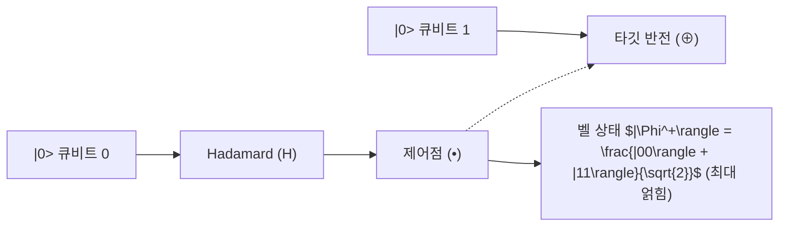

> [!abstract] 핵심 요약
> 양자 컴퓨터의 모든 논리 게이트 연산은 내적과 확률의 총합($\sum |c_i|^2 = 1$)을 보존하는 **유니터리 행렬($U^\dagger U = I$)**로 표현된다.
> **아다마르($H$) 게이트**는 결정론적 기저 상태를 균등 중첩($|+\rangle, |-\rangle$)으로 변환하여 양자 병렬성의 토대를 놓으며, 제어 큐비트에 따라 타깃 큐비트를 반전시키는 **CNOT 게이트**와 결합하여 고전적으로 분리 불가능한 **양자 얽힘(Bell State)**을 형성한다.

---

## 1. 주요 1큐비트 및 2큐비트 양자 게이트 행렬

$$X = \begin{bmatrix} 0 & 1 \\ 1 & 0 \end{bmatrix}, \quad Z = \begin{bmatrix} 1 & 0 \\ 0 & -1 \end{bmatrix}, \quad H = \frac{1}{\sqrt{2}} \begin{bmatrix} 1 & 1 \\ 1 & -1 \end{bmatrix}$$

$$\text{CNOT} = \begin{bmatrix} 1 & 0 & 0 & 0 \\ 0 & 1 & 0 & 0 \\ 0 & 0 & 0 & 1 \\ 0 & 0 & 1 & 0 \end{bmatrix}$$



---

## 2. 벨 상태(Bell States) 4대 기저

| 벨 상태 표기 | 상태 벡터 표현 | 양자 회로 구성 |
| :-- | :-- | :-- |
| $|\Phi^+\rangle$ | $\frac{1}{\sqrt{2}}(|00\rangle + |11\rangle)$ | $|00\rangle \to H(q_0) \to \text{CNOT}(q_0, q_1)$ |
| $|\Phi^-\rangle$ | $\frac{1}{\sqrt{2}}(|00\rangle - |11\rangle)$ | $|10\rangle \to H(q_0) \to \text{CNOT}(q_0, q_1)$ |
| $|\Psi^+\rangle$ | $\frac{1}{\sqrt{2}}(|01\rangle + |10\rangle)$ | $|01\rangle \to H(q_0) \to \text{CNOT}(q_0, q_1)$ |
| $|\Psi^-\rangle$ | $\frac{1}{\sqrt{2}}(|01\rangle - |10\rangle)$ | $|11\rangle \to H(q_0) \to \text{CNOT}(q_0, q_1)$ |

---

## 3. 실시간 아다마르(H) & Pauli-X 게이트 변환기

```html preview
<div style="font-family:system-ui,-apple-system,sans-serif;padding:20px;background:var(--card);color:var(--card-foreground);border:1px solid var(--border);border-radius:var(--radius)">
  <div style="font-size:16px;font-weight:700;margin-bottom:14px;color:var(--primary);display:flex;align-items:center;gap:8px">
    <span>⚡ 1큐비트 양자 게이트 상태 변환 시뮬레이터</span>
  </div>

  <div style="display:grid;grid-template-columns:1fr 1fr;gap:12px;margin-bottom:14px">
    <div>
      <label style="font-size:11px;color:var(--muted-foreground)">초기 큐비트 상태:</label>
      <select id="selInitQubit" style="width:100%;padding:5px;background:var(--background);color:var(--foreground);border:1px solid var(--border);border-radius:var(--radius);font-weight:700">
        <option value="0">|0> (기저 0)</option>
        <option value="1">|1> (기저 1)</option>
      </select>
    </div>
    <div>
      <label style="font-size:11px;color:var(--muted-foreground)">적용할 양자 게이트:</label>
      <select id="selGate" style="width:100%;padding:5px;background:var(--background);color:var(--foreground);border:1px solid var(--border);border-radius:var(--radius);font-weight:700">
        <option value="H">Hadamard (H)</option>
        <option value="X">Pauli-X (NOT)</option>
        <option value="Z">Pauli-Z (Phase Flip)</option>
      </select>
    </div>
  </div>

  <div style="padding:10px;background:var(--background);border:1px solid var(--border);border-radius:var(--radius);text-align:center">
    <div style="font-size:10px;color:var(--muted-foreground)">게이트 통과 후 최종 양자 상태 |psi></div>
    <div id="gateOutState" style="font-family:monospace;font-size:16px;font-weight:800;color:var(--primary);margin-top:2px">(|0> + |1>) / sqrt(2)  [|+>]</div>
  </div>

  <script>
    function updateGate() {
      var init = document.getElementById('selInitQubit').value;
      var gate = document.getElementById('selGate').value;
      var out = document.getElementById('gateOutState');

      if (gate === "H") {
        if (init === "0") out.textContent = "(|0> + |1>) / sqrt(2)  [|+]";
        else out.textContent = "(|0> - |1>) / sqrt(2)  [|-]";
      } else if (gate === "X") {
        if (init === "0") out.textContent = "|1> (Bit Flipped)";
        else out.textContent = "|0> (Bit Flipped)";
      } else if (gate === "Z") {
        if (init === "0") out.textContent = "|0> (No Change)";
        else out.textContent = "-|1> (Phase Flipped)";
      }
    }

    document.getElementById('selInitQubit').onchange = updateGate;
    document.getElementById('selGate').onchange = updateGate;
  </script>
</div>
```
