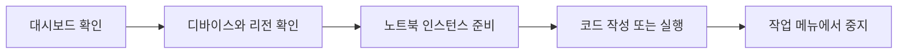

> [!abstract] 이 노트의 질문
> 강의의 콘솔 화면에서 무엇을 확인하고, 어느 지점에서 자원을 멈춰야 하는가? 이 노트는 **캡처된 UI 흐름**만을 근거로 화면의 역할과 종료 지점을 재구성한다.

---

> [!warning] 원본 표기 유의
> 원본 PDF 파일명은 “Bracket”으로 표기하지만, 캡처 화면의 서비스 이름은 “Amazon Braket”이다. 이 노트는 파일 경로는 원본 표기를 유지하고, 화면을 설명할 때는 캡처에 보이는 “Braket”을 사용한다.

## 1. 콘솔을 세 개의 질문으로 나누기

```html preview h=175
<div style="font-family:system-ui,sans-serif;padding:14px;color:var(--foreground);background:var(--card);border:1px solid var(--border);border-radius:var(--radius)">
<svg viewBox="0 0 720 128" width="100%" role="img" aria-label="양자 클라우드 작업 공간을 독자적으로 단순화한 개념도">
  <text x="18" y="23" font-size="15" font-weight="700" fill="currentColor">클라우드 실험 환경은 네 개의 작업 영역으로 나눠 볼 수 있다</text>
  <g transform="translate(22 45)" font-family="system-ui,sans-serif">
    <g><rect width="153" height="57" rx="11" fill="var(--card)" stroke="var(--chart-1)" stroke-width="2"/><circle cx="24" cy="28" r="10" fill="var(--chart-1)"/><text x="45" y="25" font-size="14" font-weight="700" fill="currentColor">설계</text><text x="45" y="43" font-size="11" fill="var(--muted-foreground)">회로와 코드</text></g>
    <g transform="translate(172)"><rect width="153" height="57" rx="11" fill="var(--card)" stroke="var(--chart-2)" stroke-width="2"/><circle cx="24" cy="28" r="10" fill="var(--chart-2)"/><text x="45" y="25" font-size="14" font-weight="700" fill="currentColor">실행</text><text x="45" y="43" font-size="11" fill="var(--muted-foreground)">시뮬레이터·장비</text></g>
    <g transform="translate(344)"><rect width="153" height="57" rx="11" fill="var(--card)" stroke="var(--chart-3)" stroke-width="2"/><circle cx="24" cy="28" r="10" fill="var(--chart-3)"/><text x="45" y="25" font-size="14" font-weight="700" fill="currentColor">관찰</text><text x="45" y="43" font-size="11" fill="var(--muted-foreground)">작업 상태·로그</text></g>
    <g transform="translate(516)"><rect width="153" height="57" rx="11" fill="var(--card)" stroke="var(--chart-4)" stroke-width="2"/><circle cx="24" cy="28" r="10" fill="var(--chart-4)"/><text x="45" y="25" font-size="14" font-weight="700" fill="currentColor">정리</text><text x="45" y="43" font-size="11" fill="var(--muted-foreground)">자원 중지·비용 점검</text></g>
  </g>
</svg>
</div>
```

대시보드는 공지·리소스·활성 노트북·디바이스를 한 화면에서 훑는 출발점이다. 강의 화면만으로도 작업 흐름을 “어디서 시작할까”가 아니라 **어떤 자원이 이미 켜져 있는가**라는 질문으로 바꾸어 볼 수 있다.

<Tabs>
<Tab label="대시보드">

활성 노트북과 디바이스 카드가 함께 보인다. 먼저 실행 중인 자원이 있는지 확인하는 관문이다.

</Tab>
<Tab label="디바이스">

사용 가능한 백엔드와 상태, 리전 선택을 확인하는 화면이다. 화면의 ONLINE/OFFLINE 표기는 강의 캡처 당시의 상태다.

</Tab>
<Tab label="노트북">

노트북 인스턴스를 만들고, 실행 중인 인스턴스를 확인하고, 작업 메뉴에서 중지하는 작업 공간이다.

</Tab>
</Tabs>



> [!note] 화면 근거의 범위
> 이 흐름은 강의가 캡처한 인터페이스의 해석이다. 현재 콘솔의 메뉴명·지역·디바이스 상태가 동일하다는 보장은 하지 않는다.

## 2. 디바이스 화면 — 백엔드를 고르기 전 확인할 것

```html preview h=195
<div style="font-family:system-ui,sans-serif;padding:14px;color:var(--foreground);background:var(--card);border:1px solid var(--border);border-radius:var(--radius)">
<svg viewBox="0 0 720 148" width="100%" role="img" aria-label="실험 장비를 선택할 때 비교하는 상태 지표를 보여주는 독자 제작 도식">
  <text x="18" y="23" font-size="15" font-weight="700" fill="currentColor">장비 선택은 이름보다 실행 조건의 비교에서 시작한다</text>
  <g transform="translate(31 47)" font-family="system-ui,sans-serif">
    <text x="0" y="15" font-size="12" fill="var(--muted-foreground)">후보</text><text x="164" y="15" font-size="12" fill="var(--muted-foreground)">대기</text><text x="292" y="15" font-size="12" fill="var(--muted-foreground)">연결성</text><text x="436" y="15" font-size="12" fill="var(--muted-foreground)">반복 비용</text><text x="580" y="15" font-size="12" fill="var(--muted-foreground)">적합성</text>
    <g transform="translate(0 30)"><rect width="650" height="28" rx="8" fill="var(--card)" stroke="var(--border)"/><text x="14" y="19" font-size="13" fill="currentColor">시뮬레이터</text><circle cx="184" cy="14" r="8" fill="var(--chart-2)"/><text x="278" y="19" font-size="12" fill="currentColor">논리적 제약 적음</text><text x="440" y="19" font-size="12" fill="currentColor">낮음</text><text x="578" y="19" font-size="12" font-weight="700" fill="var(--chart-2)">빠른 검증</text></g>
    <g transform="translate(0 70)"><rect width="650" height="28" rx="8" fill="var(--card)" stroke="var(--border)"/><text x="14" y="19" font-size="13" fill="currentColor">실제 장비</text><circle cx="184" cy="14" r="8" fill="var(--chart-3)"/><text x="278" y="19" font-size="12" fill="currentColor">토폴로지 확인</text><text x="440" y="19" font-size="12" fill="currentColor">변동</text><text x="578" y="19" font-size="12" font-weight="700" fill="var(--chart-3)">노이즈 관찰</text></g>
  </g>
</svg>
</div>
```

디바이스 화면은 백엔드 이름·상태·특성을 한 목록에서 보이게 한다. 따라서 노트북부터 여는 대신, 먼저 **리전과 상태가 화면에 어떻게 표시되는지** 확인한다.

```html preview h=280px
<div style="font-family:system-ui,sans-serif;padding:18px;color:var(--foreground);border:1px solid var(--border);border-radius:var(--radius)">
  <div style="font-size:16px;font-weight:700">강의 화면을 읽는 세 단계</div>
  <div style="font-size:13px;color:var(--muted-foreground);margin:4px 0 14px">실제 콘솔 조회가 아니라, 캡처가 제공하는 판단 순서를 요약한 도식이다.</div>
  <svg viewBox="0 0 760 150" width="100%" role="img" aria-label="Braket 화면 읽기 흐름">
    <rect x="30" y="48" width="175" height="58" rx="12" style="fill:var(--card);stroke:var(--chart-1);stroke-width:3"/>
    <rect x="292" y="48" width="175" height="58" rx="12" style="fill:var(--card);stroke:var(--chart-2);stroke-width:3"/>
    <rect x="554" y="48" width="175" height="58" rx="12" style="fill:var(--card);stroke:var(--chart-3);stroke-width:3"/>
    <path d="M210 77 L280 77" style="stroke:var(--muted-foreground);stroke-width:3;fill:none"/>
    <path d="M472 77 L542 77" style="stroke:var(--muted-foreground);stroke-width:3;fill:none"/>
    <text x="117" y="72" text-anchor="middle" style="fill:var(--foreground);font-size:15px;font-weight:700">리전</text>
    <text x="117" y="91" text-anchor="middle" style="fill:var(--muted-foreground);font-size:13px">어디서 볼 것인가</text>
    <text x="379" y="72" text-anchor="middle" style="fill:var(--foreground);font-size:15px;font-weight:700">상태</text>
    <text x="379" y="91" text-anchor="middle" style="fill:var(--muted-foreground);font-size:13px">사용 가능성 확인</text>
    <text x="641" y="72" text-anchor="middle" style="fill:var(--foreground);font-size:15px;font-weight:700">특성</text>
    <text x="641" y="91" text-anchor="middle" style="fill:var(--muted-foreground);font-size:13px">문제와 연결</text>
  </svg>
</div>
```

<details>
<summary>강의가 보여 주는 IonQ 사례를 어떻게 읽어야 할까?</summary>

강의 슬라이드는 IonQ 하드웨어를 긴 결맞음 시간과 완전 연결성이라는 두 특성으로 소개한다. 이 노트에서는 이 두 표현을 **해당 강의의 설명**으로만 보존하며, 다른 제공자와의 성능 비교나 최신 사양으로 확장하지 않는다.

</details>

```html preview h=200
<div style="font-family:system-ui,sans-serif;padding:14px;color:var(--foreground);background:var(--card);border:1px solid var(--border);border-radius:var(--radius)">
<svg viewBox="0 0 720 152" width="100%" role="img" aria-label="양자 하드웨어 특성을 연결성 정확도 반복성으로 나누어 생각하는 독자 제작 도식">
  <text x="18" y="23" font-size="15" font-weight="700" fill="currentColor">실제 장비에서는 회로 자체와 장비 특성을 함께 읽는다</text>
  <g transform="translate(50 49)" font-family="system-ui,sans-serif">
    <g><circle cx="54" cy="44" r="28" fill="var(--chart-1)"/><circle cx="18" cy="83" r="14" fill="var(--card)" stroke="var(--chart-1)" stroke-width="3"/><circle cx="90" cy="83" r="14" fill="var(--card)" stroke="var(--chart-1)" stroke-width="3"/><line x1="40" y1="64" x2="25" y2="73" stroke="var(--chart-1)" stroke-width="3"/><line x1="68" y1="64" x2="83" y2="73" stroke="var(--chart-1)" stroke-width="3"/><text x="54" y="124" text-anchor="middle" font-size="14" font-weight="700" fill="currentColor">연결성</text></g>
    <g transform="translate(255)"><path d="M54 14l29 52-29 52-29-52z" fill="var(--chart-2)"/><path d="M42 66l10 10 21-25" fill="none" stroke="white" stroke-width="6" stroke-linecap="round" stroke-linejoin="round"/><text x="54" y="124" text-anchor="middle" font-size="14" font-weight="700" fill="currentColor">오류 특성</text></g>
    <g transform="translate(510)"><circle cx="54" cy="62" r="44" fill="none" stroke="var(--chart-4)" stroke-width="8"/><path d="M54 32v32l24 14" fill="none" stroke="var(--chart-4)" stroke-width="7" stroke-linecap="round"/><text x="54" y="124" text-anchor="middle" font-size="14" font-weight="700" fill="currentColor">대기·반복성</text></g>
  </g>
</svg>
</div>
```

> [!tip] 캡처를 비교표로 오해하지 않기
> 한 장의 하드웨어 소개 슬라이드는 선택 기준의 출발점이지, 모든 백엔드를 정량 비교한 결과가 아니다. 화면에 없는 비용·대기열·정확도 수치를 이 노트에 덧붙이지 않는다.

## 3. 노트북 — 생성보다 종료를 같은 흐름에 넣기

```html preview h=175
<div style="font-family:system-ui,sans-serif;padding:14px;color:var(--foreground);background:var(--card);border:1px solid var(--border);border-radius:var(--radius)">
<svg viewBox="0 0 720 128" width="100%" role="img" aria-label="노트북 환경 생성에서 실행까지의 일반적인 준비 흐름">
  <text x="18" y="23" font-size="15" font-weight="700" fill="currentColor">실습 환경은 생성보다 준비 상태 확인이 중요하다</text>
  <g transform="translate(33 49)" font-family="system-ui,sans-serif">
    <g><rect width="132" height="48" rx="10" fill="var(--card)" stroke="var(--border)"/><text x="66" y="22" text-anchor="middle" font-size="14" font-weight="700" fill="currentColor">환경 선택</text><text x="66" y="39" text-anchor="middle" font-size="11" fill="var(--muted-foreground)">권한·용량</text></g>
    <path d="M146 24h66" stroke="var(--chart-1)" stroke-width="3"/><path d="M212 24l-10-7v14z" fill="var(--chart-1)"/>
    <g transform="translate(217)"><rect width="132" height="48" rx="10" fill="var(--card)" stroke="var(--border)"/><text x="66" y="22" text-anchor="middle" font-size="14" font-weight="700" fill="currentColor">실행 준비</text><text x="66" y="39" text-anchor="middle" font-size="11" fill="var(--muted-foreground)">패키지·데이터</text></g>
    <path d="M363 24h66" stroke="var(--chart-2)" stroke-width="3"/><path d="M429 24l-10-7v14z" fill="var(--chart-2)"/>
    <g transform="translate(434)"><rect width="132" height="48" rx="10" fill="var(--chart-2)"/><text x="66" y="22" text-anchor="middle" font-size="14" font-weight="700" fill="white">실험 실행</text><text x="66" y="39" text-anchor="middle" font-size="11" fill="white">작업 ID 기록</text></g>
  </g>
</svg>
</div>
```

노트북 화면은 생성 단계와 현재 상태를 함께 보여 준다. 따라서 시작과 종료를 분리된 사후 작업으로 두지 않고 하나의 수명주기로 읽는다.

```html preview h=270px
<div style="font-family:system-ui,sans-serif;padding:18px;color:var(--foreground);border:1px solid var(--border);border-radius:var(--radius)">
  <div style="display:flex;justify-content:space-between;align-items:center;gap:12px;flex-wrap:wrap">
    <div>
      <div style="font-size:16px;font-weight:700">노트북 수명주기</div>
      <div style="font-size:13px;color:var(--muted-foreground);margin-top:4px">강의의 시작·중지 화면을 하나의 체크 흐름으로 묶는다.</div>
    </div>
    <button id="stopButton" style="border:0;border-radius:var(--radius);padding:9px 12px;background:var(--chart-5);color:white;font-weight:700;cursor:pointer">중지 시뮬레이션</button>
  </div>
  <svg viewBox="0 0 640 110" width="100%" role="img" aria-label="노트북 상태 변화">
    <circle cx="105" cy="55" r="28" style="fill:var(--chart-1)"/>
    <circle id="running" cx="320" cy="55" r="28" style="fill:var(--chart-2)"/>
    <circle id="stopped" cx="535" cy="55" r="28" style="fill:var(--border)"/>
    <path d="M143 55 L280 55 M358 55 L495 55" style="stroke:var(--muted-foreground);stroke-width:3;fill:none"/>
    <text x="105" y="60" text-anchor="middle" style="fill:white;font-size:13px;font-weight:700">생성</text>
    <text x="320" y="60" text-anchor="middle" style="fill:white;font-size:13px;font-weight:700">실행</text>
    <text id="stoppedText" x="535" y="60" text-anchor="middle" style="fill:var(--foreground);font-size:13px;font-weight:700">중지</text>
  </svg>
</div>
<script>
  (function () {
    var button = document.getElementById('stopButton');
    var running = document.getElementById('running');
    var stopped = document.getElementById('stopped');
    var stoppedText = document.getElementById('stoppedText');
    button.addEventListener('click', function () {
      running.style.fill = 'var(--border)';
      stopped.style.fill = 'var(--chart-5)';
      stoppedText.style.fill = 'white';
      button.textContent = '중지됨';
      button.disabled = true;
    });
  }());
</script>
```

```html preview h=180
<div style="font-family:system-ui,sans-serif;padding:14px;color:var(--foreground);background:var(--card);border:1px solid var(--border);border-radius:var(--radius)">
<svg viewBox="0 0 720 133" width="100%" role="img" aria-label="사용하지 않는 실습 자원을 멈추고 확인하는 운영 절차">
  <text x="18" y="23" font-size="15" font-weight="700" fill="currentColor">종료는 클릭 한 번이 아니라 상태 확인까지의 절차다</text>
  <g transform="translate(44 48)" font-family="system-ui,sans-serif">
    <g><circle cx="30" cy="30" r="25" fill="var(--chart-3)"/><text x="30" y="36" text-anchor="middle" font-size="19" font-weight="700" fill="white">1</text><text x="30" y="79" text-anchor="middle" font-size="13" fill="currentColor">작업 식별</text></g>
    <path d="M72 30h112" stroke="var(--muted-foreground)" stroke-width="3"/><path d="M184 30l-10-7v14z" fill="var(--muted-foreground)"/>
    <g transform="translate(195)"><circle cx="30" cy="30" r="25" fill="var(--chart-5)"/><text x="30" y="36" text-anchor="middle" font-size="19" font-weight="700" fill="white">2</text><text x="30" y="79" text-anchor="middle" font-size="13" fill="currentColor">중지 요청</text></g>
    <path d="M267 30h112" stroke="var(--muted-foreground)" stroke-width="3"/><path d="M379 30l-10-7v14z" fill="var(--muted-foreground)"/>
    <g transform="translate(390)"><circle cx="30" cy="30" r="25" fill="var(--chart-2)"/><text x="30" y="36" text-anchor="middle" font-size="19" font-weight="700" fill="white">3</text><text x="30" y="79" text-anchor="middle" font-size="13" fill="currentColor">상태 재확인</text></g>
  </g>
</svg>
</div>
```

<details>
<summary>강의 화면에서 확인되는 종료 동작</summary>

노트북 목록에서 대상 행을 선택하고 작업 메뉴를 열면 “중지” 항목이 보인다. 이 노트가 주장하는 것은 그 메뉴 항목이 캡처에 존재한다는 사실뿐이며, 실제 계정에서의 중지 성공·비용·권한 결과는 이 자료로 검증되지 않는다.

</details>

> [!caution] GHZ 실행에 대한 범위
> 원본의 마지막 “Run the code-GHZ state” 화면은 다음 주제를 알리는 표지다. 코드·출력·측정 분포가 제시되지 않았으므로, 이 노트에서는 GHZ 실행 결과를 만들거나 성공했다고 쓰지 않는다.

## 4. 종료 전 한 번 더 확인할 질문

- 현재 노트북 목록에 실행 상태가 남아 있는가?
- 대상 인스턴스를 선택한 뒤 작업 메뉴에 중지가 보이는가?
- 이 노트의 UI 근거가 강의 당시의 캡처라는 점을 구분했는가?
