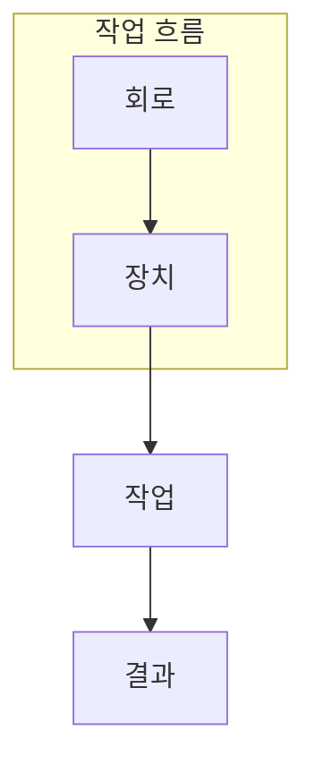

> [!abstract] 한 줄 요약
> 클라우드 양자 작업은 회로를 보내는 일만이 아니라, 디바이스와 실행 조건을 선택해 결과를 해석하는 흐름이다.

## 이 노트의 지도



## 1. 작업과 장치를 분리한다

같은 회로라도 시뮬레이터와 하드웨어에서 실행 목적이 다르다. 먼저 검증할 가정과 허용할 변동을 정한 뒤 장치를 선택한다. ==실행 조건==는 이 노트에서 결과보다 먼저 추적할 대상이다.


<details>
<summary>작업 제출 전에 확인할 세 가지</summary>

회로가 측정으로 끝나는지, 필요한 샷 수가 정해졌는지, 결과를 어떤 분포나 지표로 비교할지를 제출 전에 분리해 적는다.

</details>

```html preview
<div style="font-family:system-ui,sans-serif;padding:20px;color:var(--foreground)">
  <label for="amt" style="font-size:14px;font-weight:600">측정 샷 수</label>
  <div id="out" style="font-size:30px;font-weight:700;color:var(--chart-1);margin:6px 0">1000 shots</div>
  <input id="amt" type="range" min="100" max="5000" step="100" value="1000"
    style="width:100%;accent-color:var(--primary)" />
  <p style="font-size:13px;color:var(--muted-foreground)">샷 수는 결과 분포를 추정하는 표본 수다.</p>
  <script>
    var amt = document.getElementById('amt');
    var out = document.getElementById('out');
    amt.addEventListener('input', function () {
      out.textContent = '' + Number(amt.value).toLocaleString() + ' shots';
    });
  </script>
</div>
```

## 2. 결과는 단일 문자열이 아니라 분포다

작업 완료는 학습의 끝이 아니다. 비트열 빈도, 실행 메타데이터, 비교 기준을 함께 읽어야 회로의 기대와 관측을 구분할 수 있다.

```html preview
<div style="font-family:system-ui,sans-serif;padding:20px;color:var(--foreground)">
  <h3 style="margin:0 0 14px;font-size:15px;font-weight:600">예시 측정 분포</h3>
  <div id="bars" style="display:flex;align-items:flex-end;gap:14px;height:170px"></div>
  <script>
    var data = [["00",48],["11",46],["기타",6]];
    var max = Math.max.apply(null, data.map(function (d) { return d[1]; }));
    document.getElementById('bars').innerHTML = data.map(function (d, i) {
      return '<div style="flex:1;display:flex;flex-direction:column;align-items:center;' +
        'gap:6px;height:100%;justify-content:flex-end">' +
        '<span style="font-size:12px;font-weight:600">' + d[1] + '</span>' +
        '<div style="width:100%;height:' + (d[1] / max * 100) + '%;' +
        'background:var(--chart-' + (i + 1) + ');' +
        'border-radius:var(--radius) var(--radius) 0 0"></div>' +
        '<span style="font-size:12px;color:var(--muted-foreground)">' + d[0] + '</span>' +
        '</div>';
    }).join('');
  </script>
</div>
```

> [!caution] 해석의 범위
> 이 분포는 작업 결과 형식을 설명하는 예시이며 특정 장치 성능 측정값이 아니다.

```html preview
<div style="font-family:system-ui,sans-serif;padding:20px">
  <div id="cards" style="display:flex;gap:14px;flex-wrap:wrap"></div>
  <script>
    var stats = [["설계","회로","의도 명시","var(--chart-1)"],["실행","장치","조건 선택","var(--chart-2)"],["해석","분포","비교 기준","var(--chart-3)"]];
    document.getElementById('cards').innerHTML = stats.map(function (s) {
      return '<div style="flex:1;min-width:150px;padding:16px;background:var(--card);' +
        'color:var(--card-foreground);border:1px solid var(--border);' +
        'border-radius:var(--radius)">' +
        '<div style="font-size:13px;color:var(--muted-foreground)">' + s[0] + '</div>' +
        '<div style="font-size:26px;font-weight:700;margin-top:4px">' + s[1] + '</div>' +
        '<div style="font-size:12px;font-weight:600;margin-top:4px;color:' + s[3] + '">' +
        s[2] + '</div>' +
        '</div>';
    }).join('');
  </script>
</div>
```

<Tabs>
  <Tab label="시뮬레이터">논리와 기대 분포를 빠르게 점검한다.</Tab>
  <Tab label="하드웨어">오류와 제약이 있는 관측을 얻는다.</Tab>
  <Tab label="결과">빈도와 실행 조건을 함께 기록한다.</Tab>
</Tabs>

## 핵심 정리

| 관점 | 확인할 질문 | 학습상 의미 |
| :-- | :-- | :-- |
| 회로 | 무엇을 준비하는가 | 논리 검증 |
| 장치 | 어디서 실행하는가 | 제약 인식 |
| 분포 | 무엇을 관측했는가 | 결과 해석 |

> [!question]- 스스로 점검
> **Q.** 샷 수를 늘리면 무엇이 더 안정적으로 추정되는가?
>
> **A.** 같은 회로와 조건에서 얻는 측정 결과의 빈도 분포다.

## 출처

- 공개 노트에는 원본 강의 자료, 자산 이미지, 페이지 단위 근거를 포함하지 않는다.
