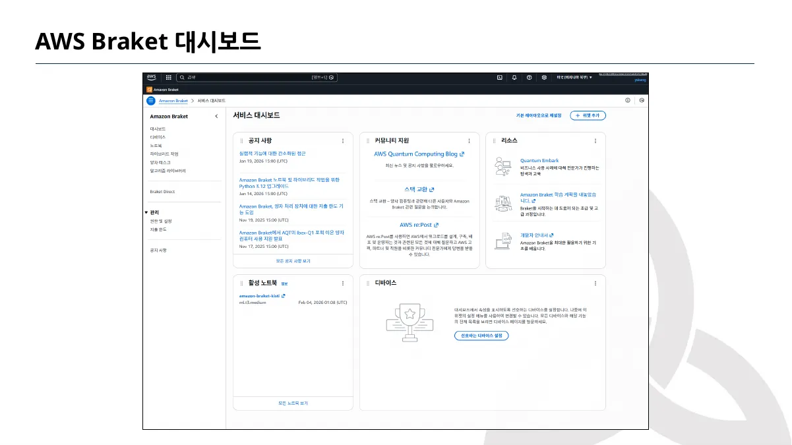
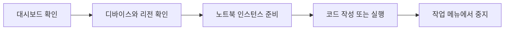
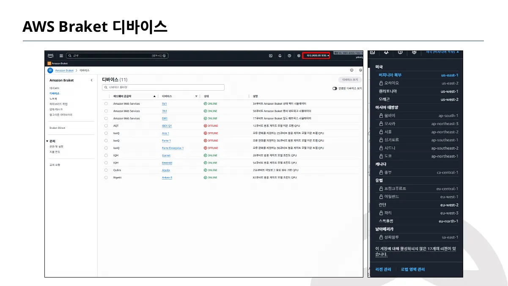
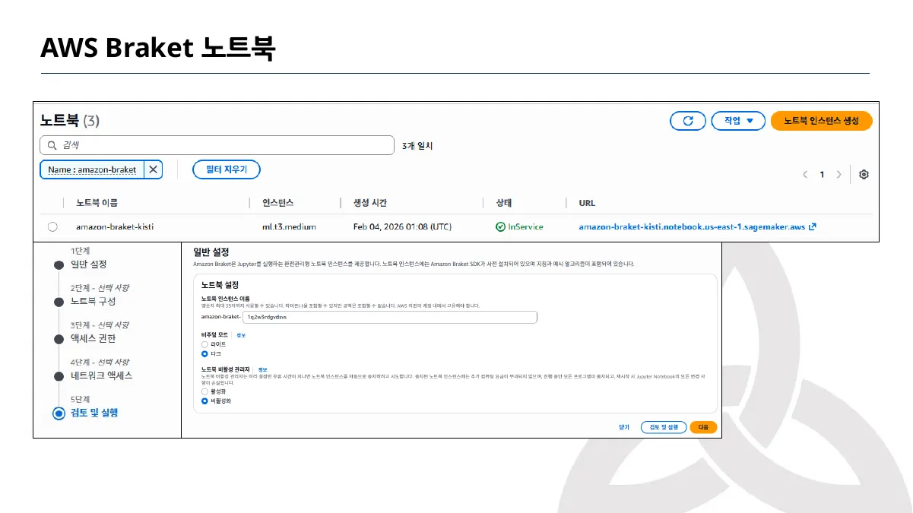
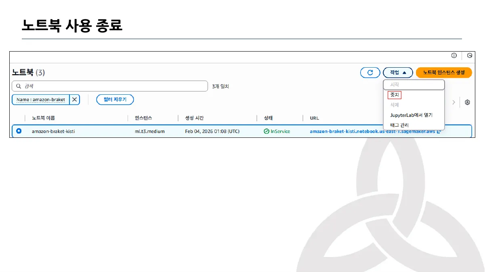

> [!abstract] 이 노트의 질문
> 강의의 콘솔 화면에서 무엇을 확인하고, 어느 지점에서 자원을 멈춰야 하는가? 이 노트는 **캡처된 UI 흐름**만을 근거로 화면의 역할과 종료 지점을 재구성한다.

---

> [!warning] 원본 표기 유의
> 원본 PDF 파일명은 “Bracket”으로 표기하지만, 캡처 화면의 서비스 이름은 “Amazon Braket”이다. 이 노트는 파일 경로는 원본 표기를 유지하고, 화면을 설명할 때는 캡처에 보이는 “Braket”을 사용한다.

## 1. 콘솔을 세 개의 질문으로 나누기



대시보드는 공지·리소스·활성 노트북·디바이스를 한 화면에서 훑는 출발점이다. 강의 화면만으로도 작업 흐름을 “어디서 시작할까”가 아니라 **어떤 자원이 이미 켜져 있는가**라는 질문으로 바꾸어 볼 수 있다.

<Tabs>
<Tab label="대시보드">

활성 노트북과 디바이스 카드가 함께 보인다. 먼저 실행 중인 자원이 있는지 확인하는 관문이다.

</Tab>
<Tab label="디바이스">

사용 가능한 백엔드와 상태, 리전 선택을 확인하는 화면이다. 화면의 ONLINE/OFFLINE 표기는 강의 캡처 당시의 상태다.

</Tab>
<Tab label="노트북">

노트북 인스턴스를 만들고, 실행 중인 인스턴스를 확인하고, 작업 메뉴에서 중지하는 작업 공간이다.

</Tab>
</Tabs>



> [!note] 화면 근거의 범위
> 이 흐름은 강의가 캡처한 인터페이스의 해석이다. 현재 콘솔의 메뉴명·지역·디바이스 상태가 동일하다는 보장은 하지 않는다.

## 2. 디바이스 화면 — 백엔드를 고르기 전 확인할 것



디바이스 화면은 백엔드 이름·상태·특성을 한 목록에서 보이게 한다. 따라서 노트북부터 여는 대신, 먼저 **리전과 상태가 화면에 어떻게 표시되는지** 확인한다.

```html preview h=280px
<div style="font-family:system-ui,sans-serif;padding:18px;color:var(--foreground);border:1px solid var(--border);border-radius:var(--radius)">
  <div style="font-size:16px;font-weight:700">강의 화면을 읽는 세 단계</div>
  <div style="font-size:13px;color:var(--muted-foreground);margin:4px 0 14px">실제 콘솔 조회가 아니라, 캡처가 제공하는 판단 순서를 요약한 도식이다.</div>
  <svg viewBox="0 0 760 150" width="100%" role="img" aria-label="Braket 화면 읽기 흐름">
    <rect x="30" y="48" width="175" height="58" rx="12" style="fill:var(--card);stroke:var(--chart-1);stroke-width:3"/>
    <rect x="292" y="48" width="175" height="58" rx="12" style="fill:var(--card);stroke:var(--chart-2);stroke-width:3"/>
    <rect x="554" y="48" width="175" height="58" rx="12" style="fill:var(--card);stroke:var(--chart-3);stroke-width:3"/>
    <path d="M210 77 L280 77" style="stroke:var(--muted-foreground);stroke-width:3;fill:none"/>
    <path d="M472 77 L542 77" style="stroke:var(--muted-foreground);stroke-width:3;fill:none"/>
    <text x="117" y="72" text-anchor="middle" style="fill:var(--foreground);font-size:15px;font-weight:700">리전</text>
    <text x="117" y="91" text-anchor="middle" style="fill:var(--muted-foreground);font-size:13px">어디서 볼 것인가</text>
    <text x="379" y="72" text-anchor="middle" style="fill:var(--foreground);font-size:15px;font-weight:700">상태</text>
    <text x="379" y="91" text-anchor="middle" style="fill:var(--muted-foreground);font-size:13px">사용 가능성 확인</text>
    <text x="641" y="72" text-anchor="middle" style="fill:var(--foreground);font-size:15px;font-weight:700">특성</text>
    <text x="641" y="91" text-anchor="middle" style="fill:var(--muted-foreground);font-size:13px">문제와 연결</text>
  </svg>
</div>
```

<details>
<summary>강의가 보여 주는 IonQ 사례를 어떻게 읽어야 할까?</summary>

강의 슬라이드는 IonQ 하드웨어를 긴 결맞음 시간과 완전 연결성이라는 두 특성으로 소개한다. 이 노트에서는 이 두 표현을 **해당 강의의 설명**으로만 보존하며, 다른 제공자와의 성능 비교나 최신 사양으로 확장하지 않는다.

</details>


> [!tip] 캡처를 비교표로 오해하지 않기
> 한 장의 하드웨어 소개 슬라이드는 선택 기준의 출발점이지, 모든 백엔드를 정량 비교한 결과가 아니다. 화면에 없는 비용·대기열·정확도 수치를 이 노트에 덧붙이지 않는다.

## 3. 노트북 — 생성보다 종료를 같은 흐름에 넣기



노트북 화면은 생성 단계와 현재 상태를 함께 보여 준다. 따라서 시작과 종료를 분리된 사후 작업으로 두지 않고 하나의 수명주기로 읽는다.

```html preview h=270px
<div style="font-family:system-ui,sans-serif;padding:18px;color:var(--foreground);border:1px solid var(--border);border-radius:var(--radius)">
  <div style="display:flex;justify-content:space-between;align-items:center;gap:12px;flex-wrap:wrap">
    <div>
      <div style="font-size:16px;font-weight:700">노트북 수명주기</div>
      <div style="font-size:13px;color:var(--muted-foreground);margin-top:4px">강의의 시작·중지 화면을 하나의 체크 흐름으로 묶는다.</div>
    </div>
    <button id="stopButton" style="border:0;border-radius:var(--radius);padding:9px 12px;background:var(--chart-5);color:white;font-weight:700;cursor:pointer">중지 시뮬레이션</button>
  </div>
  <svg viewBox="0 0 640 110" width="100%" role="img" aria-label="노트북 상태 변화">
    <circle cx="105" cy="55" r="28" style="fill:var(--chart-1)"/>
    <circle id="running" cx="320" cy="55" r="28" style="fill:var(--chart-2)"/>
    <circle id="stopped" cx="535" cy="55" r="28" style="fill:var(--border)"/>
    <path d="M143 55 L280 55 M358 55 L495 55" style="stroke:var(--muted-foreground);stroke-width:3;fill:none"/>
    <text x="105" y="60" text-anchor="middle" style="fill:white;font-size:13px;font-weight:700">생성</text>
    <text x="320" y="60" text-anchor="middle" style="fill:white;font-size:13px;font-weight:700">실행</text>
    <text id="stoppedText" x="535" y="60" text-anchor="middle" style="fill:var(--foreground);font-size:13px;font-weight:700">중지</text>
  </svg>
</div>
<script>
  (function () {
    var button = document.getElementById('stopButton');
    var running = document.getElementById('running');
    var stopped = document.getElementById('stopped');
    var stoppedText = document.getElementById('stoppedText');
    button.addEventListener('click', function () {
      running.style.fill = 'var(--border)';
      stopped.style.fill = 'var(--chart-5)';
      stoppedText.style.fill = 'white';
      button.textContent = '중지됨';
      button.disabled = true;
    });
  }());
</script>
```



<details>
<summary>강의 화면에서 확인되는 종료 동작</summary>

노트북 목록에서 대상 행을 선택하고 작업 메뉴를 열면 “중지” 항목이 보인다. 이 노트가 주장하는 것은 그 메뉴 항목이 캡처에 존재한다는 사실뿐이며, 실제 계정에서의 중지 성공·비용·권한 결과는 이 자료로 검증되지 않는다.

</details>

> [!caution] GHZ 실행에 대한 범위
> 원본의 마지막 “Run the code-GHZ state” 화면은 다음 주제를 알리는 표지다. 코드·출력·측정 분포가 제시되지 않았으므로, 이 노트에서는 GHZ 실행 결과를 만들거나 성공했다고 쓰지 않는다.

## 4. 종료 전 한 번 더 확인할 질문

- 현재 노트북 목록에 실행 상태가 남아 있는가?
- 대상 인스턴스를 선택한 뒤 작업 메뉴에 중지가 보이는가?
- 이 노트의 UI 근거가 강의 당시의 캡처라는 점을 구분했는가?
