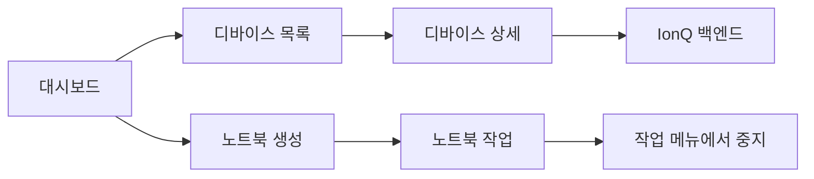
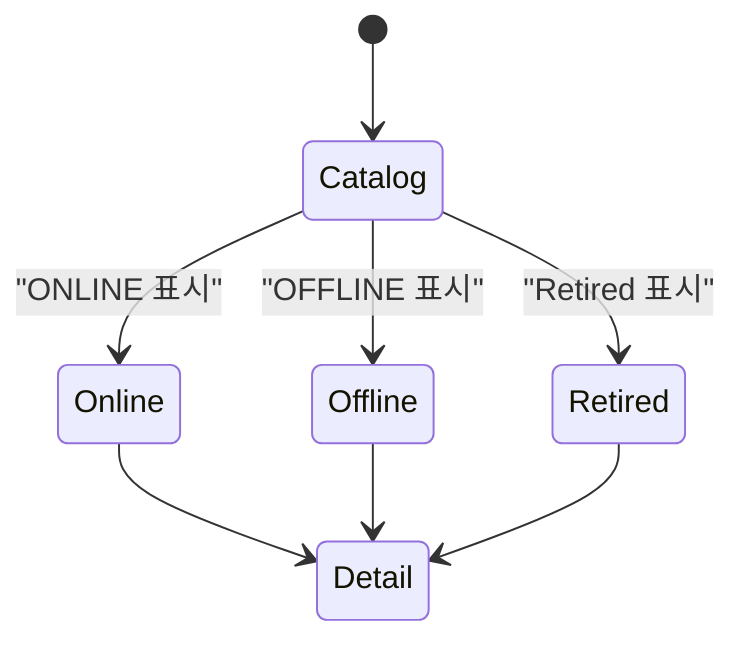
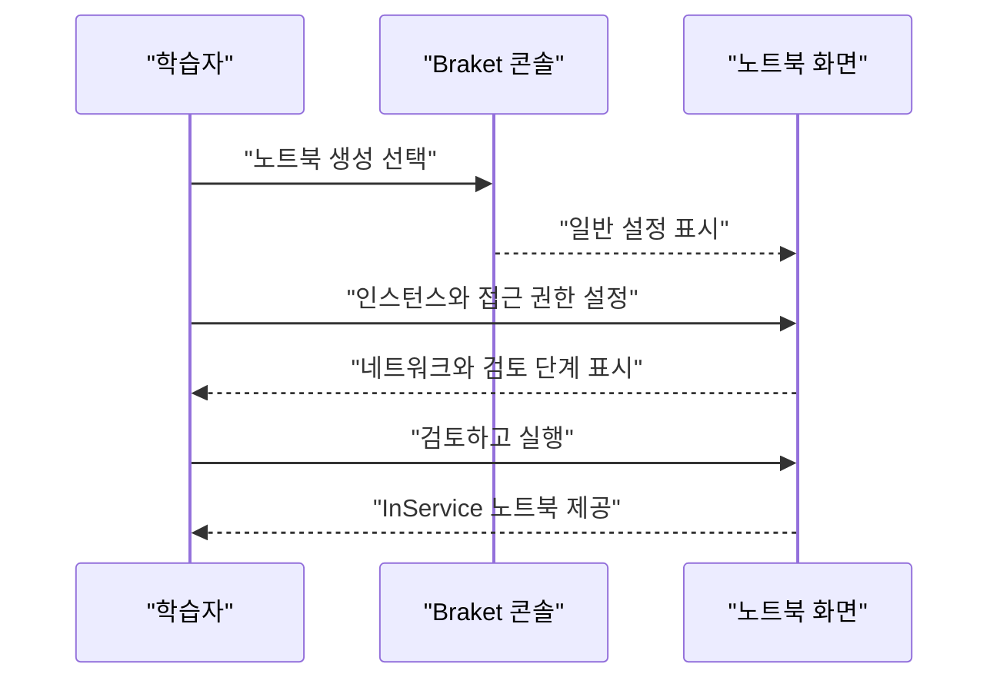

> [!abstract] 이 문서가 답하는 질문
> AWS Braket 화면에서 **어디로 들어가 무엇을 확인하고, 노트북 작업을 어떻게 끝내는가?**를 대시보드 → 디바이스 → 백엔드 → 노트북의 순서로 정리한다.

## 화면을 읽는 순서

이 자료는 API 명세보다 콘솔 화면의 이동을 보여 준다. 따라서 먼저 **목록에서 상태와 지역을 확인한 뒤**, 상세 화면에서 하드웨어 특성과 노트북 실행 화면으로 넘어간다.




대시보드에는 공지 사항, 커뮤니티 지원, 리소스, 합성 노트북, 디바이스 영역이 함께 배치되어 있다. 이 화면은 **콘솔의 진입점**으로 읽으면 된다.

> [!tip] 먼저 볼 것
> 디바이스를 바로 고르기보다 대시보드에서 리전과 노트북 리소스가 어느 영역에 있는지 확인한 다음 디바이스 목록으로 이동한다.

## 디바이스 목록은 카탈로그다


원본 화면의 디바이스 표에는 하드웨어 공급자, 디바이스 이름, 상태, 설명이 함께 보인다. 오른쪽 패널은 여러 지역을 선택하는 구조를 보여 준다. 화면에 표시된 예시는 다음처럼 읽을 수 있다.

| 화면에서 보이는 축 | 읽는 값 | 사용 목적 |
| --- | --- | --- |
| 하드웨어 공급자 | Amazon Web Services, IonQ, IQM, QuEra, Rigetti 등 | 어떤 구현을 호출할지 좁힌다 |
| 디바이스 이름 | SV1, TN1, DM1, Aria 1, Forte 등 | 시뮬레이터·실기기 후보를 구분한다 |
| 상태 | ONLINE, OFFLINE 등 | 제출 전에 현재 화면의 이용 가능성을 확인한다 |
| 지역 | 미국·아시아·유럽 등 리전 목록 | 콘솔 자원과 접근 위치를 맞춘다 |

> [!important] 상태는 자료의 캡처 시점 값이다
> 목록의 ONLINE·OFFLINE 표시는 이 강의자료가 캡처된 순간의 화면이다. 현재 서비스 상태나 대기 시간으로 일반화하지 않는다.



<details>
<summary>목록에서 상세로 넘어갈 때 확인할 항목</summary>

- 공급자와 디바이스 이름이 원하는 구현과 일치하는지
- 상태가 제출 가능한 상태인지
- 지역 선택이 현재 콘솔 작업과 맞는지
- 상세 화면에서 제공하는 게이트·토폴로지·오류 지표가 있는지

이 네 항목은 화면에 실제로 표시된 열과 상세 패널을 학습 순서로 재배열한 것이다.

</details>

## 마켓플레이스와 IonQ 상세 화면


마켓플레이스 화면은 Quantum 검색 결과를 제공자별 상품 목록으로 보여 준다. 캡처에는 D-Wave, Toshiba, Quantum 등의 항목이 함께 표시된다. 마켓플레이스는 **문제를 푸는 장치 목록**이 아니라, 서비스·상품을 탐색하는 별도 화면으로 구분한다.

<Tabs>
  <Tab label="Braket 디바이스">
    디바이스 목록에서 공급자·이름·상태·지역을 확인하고, 필요한 장치의 상세 화면으로 들어간다.
  </Tab>
  <Tab label="IonQ 백엔드">
    IonQ 콘솔의 백엔드 화면에서는 장치별 큐빗 수, 가용성, 예상 대기 시간, 토폴로지와 오류 지표가 한 패널에 모인다.
  </Tab>
</Tabs>


IonQ 디바이스 상세 화면은 상태, 디바이스 ARN, 탭 형태의 세부 정보·보정·네이티브 게이트·실험적 기능 영역을 보여 준다. 즉 목록의 한 행을 **실행 대상의 식별자와 상세 능력**으로 확장하는 단계다.


백엔드 화면에는 Forte, Aria 등의 장치 카드가 있고, 각 카드의 가용성·큐빗 수·예상 대기 시간이 다르게 표시된다. 선택한 Forte 패널에는 all-to-all 토폴로지, 게이트 오류, 읽기 오류, 게이트 시간, 지원 게이트와 예약 기능이 함께 보인다.

> [!warning] 화면에 없는 값은 채우지 않는다
> 슬라이드가 보여 주지 않는 SDK 호출법, 인증값, 실제 제출 결과는 이 문서에 추가하지 않는다. 이 문서의 근거는 캡처된 콘솔 화면과 그 안의 텍스트다.

## 노트북 만들기와 작업 공간

노트북 생성 화면은 다섯 단계의 설정 마법사로 구성되어 있다.




원본 예시의 노트북 목록에는 `amazon-braket-kisti`가 `ml.t3.medium` 인스턴스로 표시되고 InService 상태가 보인다. 생성 마법사는 일반 설정, 노트북 구성, 액세스 권한, 네트워크 액세스, 검토 및 실행의 순서를 가진다.


작업 공간 화면은 파일 목록과 Launcher를 함께 보여 준다. Launcher에는 Braket 시작 항목, 회로·알고리즘 관련 노트북, 콘솔과 터미널 도구가 배치되어 있다.

```html preview
<div style="font-family:system-ui,sans-serif;padding:20px;color:var(--foreground)">
  <h3 style="margin:0 0 14px;font-size:15px;font-weight:600">Braket 화면에서 확인할 네 가지</h3>
  <div id="braket-cards" style="display:flex;gap:12px;flex-wrap:wrap"></div>
  <script>
    var cards = [
      ['진입점', '대시보드', '공지와 리소스'],
      ['선택', '디바이스', '공급자와 상태'],
      ['실행', '노트북', '인스턴스와 Launcher'],
      ['정리', '작업 메뉴', '중지와 종료 확인']
    ];
    document.getElementById('braket-cards').innerHTML = cards.map(function (c, i) {
      return '<div style="flex:1;min-width:150px;padding:14px;background:var(--card);color:var(--card-foreground);border:1px solid var(--border);border-radius:var(--radius)">' +
        '<div style="font-size:12px;color:var(--muted-foreground)">' + c[0] + '</div>' +
        '<div style="font-size:18px;font-weight:700;margin-top:4px">' + c[1] + '</div>' +
        '<div style="font-size:13px;margin-top:6px">' + c[2] + '</div>' +
        '</div>';
    }).join('');
  </script>
</div>
```

이 카드는 원본에 반복해서 등장하는 네 화면을 **찾아가는 순서**로 요약한 것이다. 실행 시간이나 비용을 새로 계산한 결과가 아니다.

## 작업 종료


노트북 목록의 작업 메뉴에는 시작, 중지, 삭제, JupyterLab에서 열기, 태그 관리가 표시된다. 강의자료가 강조하는 “노트북 사용 종료”는 작업 메뉴에서 현재 인스턴스 상태에 맞는 중지 동작을 확인하는 단계로 정리할 수 있다.

> [!caution] 종료 동작을 확인한 뒤 닫기
> 화면에 보이는 작업 메뉴의 상태를 확인하지 않고 브라우저만 닫으면 노트북 인스턴스 상태를 알 수 없다. 중지·삭제는 서로 다른 동작이므로 메뉴의 대상과 상태를 확인한다.

## GHZ 상태 실행 슬라이드가 뜻하는 것


마지막 실습 슬라이드는 “Run the code-GHZ state”라는 실행 주제를 제시한다. 이 렌더에는 코드 본문이나 측정 결과가 보이지 않으므로, **GHZ 회로의 코드와 출력 분포를 이 자료만으로 재구성하지 않는다.**

> [!note] 이미지 근거의 범위
> 이 문서에서 슬라이드 근거로 쓰는 것은 위의 실제 렌더 이미지다. PDF 파일명과 쪽수만 적은 텍스트 표기는 슬라이드 근거로 세지 않는다.

## 핵심 정리

| 단계 | 확인할 화면 | 남겨야 할 판단 |
| --- | --- | --- |
| 1 | 대시보드 | 콘솔의 진입 영역과 리소스 위치 |
| 2 | 디바이스 목록 | 공급자·장치 이름·상태·지역 |
| 3 | 상세·백엔드 | ARN, 토폴로지, 오류 지표, 지원 기능 |
| 4 | 노트북 | 인스턴스 설정과 작업 공간 |
| 5 | 작업 메뉴 | 중지·삭제 등 종료 동작의 차이 |

> [!question]- 스스로 점검
> **Q.** 디바이스 목록에서 상태가 보이는 것과 IonQ 백엔드 상세 화면을 따로 확인해야 하는 이유는 무엇인가?
>
> **A.** 목록은 공급자·이름·지역·상태를 빠르게 비교하는 카탈로그이고, 상세 화면은 토폴로지·오류 지표·지원 게이트처럼 실행 판단에 필요한 세부 능력을 보여 주기 때문이다.

## 출처

- [2. 양자클라우드 Bracket 기초 사용법_Jun.2026.pdf](<../sources/2. 양자클라우드 Bracket 기초 사용법_Jun.2026.pdf>) — 원본 강의 슬라이드 12쪽.
