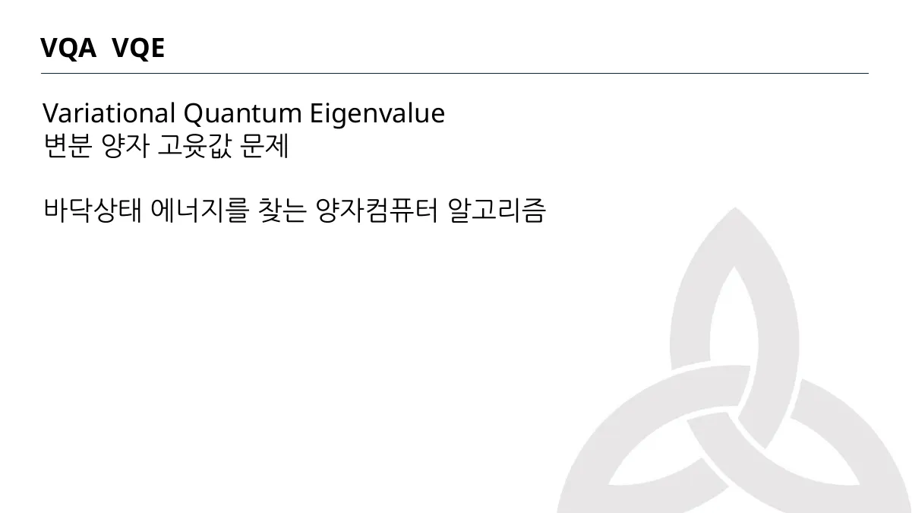
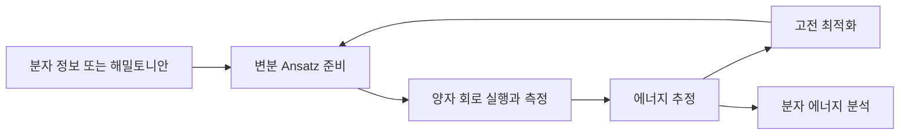
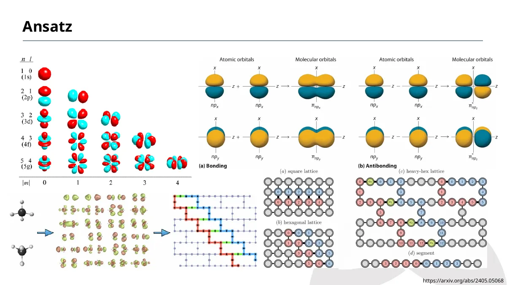
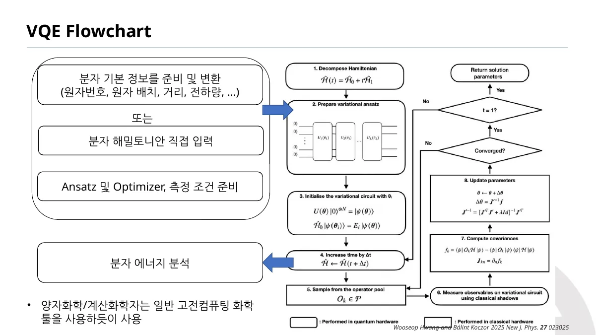

> [!abstract] 이 노트의 질문
> VQA는 한 번의 회로 실행으로 답을 확정하는 방식이 아니라, ==측정과 갱신을 반복해 목표값에 가까워지는 구조==다. VQE는 그 구조를 바닥상태 에너지 찾기에 적용한 사례다.

## 1. VQA와 VQE의 역할을 섞지 않기



<Tabs>
<Tab label="VQA">

강의는 여러 실험·측정을 반복하고, 측정값 중 최대 또는 최소에 가까운 값을 고르는 변분 양자 알고리즘의 관점으로 설명한다.

</Tab>
<Tab label="VQE">

VQA의 한 사례로서, 바닥상태 에너지를 찾는 변분 양자 고윳값 문제를 다룬다.

</Tab>
<Tab label="화학 문제">

분자 정보 또는 분자 해밀토니안을 준비하고, 상태를 나타낼 Ansatz와 측정 조건을 정한 뒤 에너지를 분석하는 흐름으로 제시된다.

</Tab>
</Tabs>

> [!note] 목적 함수가 먼저다
> 반복은 그 자체로 목적이 아니다. VQE에서는 에너지라는 목표값을 측정하고, 다음 파라미터가 더 나은 에너지 추정으로 이어지도록 고전 최적화가 갱신을 제안한다.



## 2. Ansatz — 탐색할 상태의 모양을 정하는 선택



Ansatz는 “정답 상태를 어떻게 표현 가능한 상태 가족 안에서 찾아볼 것인가”라는 선택이다. 강의는 UCC 계열·적응형 VQE·해밀토니안 변분 Ansatz 등 여러 이름을 나열하지만, 이 노트에서는 각 방법의 우열을 단정하지 않는다.

```html preview h=280px
<div style="font-family:system-ui,sans-serif;padding:18px;color:var(--foreground);border:1px solid var(--border);border-radius:var(--radius)">
  <div style="font-size:16px;font-weight:700">Ansatz는 탐색 공간의 문이다</div>
  <div style="font-size:13px;color:var(--muted-foreground);margin:4px 0 14px">파라미터 수를 바꾸면 표현 가능성·최적화 부담이 함께 변한다는 개념 모형이다.</div>
  <input id="params" type="range" min="1" max="8" value="3" style="width:100%;accent-color:var(--primary)">
  <svg viewBox="0 0 680 130" width="100%" role="img" aria-label="Ansatz 파라미터와 탐색 공간 모형">
    <rect x="40" y="40" width="170" height="52" rx="10" style="fill:var(--card);stroke:var(--chart-1);stroke-width:3"/>
    <rect x="255" y="40" width="170" height="52" rx="10" style="fill:var(--card);stroke:var(--chart-2);stroke-width:3"/>
    <rect x="470" y="40" width="170" height="52" rx="10" style="fill:var(--card);stroke:var(--chart-3);stroke-width:3"/>
    <path d="M220 66 L245 66 M435 66 L460 66" style="stroke:var(--muted-foreground);stroke-width:3;fill:none"/>
    <text x="125" y="62" text-anchor="middle" style="fill:var(--foreground);font-size:14px;font-weight:700">파라미터</text>
    <text id="count" x="125" y="80" text-anchor="middle" style="fill:var(--chart-1);font-size:14px"></text>
    <text x="340" y="62" text-anchor="middle" style="fill:var(--foreground);font-size:14px;font-weight:700">표현 가능한 상태</text>
    <text id="reach" x="340" y="80" text-anchor="middle" style="fill:var(--chart-2);font-size:14px"></text>
    <text x="555" y="62" text-anchor="middle" style="fill:var(--foreground);font-size:14px;font-weight:700">최적화 탐색</text>
    <text id="search" x="555" y="80" text-anchor="middle" style="fill:var(--chart-3);font-size:14px"></text>
  </svg>
</div>
<script>
  (function () {
    var slider = document.getElementById('params');
    var count = document.getElementById('count');
    var reach = document.getElementById('reach');
    var search = document.getElementById('search');
    function draw() {
      var n = Number(slider.value);
      count.textContent = n + '개';
      reach.textContent = n < 4 ? '제한적' : '넓어짐';
      search.textContent = n < 4 ? '단순' : '복잡도 증가';
    }
    slider.addEventListener('input', draw);
    draw();
  }());
</script>
```

<details>
<summary>표현력이 크면 언제나 더 좋은 Ansatz일까?</summary>

아니다. 강의가 다양한 Ansatz 계열을 제시한다는 사실은 선택지가 여러 개라는 뜻이지, 파라미터가 많은 방법이 항상 더 정확하거나 더 쉽게 최적화된다는 결론은 아니다. 문제·회로 깊이·측정 비용을 함께 보아야 한다.

</details>

> [!tip] Ansatz와 Optimizer를 역할로 구분하기
> Ansatz는 후보 상태를 생성한다. Optimizer는 측정된 목적 함수를 바탕으로 다음 파라미터를 고른다. 둘 다 반복에 참여하지만 서로 대체할 수 없다.

## 3. VQE의 하이브리드 루프



```html preview h=300px
<div style="font-family:system-ui,sans-serif;padding:18px;color:var(--foreground);border:1px solid var(--border);border-radius:var(--radius)">
  <div style="display:flex;justify-content:space-between;align-items:center;gap:12px;flex-wrap:wrap">
    <div>
      <div style="font-size:16px;font-weight:700">한 번의 VQE 반복</div>
      <div style="font-size:13px;color:var(--muted-foreground);margin-top:4px">버튼을 누르면 한 번의 측정·갱신 사이클을 순서대로 강조한다.</div>
    </div>
    <button id="next" style="border:0;border-radius:var(--radius);padding:9px 12px;background:var(--primary);color:var(--primary-foreground);font-weight:700;cursor:pointer">다음 단계</button>
  </div>
  <svg viewBox="0 0 760 145" width="100%" role="img" aria-label="VQE 반복 단계">
    <g id="n0"><rect x="20" y="50" width="130" height="48" rx="9" style="fill:var(--card);stroke:var(--border);stroke-width:2"/><text x="85" y="79" text-anchor="middle" style="fill:var(--foreground);font-size:13px">Ansatz</text></g>
    <g id="n1"><rect x="210" y="50" width="130" height="48" rx="9" style="fill:var(--card);stroke:var(--border);stroke-width:2"/><text x="275" y="79" text-anchor="middle" style="fill:var(--foreground);font-size:13px">측정</text></g>
    <g id="n2"><rect x="400" y="50" width="130" height="48" rx="9" style="fill:var(--card);stroke:var(--border);stroke-width:2"/><text x="465" y="79" text-anchor="middle" style="fill:var(--foreground);font-size:13px">에너지 추정</text></g>
    <g id="n3"><rect x="590" y="50" width="130" height="48" rx="9" style="fill:var(--card);stroke:var(--border);stroke-width:2"/><text x="655" y="79" text-anchor="middle" style="fill:var(--foreground);font-size:13px">고전 갱신</text></g>
    <path d="M155 74 L205 74 M345 74 L395 74 M535 74 L585 74" style="stroke:var(--muted-foreground);stroke-width:3;fill:none"/>
  </svg>
  <div id="loopText" style="font-size:13px;color:var(--muted-foreground)">Ansatz부터 시작</div>
</div>
<script>
  (function () {
    var i = 0;
    var labels = ['Ansatz 준비', '관측량 측정', '에너지 추정', '고전 최적화 갱신'];
    var button = document.getElementById('next');
    var text = document.getElementById('loopText');
    function draw() {
      for (var j = 0; j < 4; j += 1) {
        document.querySelector('#n' + j + ' rect').style.stroke = j === i ? 'var(--chart-1)' : 'var(--border)';
        document.querySelector('#n' + j + ' rect').style.strokeWidth = j === i ? '4' : '2';
      }
      text.textContent = labels[i] + ' 단계가 강조됨';
    }
    button.addEventListener('click', function () { i = (i + 1) % 4; draw(); });
    draw();
  }());
</script>
```

<details>
<summary>수렴 결과가 곧 정확한 바닥상태라는 뜻일까?</summary>

흐름도에는 수렴 판단과 해답 파라미터 반환이 있다. 그러나 강의의 흐름도만으로 특정 실험의 정확도·오차·전역 최적해 도달을 보증할 수는 없다. 이 노트는 루프의 구조를 설명할 뿐, 실행 결과를 만들어 내지 않는다.

</details>

> [!caution] 코드 실습 표지와 실행 결과를 구분하기
> 원본에는 VQE 워크플로우와 실습 코드를 소개하는 슬라이드가 있지만, 이 자료만으로 특정 노트북 실행·측정값·수렴 성공을 확인할 수 없다. 그래서 이 노트에는 실행 성공 주장이나 임의의 에너지 수치를 넣지 않는다.

## 4. 한 번에 회수하기

- VQA는 측정과 갱신을 반복하는 변분 구조다.
- VQE는 그 구조로 바닥상태 에너지를 찾는 문제를 다룬다.
- Ansatz는 후보 상태의 가족을, Optimizer는 다음 후보를 정한다.
- 하이브리드 루프는 양자 측정과 고전 파라미터 갱신을 왕복한다.
