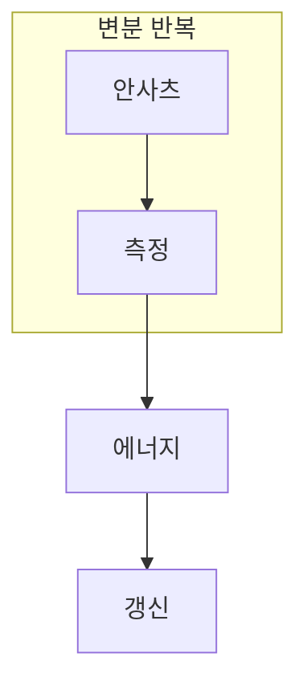

> [!abstract] 한 줄 요약
> VQE는 양자 회로가 에너지를 추정하고 고전 최적화기가 매개변수를 갱신하는 반복 구조다.

## 이 노트의 지도



## 1. 에너지를 한 번 계산하는 문제가 아니다

안사츠는 후보 상태를 만들고, 측정은 기대 에너지를 추정하며, 고전 최적화는 다음 후보를 선택한다. ==기대 에너지==는 이 노트에서 결과보다 먼저 추적할 대상이다.

$$
E(\theta)=\langle\psi(\theta)|H|\psi(\theta)\rangle
$$

<details>
<summary>안사츠가 너무 단순하거나 너무 복잡하면?</summary>

표현력이 부족하면 낮은 에너지 상태를 만들기 어렵고, 지나치게 복잡하면 측정 비용과 최적화 난도가 커진다.

</details>

```html preview
<div style="font-family:system-ui,sans-serif;padding:20px;color:var(--foreground)">
  <label for="amt" style="font-size:14px;font-weight:600">변분 매개변수 θ</label>
  <div id="out" style="font-size:30px;font-weight:700;color:var(--chart-1);margin:6px 0">θ = 90°</div>
  <input id="amt" type="range" min="0" max="180" step="1" value="90"
    style="width:100%;accent-color:var(--primary)" />
  <p style="font-size:13px;color:var(--muted-foreground)">매개변수 변화는 다음 측정할 후보 상태를 바꾼다.</p>
  <script>
    var amt = document.getElementById('amt');
    var out = document.getElementById('out');
    amt.addEventListener('input', function () {
      out.textContent = 'θ = ' + Number(amt.value).toLocaleString() + '°';
    });
  </script>
</div>
```

## 2. 낮은 추정값만으로 답을 확정하지 않는다

반복 중의 에너지 추정은 샷과 장치 오류의 영향을 받는다. 수렴 곡선과 측정 불확실성을 함께 확인해야 한다.

```html preview
<div style="font-family:system-ui,sans-serif;padding:20px;color:var(--foreground)">
  <h3 style="margin:0 0 14px;font-size:15px;font-weight:600">반복에 따른 예시 에너지</h3>
  <div id="bars" style="display:flex;align-items:flex-end;gap:14px;height:170px"></div>
  <script>
    var data = [["초기",9],["중간",5],["후기",3]];
    var max = Math.max.apply(null, data.map(function (d) { return d[1]; }));
    document.getElementById('bars').innerHTML = data.map(function (d, i) {
      return '<div style="flex:1;display:flex;flex-direction:column;align-items:center;' +
        'gap:6px;height:100%;justify-content:flex-end">' +
        '<span style="font-size:12px;font-weight:600">' + d[1] + '</span>' +
        '<div style="width:100%;height:' + (d[1] / max * 100) + '%;' +
        'background:var(--chart-' + (i + 1) + ');' +
        'border-radius:var(--radius) var(--radius) 0 0"></div>' +
        '<span style="font-size:12px;color:var(--muted-foreground)">' + d[0] + '</span>' +
        '</div>';
    }).join('');
  </script>
</div>
```

> [!caution] 해석의 범위
> 막대는 수렴 방향을 설명하는 정규화 예시다. 분자 에너지의 실제 단위나 결과가 아니다.

```html preview
<div style="font-family:system-ui,sans-serif;padding:20px">
  <div id="cards" style="display:flex;gap:14px;flex-wrap:wrap"></div>
  <script>
    var stats = [["안사츠","상태","후보 생성","var(--chart-1)"],["측정","에너지","기대값 추정","var(--chart-2)"],["최적화","갱신","다음 후보","var(--chart-3)"]];
    document.getElementById('cards').innerHTML = stats.map(function (s) {
      return '<div style="flex:1;min-width:150px;padding:16px;background:var(--card);' +
        'color:var(--card-foreground);border:1px solid var(--border);' +
        'border-radius:var(--radius)">' +
        '<div style="font-size:13px;color:var(--muted-foreground)">' + s[0] + '</div>' +
        '<div style="font-size:26px;font-weight:700;margin-top:4px">' + s[1] + '</div>' +
        '<div style="font-size:12px;font-weight:600;margin-top:4px;color:' + s[3] + '">' +
        s[2] + '</div>' +
        '</div>';
    }).join('');
  </script>
</div>
```

<Tabs>
  <Tab label="안사츠">표현 가능한 후보 상태의 범위를 정한다.</Tab>
  <Tab label="측정">해밀토니안 항의 기대값을 추정한다.</Tab>
  <Tab label="최적화">낮은 에너지 방향으로 매개변수를 갱신한다.</Tab>
</Tabs>

## 핵심 정리

| 관점 | 확인할 질문 | 학습상 의미 |
| :-- | :-- | :-- |
| 표현 | 어떤 상태를 만들 수 있는가 | 안사츠 선택 |
| 추정 | 무엇을 측정하는가 | 에너지 계산 |
| 갱신 | 어떻게 바꾸는가 | 수렴 판단 |

> [!question]- 스스로 점검
> **Q.** VQE에서 고전 최적화기가 받는 핵심 입력은 무엇인가?
>
> **A.** 현재 매개변수로 측정해 얻은 기대 에너지 추정값이다.

## 출처

- 공개 노트에는 원본 강의 자료, 자산 이미지, 페이지 단위 근거를 포함하지 않는다.
