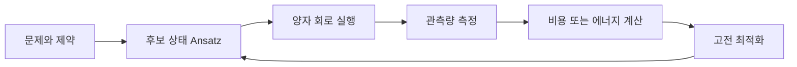
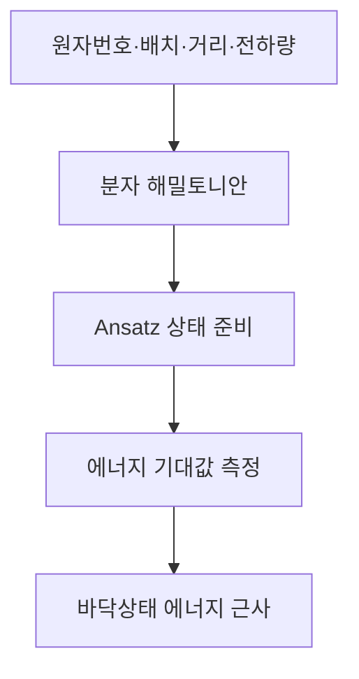
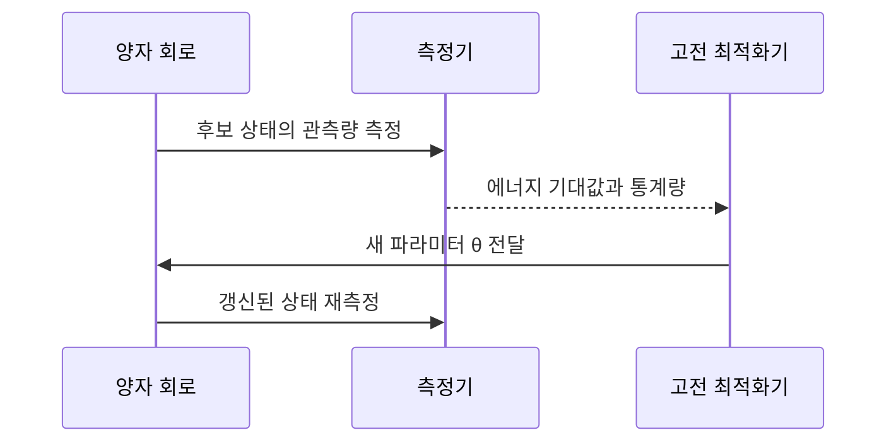
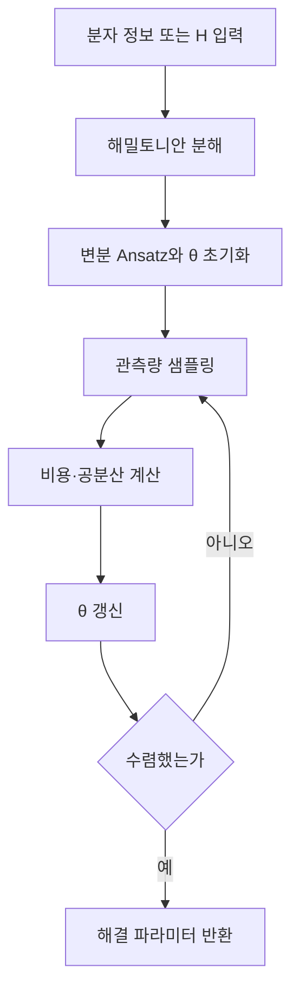

> [!ABSTRACT]
> VQA는 닫힌 문제의 후보 해를 양자 회로로 여러 번 측정하고, 측정값이 가장 좋아지는 방향으로 고전 최적화기가 파라미터를 갱신하는 NISQ 알고리즘이다. VQE는 이 틀을 고윳값 문제, 특히 분자 바닥상태 에너지 탐색에 적용한다.

## 1. VQA가 필요한 문제

강의는 NISQ(Noisy Intermediate-Scale Quantum) 환경을 전제로 한다. 회로를 얕게 유지하고, 양자 회로와 고전 최적화기를 섞으며, 노이즈와 측정 횟수를 감당할 수 있는 문제를 고른다. 완전한 정밀해를 한 번에 계산하기보다 여러 실험에서 얻은 값으로 답을 추론한다.

| NISQ 설계 기준 | VQA에서의 의미 |
| --- | --- |
| 얕은 회로 | 현재 장치에서 실행 가능한 깊이로 후보 상태를 준비 |
| 하이브리드 구조 | 회로 평가는 양자 장치, 파라미터 갱신은 고전 장치가 담당 |
| 변분 원리 | 목적 함수의 상한·하한을 이용해 후보를 개선 |
| 노이즈 강인성 | 한 번의 결과보다 반복 측정과 평균에 의존 |
| 측정 효율성 | 필요한 관측량만 선택해 샷 수를 줄임 |
| 문제 맞춤형 | 일반 정밀 계산 대신 구조에 맞는 Ansatz를 사용 |

출근 경로 중 최단 시간을 여러 번 시험해 고르는 비유처럼, VQA는 참값과 측정값 사이의 관계가 분명한 닫힌 문제에서 최대 또는 최소 측정값을 선택한다. 이 비유는 VQA의 반복·선택 구조를 설명하기 위한 것이며, 모든 최적화 문제가 VQA로 바뀐다는 뜻은 아니다.



> [!TIP]
> VQA의 결과는 ==단일 측정 샷이 아니다==. 동일 회로를 반복 실행해 얻은 확률 평균 또는 기대값을 목적 함수로 삼는다.

## 2. VQA에서 VQE로 좁히기

VQE(Variational Quantum Eigensolver)는 VQA의 변분 구조를 에너지 고윳값 문제에 적용한 알고리즘이다. 목표는 해밀토니안 $H$의 가장 낮은 고윳값, 즉 분자의 바닥상태 에너지 $E_0$를 추정하는 것이다.

$$
H\lvert\psi_n\rangle=E_n\lvert\psi_n\rangle, \qquad E_0=\min_n E_n
$$

분자 문제는 원자 수가 조금만 늘어도 다체 상호작용 때문에 고전적으로 풀기 어려워진다. 슬라이드는 뉴턴·맥스웰·슈뢰딩거 방정식을 알고 있어도 물체가 세 개만 되어도 직접 해를 얻기 어렵다고 설명한다. 따라서 실제 계산에서는 분자 구조를 행렬 또는 해밀토니안으로 바꾸고, 양자 회로에서 에너지 기대값을 샘플링한다.

| 분자 예시 | 분자식 | 전체 전자 수 |
| --- | --- | ---: |
| 수소 기체 | H₂ | 2 |
| 산소 기체 | O₂ | 16 |
| 물 | H₂O | 10 |
| 암모니아 | NH₃ | 10 |
| 메탄 | CH₄ | 10 |
| 이산화탄소 | CO₂ | 22 |
| 포도당 | C₆H₁₂O₆ | 96 |
| 아스피린 | C₉H₈O₄ | 98 |

> [!IMPORTANT]
> VQE의 입력은 “분자 이름” 자체가 아니라 원자번호·배치·거리·전하량으로 만든 해밀토니안 또는 해밀토니안 행렬이다. 슬라이드의 사용자 흐름은 이 입력 변환을 숨기고 일반 화학 도구처럼 사용하도록 제시한다.




> [!WARNING]
> 원본 p.13은 파울리 배타 원리를 “전자는 같은 공간에 3개 이상 있을 수 없다”라고 적는다. 이 노트는 원본 문구를 고치지 않고 기록하며, 해당 표현의 정확한 물리적 해석은 별도 검토 대상으로 남긴다.

## 3. 레일리-리츠 변분 원리와 Ansatz

임의의 시험 상태 $\lvert\psi\_{trial}\rangle$의 에너지 기대값은 정확한 바닥상태 에너지보다 낮아지지 않는다.

$$
\langle H\rangle=\frac{\langle\psi_{trial}\rvert H\lvert\psi_{trial}\rangle}{\langle\psi_{trial}\vert\psi_{trial}\rangle}\ge E_0
$$

이 부등식 덕분에 최적화기는 “정답을 넘어서 더 낮은 에너지”를 찾는 대신, 후보 상태의 에너지를 가능한 한 낮추는 방향으로 움직인다. 문제는 함수의 경우의 수가 무한하다는 점이다. 강의는 기준 상태에서 출발해 Ansatz의 매개변수를 조금씩 변형하는 방법으로 이 공간을 제한한다.


<Tabs>
  <Tab label="UCC 계열">
    UCC, UCCSD, UCCGSD, UCC(k), k-UpCCGSD처럼 결합 클러스터 구조를 유니터리 Ansatz로 만든다.
  </Tab>
  <Tab label="ADAPT 계열">
    ADAPT-VQE, ADAPT-QCC, P-ADAPT-VQE처럼 현재 문제의 신호에 따라 연산자를 선택적으로 추가한다.
  </Tab>
  <Tab label="HVA·구조 특화">
    Hamiltonian Variational Ansatz, 대칭 보존 Ansatz, 저심도 분자 Ansatz처럼 문제의 물리 구조나 회로 깊이를 우선한다.
  </Tab>
</Tabs>



> [!NOTE]
> Ansatz는 실제 바닥상태를 보장하는 정답 함수가 아니라, 탐색할 후보 상태의 표현 공간이다. 따라서 Ansatz의 표현력과 회로 깊이, 측정 비용 사이의 균형이 VQE 설계의 일부가 된다.

<details>
<summary>변분 부등식의 읽기 순서</summary>

1. 먼저 후보 상태 $\lvert\psi_{trial}(\theta)\rangle$를 정한다.
2. $H$를 그 상태에 작용시켜 에너지 기대값을 측정한다.
3. 기대값이 낮아지도록 $\theta$를 갱신한다.
4. 수렴하면 그 값이 $E_0$의 근사 상한이 된다.

</details>

## 4. VQE 워크플로우

슬라이드의 흐름은 입력 준비와 반복 계산을 분리한다. 먼저 분자 기본 정보 또는 해밀토니안을 준비하고, Ansatz·Optimizer·측정 조건을 정한다. 이후 양자 회로에서 관측량을 샘플링하고, 고전 장치가 비용과 공분산을 계산해 파라미터를 업데이트한다.



| 단계 | 양자 쪽 작업 | 고전 쪽 작업 | 산출물 |
| --- | --- | --- | --- |
| 준비 | Ansatz 회로 구성 | 입력 변환·Optimizer 설정 | 초기 $\theta$ |
| 평가 | 관측량 측정 | 기대값·공분산 계산 | 비용 $E(\theta)$ |
| 갱신 | 새 회로 파라미터 수용 | $\theta\leftarrow\theta+\Delta\theta$ | 다음 후보 상태 |
| 종료 | 마지막 상태 측정 | 수렴·시간 조건 확인 | 에너지와 파라미터 |

```python
estimator = BackendEstimatorV2(backend=simulator)

def cost(params):
    pub = (ansatz, pauli_op, params)
    job = estimator.run([pub])
    result = job.result()

    # 현재 파라미터 출력 및 에너지 반환
    print(params)
    return result[0].data.evs
```


> [!INFO]
> 위 코드는 원본 p.39의 비용 함수 예시를 옮긴 것이다. 이 노트에서 실행 결과를 새로 만들거나 API 호환성을 보장한다고 주장하지 않는다.


```html preview
<div style="font-family:system-ui,sans-serif;padding:20px;color:var(--foreground)">
  <h3 style="margin:0 0 14px;font-size:16px">VQE 한 반복의 역할 분담</h3>
  <div style="display:flex;gap:10px;flex-wrap:wrap">
    <div style="flex:1;min-width:130px;padding:14px;background:var(--card);border:1px solid var(--border);border-radius:var(--radius)"><strong>1 입력</strong><p style="font-size:12px;color:var(--muted-foreground)">H 또는 분자 정보</p></div>
    <div style="flex:1;min-width:130px;padding:14px;background:var(--card);border:1px solid var(--border);border-radius:var(--radius)"><strong>2 실행</strong><p style="font-size:12px;color:var(--muted-foreground)">Ansatz 회로 측정</p></div>
    <div style="flex:1;min-width:130px;padding:14px;background:var(--card);border:1px solid var(--border);border-radius:var(--radius)"><strong>3 평가</strong><p style="font-size:12px;color:var(--muted-foreground)">기대값과 비용 계산</p></div>
    <div style="flex:1;min-width:130px;padding:14px;background:var(--card);border:1px solid var(--border);border-radius:var(--radius)"><strong>4 갱신</strong><p style="font-size:12px;color:var(--muted-foreground)">θ를 바꾸고 반복</p></div>
  </div>
</div>
```

## 5. 결과를 읽는 법

원본 p.41의 H₂ Potential Energy Curve는 H–H 거리와 VQE 에너지의 관계를 점으로 표시하고, $R\_{eq}=0.750\,\text{Å}$를 수직선으로 표시한다. 그래프의 낮은 지점 주변이 안정한 결합 거리와 연결되는 해석 포인트다. 이 그림은 강의 슬라이드의 결과 예시이며, 다른 분자나 다른 Ansatz에 일반화하지 않는다.


> [!QUOTE]
> 레일리-리츠 원리는 계산된 에너지가 실제 바닥상태 에너지보다 낮아지지 않는다는 안전망을 제공한다. VQE의 반복은 이 상한을 낮추는 과정이다.


> [!CAUTION]
> 원본 p.29의 “VQE Result” 슬라이드는 `가설:` 뒤가 비어 있다. 비어 있는 가설을 임의로 채우지 않고, p.41의 그래프와 강의에 적힌 $R_{eq}$ 표시만 근거로 사용한다.

## 자기점검

> [!QUESTION]-
>
> 1. VQA와 VQE의 범위 차이를 설명할 수 있는가?
> 2. 레일리-리츠 부등식이 에너지 최적화의 방향을 어떻게 제한하는가?
> 3. Ansatz·측정·Optimizer가 각각 어느 단계에 놓이는가?
> 4. 한 번의 측정이 아니라 반복 샷과 기대값이 필요한 이유는 무엇인가?

## 원본과 근거

- [원본 PDF](<../sources/3. 화학 알고리즘 소개-VQA_Jun.2026.pdf>)
- 원본 해시: `9d7d3672ef1199d002f73c48a214a75a8a5005b01eb0da45a9b4b0e79a986725`
- 렌더 이미지: p.13, p.24, p.29, p.31, p.39, p.41 (실제 `assets/` 파일만 임베드)
- 추출본: `.ok/local/pdf-extract/03_ai-ml-data__quantum-lecture__3.-화학-알고리즘-소개-VQA_Jun.2026/text.md`
