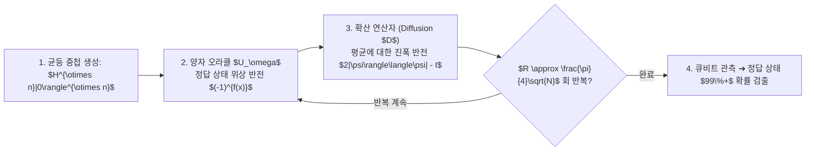

> [!abstract] 핵심 요약
> 양자 컴퓨터의 진정한 가치는 단순한 연산 클럭 속도가 아니라 **양자 알고리즘을 통한 시간 복잡도(Big-O)의 근본적 단축**에 있다.
> **그로버(Grover)** 검색은 정답 상태의 확률 진폭만 선택적으로 반전·증폭시키는 **진폭 증폭(Amplitude Amplification)**을 통해 $N$개 데이터 검색을 $O(\sqrt{N})$에 수행하며, **쇼어(Shor)** 알고리즘은 양자 푸리에 변환(QFT)을 통한 주기 탐색으로 소인수분해를 지수 시간에서 다항 시간 $O((\log N)^3)$으로 압축한다.

---

## 1. 그로버 진폭 증폭(Amplitude Amplification) 파이프라인

$$R_{\text{Grover}} \approx \frac{\pi}{4} \sqrt{N}$$



---

## 2. 고전 알고리즘 vs 양자 알고리즘 시간 복잡도 비교

| 문제 유형 | 고전 최고 알고리즘 | 양자 알고리즘 | 양자 이점 (Speedup) |
| :-- | :-- | :-- | :-- |
| **비정렬 $N$개 데이터 검색** | $O(N)$ (선형 탐색) | **그로버 검색: $O(\sqrt{N})$** | **2차 가속 (Quadratic Speedup)** |
| **$N$비트 정수 소인수분해** | $O(e^{c \sqrt[3]{\log N (\log \log N)^2}})$ (GNFS) | **쇼어 알고리즘: $O((\log N)^3)$** | **지수 가속 (Exponential Speedup)** |
| **함수 상수/균형 판별** | $O(2^{n-1} + 1)$ | **도이치-조사: $O(1)$** | **지수 가속 (결정론적 단 1회)** |

---

## 3. 실시간 고전 vs 그로버 검색 연산 횟수 비교기

```html preview
<div style="font-family:system-ui,-apple-system,sans-serif;padding:20px;background:var(--card);color:var(--card-foreground);border:1px solid var(--border);border-radius:var(--radius)">
  <div style="font-size:16px;font-weight:700;margin-bottom:14px;color:var(--primary);display:flex;align-items:center;gap:8px">
    <span>🔍 고전 선형 검색 vs 그로버 양자 검색 연산 횟수 비교</span>
  </div>

  <div style="margin-bottom:14px">
    <div style="display:flex;justify-content:space-between;font-size:11px;color:var(--muted-foreground);margin-bottom:4px">
      <span>검색 데이터베이스 크기 (N):</span>
      <span id="dbSizeVal" style="font-weight:700;color:var(--primary)">N = 1,000,000 (100만 건)</span>
    </div>
    <input id="inDbSize" type="range" min="1000" max="10000000" step="10000" value="1000000" style="width:100%" />
  </div>

  <div style="display:grid;grid-template-columns:1fr 1fr;gap:12px;margin-bottom:12px">
    <div style="padding:10px;background:var(--background);border:1px solid var(--border);border-radius:var(--radius);text-align:center">
      <div style="font-size:10px;color:var(--muted-foreground)">고전 평균 탐색 횟수 (N / 2)</div>
      <div id="classicStepsOut" style="font-family:monospace;font-size:16px;font-weight:800;color:var(--destructive,#ef4444)">500,000 회</div>
    </div>
    <div style="padding:10px;background:var(--background);border:1px solid var(--border);border-radius:var(--radius);text-align:center">
      <div style="font-size:10px;color:var(--muted-foreground)">그로버 양자 반복 횟수 (pi/4 * sqrt(N))</div>
      <div id="groverStepsOut" style="font-family:monospace;font-size:16px;font-weight:800;color:var(--primary)">785 회 (637배 가속 ⚡)</div>
    </div>
  </div>

  <script>
    document.getElementById('inDbSize').oninput = function() {
      var n = parseFloat(this.value);
      document.getElementById('dbSizeVal').textContent = "N = " + n.toLocaleString() + " 건";

      var classic = n / 2.0;
      var grover = (Math.PI / 4.0) * Math.sqrt(n);
      var speedup = classic / grover;

      document.getElementById('classicStepsOut').textContent = Math.round(classic).toLocaleString() + " 회";
      document.getElementById('groverStepsOut').textContent = Math.round(grover).toLocaleString() + " 회 (" + Math.round(speedup).toLocaleString() + "배 가속 ⚡)";
    };
  </script>
</div>
```
