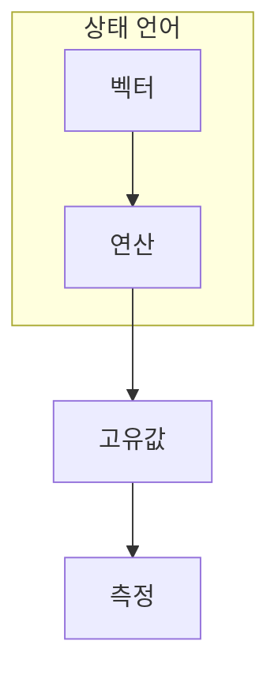

> [!abstract] 한 줄 요약
> 선형대수는 상태를 표현하고, 물리는 상태가 시간과 연산에 따라 어떻게 변하는지 설명한다.

## 이 노트의 지도



## 1. 벡터와 행렬은 상태 변화의 언어다

상태는 벡터, 게이트는 선형 연산자, 관측 가능한 값은 고유값 문제로 연결된다. ==고유값==는 이 노트에서 결과보다 먼저 추적할 대상이다.

$$
H|v\rangle=E|v\rangle
$$

<details>
<summary>유니터리와 에르미트는 왜 구분할까?</summary>

게이트는 확률을 보존하는 유니터리 연산이고, 관측량과 해밀토니안은 실수 고유값을 갖는 에르미트 연산자다.

</details>


## 2. 차원이 늘면 가능한 상태 표현도 늘어난다

큐비트 수가 하나 늘면 상태 벡터의 성분 수는 두 배가 된다. 이 증가는 표현 가능성과 계산 자원 요구를 함께 키운다.


> [!caution] 해석의 범위
> 성분 수 증가는 상태 표현의 크기다. 곧바로 모든 문제의 계산 속도 향상을 뜻하지 않는다.

## 기하 또는 상태로 회수하기

```html preview
<div style="font-family:system-ui,sans-serif;padding:20px;display:flex;align-items:center;gap:20px;color:var(--foreground)">
  <svg width="120" height="120" viewBox="0 0 120 120" role="img" aria-label="half of a two basis state decomposition">
    <circle cx="60" cy="60" r="46" stroke-width="14" style="fill: none; stroke: var(--border)" />
    <circle cx="60" cy="60" r="46" stroke-width="14"
      stroke-linecap="round" stroke-dasharray="289" stroke-dashoffset="145"
      transform="rotate(-90 60 60)" style="fill: none; stroke: var(--chart-1)" />
    <text x="60" y="67" text-anchor="middle" font-size="22" font-weight="700"
      style="fill: var(--foreground)">50%</text>
  </svg>
  <div>
    <div style="font-weight:600;font-size:15px">두 성분 상태</div>
    <div style="font-size:13px;color:var(--muted-foreground);margin-top:2px">한 큐비트는 두 계산 기저 성분으로 표현한다.</div>
  </div>
</div>
```

<Tabs>
  <Tab label="벡터">상태의 진폭을 나열한다.</Tab>
  <Tab label="행렬">상태에 선형 변환을 적용한다.</Tab>
  <Tab label="고유값">관측 가능한 결과를 해석한다.</Tab>
</Tabs>

## 핵심 정리

| 관점 | 확인할 질문 | 학습상 의미 |
| :-- | :-- | :-- |
| 상태 | 무엇을 표현하는가 | 벡터 |
| 변화 | 무엇이 작용하는가 | 행렬 |
| 관측 | 무엇을 읽는가 | 고유값 |

> [!question]- 스스로 점검
> **Q.** 게이트와 관측량에 서로 다른 행렬 조건이 필요한 이유는 무엇인가?
>
> **A.** 게이트는 확률 보존과 가역성을, 관측량은 실수 결과값의 해석을 보장해야 하기 때문이다.

## 출처

- 공개 노트에는 원본 강의 자료, 자산 이미지, 페이지 단위 근거를 포함하지 않는다.
