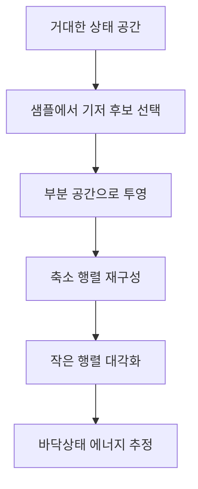
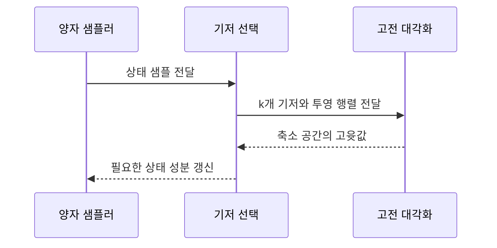
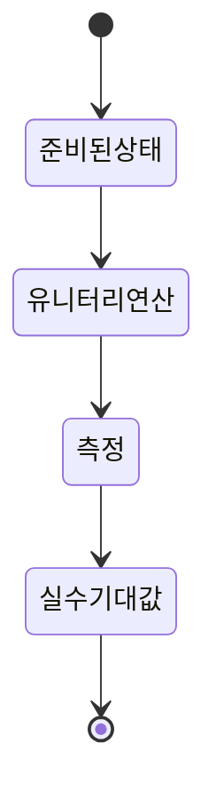
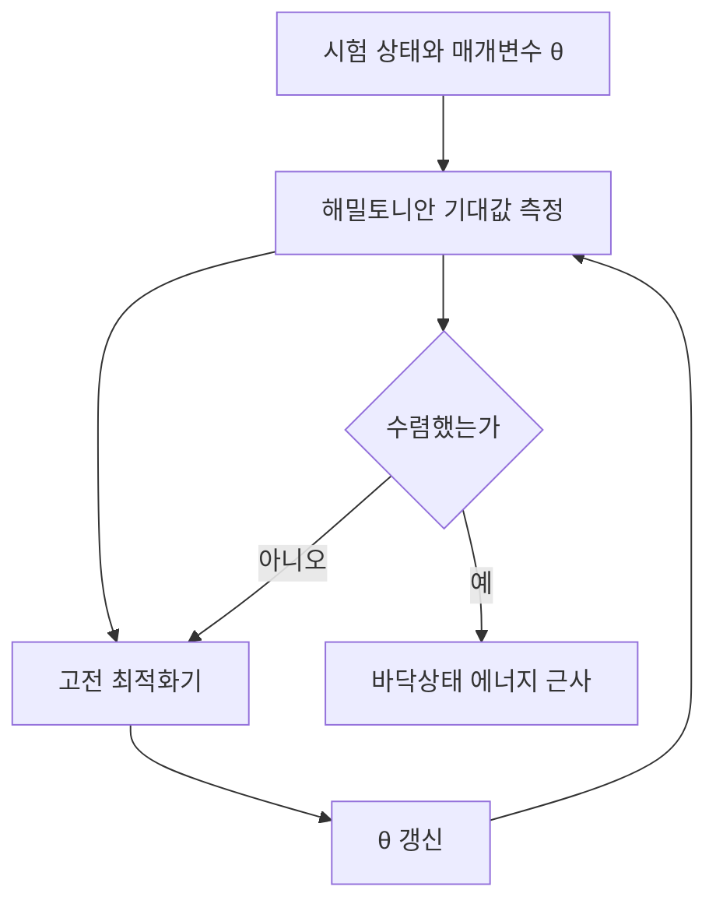

> [!ABSTRACT]
> 이 강의는 양자 알고리즘의 계산 언어를 선형대수와 물리학의 연결로 설명한다. 행렬의 고윳값·고유벡터에서 시작해 유니터리 변환, 텐서곱, 양자 상태, 슈뢰딩거 방정식, 레일리-리츠 변분 원리로 이어진다. 핵심 질문은 거대한 상태 공간을 직접 풀지 않고도 에너지 고윳값을 어떻게 추정하는가이다.

> [!INFO]
> 읽는 순서: `행렬 표현 → 상태 변화 → 측정 가능한 값 → 변분 최적화`. 슬라이드의 외부 링크는 원문에 적힌 참고 링크이며, 이 노트의 1차 근거는 아래에 연결한 PDF와 렌더 이미지다.

## 1. 한 장으로 보는 계산 언어

| 개념 | 수학적 조건 | 양자 계산에서 맡는 역할 |
| --- | --- | --- |
| 고유벡터·고윳값 | $A\lvert x\rangle=\lambda\lvert x\rangle$ | 변환 뒤 방향과 크기의 변화를 분리 |
| 에르미트 행렬 | $H=H^\dagger$ | 측정 가능한 관측량과 해밀토니안 표현 |
| 유니터리 변환 | $U^\dagger U=I$ | 노름을 보존하는 가역적 게이트 연산 |
| 텐서곱 | $\mathcal H_A\otimes\mathcal H_B$ | 여러 큐비트의 결합 상태 표현 |
| 변분 원리 | $\langle H\rangle\ge E_0$ | 바닥상태 에너지의 상한을 반복적으로 낮춤 |


> [!TIP]
> 이 강의에서 행렬은 단순한 데이터 표가 아니다. 에르미트 행렬은 문제를 부호화하고, 유니터리 게이트는 상태를 변화시키며, 측정은 실수 기대값으로 결과를 돌려준다.

## 2. 고윳값과 고유벡터

선형 변환 $A$가 어떤 0이 아닌 벡터 $\lvert x\rangle$의 방향을 바꾸지 않고 크기만 $\lambda$배 한다면 그 벡터가 고유벡터, 배율이 고윳값이다.

$$
A\lvert x\rangle=\lambda\lvert x\rangle, \qquad (A-\lambda I)\lvert x\rangle=0
$$

해가 0이 아닌 벡터가 되려면 특성 방정식이 필요하다.

$$
\det(A-\lambda I)=0
$$

슬라이드는 이 관계를 선형 변환의 기하로 설명한다. 일반 벡터는 회전·확대·축소·밀림을 겪지만, 고유벡터 방향에서는 변환 결과가 같은 방향에 남는다. 양자 게이트의 고유상태에서는 크기(노름)는 보존되고 복소 위상만 변할 수 있으며, 이 위상이 위상 킥백의 출발점이 된다.


> [!IMPORTANT]
> 유니터리 $U$의 고유값은 크기가 1인 복소수로 제한된다. 따라서 $U\lvert\psi\rangle=e^{2\pi i\theta}\lvert\psi\rangle$처럼 상태 벡터의 관측 확률은 그대로 두고 위상만 바꾸는 표현이 가능하다.

## 3. 대각화·부분 공간·차원의 저주

대각화는 적절한 기저에서 행렬을 고윳값의 대각 성분으로 바꾸는 과정이다.

$$
A=PDP^{-1}
$$

하지만 여러 입자의 상태 공간은 빠르게 커진다. 슬라이드는 전체 행렬을 그대로 대각화하는 대신, 시스템 에너지에 결정적으로 기여하는 기저만 골라 작은 부분 공간을 만드는 접근을 소개한다. SQD(Sample-based Quantum Diagonalization)는 양자 하드웨어의 샘플링으로 중요한 상태 성분을 모으고 그 기저에서 축소 행렬을 구성하는 아이디어다.

| 단계 | 입력과 연산 | 얻는 것 |
| --- | --- | --- |
| 샘플링 | 전체 상태에서 중요한 기저 후보 수집 | 대표 상태 $\lvert D_i\rangle$ |
| 투영 | $H_{ij}=\langle D_i\lvert H\rvert D_j\rangle$ | $k\times k$ 축소 행렬 |
| 재구성 | 축소 행렬을 대각화 | 근사 고윳값·고유상태 |




> [!NOTE]
> 차원의 저주는 변수가 늘기만 하면 자동으로 생기는 현상이 아니다. 슬라이드는 관측치 수보다 변수 수가 많아질 때 학습 효율이 떨어지고 거리 집중이 나타난다고 설명한다. 즉, 상태 공간의 크기와 실제로 확보한 샘플 수를 함께 봐야 한다.



<details>
<summary>텐서곱이 만드는 차원 증가</summary>

두 시스템의 상태 공간을 결합하면 차원은 곱해진다.

$$
\dim(\mathcal H_A\otimes\mathcal H_B)=\dim(\mathcal H_A)\dim(\mathcal H_B),
\qquad \dim(\mathcal H_{n\,qubits})=2^n
$$

슬라이드의 1차원·2차원·3차원 예시는 공간 차원이 커질수록 같은 수의 점이 더 희소하게 퍼지는 모습을 보여 준다. 이 비유는 모든 상태를 고전적으로 저장하는 엄밀한 대각화가 어려운 이유를 설명하는 데 쓰인다.

</details>

```html preview
<div style="font-family:system-ui,sans-serif;padding:20px;color:var(--foreground)">
  <h3 style="margin:0 0 12px;font-size:16px">슬라이드의 차원별 데이터 포착 예시</h3>
  <div style="display:flex;align-items:flex-end;gap:10px;height:150px;border-bottom:1px solid var(--border);padding:8px 4px">
    <div style="flex:1;height:100%;background:var(--chart-1);border-radius:var(--radius) var(--radius) 0 0;position:relative"><span style="position:absolute;top:-20px">42%</span></div>
    <div style="flex:1;height:33%;background:var(--chart-2);border-radius:var(--radius) var(--radius) 0 0;position:relative"><span style="position:absolute;top:-20px">14%</span></div>
    <div style="flex:1;height:17%;background:var(--chart-3);border-radius:var(--radius) var(--radius) 0 0;position:relative"><span style="position:absolute;top:-20px">7%</span></div>
    <div style="flex:1;height:7%;background:var(--chart-4);border-radius:var(--radius) var(--radius) 0 0;position:relative"><span style="position:absolute;top:-20px">3%</span></div>
  </div>
  <div style="display:flex;gap:10px;margin-top:8px;font-size:12px;color:var(--muted-foreground)"><span style="flex:1;text-align:center">1-D</span><span style="flex:1;text-align:center">2-D</span><span style="flex:1;text-align:center">3-D</span><span style="flex:1;text-align:center">4-D</span></div>
  <p style="font-size:12px;color:var(--muted-foreground);margin:12px 0 0">원본 p.12에 표시된 예시 비율을 재현한 도식이며, 모든 데이터셋의 일반 법칙은 아니다.</p>
</div>
```

## 4. 유니터리와 에르미트: 상태를 바꾸고 값을 읽는 조건

### 유니터리 변환

유니터리 행렬은 $U^\dagger U=I$를 만족한다. 역변환은 $U^{-1}=U^\dagger$로 주어지며, 내적과 노름을 보존한다. 이 성질 때문에 양자 게이트를 연속해서 적용해도 확률의 총합이 1로 유지된다.

### 에르미트 행렬과 관측량

에르미트 행렬은 $M=M^\dagger$인 행렬이다. 슬라이드는 에너지·위치·스핀처럼 측정할 물리량을 에르미트 행렬로 나타내며, 에르미트 행렬의 고윳값은 실수이고 서로 다른 고윳값의 고유벡터는 직교한다고 설명한다.

<Tabs>
  <Tab label="에르미트 행렬">
    문제의 물리량을 부호화한다. 고윳값이 가능한 측정값이며, 기대값은 실수다.
  </Tab>
  <Tab label="유니터리 변환">
    게이트 연산을 나타낸다. 상태의 노름과 내적을 보존하고 역연산이 존재한다.
  </Tab>
</Tabs>



## 5. 양자 상태·복소수 평면·측정

관측하지 않을 때 양자 상태는 유니터리 변환으로 연속적으로 진화하고, 관측 순간에는 중첩된 상태가 고유 상태 가운데 하나로 붕괴한다. 큐비트의 상태 벡터는 복소수 진폭으로 표현하며, 위상은 간섭을 통해 결과 확률에 영향을 준다.

에르미트 관측량 $M$의 기대값은 다음과 같이 계산한다.

$$
\langle M\rangle_\psi=\langle\psi\rvert M\lvert\psi\rangle
$$

> [!QUOTE]
> 한 번의 측정으로 중첩 상태의 전체 정보를 읽을 수 없다. 동일한 초기 상태와 회로를 여러 번 실행해 측정 결과의 확률 평균, 즉 기대값을 추정해야 한다.

## 6. 슈뢰딩거 방정식과 바닥상태

양자 상태의 시간 변화는 슈뢰딩거 방정식으로 기술된다.

$$
i\hbar\frac{\partial}{\partial t}\lvert\Psi(t)\rangle=\hat H\lvert\Psi(t)\rangle
$$

공간 좌표 표현에서 해밀토니안은 운동에너지와 퍼텐셜 에너지의 합으로 쓸 수 있다.

$$
\hat H=-\frac{\hbar^2}{2m}\nabla^2+V(\mathbf r,t)
$$

퍼텐셜이 시간에 무관하면 파동함수는 공간 부분과 시간 부분으로 분리되고, 정지 상태는 에너지 고윳값 방정식을 만족한다.

$$
\hat H\lvert\psi_n\rangle=E_n\lvert\psi_n\rangle
$$

> [!ABSTRACT]
> 여기서 $E_n$은 가능한 에너지 고윳값, $\lvert\psi_n\rangle$은 해당 고유상태다. 바닥상태는 가능한 에너지 중 가장 낮은 상태이며, 양자화학 문제에서는 이 값을 직접 찾는 일이 핵심 목표가 된다.

## 7. 레일리-리츠 변분 원리

정확한 다체 파동함수를 직접 구하기 어렵다면, 매개변수화한 시험 파동함수 $\lvert\psi_{trial}(\theta)\rangle$를 준비하고 에너지 기대값을 계산한다.

$$
\langle H\rangle_\theta=\frac{\langle\psi_{trial}(\theta)\rvert\hat H\lvert\psi_{trial}(\theta)\rangle}{\langle\psi_{trial}(\theta)\vert\psi_{trial}(\theta)\rangle}\ge E_0
$$

이 부등식은 임의의 시험 함수가 바닥상태 에너지보다 낮은 값을 내지 않는다는 보장이다. 매개변수에 대한 미분이 0에 가까워지도록 반복하면 최소 에너지 근처로 이동한다.




> [!WARNING]
> 원본 p.13은 파울리 배타 원리를 설명하며 “전자는 같은 공간에 3개 이상 있을 수 없다”라고 적는다. 이 문구는 원본의 표현을 수정하지 않고 기록한 것이며, 정확한 물리적 해석은 별도 검토가 필요하다.

<details>
<summary>이 문서에서 수식을 읽는 법</summary>

1. $H$는 문제를 나타내는 에르미트 행렬이다.
2. $\lvert\psi(\theta)\rangle$는 회로가 만드는 후보 상태다.
3. 측정으로 $\langle H\rangle_\theta$를 추정한다.
4. 고전 최적화기가 $\theta$를 바꾸고 다시 측정한다.

</details>

## 자기점검

> [!QUESTION]-
> 1. $U^\dagger U=I$가 확률 보존을 보장하는 이유를 말할 수 있는가?
> 2. 에르미트 행렬의 고윳값이 왜 측정값으로 적합한가?
> 3. 텐서곱의 차원 증가가 정확한 대각화를 어렵게 만드는 과정을 설명할 수 있는가?
> 4. 변분 원리의 부등식이 최적화 방향에 주는 보장은 무엇인가?

## 원본과 근거

- [원본 PDF](<../sources/3. 양자컴퓨팅을 위한 물리 및 선형대수_Jun.2026.pdf>)
- 원본 해시: `c84d76143fd29c1941384a3120482169335f8cfc407300763c6a75f84e674ec9`
- 렌더 이미지: p.5, p.7, p.20 (실제 `assets/` 파일만 임베드)
- 추출본: `.ok/local/pdf-extract/03_ai-ml-data__quantum-lecture__3.-양자컴퓨팅을-위한-물리-및-선형대수_Jun.2026/text.md`