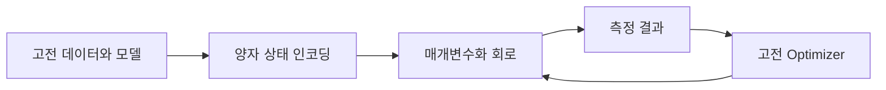
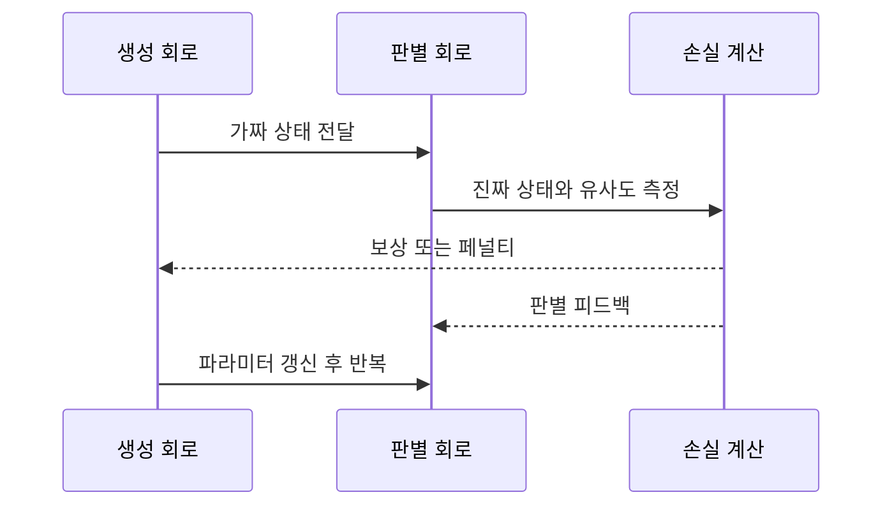
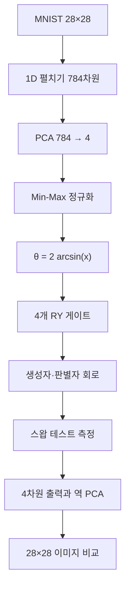

> [!ABSTRACT]
> 이 강의는 QML을 “고전 데이터를 양자 상태와 회로로 매핑해 학습하는 하이브리드 접근”으로 소개하고, 생성형 사례인 QuGAN을 따라 데이터 축소·큐비트 인코딩·양자 상태 충실도 판별·이미지 복원까지 연결한다. 부록에서는 QKNN·QSVM·양자 K-Means·QNN·QDT·양자 확률 모델의 문제 설정을 비교한다.

## 1. QML이 다루려는 병목

슬라이드는 머신러닝 모델의 파라미터 수와 레이어 깊이, 훈련 FLOPs가 빠르게 커지면서 고전 컴퓨팅의 하드웨어 비용·전력·시간 부담이 드러난다고 설명한다. 이 관찰에서 출발한 QML의 방향은 순수 양자 알고리즘으로 모두 대체하는 것이 아니라, NISQ 장치에서 작은 회로와 고전 Optimizer를 결합하는 것이다.

| 고전 모델 | 양자 매핑 또는 결합 방식 | 슬라이드가 강조한 목적 |
| --- | --- | --- |
| 신경망 | 하이브리드 양자 회로를 특징 추출 블록으로 결합 | 적은 파라미터로 표현력 확보 |
| SVM | 양자 커널로 데이터를 큰 Hilbert 공간에 매핑 | 비선형 분리와 신호 분류 |
| K-Means·k-NN | 양자 상태의 거리·충실도 추정 | 적은 데이터에서 거리 계산 효율화 |
| 결정 트리 | 양자 커널 또는 양자 분기 판별기 | 트리 탐색과 해석 가능성 결합 |
| 확률 모델 | QGAN·HQMM 등으로 분포 샘플링 | 불확실성 추론과 생성 |



> [!NOTE]
> 표의 최신 SOTA 정확도·파라미터 감소 수치는 강의 슬라이드가 인용한 문헌과 함께 제시한 주장이다. 이 노트는 PDF에 적힌 범위를 재구성하며, 별도의 재현 실험이나 외부 검증을 했다고 말하지 않는다.

## 2. 생성형 모델로서의 QuGAN

양자 시스템은 중첩과 얽힘을 측정할 때 확률 분포를 생성한다. 강의는 이 성질을 GAN의 생성자에 연결해, 무작위 노이즈에서 가짜 데이터를 만들고 판별자가 진짜·가짜를 구분하는 적대 학습을 양자 회로로 구현하는 QuGAN을 사례로 선택한다.

| 구성 요소 | 고전 GAN | QuGAN의 강의상 대응 |
| --- | --- | --- |
| 생성자 | 신경망이 가짜 데이터 생성 | 양자 생성 회로가 양자 상태를 생성 |
| 판별자 | 진짜·가짜 이진 분류 | 스왑 테스트로 상태 유사도 측정 |
| 기울기 | 역전파 | 파라미터 이동 규칙으로 게이트 미분 추정 |
| 목표 | 데이터 분포 모사 | 양자 상태 충실도 기반 경쟁 학습 |




<Tabs>
  <Tab label="고전 GAN">
    생성자와 판별자가 고전 신경망이다. 데이터는 픽셀이나 실수 벡터로 다룬다.
  </Tab>
  <Tab label="QuGAN">
    생성자와 판별자를 양자 회로로 만들고, 상태 충실도와 스왑 테스트를 판별 신호로 사용한다.
  </Tab>
</Tabs>

> [!IMPORTANT]
> 강의가 말하는 “양자 생성기”는 측정의 확률성을 활용한다는 뜻이다. 양자라는 이유만으로 모든 생성 문제가 자동으로 빨라진다는 주장은 이 자료의 결론이 아니다.

## 3. MNIST를 양자 회로에 넣는 경로

실습 대상은 28×28 MNIST 이미지다. 한 이미지를 펼치면 784차원 벡터가 되지만, 현재 양자 장치에서 784개 특징을 직접 다루기 어렵기 때문에 PCA로 4차원까지 줄인다. 정규화한 값 $x_i\in[0,1]$을 회전 각도에 매핑한다.

$$
\theta_i=2\arcsin(x_i)
$$

각 $\theta_i$를 $R_Y(\theta_i)$ 게이트로 네 큐비트에 적용한다. 판별자와 생성자에는 각각 네 큐비트가 쓰이며, 보조 큐비트는 스왑 테스트의 측정 확률을 판별 결과로 전달한다.




> [!TIP]
> 차원 축소는 단순 전처리가 아니라 회로 규모를 결정한다. 784→4로 줄인다는 선택에는 정보 손실을 감수하고 현재 큐비트 수에 맞추겠다는 설계 판단이 들어 있다.

<details>
<summary>보조 큐비트의 역할</summary>

보조 큐비트는 비교할 두 상태의 유사도를 스왑 테스트로 읽는 통로다. 슬라이드 회로에서 보조 큐비트의 측정 확률이 판별자의 결과값이 되므로, 생성자와 기준 상태를 같은 회로 안에서 비교할 수 있다.

</details>

## 4. 생성·복원·비교

양자 컴퓨터가 내놓는 값은 축소된 4차원 데이터다. 이를 역스케일링하고 PCA 역변환으로 784차원 픽셀 공간에 되돌린 뒤 28×28 이미지로 재구성한다. 원본 데이터와 생성 데이터를 비교하는 것이 훈련과 성능 평가의 마지막 단계다.

| 변환 | 차원 | 의미 |
| --- | ---: | --- |
| 원본 이미지 | 28×28 | 픽셀 배열 |
| 1D 펼치기 | 784 | 양자 입력 전 벡터 |
| PCA 축소 | 4 | 양자 회로에 넣을 특징 |
| 양자 출력 | 4 | 생성 회로의 측정 결과 |
| 역 PCA·재구성 | 784 → 28×28 | 비교 가능한 이미지 |

```html preview
<div style="font-family:system-ui,sans-serif;padding:20px;color:var(--foreground)">
  <h3 style="margin:0 0 14px;font-size:16px">생성 모델의 역할 비교</h3>
  <div style="display:grid;grid-template-columns:repeat(2,minmax(0,1fr));gap:12px">
    <div style="padding:16px;background:var(--card);border:1px solid var(--border);border-radius:var(--radius)">
      <div style="font-size:12px;color:var(--muted-foreground)">고전 기준선</div>
      <strong style="display:block;margin-top:6px;font-size:20px">C-GAN</strong>
      <p style="margin:8px 0 0;font-size:13px">고전 생성자와 판별자가 분포를 맞춘다.</p>
    </div>
    <div style="padding:16px;background:var(--card);border:1px solid var(--border);border-radius:var(--radius)">
      <div style="font-size:12px;color:var(--muted-foreground)">양자 회로 사례</div>
      <strong style="display:block;margin-top:6px;font-size:20px">QuGAN</strong>
      <p style="margin:8px 0 0;font-size:13px">양자 회로 생성자와 판별자가 측정 분포를 비교한다.</p>
    </div>
  </div>
  <p style="font-size:12px;color:var(--muted-foreground);margin:14px 0 0">강의의 구조 비교를 개념도로 재배열한 것이며, 새 성능 수치를 산출하지 않았다.</p>
</div>
```


> [!SUCCESS]
> 원본 p.22는 1·100번째 epoch에서 C-GAN과 QuGAN의 클래스별 분포를 비교한다. 이 그림에서 읽을 수 있는 것은 강의가 제시한 비교 예시이며, 새로운 정확도 수치나 일반화 결론을 추가하지 않는다.

## 5. 성과와 한계

강의는 QuGAN의 연구 의미로 양자 회로 생성자·판별자, 충실도 기반 손실, 파라미터 감소, 안정적 학습, 순수 양자 아키텍처를 든다. 동시에 제한된 큐비트, 노이즈, 샷 기반 시뮬레이션 비용, GAN 특유의 훈련 불안정성, 확장성 문제를 도전 과제로 적는다.

| 관찰된 장점 | 함께 기록해야 할 조건 |
| --- | --- |
| 양자 회로 생성자·판별자 구조 | 큐비트 수와 회로 깊이에 의존 |
| 양자 상태를 직접 생성할 가능성 | 샷 기반 시뮬레이션 비용에 의존 |
| 충실도 기반 판별과 안정적 수렴 주장 | 강의가 제시한 실험 맥락 안에서만 해석 |
| 고차원 분포 탐색 잠재력 | 노이즈·모드 붕괴·확장성 위험 |

## 6. 부록 알고리즘 지형

부록은 QML을 하나의 모델로 고정하지 않고, 데이터 유형과 계산 목표에 따라 여러 양자 모델을 나란히 둔다.

| 모델 | 핵심 질문 | 슬라이드의 양자 관점 |
| --- | --- | --- |
| QKNN | 가까운 이웃은 무엇인가? | 상태 간 거리·유사도 추정 |
| QSVM | 어느 초평면이 분리하는가? | 양자 커널로 특징 공간 확장 |
| Quantum K-Means | 군집 중심은 어디인가? | 양자 거리와 반복 할당 |
| QNN | 가중치 매핑을 어떻게 학습하는가? | 유니터리 회로와 비선형성의 긴장 |
| QDT | 어떤 질문으로 분기할 것인가? | 측정과 폰 노이만 엔트로피 |
| 확률 모델 | 숨은 상태·분포를 어떻게 추론하는가? | 밀도 행렬, POVM, Kraus 연산자 |

<details>
<summary>QNN·QDT·양자 확률 모델의 주의점</summary>

- QNN은 고전 신경망의 비선형 활성화 함수와 양자 동역학의 가역적·선형적인 유니터리 변환 사이의 설계 난제를 갖는다.
- QDT는 고전 특징을 양자 상태로 인코딩하고, 분기 기준을 측정 또는 양자 연산으로 만든다. 슬라이드는 Shannon entropy 대신 von Neumann entropy를 제안하는 흐름을 소개한다.
- 양자 확률 모델은 베이즈 분류를 POVM으로 확장하고, HQMM에서 전이 행렬 대신 Kraus 연산자로 밀도 행렬 변화를 표현한다.

</details>

> [!CAUTION]
> 부록의 QKNN·QSVM·K-Means 슬라이드는 제목과 도식 위주로 추출되며, 이 노트는 PDF에서 확인되는 문제 설정만 요약한다. 보이지 않는 수식이나 실험 결과를 임의로 복원하지 않는다.

## 자기점검

> [!QUESTION]-
>
> 1. 784차원 MNIST를 4차원으로 줄이는 이유와 정보 손실의 의미를 설명할 수 있는가?
> 2. RY 게이트의 각도와 입력값 사이의 관계를 쓸 수 있는가?
> 3. QuGAN에서 보조 큐비트와 스왑 테스트가 판별 신호가 되는 이유는 무엇인가?
> 4. 파라미터 감소 주장과 하드웨어·시뮬레이션 한계를 함께 말할 수 있는가?
> 5. QNN의 비선형성 문제와 QDT의 엔트로피 선택을 구별할 수 있는가?

## 원본과 근거

- [원본 PDF](<../sources/4. 양자 머신러닝 알고리즘 소개-QML_Jun.2026.pdf>)
- 원본 해시: `ec2d4533d241f7af97126bd5ddb91fdf91c8da723c097add19441622430fc59c`
- 렌더 이미지: p.12, p.18, p.22 (실제 `assets/` 파일만 임베드)
- 추출본: `.ok/local/pdf-extract/03_ai-ml-data__quantum-lecture__4.-양자-머신러닝-알고리즘-소개-QML_Jun.2026/text.md`
