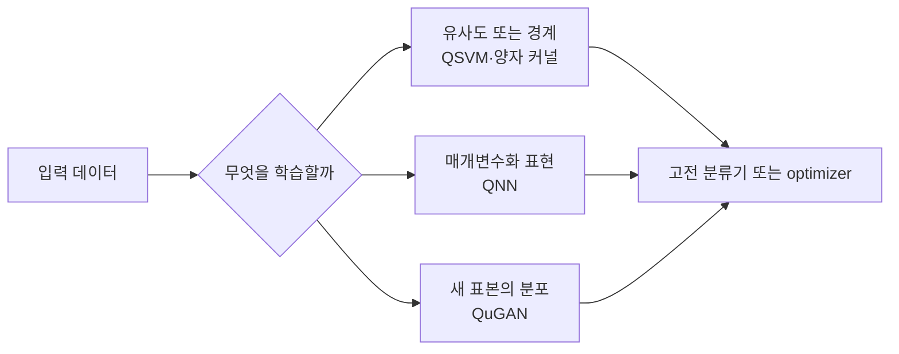

## 04. 양자 머신러닝 알고리즘 소개 — QML

QML은 고전 모델을 양자 회로로 단순히 바꾸는 일이 아니다. **고전 데이터를 어떤 상태로 인코딩할지**, **회로가 어떤 특징을 만들지**, **측정 결과를 어떤 고전적 손실로 되돌릴지**를 함께 설계하는 문제다.

> [!NOTE]
> 이 문서의 모든 도식은 학습을 위해 새로 만든 개념 시각화다. 원본 강의 슬라이드·스크린샷·도표는 포함하지 않는다.

```html preview h=210
<div style="font-family:system-ui,sans-serif;padding:14px;color:var(--foreground);background:var(--card);border:1px solid var(--border);border-radius:var(--radius)">
<svg viewBox="0 0 720 160" width="100%" role="img" aria-label="고전 데이터가 인코딩과 양자 회로, 측정, 고전 학습으로 이어지는 QML 흐름">
  <text x="18" y="24" font-size="15" font-weight="700" fill="currentColor">QML은 양자 부분만이 아니라 양자와 고전의 접점을 설계한다</text>
  <g transform="translate(26 52)" font-family="system-ui,sans-serif">
    <g><rect width="124" height="54" rx="11" fill="var(--card)" stroke="var(--border)"/><text x="62" y="23" text-anchor="middle" font-size="14" font-weight="700" fill="currentColor">고전 데이터</text><text x="62" y="41" text-anchor="middle" font-size="11" fill="var(--muted-foreground)">벡터·특징</text></g>
    <path d="M137 27h46" stroke="var(--muted-foreground)" stroke-width="3"/><path d="M183 27l-10-7v14z" fill="var(--muted-foreground)"/>
    <g transform="translate(198)"><rect width="124" height="54" rx="11" fill="var(--chart-1)"/><text x="62" y="23" text-anchor="middle" font-size="14" font-weight="700" fill="white">인코딩</text><text x="62" y="41" text-anchor="middle" font-size="11" fill="white">|ψ(x)⟩</text></g>
    <path d="M335 27h46" stroke="var(--muted-foreground)" stroke-width="3"/><path d="M381 27l-10-7v14z" fill="var(--muted-foreground)"/>
    <g transform="translate(396)"><rect width="124" height="54" rx="11" fill="var(--chart-4)"/><text x="62" y="23" text-anchor="middle" font-size="14" font-weight="700" fill="white">PQC</text><text x="62" y="41" text-anchor="middle" font-size="11" fill="white">U(θ)</text></g>
    <path d="M533 27h46" stroke="var(--muted-foreground)" stroke-width="3"/><path d="M579 27l-10-7v14z" fill="var(--muted-foreground)"/>
    <g transform="translate(594)"><rect width="88" height="54" rx="11" fill="var(--chart-2)"/><text x="44" y="23" text-anchor="middle" font-size="14" font-weight="700" fill="white">측정</text><text x="44" y="41" text-anchor="middle" font-size="11" fill="white">ŷ</text></g>
    <path d="M638 67v23H461v-20" fill="none" stroke="var(--chart-2)" stroke-width="3"/><path d="M461 70l-8 10h16z" fill="var(--chart-2)"/><text x="543" y="109" text-anchor="middle" font-size="12" fill="var(--muted-foreground)">고전 optimizer가 θ를 갱신</text>
  </g>
</svg>
</div>
```

## 1. 먼저 결정할 것: 데이터 표현

강의는 SVM·신경망·거리 기반 방법·트리·확률 모델마다 양자 커널, 매개변수화 회로, 충실도, 양자 상태 샘플링처럼 서로 다른 접점을 제시한다. 공통점은 **입력 $x$를 양자 상태 $|\psi(x)\rangle$로 옮긴 뒤 측정 가능한 양으로 읽는다**는 데 있다.

<Tabs>
  <Tab label="커널 관점">
  두 입력의 유사도를 회로가 만든 상태의 겹침으로 정의한다. 분류기는 이 유사도 행렬을 고전 SVM에 넘겨 결정 경계를 찾는다.
  </Tab>
  <Tab label="회로 관점">
  데이터 인코딩 뒤 매개변수화 회로 $U(\theta)$가 특징을 바꾼다. 측정값과 손실을 통해 $\theta$를 반복 갱신한다.
  </Tab>
  <Tab label="생성 관점">
  회로에서 얻은 표본을 목표 분포와 비교한다. 학습의 대상은 클래스가 아니라 ==원하는 분포의 모양==이다.
  </Tab>
</Tabs>

```html preview h=190
<div style="font-family:system-ui,sans-serif;padding:14px;color:var(--foreground);background:var(--card);border:1px solid var(--border);border-radius:var(--radius)">
<svg viewBox="0 0 720 140" width="100%" role="img" aria-label="많은 고전 특징을 적은 양자 입력으로 압축할 때 생기는 정보 보존 선택을 보여주는 도식">
  <text x="18" y="23" font-size="15" font-weight="700" fill="currentColor">특징 수가 많을수록 “무엇을 남길지”가 인코딩보다 먼저다</text>
  <g transform="translate(36 48)" font-family="system-ui,sans-serif">
    <g><rect width="178" height="60" rx="11" fill="var(--card)" stroke="var(--border)"/><g fill="var(--chart-1)"><circle cx="30" cy="30" r="6"/><circle cx="52" cy="20" r="6"/><circle cx="74" cy="39" r="6"/><circle cx="96" cy="23" r="6"/><circle cx="118" cy="43" r="6"/><circle cx="140" cy="28" r="6"/></g><text x="89" y="82" text-anchor="middle" font-size="12" fill="var(--muted-foreground)">원래 특징 공간</text></g>
    <path d="M197 30h81" stroke="var(--muted-foreground)" stroke-width="3"/><path d="M278 30l-10-7v14z" fill="var(--muted-foreground)"/><text x="211" y="17" font-size="12" fill="var(--muted-foreground)">정규화·축소</text>
    <g transform="translate(295)"><rect width="130" height="60" rx="11" fill="var(--card)" stroke="var(--chart-3)" stroke-width="2"/><path d="M25 42L105 16" stroke="var(--chart-3)" stroke-width="5" stroke-linecap="round"/><circle cx="42" cy="36" r="6" fill="var(--chart-3)"/><circle cx="69" cy="27" r="6" fill="var(--chart-3)"/><circle cx="95" cy="19" r="6" fill="var(--chart-3)"/><text x="65" y="82" text-anchor="middle" font-size="12" fill="var(--muted-foreground)">선택된 표현</text></g>
    <path d="M437 30h81" stroke="var(--muted-foreground)" stroke-width="3"/><path d="M518 30l-10-7v14z" fill="var(--muted-foreground)"/>
    <g transform="translate(535)"><circle cx="50" cy="30" r="27" fill="none" stroke="var(--chart-4)" stroke-width="5"/><line x1="50" y1="30" x2="69" y2="12" stroke="var(--chart-4)" stroke-width="5" stroke-linecap="round"/><text x="50" y="82" text-anchor="middle" font-size="12" fill="var(--muted-foreground)">양자 입력 상태</text></g>
  </g>
</svg>
</div>
```

> [!TIP]
> 강의의 QuGAN 사례는 MNIST 이미지를 펼친 784차원 값을 정규화하고 PCA로 4차원까지 줄이는 전처리를 쓴다. 여기서 4차원은 “원본을 완전히 보존한다”는 뜻이 아니라, 제한된 회로에서 다룰 표현을 선택했다는 뜻이다.

<details>
<summary>인코딩을 검토할 때 던질 네 가지 질문</summary>

1. 입력 특징은 연속값인가, 범주값인가?
2. 정규화 뒤 각 값은 어떤 회전각 또는 진폭에 대응하는가?
3. 축소 과정이 분류·생성에 필요한 정보를 지나치게 버리지는 않는가?
4. 측정으로 되돌린 값이 원래 문제의 손실 함수와 직접 연결되는가?

</details>

## 2. QuGAN: 분포를 두고 경쟁하는 실험

GAN에서 생성자는 노이즈로 가짜 표본을 만들고, 판별자는 진짜 표본과 생성 표본을 구별한다. 강의의 QuGAN은 이 구도를 양자 상태 충실도와 회로 기반 생성·판별로 해석한다. 중요한 것은 “양자라서 자동으로 좋은 생성 모델”이 아니라, **표본 분포를 어떤 측정과 손실로 비교하는가**다.

```html preview h=210
<div style="font-family:system-ui,sans-serif;padding:14px;color:var(--foreground);background:var(--card);border:1px solid var(--border);border-radius:var(--radius)">
<svg viewBox="0 0 720 160" width="100%" role="img" aria-label="생성 모델과 판별 또는 비교 손실이 반복 갱신되는 QuGAN 학습 개념도">
  <text x="18" y="24" font-size="15" font-weight="700" fill="currentColor">생성 모델은 표본 하나가 아니라 목표 분포에 가까워지는 과정을 학습한다</text>
  <g transform="translate(38 51)" font-family="system-ui,sans-serif">
    <g><rect width="128" height="54" rx="11" fill="var(--card)" stroke="var(--border)"/><text x="64" y="23" text-anchor="middle" font-size="14" font-weight="700" fill="currentColor">노이즈 z</text><text x="64" y="41" text-anchor="middle" font-size="11" fill="var(--muted-foreground)">표본의 출발점</text></g>
    <path d="M141 27h47" stroke="var(--muted-foreground)" stroke-width="3"/><path d="M188 27l-10-7v14z" fill="var(--muted-foreground)"/>
    <g transform="translate(203)"><rect width="128" height="54" rx="11" fill="var(--chart-4)"/><text x="64" y="23" text-anchor="middle" font-size="14" font-weight="700" fill="white">생성 회로</text><text x="64" y="41" text-anchor="middle" font-size="11" fill="white">G(θ)</text></g>
    <path d="M344 27h47" stroke="var(--muted-foreground)" stroke-width="3"/><path d="M391 27l-10-7v14z" fill="var(--muted-foreground)"/>
    <g transform="translate(406)"><rect width="128" height="54" rx="11" fill="var(--chart-5)"/><text x="64" y="23" text-anchor="middle" font-size="14" font-weight="700" fill="white">분포 비교</text><text x="64" y="41" text-anchor="middle" font-size="11" fill="white">충실도·손실</text></g>
    <path d="M547 27h47" stroke="var(--muted-foreground)" stroke-width="3"/><path d="M594 27l-10-7v14z" fill="var(--muted-foreground)"/>
    <g transform="translate(609)"><rect width="66" height="54" rx="11" fill="var(--chart-2)"/><text x="33" y="23" text-anchor="middle" font-size="13" font-weight="700" fill="white">갱신</text><text x="33" y="41" text-anchor="middle" font-size="10" fill="white">θ</text></g>
    <path d="M642 66v24H267v-20" fill="none" stroke="var(--chart-2)" stroke-width="3"/><path d="M267 70l-8 10h16z" fill="var(--chart-2)"/><text x="453" y="111" text-anchor="middle" font-size="12" fill="var(--muted-foreground)">측정 결과가 다음 회로 파라미터를 바꾼다</text>
  </g>
</svg>
</div>
```

<details>
<summary>강의의 QuGAN 비교를 읽는 법</summary>

- 고전 GAN은 보통 신경망 생성자·판별자와 역전파를 사용한다.
- 강의의 QuGAN 설명은 양자 상태 충실도와 스왑 테스트를 분포 비교의 핵심 도구로 둔다.
- 강의가 제시한 “10개 대 199개 파라미터”는 특정 과제·구성의 사례다. 일반적인 우위나 모든 데이터셋의 효율로 확대하면 안 된다.
- Hellinger distance가 0에 가까우면 두 분포가 가깝다는 강의의 해석도, 데이터 전처리·측정 횟수·비교 대상과 함께 읽어야 한다.

</details>

> [!IMPORTANT]
> 파라미터 수가 작아도 데이터 인코딩, 반복 측정, 시뮬레이터 비용이 사라지는 것은 아니다. ==회로 파라미터만으로 학습 비용을 판단하지 않는다.==

## 3. QML 모델을 구분하는 세 개의 렌즈



<Tabs>
  <Tab label="QSVM">
  상태 인코딩 뒤 두 입력의 유사도를 커널로 읽는다. 회로의 역할은 “좋은 특징 공간”을 만드는 데 있고, 최종 분류 경계는 고전 SVM이 담당할 수 있다.
  </Tab>
  <Tab label="QNN">
  매개변수화 회로가 가중치 층과 비슷한 역할을 한다. 다만 유니터리 변환은 선형·가역적이므로, 고전 신경망의 비선형 활성화를 무엇으로 대응시킬지가 별도 설계 과제다.
  </Tab>
  <Tab label="QDT·확률 모델">
  QDT는 양자 상태 인코딩과 분기 기준을 결합하는 방향을, 확률 모델은 분포 표현·샘플링을 강조한다. 같은 QML이라도 필요한 측정과 해석 가능성이 다르다.
  </Tab>
</Tabs>

```html preview h=185
<div style="font-family:system-ui,sans-serif;padding:14px;color:var(--foreground);background:var(--card);border:1px solid var(--border);border-radius:var(--radius)">
<svg viewBox="0 0 720 135" width="100%" role="img" aria-label="QNN에서 유니터리 회로와 측정이 고전적 비선형 처리와 다른 역할을 갖는다는 비교 도식">
  <text x="18" y="23" font-size="15" font-weight="700" fill="currentColor">QNN을 볼 때는 “뉴런 모양”보다 측정과 손실의 위치를 확인한다</text>
  <g transform="translate(42 49)" font-family="system-ui,sans-serif">
    <g><rect width="188" height="57" rx="11" fill="var(--card)" stroke="var(--chart-1)" stroke-width="2"/><text x="94" y="24" text-anchor="middle" font-size="14" font-weight="700" fill="currentColor">고전 신경망</text><text x="94" y="43" text-anchor="middle" font-size="12" fill="var(--muted-foreground)">선형 결합 → 비선형 활성화</text></g>
    <path d="M246 28h65" stroke="var(--muted-foreground)" stroke-width="3"/><path d="M311 28l-10-7v14z" fill="var(--muted-foreground)"/>
    <g transform="translate(326)"><rect width="188" height="57" rx="11" fill="var(--card)" stroke="var(--chart-4)" stroke-width="2"/><text x="94" y="24" text-anchor="middle" font-size="14" font-weight="700" fill="currentColor">QNN</text><text x="94" y="43" text-anchor="middle" font-size="12" fill="var(--muted-foreground)">유니터리 회로 → 측정 → 고전 손실</text></g>
    <path d="M530 28h65" stroke="var(--muted-foreground)" stroke-width="3"/><path d="M595 28l-10-7v14z" fill="var(--muted-foreground)"/>
    <g transform="translate(610)"><circle cx="25" cy="28" r="24" fill="var(--chart-2)"/><text x="25" y="34" text-anchor="middle" font-size="17" font-weight="700" fill="white">θ</text><text x="25" y="84" text-anchor="middle" font-size="12" fill="var(--muted-foreground)">갱신</text></g>
  </g>
</svg>
</div>
```

> [!CAUTION]
> 강의에 있는 최근 성능 수치·사례는 원문이 인용한 개별 연구의 조건에서 해석해야 한다. 이 정리문서는 그 수치를 재현하거나 보편적 우위를 주장하지 않는다.

<details>
<summary>학습 전 점검표</summary>

- 데이터 차원 축소와 인코딩은 별도 단계로 설명할 수 있는가?
- 회로 출력이 확률·기댓값·샘플 중 무엇인지 적었는가?
- 고전 optimizer가 어떤 손실을 최소화하는지 명시했는가?
- 비교 기준에 샷 수, 노이즈, 시뮬레이터 비용을 포함했는가?
- “양자 이점”을 실험 결과가 아닌 가설로 말해야 하는 구간을 구분했는가?

</details>

## 한 문장 정리

QML의 난점은 양자 회로를 넣는 데 있지 않다. **데이터를 표현으로 바꾸고, 측정 가능한 신호로 학습을 닫는 전체 경로**를 설계하는 데 있다.
