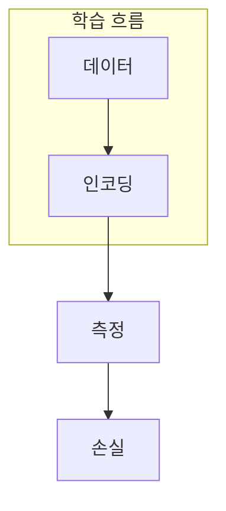

> [!abstract] 한 줄 요약
> QML의 핵심은 데이터를 양자 상태로 옮긴 뒤, 측정 가능한 특징을 고전 학습 목표에 연결하는 설계다.

## 이 노트의 지도



## 1. 표현 공간을 바꾸는 선택

인코딩은 고전 입력을 양자 상태로 매핑한다. 어떤 특징을 보존하고 어떤 회로 깊이를 허용할지는 모델 설계의 일부다. ==특징 매핑==는 이 노트에서 결과보다 먼저 추적할 대상이다.

$$
x\mapsto|\phi(x)\rangle
$$

<details>
<summary>인코딩이 좋아 보인다는 말의 조건</summary>

표현이 복잡해도 데이터에 맞는 구분이 생기지 않거나 측정 비용이 과도하면 학습 이점이 아니다. 고전 기준선과 같은 평가 지표가 필요하다.

</details>

```html preview
<div style="font-family:system-ui,sans-serif;padding:20px;color:var(--foreground)">
  <label for="amt" style="font-size:14px;font-weight:600">특징 수</label>
  <div id="out" style="font-size:30px;font-weight:700;color:var(--chart-1);margin:6px 0">4 features</div>
  <input id="amt" type="range" min="1" max="12" step="1" value="4"
    style="width:100%;accent-color:var(--primary)" />
  <p style="font-size:13px;color:var(--muted-foreground)">특징 수 변화는 인코딩 설계 복잡도를 바꾼다.</p>
  <script>
    var amt = document.getElementById('amt');
    var out = document.getElementById('out');
    amt.addEventListener('input', function () {
      out.textContent = '' + Number(amt.value).toLocaleString() + ' features';
    });
  </script>
</div>
```

## 2. 측정 결과를 학습 신호로 바꾼다

양자 회로의 내부 상태는 직접 학습 목표가 되지 않는다. 측정한 기대값이나 분포를 고전 손실 함수에 연결해 갱신해야 한다.


> [!caution] 해석의 범위
> 막대는 단계별 상대적 설계 항목 수를 나타내는 학습용 도식이다. 성능 점수가 아니다.


<Tabs>
  <Tab label="인코딩">입력을 양자 상태로 매핑한다.</Tab>
  <Tab label="회로">매개변수화된 변환으로 특징을 만든다.</Tab>
  <Tab label="측정">고전 학습기가 쓸 수 있는 값을 꺼낸다.</Tab>
</Tabs>

## 핵심 정리

| 관점 | 확인할 질문 | 학습상 의미 |
| :-- | :-- | :-- |
| 입력 | 무엇을 보존하는가 | 인코딩 |
| 회로 | 무엇을 변환하는가 | 표현 |
| 측정 | 무엇을 내보내는가 | 학습 신호 |

> [!question]- 스스로 점검
> **Q.** QML에서 측정 단계를 생략하면 왜 학습 목표와 회로 상태를 연결하기 어려운가?
>
> **A.** 고전 최적화기가 사용할 수 있는 수치적 관측값이 없기 때문이다.

## 출처

- 공개 노트에는 원본 강의 자료, 자산 이미지, 페이지 단위 근거를 포함하지 않는다.
