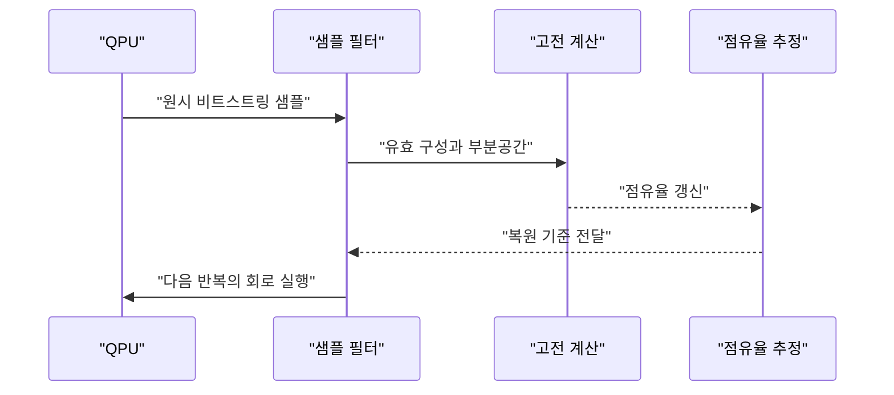
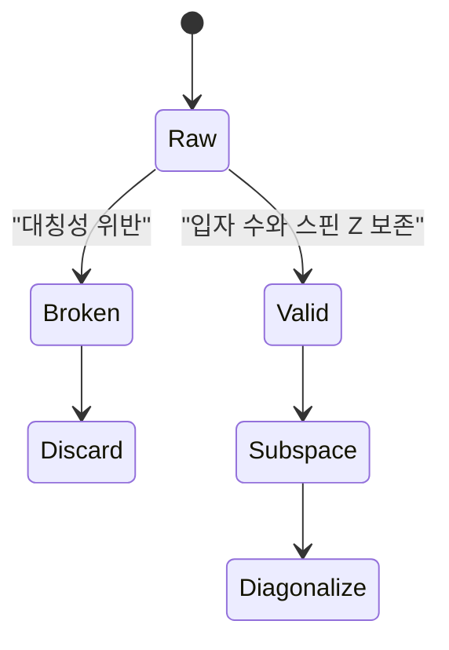

> [!abstract] 이 문서가 답하는 질문
> 거대한 전자 구조 공간을 모두 계산하지 않고, **양자 장치의 샘플과 고전적 부분공간 대각화로 바닥 상태 에너지를 어떻게 찾는가?**를 CI → QSCI → SQD의 흐름으로 설명한다.

## 왜 전체 공간이 문제가 되는가


자료는 전자의 궤도를 여러 오비탈의 선형 합으로 표현하고, 하나의 오비탈에 같은 스핀 전자가 하나만 있을 수 있다는 파울리 배타 원리를 문제 정의의 출발점으로 둔다.


VQE 복습 슬라이드는 수많은 파동함수의 에너지를 계산했을 때 그중 최솟값이 찾고 싶은 참값이라는 그림을 사용한다. SQD는 이 목표를 유지하면서 전체 행렬을 직접 다루는 부담을 줄이려는 방향이다.


N₂ 예시에서는 활성 전자 5개와 활성 오비탈 10개가 `(10C5)^2 = 63504`개의 determinant로 이어진다.


Fe₄S₄ 클러스터 예시는 활성 전자 30개와 활성 오비탈 60개에서 `(30C15)^2 = 2.4e+16`개의 determinant를 표시한다. 두 수치는 계산 공간이 분자 크기에 따라 급격히 커지는 모습을 보여 주는 원본의 예시다.

> [!important] 숫자의 역할
> 63504와 2.4e+16은 이 문서에서 다시 계산한 벤치마크가 아니라 슬라이드에 표시된 determinant 규모다. SQD의 필요성을 설명하는 공간 크기 예시로만 사용한다.

## FCI에서 SCI로, 그리고 QSCI로


FCI에서 SCI로 넘어가는 슬라이드는 거대한 Full Space 전체가 아니라 파동 함수에 결정적 기여를 하는 행렬식만 걸러내어 Selected CI의 부분공간을 만든다고 설명한다.


비트스트링 매핑 절차는 공간 오비탈을 스핀-α와 스핀-β로 나누고, 전자 존재 여부를 1과 0으로 표현한 `|z⟩` 상태로 연결한다.


중첩 상태를 반복 측정하면 파동함수 계수의 제곱에 비례해 행렬식이 관측된다는 Born rule 그림이 제시된다.

$$
P_i = |a_i|^2
$$

따라서 샘플에서 높은 빈도로 관측된 (k)개의 고유 행렬식을 골라 부분공간을 만든다.


원본은 선택된 부분공간을 다음처럼 적는다.

$$
S = \operatorname{span}\{ |D_1\rangle, |D_2\rangle, \ldots, |D_k\rangle \}
$$

양자 하드웨어의 역할은 여기서 끝나고, 이후에는 선택된 행렬식 사이의 부분공간 행렬을 고전적으로 계산한다.


슬라이드는 선택된 기저 사이의 행렬 요소를 다음으로 표시한다.

$$
H_{ij} = \langle D_i | \tilde{H} | D_j \rangle
$$

전체 $N_{\mathrm{FCI}}\times N_{\mathrm{FCI}}$ 행렬 대신 $k\times k$ 부분공간 행렬을 대각화하는 것이 핵심 축소다.

<Tabs>
  <Tab label="FCI">
    Full Space의 가능한 행렬식을 모두 다루는 출발점이다. 분자 크기가 커지면 determinant 공간이 급격히 커진다.
  </Tab>
  <Tab label="SCI">
    파동함수에 결정적으로 기여하는 행렬식만 선택해 부분공간을 만든다.
  </Tab>
  <Tab label="QSCI">
    양자 측정의 Born 확률로 중요한 행렬식을 샘플링하고 선택한다.
  </Tab>
</Tabs>

## SQD가 붙이는 하이브리드 루프


SQD는 거대한 화학 Hamiltonian을 위한 하이브리드 접근법으로 소개된다. 목표는 양자 노이즈가 있는 환경에서도 질소 분자 N₂의 정확한 바닥 상태 에너지를 얻는 것이다.



### Hamiltonian과 초기 회로


슬라이드는 분자의 화학적 구조를 텐서 형태 Hamiltonian으로 정의하고 PySCF로 분자 적분과 초기 진폭 (t_1, t_2)를 추출하는 흐름을 보여 준다.

$$
H = sum_{pr} h_{pr} a_p^dagger a_r
+ rac{1}{2}sum_{pqrs} h_{pqrs} a_p^dagger a_q^dagger a_s a_r
$$

화면에 보이는 코드 조각은 다음과 같다.

```python
# Define Nitrogen molecule (N2)
molecule = gto.M(atom='N 0 0 0; N 0 0 1.0977',
                 basis='cc-pVDZ')
ccsd = cc.CCSD(scf.RHF(molecule)).run()
```

> [!warning] 원본 코드의 범위
> 위 코드는 슬라이드에 보이는 일부를 옮긴 것이며 이 저장소에서 실행해 검증한 프로그램이 아니다. 슬라이드의 변수명과 주석을 임의로 보완하지 않았다.

### LUCJ ansatz


LUCJ는 Hartree–Fock 기준 상태 $|\Phi_0\rangle$에서 시작해 $e^K$ orbital rotation, $e^{iJ}$ 상호작용, 측정으로 이어지는 회로 구조로 표시된다. 슬라이드는 이를 물리적 타당성과 하드웨어 효율성을 함께 갖춘 특화 양자 회로 구조로 설명한다.

### 대칭성 기반 후선택


화학적 Hamiltonian은 입자 수와 스핀 Z를 보존해야 한다. 원본의 예시는 입자 수가 너무 많거나 좌우 스핀 구성이 불균형한 비트스트링을 Broken으로 표시하고, 대칭성을 보존한 구성만 Valid로 남긴다.



### 자기 일관적 복원


Self-Consistent Recovery는 손상된 데이터를 폐기하는 대신 다음 루프를 반복한다.

1. 손상된 비트스트링을 탐지한다.
2. 평균 점유율을 기준으로 0과 1을 확률적으로 복원한다.
3. 유효 상태를 다시 샘플링한다.
4. 고전적 대각화와 점유율 추정치를 갱신한다.

> [!tip] SQD를 읽는 핵심
> “양자에서 최종 에너지를 모두 계산한다”가 아니라, 양자 측정은 중요한 구성 샘플을 제공하고 고전 계산이 부분공간을 복원·대각화한다는 역할 분담으로 이해한다.

## 결과를 해석하는 법


자료는 대칭성을 만족하는 유효 구성의 비율이 작아 보여도 무작위 추측과 비교하면 통계적으로 의미 있는 양자 신호를 포함한다고 설명한다.


원본의 세 단계는 다음과 같다.

| 단계 | 하드웨어·소프트웨어 역할 |
| --- | --- |
| 1. 큐비트 실행 | 최적화된 회로를 타깃 하드웨어에서 실행해 원시 샘플을 수집 |
| 2. 샘플 필터링 | 입자 수와 스핀 대칭성을 기준으로 유효 구성 비율을 확인 |
| 3. 복원 및 대각화 | 자기 일관성 알고리즘을 반복 실행해 최저 에너지로 수렴 |


결과 그래프는 공간 오비탈 인덱스 0부터 N까지의 점유율을 스핀-α와 스핀-β로 나누어 표시한다. 슬라이드의 해석은 두 스핀 전자가 하위 5개 오비탈에 강하게 밀집되어 있다는 것이다.


Hybrid Workflow 화면에는 IonQ 기준 CPU는 노트북에서 1시간 미만, QPU Forte는 32시간, 320개 NVIDIA H200 GPU는 45시간이라는 비교가 표시되어 있다. 이 값은 강의자료가 보여 주는 한 사례의 time-to-solution이며, 일반적인 장치 순위나 재현된 실험 결과로 해석하지 않는다.

```html preview
<div style="font-family:system-ui,sans-serif;padding:20px;color:var(--foreground)">
  <h3 style="margin:0 0 14px;font-size:15px;font-weight:600">SQD가 줄이는 것과 남기는 것</h3>
  <div id="sqd-cards" style="display:flex;gap:12px;flex-wrap:wrap"></div>
  <script>
    var cards = [
      ['전체 공간', 'N₂', '63,504 determinants', '원본 예시'],
      ['거대 클러스터', 'Fe₄S₄', '2.4e+16 determinants', '원본 예시'],
      ['선택 공간', 'k × k', '부분공간 Hamiltonian', '고전 대각화'],
      ['반복 결과', 'α · β', '하위 5개 오비탈 점유', '슬라이드 해석']
    ];
    document.getElementById('sqd-cards').innerHTML = cards.map(function (c, i) {
      return '<div style="flex:1;min-width:165px;padding:14px;background:var(--card);color:var(--card-foreground);border:1px solid var(--border);border-radius:var(--radius)">' +
        '<div style="font-size:12px;color:var(--muted-foreground)">' + c[0] + '</div>' +
        '<div style="font-size:19px;font-weight:700;margin-top:4px">' + c[1] + '</div>' +
        '<div style="font-size:13px;margin-top:6px">' + c[2] + '</div>' +
        '<div style="font-size:12px;margin-top:4px;color:var(--chart-' + (i + 1) + ')">' + c[3] + '</div>' +
        '</div>';
    }).join('');
  </script>
</div>
```

> [!quote] 원본 표기와 오류
> 슬라이드에는 `determianats`, `determianants`처럼 철자가 흔들리는 표기가 보인다. 본문에서는 의미를 위해 determinant로만 정리했고, 원본 표기 자체는 수정된 것으로 간주하지 않는다.

## 핵심 정리

| 단계 | 양자 측정이 주는 것 | 고전 계산이 하는 것 |
| --- | --- | --- |
| 구성 생성 | 비트스트링 샘플 | 유효 구성 선별 |
| 부분공간 구축 | Born 확률 기반 중요한 행렬식 | $S = \operatorname{span}\{D_i\}$ 구성 |
| 행렬 계산 | 측정으로 드러난 기저 | $H_{ij}$ 계산과 $k \times k$ 대각화 |
| 반복 복원 | 노이즈가 섞인 새 샘플 | 점유율 갱신과 수렴 판단 |

> [!question]- 스스로 점검
> **Q.** SQD에서 양자 하드웨어의 샘플을 곧바로 최종 에너지로 읽지 않는 이유는 무엇인가?
>
> **A.** 샘플은 중요한 행렬식과 유효 부분공간을 정하는 입력이다. 선택된 $k \times k$ 부분공간 Hamiltonian을 고전적으로 대각화하고, 복원·재샘플링을 반복해 에너지를 낮추는 것이 SQD의 하이브리드 구조다.

## 출처

- [5. 하이브리드 알고리즘 소개-SQD_Jun.2026.pdf](<../sources/5. 하이브리드 알고리즘 소개-SQD_Jun.2026.pdf>) — 원본 강의 슬라이드 29쪽.
