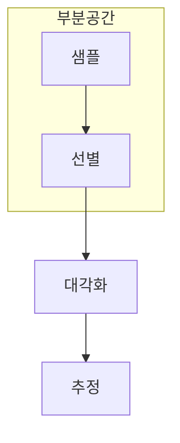

> [!abstract] 한 줄 요약
> SQD는 모든 구성을 다 보지 않고, 샘플링으로 유망한 부분공간을 골라 고전 계산으로 정제한다.

## 이 노트의 지도



## 1. 전체 조합 공간을 그대로 열거하지 않는다

전자 배치 후보는 빠르게 늘어난다. SQD는 측정 샘플에서 자주 나타나거나 중요한 구성을 모아 작은 부분공간을 만든다. ==부분공간==는 이 노트에서 결과보다 먼저 추적할 대상이다.


<details>
<summary>샘플이 부분공간을 대표하지 못하면?</summary>

유망한 구성이 빠지면 고전 대각화가 정확해도 전체 문제의 좋은 근사에 도달하지 못한다. 샘플 품질과 후보 선택 기준을 따로 점검해야 한다.

</details>


## 2. 양자와 고전의 역할을 분리해 본다

양자 단계는 샘플을 제공하고, 고전 단계는 선택된 부분공간에서 선형대수 계산을 수행한다. 어느 단계가 병목인지 기록하는 것이 중요하다.

```html preview
<div style="font-family:system-ui,sans-serif;padding:20px;color:var(--foreground)">
  <h3 style="margin:0 0 14px;font-size:15px;font-weight:600">부분공간 축소 예시</h3>
  <div id="bars" style="display:flex;align-items:flex-end;gap:14px;height:170px"></div>
  <script>
    var data = [["전체 후보",1000],["샘플 후보",200],["선별 공간",50]];
    var max = Math.max.apply(null, data.map(function (d) { return d[1]; }));
    document.getElementById('bars').innerHTML = data.map(function (d, i) {
      return '<div style="flex:1;display:flex;flex-direction:column;align-items:center;' +
        'gap:6px;height:100%;justify-content:flex-end">' +
        '<span style="font-size:12px;font-weight:600">' + d[1] + '</span>' +
        '<div style="width:100%;height:' + (d[1] / max * 100) + '%;' +
        'background:var(--chart-' + (i + 1) + ');' +
        'border-radius:var(--radius) var(--radius) 0 0"></div>' +
        '<span style="font-size:12px;color:var(--muted-foreground)">' + d[0] + '</span>' +
        '</div>';
    }).join('');
  </script>
</div>
```

> [!caution] 해석의 범위
> 숫자는 부분공간 축소의 관계를 보이는 예시다. 특정 분자나 실행의 실측값이 아니다.


<Tabs>
  <Tab label="샘플">관측 가능한 후보 구성을 모은다.</Tab>
  <Tab label="선별">계산할 부분공간을 정한다.</Tab>
  <Tab label="대각화">선택된 공간에서 값을 추정한다.</Tab>
</Tabs>

## 핵심 정리

| 관점 | 확인할 질문 | 학습상 의미 |
| :-- | :-- | :-- |
| 범위 | 얼마나 줄이는가 | 계산 비용 |
| 대표성 | 무엇이 남는가 | 근사 품질 |
| 정제 | 어떻게 계산하는가 | 고전 선형대수 |

> [!question]- 스스로 점검
> **Q.** SQD에서 고전 대각화가 정확해도 전체 해답이 부정확할 수 있는 이유는 무엇인가?
>
> **A.** 샘플과 선별 단계가 좋은 구성을 부분공간에 포함하지 못할 수 있기 때문이다.

## 출처

- 공개 노트에는 원본 강의 자료, 자산 이미지, 페이지 단위 근거를 포함하지 않는다.
