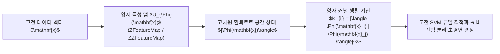

> [!abstract] 핵심 요약
> **양자 머신러닝(QML)**은 고전 머신러닝의 커널 트릭을 극단적으로 확장하여, 고전 컴퓨터로는 시뮬레이션 불가능한 지수적 고차원 힐베르트 공간으로 데이터를 사상($\mathbf{x} \to |\Phi(\mathbf{x})\rangle$)한다.
> 두 양자 상태의 겹침 크기인 **충실도(Fidelity: $|\langle \Phi(\mathbf{x}) | \Phi(\mathbf{x}') \rangle|^2$)**를 양자 커널로 활용하는 **QSVM**과, 파라미터화된 양자 회로를 딥러닝 레이어로 사용하는 **QNN**은 **파라미터 시프트 규칙(Parameter Shift Rule)**을 통해 분석적 그래디언트를 계산하여 학습된다.

---

## 1. 양자 커널(Quantum Kernel) 및 QSVM 원리

$$K(\mathbf{x}_i, \mathbf{x}_j) = |\langle \Phi(\mathbf{x}_i) | \Phi(\mathbf{x}_j) \rangle|^2 = \text{Tr}\left( \rho(\mathbf{x}_i) \rho(\mathbf{x}_j) \right)$$

$$\frac{\partial \langle \hat{O} \rangle}{\partial \theta_k} = \frac{\langle \hat{O} \rangle_{\theta_k + \frac{\pi}{2}} - \langle \hat{O} \rangle_{\theta_k - \frac{\pi}{2}}}{2} \quad (\text{Parameter Shift Rule})$$



---

## 2. 양자 인코딩(Quantum Embedding) 방식 비교

| 인코딩 방식 | 사용 큐비트 수 | 양자 상태 표현 | 특징 및 장단점 |
| :-- | :-- | :-- | :-- |
| **기저 인코딩 (Basis)** | $N$ 큐비트 ($N$비트 데이터) | $|x\rangle = |x_1 x_2 \dots x_N\rangle$ | 단순하지만 큐비트 자원 소모가 큼 |
| **진폭 인코딩 (Amplitude)** | $\log_2(N)$ 큐비트 ($N$차원 벡터) | $|\psi_x\rangle = \sum x_i |i\rangle$ | 지수적 공간 절약, 준비 회로 깊이가 깊음 |
| **각도 인코딩 (Angle / Feature Map)** | $N$ 큐비트 ($N$개 특성) | $\bigotimes_{i=1}^N \left( \cos x_i |0\rangle + \sin x_i |1\rangle \right)$ | NISQ 하드웨어에 가장 적합하며 비선형 얽힘(ZZ) 결합 용이 |

---

## 3. 실시간 양자 커널 충실도(Fidelity) 계산기

```html preview
<div style="font-family:system-ui,-apple-system,sans-serif;padding:20px;background:var(--card);color:var(--card-foreground);border:1px solid var(--border);border-radius:var(--radius)">
  <div style="font-size:16px;font-weight:700;margin-bottom:14px;color:var(--primary);display:flex;align-items:center;gap:8px">
    <span>⚛️ 양자 각도 인코딩 커널 충실도 K(x1, x2) 계산기</span>
  </div>

  <div style="display:grid;grid-template-columns:1fr 1fr;gap:12px;margin-bottom:14px">
    <div>
      <label style="font-size:11px;color:var(--muted-foreground)">샘플 1 데이터 각도 x1 (rad):</label>
      <input id="inQAngle1" type="number" value="0.5" step="0.1" style="width:100%;padding:4px;background:var(--background);color:var(--foreground);border:1px solid var(--border);border-radius:var(--radius);font-weight:700" />
    </div>
    <div>
      <label style="font-size:11px;color:var(--muted-foreground)">샘플 2 데이터 각도 x2 (rad):</label>
      <input id="inQAngle2" type="number" value="0.8" step="0.1" style="width:100%;padding:4px;background:var(--background);color:var(--foreground);border:1px solid var(--border);border-radius:var(--radius);font-weight:700" />
    </div>
  </div>

  <div style="padding:10px;background:var(--background);border:1px solid var(--border);border-radius:var(--radius);text-align:center">
    <div style="font-size:10px;color:var(--muted-foreground)">양자 커널 유사도 K(x1, x2) = cos²((x1 - x2)/2)</div>
    <div id="qKernelOut" style="font-family:monospace;font-size:18px;font-weight:800;color:var(--primary);margin-top:2px">0.9777</div>
  </div>

  <script>
    function updateQKernel() {
      var x1 = parseFloat(document.getElementById('inQAngle1').value) || 0;
      var x2 = parseFloat(document.getElementById('inQAngle2').value) || 0;

      var diff = (x1 - x2) / 2.0;
      var k = Math.cos(diff) * Math.cos(diff);

      document.getElementById('qKernelOut').textContent = k.toFixed(4);
    }

    ['inQAngle1', 'inQAngle2'].forEach(function(id) {
      document.getElementById(id).addEventListener('input', updateQKernel);
    });
    updateQKernel();
  </script>
</div>
```
