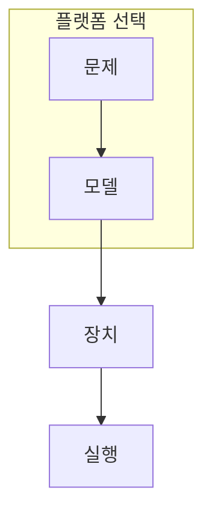

> [!abstract] 한 줄 요약
> 하드웨어 선택은 ‘가장 좋은 기계’를 고르는 일이 아니라, 회로 모델과 제어·오류·문제 매핑의 조건을 맞추는 일이다.

## 이 노트의 지도



## 1. 물리 플랫폼과 계산 모델을 함께 본다

초전도와 이온 트랩은 범용 게이트 모델을 향하고, 어닐링은 에너지 최소화 형태의 문제에 특화된 매핑을 사용한다. ==문제 매핑==는 이 노트에서 결과보다 먼저 추적할 대상이다.


<details>
<summary>큐비트 수만 비교하면 왜 부족할까?</summary>

연결성, 게이트 충실도, 측정 방식, 제어 시간, 소프트웨어 지원이 함께 달라 같은 수의 큐비트도 같은 일을 뜻하지 않는다.

</details>

```html preview
<div style="font-family:system-ui,sans-serif;padding:20px;color:var(--foreground)">
  <label for="amt" style="font-size:14px;font-weight:600">논리 회로 깊이</label>
  <div id="out" style="font-size:30px;font-weight:700;color:var(--chart-1);margin:6px 0">depth 8</div>
  <input id="amt" type="range" min="1" max="32" step="1" value="8"
    style="width:100%;accent-color:var(--primary)" />
  <p style="font-size:13px;color:var(--muted-foreground)">회로 깊이는 누적 오류와 실행 가능성을 함께 검토할 변수다.</p>
  <script>
    var amt = document.getElementById('amt');
    var out = document.getElementById('out');
    amt.addEventListener('input', function () {
      out.textContent = 'depth ' + Number(amt.value).toLocaleString() + '';
    });
  </script>
</div>
```

## 2. 비교 항목을 분리한다

플랫폼 비교에서는 물리 구현의 우열보다 어떤 문제를 어떤 형식으로 넣을 수 있는지, 그리고 무엇을 측정해 평가할지를 명시한다.

```html preview
<div style="font-family:system-ui,sans-serif;padding:20px;color:var(--foreground)">
  <h3 style="margin:0 0 14px;font-size:15px;font-weight:600">플랫폼별 학습용 비교 항목 수</h3>
  <div id="bars" style="display:flex;align-items:flex-end;gap:14px;height:170px"></div>
  <script>
    var data = [["초전도",4],["이온",4],["중성원자",4],["어닐링",3]];
    var max = Math.max.apply(null, data.map(function (d) { return d[1]; }));
    document.getElementById('bars').innerHTML = data.map(function (d, i) {
      return '<div style="flex:1;display:flex;flex-direction:column;align-items:center;' +
        'gap:6px;height:100%;justify-content:flex-end">' +
        '<span style="font-size:12px;font-weight:600">' + d[1] + '</span>' +
        '<div style="width:100%;height:' + (d[1] / max * 100) + '%;' +
        'background:var(--chart-' + (i + 1) + ');' +
        'border-radius:var(--radius) var(--radius) 0 0"></div>' +
        '<span style="font-size:12px;color:var(--muted-foreground)">' + d[0] + '</span>' +
        '</div>';
    }).join('');
  </script>
</div>
```

> [!caution] 해석의 범위
> 막대는 성능 순위가 아니라 비교할 설계 항목의 수를 보여 주는 학습용 도식이다.

```html preview
<div style="font-family:system-ui,sans-serif;padding:20px">
  <div id="cards" style="display:flex;gap:14px;flex-wrap:wrap"></div>
  <script>
    var stats = [["초전도","게이트","빠른 제어","var(--chart-1)"],["이온","게이트","긴 결맞음","var(--chart-2)"],["어닐링","최적화","에너지 매핑","var(--chart-3)"]];
    document.getElementById('cards').innerHTML = stats.map(function (s) {
      return '<div style="flex:1;min-width:150px;padding:16px;background:var(--card);' +
        'color:var(--card-foreground);border:1px solid var(--border);' +
        'border-radius:var(--radius)">' +
        '<div style="font-size:13px;color:var(--muted-foreground)">' + s[0] + '</div>' +
        '<div style="font-size:26px;font-weight:700;margin-top:4px">' + s[1] + '</div>' +
        '<div style="font-size:12px;font-weight:600;margin-top:4px;color:' + s[3] + '">' +
        s[2] + '</div>' +
        '</div>';
    }).join('');
  </script>
</div>
```

<Tabs>
  <Tab label="회로">게이트 모델에 맞는 회로를 구성한다.</Tab>
  <Tab label="매핑">문제를 장치가 받는 형식으로 바꾼다.</Tab>
  <Tab label="평가">오류와 결과 품질을 같은 기준으로 비교한다.</Tab>
</Tabs>

## 핵심 정리

| 관점 | 확인할 질문 | 학습상 의미 |
| :-- | :-- | :-- |
| 모델 | 어떤 계산 형식인가 | 문제 표현 |
| 제어 | 어떤 물리 조작인가 | 회로 가능성 |
| 평가 | 어떤 지표를 읽는가 | 비교의 공정성 |

> [!question]- 스스로 점검
> **Q.** 하드웨어 비교에서 회로 깊이를 함께 보는 이유는 무엇인가?
>
> **A.** 게이트가 누적될수록 오류와 실행 제약이 결과에 더 크게 반영되기 때문이다.

## 출처

- 공개 노트에는 원본 강의 자료, 자산 이미지, 페이지 단위 근거를 포함하지 않는다.
