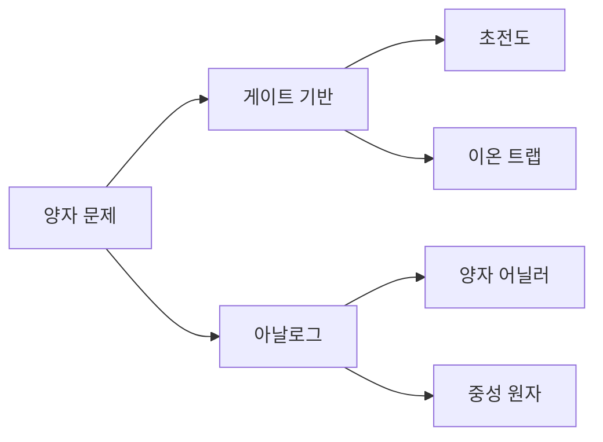
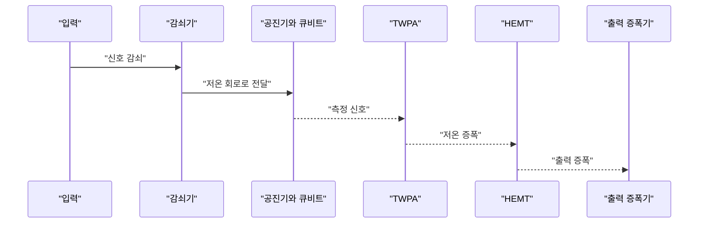
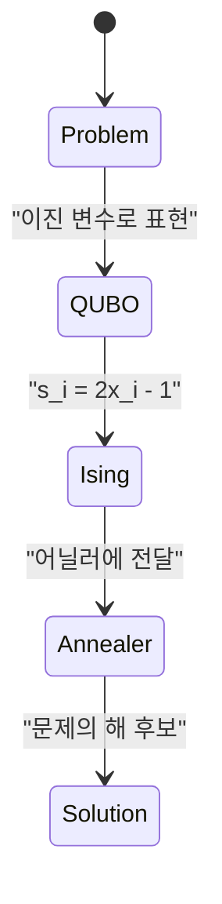

> [!abstract] 이 문서가 답하는 질문
> 양자 하드웨어를 “더 빠른 컴퓨터”로 뭉뚱그리지 않고, **게이트 기반 범용 장치와 문제 특화 장치가 어떤 물리적 제약과 문제 표현을 갖는지** 비교한다.

## 먼저 구분할 두 축


원본은 고전 비트를 이진 시스템으로, 큐비트를 두 상태를 다루는 양자 시스템으로 나란히 놓고 중첩과 측정의 장면을 보여 준다. 여기서 중요한 출발점은 큐비트의 물리 구현이 하나가 아니라는 점이다.



| 계산 방식 | 원본이 붙인 성격 | 대표 플랫폼 | 맞물리는 문제 표현 |
| --- | --- | --- | --- |
| 게이트 기반 | Generalist | 초전도, 이온 트랩 | 회로와 게이트 |
| 아날로그 | Specialist | 양자 어닐러, 중성 원자 | QUBO, MIS 등 문제 특화 표현 |


원본의 아날로그 비교 화면은 양자 어닐러를 **QUBO Specialist**, 중성 원자를 **MIS Specialist**로 표시한다. 이 표현은 특정 장치가 모든 문제에 적합하다는 뜻이 아니라, 자료가 보여 주는 대표 문제와의 대응을 가리킨다.


게이트 기반 비교 화면은 초전도와 이온 트랩을 **Generalist** 범주에 둔다. 다음 절에서는 이 범주 안에서도 온도·연결성·게이트 시간 같은 제약이 어떻게 달라지는지 본다.

> [!note] 비교의 단위
> 원본의 “전문가형/범용형”은 성능 순위가 아니다. 어떤 문제 표현과 제어 방식이 장치의 구조에 맞는지를 읽는 분류 축이다.

## 초전도 큐비트: 낮은 온도와 연결성


초전도 회로는 온도에 민감하다. 원본 냉각 도식은 실온에서 시작해 기계적 냉각과 엔탈피 냉각을 거쳐 10 mK 부근의 공진기와 큐비트로 내려가는 경로를 보인다. 입력 신호는 감쇠기를 지나고, 출력은 TWPA와 HEMT·증폭기를 거친다.




원본은 초전도 큐비트를 전기적 회로로 구성한다고 설명하면서, 회로 배열·배치 때문에 먼 큐비트 사이 상호작용이 다른 큐비트를 거쳐 형성될 수 있음을 지적한다.


자료가 열거한 성질은 인공 원자, 낮은 온도 15 mK, 열 취약성, 짧은 결맞음 시간, 낮은 연결성, 빠른 게이트 동작 시간 약 ns, 확장성이다. 연결성의 예로 IBM Heron 기준 3개 큐비트, 확장성의 예로 SOTA 2025 156Q라는 수치가 슬라이드에 표시되어 있다.

| 원본에 표시된 성질 | 하드웨어 읽기 |
| --- | --- |
| 15 mK | 인공 원자를 동작시키는 낮은 온도 |
| 짧은 coherence time | 열 취약성과 함께 제시된 제약 |
| IBM Heron 기준 3개 큐비트 | 낮은 connectivity의 슬라이드 예시 |
| 약 ns | 빠른 게이트 동작 시간의 표기 |
| SOTA 2025: 156Q | 확장성의 슬라이드 표기 |

<details>
<summary>초전도 슬라이드에서 보이는 용어 묶음</summary>

- **Zero Electrical Resistance**와 **Meissner Effect**는 초전도성의 온도 의존성을 설명하는 두 키워드다.
- 냉각 도식의 온도 표시는 300K, 4K, 700mK, 10mK로 단계화되어 있다.
- 회로 슬라이드는 다양한 초전도 큐비트 회로와 커플링 방식을 한 화면에 배치한다.

</details>

## 이온 트랩: 시각 자료가 말하는 범위


이온 트랩 절의 본문 추출에는 제목 외 설명이 거의 없고, 뒤의 렌더가 이온 트랩과 광자 연결을 시각적으로 제시한다.


따라서 이 문서에서는 이온의 구체적인 게이트 시간·온도·오류율을 추가로 추정하지 않는다. 원본이 직접 보여 주는 **Ion Traps**, **Photonic Interconnect**, **Photon mediates Ion trap Qubits**라는 세 장면만 근거로 삼는다.

> [!warning] 원본 표기 보존
> 일부 페이지는 추출 텍스트가 `Liers. T`처럼 깨져 있고, 제목의 `Gate-base`, `Combinational` 같은 표기도 그대로 남아 있다. 의미가 확인되는 내용만 재구성했으며 원본 슬라이드의 표기를 임의로 교정하지 않았다.

## 양자 어닐러: QUBO로 표현되는 문제


양자 어닐러 슬라이드는 낮은 연결성 20개 큐비트, Advantage2 4400Q, D-Wave 어닐러가 Ising 문제로 변환 가능한 문제만 해결할 수 있다는 제약을 함께 적는다. 자료는 이 변환의 이름으로 QUBO를 제시한다.


원본은 QUBO를 **Quadratic Unconstrained Binary Optimization**으로 풀어 쓰고, `s_i = 2x_i - 1` 변환과 Ising Hamiltonian을 같은 화면에 배치한다.

$$
H = \sum_{i,j} J_{ij}\sigma_i\sigma_j + h\sum_j \sigma_j
$$

위 식은 슬라이드에 표시된 Ising Hamiltonian을 읽기 위한 표기이며, 이 문서에서 계수나 해를 새로 계산한 것은 아니다.



| 문제 예시 | 원본이 묻는 질문 | 장치 선택을 생각할 때 |
| --- | --- | --- |
| TSP | 모든 노드를 최소 거리로 방문하는 방법 | 조합 최적화 표현으로 변환 |
| 물류 최적화 | 물류 배치를 어떻게 최적화할까 | 문제의 비용·제약을 이진 변수화 |
| Max-Cut | 그래프 간선을 최대한 많이 자르는 두 영역 | 그래프를 QUBO로 매핑 |
| Knapsack | 제한된 크기·질량에서 가치가 높은 상품 | 선택 변수를 QUBO로 매핑 |
| RSTPP | 교차 없이 점을 최단거리로 연결 | 도구에 맞게 매핑할 해를 선택 |


Max-Cut 화면은 그래프를 두 영역으로 나누고 간선을 많이 절단하는 방법을 묻는다. 팀 빌딩, 자산 포트폴리오, 리스크 관리, 네트워크 차단이 예시로 함께 적혀 있다.

> [!example] 문제에서 장치로
> 먼저 문제를 조합 최적화 표현으로 만들고, 그 표현이 QUBO·Ising으로 매핑되는지 확인해야 한다. 장치 이름을 먼저 고르는 순서는 원본의 메시지와 반대다.

## 중성 원자: 광학 트위저와 Rydberg blockade


광학 트위저 슬라이드는 원자 배열 사진과 Hyperboloid, Möbius strip, C84 fullerene-like, Cone, Torus, Eiffel tower 같은 여러 배치 예시를 보여 준다. 배열 이름과 사이트 수는 이미지에 표시된 원문을 그대로 둔다.


Rydberg blockade 도식은 두 단계를 설명한다.

1. 레이저로 원자를 들뜬 상태로 만들어 전자를 멀리 떨어뜨린다.
2. 들뜬 원자의 강한 전기장을 이용해 가까운 원자의 같은 상태 전이를 막고, 멀리 있는 두 원자 사이 CNOT 게이트를 수행한다.


중성 원자 절은 MIS를 **Maximum Independent Set**, 즉 최대 독립 집합으로 풀어 쓰고, 그래프에서 인접하지 않은 정점들의 집합을 시각적으로 제시한다. Facility Location Problem도 같은 절의 예시로 등장한다.

## 선택은 매핑에서 시작한다

<Tabs>
  <Tab label="게이트 기반">
    초전도와 이온 트랩처럼 회로와 게이트를 중심으로 문제를 표현한다. 초전도 절에서는 냉각·결맞음·연결성이 핵심 제약으로 나타난다.
  </Tab>
  <Tab label="아날로그">
    양자 어닐러와 중성 원자처럼 문제 구조에 맞춘 표현을 사용한다. 어닐러는 QUBO와 Ising, 중성 원자는 MIS와 배열·차단 현상으로 설명된다.
  </Tab>
</Tabs>


RSTPP 슬라이드는 같은 문제를 푸는 방법이 유일하지 않으며, 보유한 도구에 맞게 매핑하는 것이 양자 알고리즘 설계의 핵심이라고 정리한다. 이 결론은 하드웨어 비교표의 사용법이기도 하다.

```html preview
<div style="font-family:system-ui,sans-serif;padding:20px;color:var(--foreground)">
  <h3 style="margin:0 0 14px;font-size:15px;font-weight:600">원본이 제시한 하드웨어 선택 축</h3>
  <div id="hardware-cards" style="display:flex;gap:12px;flex-wrap:wrap"></div>
  <script>
    var cards = [
      ['게이트 기반', 'Generalist', '초전도 · 이온 트랩', '회로와 게이트'],
      ['아날로그', 'Specialist', '양자 어닐러 · 중성 원자', 'QUBO · MIS'],
      ['초전도', '15 mK', '낮은 connectivity', '빠른 게이트'],
      ['어닐러', '4400Q', 'Advantage2', 'Ising · QUBO']
    ];
    document.getElementById('hardware-cards').innerHTML = cards.map(function (c, i) {
      return '<div style="flex:1;min-width:170px;padding:14px;background:var(--card);color:var(--card-foreground);border:1px solid var(--border);border-radius:var(--radius)">' +
        '<div style="font-size:12px;color:var(--muted-foreground)">' + c[0] + '</div>' +
        '<div style="font-size:19px;font-weight:700;margin-top:4px">' + c[1] + '</div>' +
        '<div style="font-size:13px;margin-top:6px">' + c[2] + '</div>' +
        '<div style="font-size:12px;margin-top:4px;color:var(--chart-' + (i + 1) + ')">' + c[3] + '</div>' +
        '</div>';
    }).join('');
  </script>
</div>
```

이 카드는 성능 순위를 계산한 차트가 아니라, 슬라이드에서 반복되는 **분류·제약·문제 표현**을 한눈에 다시 보는 도구다.

## 핵심 정리

| 질문 | 원본에서 찾는 단서 | 답을 쓰는 방식 |
| --- | --- | --- |
| 어떤 계산 방식인가? | Generalist 또는 Specialist | 게이트 기반과 아날로그를 먼저 구분 |
| 무엇이 물리적 병목인가? | 온도·결맞음·연결성·배열 | 플랫폼의 제약으로 기록 |
| 어떤 문제 표현인가? | QUBO·Ising·MIS | 문제를 장치 표현으로 매핑 |
| 해가 하나뿐인가? | RSTPP 인스턴스와 여러 해 | 도구에 맞는 해를 선택 |

> [!question]- 스스로 점검
> **Q.** Max-Cut이나 RSTPP를 보고 바로 어닐러를 선택하면 안 되는 이유는 무엇인가?
>
> **A.** 원본은 문제를 장치가 이해하는 표현으로 매핑하는 과정이 핵심이라고 강조한다. 따라서 문제의 제약과 목적을 먼저 QUBO·Ising 등으로 표현할 수 있는지 확인해야 한다.

## 출처

- [5. 양자컴퓨팅 하드웨어에 대한 이해 _Jun.2026.pdf](<../sources/5. 양자컴퓨팅 하드웨어에 대한 이해 _Jun.2026.pdf>) — 원본 강의 슬라이드 37쪽.
