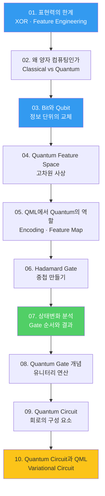

---
aliases:
  - 양자 ML 인덱스
  - Quantum ML MOC
  - QML 학습 경로
course: quantum-ml
created: '2026-08-28'
date: '2026-08-28'
semester: summer
source: ''
status: evergreen
tags:
  - type/index
  - cs/quantum
  - cs/ml
title: 00. 양자 ML 인덱스
type: index
updated: '2026-08-28'
---

domain:: [[ComputerScience/03_ai-ml-data/AI ML 데이터 인터페이스|AI ML 데이터 인터페이스]]
module:: [[ComputerScience/00_graph-interfaces/courses/양자 ML 인터페이스|양자 ML 인터페이스]]
schema:: [[docs/knowledge-schema|지식 스키마]]
related:: [[ComputerScience/00_graph-interfaces/courses/머신러닝 인터페이스|머신러닝 인터페이스]]

# 00. 양자 ML 인덱스

> [!abstract] 이 과정 한 줄
> **고전 머신러닝이 표현력에서 막히는 지점**을 출발점으로 삼아,
> 그 한계를 넘기 위한 도구로 **Qubit → Gate → Circuit → QML**을 차례로 쌓는다.
> 모든 정리문서는 `01.*` · `02.*` 모듈의 원본 강의 PDF를 근거로 다시 작성되었다.

## 왜 이 순서인가

이 과정의 핵심 논리는 "양자가 신기해서"가 아니라 **표현력(expressive power)** 이다.
XOR조차 직선 하나로 가르지 못하는 고전 모델의 한계에서 시작해,
정보를 담는 단위 자체를 바꾸면 무엇이 달라지는지를 따라간다.

## 과정을 관통하는 한 줄

고전과 양자를 가르는 지점은 **같은 $n$개 단위가 무엇을 담느냐**에 있다.

$$
\text{고전 } n\text{비트}: \; s \in \{0,1\}^n \;(\text{2}^n \text{ 중 하나})
\qquad\longrightarrow\qquad
\text{양자 } n\text{큐비트}: \; \lvert\psi\rangle = \sum_{i=0}^{2^n-1} \alpha_i \lvert i \rangle
$$

오른쪽 식의 $\alpha_i$ 를 **어떻게 설계하고 간섭시킬 것인가** — 이 과정의 모든 노트가 결국 이 질문의 부분이다.

## 세 개의 축

과정 전체는 결국 **같은 질문을 세 층위에서** 던진다.

| 층위 | 질문 | 다루는 노트 |
|:--|:--|:--|
| **동기** | 왜 고전 ML로는 부족한가 | [[01. 표현력의 한계]], [[02. 왜 양자 컴퓨팅인가]] |
| **표현** | 정보를 무엇으로 담는가 | [[03. Bit와 Qubit]], [[04. Quantum Feature Space]], [[05. QML에서 Quantum의 역할]] |
| **연산** | 그 정보를 어떻게 조작하는가 | [[06. Hadamard Gate]], [[07. 상태변화 분석]], [[08. Quantum Gate 개념]], [[09. Quantum Circuit]], [[10. Quantum Circuit과 QML]] |

## 정리문서

| # | 노트 | 근거 원본 | 페이지 |
|:--|:--|:--|--:|
| 01 | [[01. 표현력의 한계]] | `day01_02_expressive_power_limit_lecture.pdf` | 10 |
| 02 | [[02. 왜 양자 컴퓨팅인가]] | `day02_01_why_quantum_computing_lecture.pdf` | 5 |
| 03 | [[03. Bit와 Qubit]] | `day02_02_bit_and_qubit_lecture.pdf` | 5 |
| 04 | [[04. Quantum Feature Space]] | `day02_03_quantum_feature_space_lecture.pdf` | 5 |
| 05 | [[05. QML에서 Quantum의 역할]] | `day02_04_quantum_role_in_qml_lecture.pdf` | 11 |
| 06 | [[06. Hadamard Gate]] | `day05_03_hadamard_gate_concepts_lecture.pdf` | 6 |
| 07 | [[07. 상태변화 분석]] | `day05_04_quantum_state_transition_analysis_lecture.pdf` | 14 |
| 08 | [[08. Quantum Gate 개념]] | `day08_01_quantum_gate_concepts_lecture.pdf` | 7 |
| 09 | [[09. Quantum Circuit]] | `day10_01_quantum_circuit_lecture.pdf` | 7 |
| 10 | [[10. Quantum Circuit과 QML]] | `day11_04_quantum_circuit_and_qml_lecture.pdf` | 17 |

## 실습 자료

강의 PDF가 없는 후속 모듈은 **주피터 노트북으로만** 구성된다.
정리문서 대상이 아니므로 여기서 위치만 밝혀 둔다.

| 모듈 | 내용 | 노트북 |
|:--|:--|--:|
| `03.variational-learning-and-kernels` | 변분 학습 · 커널 | 30 |
| `04.quantum-kernel-classification` | 양자 커널 분류 | 22 |
| `05.quantum-neural-networks` | 양자 신경망 | 21 |
| `06.qaoa-and-combinatorial-optimization` | QAOA · 조합 최적화 | 11 |
| `07.capstone` | 캡스톤 | 2 |

> [!note] 수료
> `ICTIS_AI_Quantum_Computing_160H_Certificate.pdf` — 160시간 과정 수료증.
