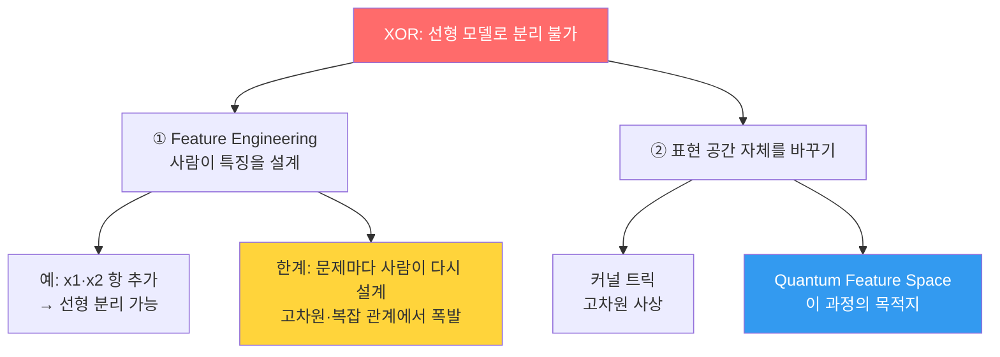

---
aliases:
  - 표현력의 한계
  - Expressive Power Limit
  - XOR 문제
authority: primary
course: quantum-ml
created: '2026-08-28'
date: '2026-08-28'
review_state: active
semester: summer
source: 01.quantum-foundations/01.why-quantum-and-qml/day01_02_expressive_power_limit_lecture.pdf
source_pages: 10
source_sha256: 79c1ea3bf3fda2ad
source_type: lecture-slides
status: draft
tags:
  - type/lecture
  - cs/ml
  - cs/quantum
title: 01. 표현력의 한계
type: lecture
updated: '2026-08-28'
---

domain:: [AI ML 데이터 인터페이스](<../AI ML 데이터 인터페이스.md>)
module:: [양자 ML 인터페이스](<../../00_graph-interfaces/courses/양자 ML 인터페이스.md>)
source:: [day01_02_expressive_power_limit_lecture.pdf](<01.quantum-foundations/01.why-quantum-and-qml/day01_02_expressive_power_limit_lecture.pdf>)
next:: [02. 왜 양자 컴퓨팅인가](<02. 왜 양자 컴퓨팅인가.md>)
related:: [머신러닝 인터페이스](<../../00_graph-interfaces/courses/머신러닝 인터페이스.md>)

> [!abstract] 한 줄 요약
> 이 과정이 양자에서 시작하지 않고 **XOR에서 시작하는 이유**를 다룬다.
> 모델이 못 푸는 문제가 있을 때, 우리는 보통 **특징을 손으로 만들어(Feature Engineering)** 우회한다.
> 그 우회가 언제 한계에 부딪히는가 — 이것이 양자를 꺼내는 동기다.

## 문제 정의 — 직선 하나로 못 가르는 데이터

XOR는 입력 두 개의 배타적 논리합이다. 네 점을 평면에 찍어 보면 사정이 분명해진다.

| $x_1$ | $x_2$ | $y$ | 평면 위 위치 |
| :--: | :--: | :--: | :-- |
| 0 | 0 | 0 | 좌하 |
| 0 | 1 | 1 | 좌상 |
| 1 | 0 | 1 | 우하 |
| 1 | 1 | 0 | 우상 |

> [!warning] 핵심 관찰
> 같은 클래스가 **대각선 방향**으로 마주 보고 놓인다.
> $y=1$ 인 두 점은 한 대각선에, $y=0$ 인 두 점은 다른 대각선에 있다.
> 따라서 **어떤 직선을 그어도 두 클래스를 완벽히 나눌 수 없다.**

선형 모델은 결정 경계를 다음 형태로만 만든다.

$$
\hat{y} = \sigma(w_1 x_1 + w_2 x_2 + b), \qquad
\sigma(z) = \frac{1}{1 + e^{-z}}
$$

경계는 $w_1 x_1 + w_2 x_2 + b = 0$, 즉 **직선**이다. XOR에는 해가 없다.

## 실습 — Logistic Regression으로 확인하기

강의는 이 실패를 말로 설명하지 않고 **직접 돌려서 보여준다.**

```python
import numpy as np

X = np.array([[0, 0], [0, 1], [1, 0], [1, 1]])
y = np.array([0, 1, 1, 0])
```

시각화하면 대각선 배치가 눈으로 확인되고, 이어서 선형 분류기를 학습시키면
정확도가 우연 수준에서 더 오르지 않는다.

[day01_02_expressive_power_limit_lecture p.7](<01.quantum-foundations/01.why-quantum-and-qml/day01_02_expressive_power_limit_lecture.pdf>)

## 두 갈래의 해결책



**① Feature Engineering** — 곱 항 $x_1 x_2$ 하나만 더해도 XOR는 선형 분리가 된다.

$$
z = w_1 x_1 + w_2 x_2 + w_3 (x_1 x_2) + b
$$

문제는 이 방법이 **사람의 통찰에 의존**한다는 점이다. 입력 차원이 커지고
관계가 복잡해질수록 어떤 특징을 만들어야 하는지 자체가 어려운 문제가 된다.

**② 표현 공간을 바꾸기** — 특징을 손으로 만들지 말고, 데이터를 애초에
**더 넓은 공간으로 사상**해 버리는 접근이다. 고전 머신러닝의 커널 트릭이 이 길이고,
이 과정이 향하는 [04. Quantum Feature Space](<04. Quantum Feature Space.md>) 도 같은 길 위에 있다.

> [!tip] 이 노트가 과정 전체에서 갖는 자리
> 뒤에 나올 Qubit · Gate · Circuit 은 전부 **②를 실현하는 장치**다.
> "왜 굳이 양자인가"라는 질문의 답은 여기, 표현력에 있다.

## 출처

- 원본: `01.quantum-foundations/01.why-quantum-and-qml/day01_02_expressive_power_limit_lecture.pdf` (10p)
- 강의 인용 출처: Google Machine Learning Crash Course — Feature Engineering; Christopher M. Bishop, *Pattern Recognition and Machine Learning*
