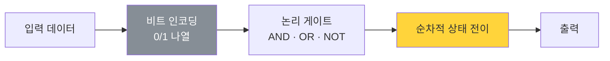
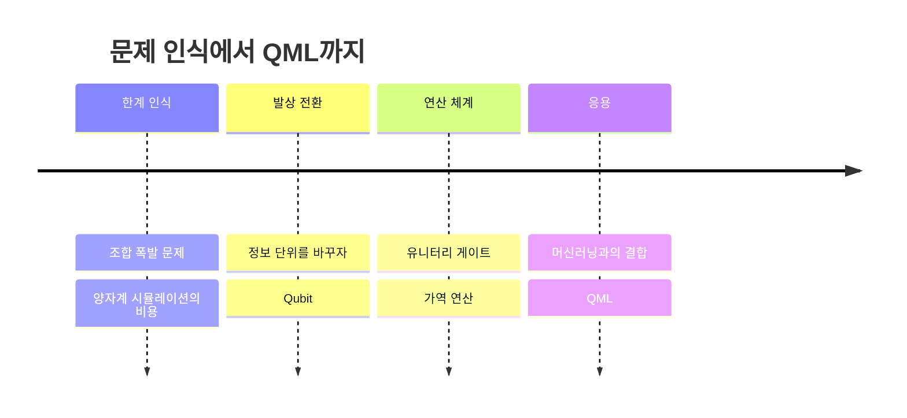

---
aliases:
  - 왜 양자 컴퓨팅인가
  - Why Quantum Computing
  - Classical vs Quantum
authority: primary
course: quantum-ml
created: '2026-08-28'
date: '2026-08-28'
review_state: active
semester: summer
source: 01.quantum-foundations/01.why-quantum-and-qml/day02_01_why_quantum_computing_lecture.pdf
source_pages: 5
source_sha256: 8fc38685af72cf08
source_type: lecture-slides
status: seedling
tags:
  - type/lecture
  - cs/quantum
title: 02. 왜 양자 컴퓨팅인가
type: lecture
updated: '2026-08-28'
---

domain:: [[ComputerScience/03_ai-ml-data/AI ML 데이터 인터페이스|AI ML 데이터 인터페이스]]
module:: [[ComputerScience/00_graph-interfaces/courses/양자 ML 인터페이스|양자 ML 인터페이스]]
source:: [[day02_01_why_quantum_computing_lecture.pdf]]
prerequisites:: [[01. 표현력의 한계]]
next:: [[03. Bit와 Qubit]]

# 02. 왜 양자 컴퓨팅인가

> [!abstract] 한 줄 요약
> [[01. 표현력의 한계|앞 노트]]가 **모델의 한계**를 보였다면, 이 노트는 **계산 기반 자체의 한계**를 본다.
> 고전 컴퓨터가 무엇을 잘하고 어디서 막히는지를 먼저 정리한 뒤,
> 그 막힌 자리에서 양자 컴퓨팅이 등장한 배경을 잇는다.

## 고전 컴퓨팅이 하는 일

고전 컴퓨터는 모든 정보를 **비트(bit)** 로 환원한다. 비트는 매 순간 0 또는 1 중 **하나**다.

이 구조는 매우 견고하지만, **경우의 수가 지수적으로 늘어나는 문제**에서 비용이 그대로 지수로 따라붙는다.
$n$ 비트로 표현 가능한 상태는 $2^n$ 개지만, 고전 컴퓨터는 그중 **한 번에 하나**만 담는다.

$$
\text{고전 } n\text{비트 레지스터: } \quad s \in \{0,1\}^n, \quad |\{s\}| = 1
$$

## 두 방식의 대비

| 구분 | Classical Computing | Quantum Computing |
|:--|:--|:--|
| 기본 단위 | Bit | Qubit |
| 한 순간의 상태 | 0 **또는** 1 | 0 **과** 1의 중첩 |
| $n$단위가 담는 상태 | $2^n$ 중 **하나** | $2^n$ 개 진폭의 **선형결합** |
| 연산 | 논리 게이트 (비가역 가능) | 유니터리 게이트 (가역) |
| 결과 읽기 | 그대로 읽음 | **측정**해야 하며 확률적으로 붕괴 |
| 강점 | 범용·안정·성숙한 생태계 | 특정 구조의 탐색·시뮬레이션 |

> [!warning] 흔한 오해
> "양자 컴퓨터는 모든 걸 빠르게 한다"는 말은 **틀렸다.**
> $2^n$ 개 상태를 동시에 담더라도, **측정하면 그중 하나만 관측**된다.
> 이득은 "많이 담는 것"이 아니라 **간섭을 설계해 원하는 답의 확률을 키우는 것**에서 나온다.

## 등장 배경

> [!tip] 다음 노트로 넘어가기 전에
> 여기까지가 **"왜"** 다. 다음 [[03. Bit와 Qubit]] 부터는 **"무엇으로"** 로 넘어간다.
> 정보를 담는 단위를 바꾸면 위 표의 오른쪽 열이 실제로 어떻게 만들어지는지를 본다.

## 출처

- 원본: `01.quantum-foundations/01.why-quantum-and-qml/day02_01_why_quantum_computing_lecture.pdf` (5p)
- 강의 인용 출처: Microsoft Azure Quantum; IBM Quantum Learning; Qiskit Documentation
