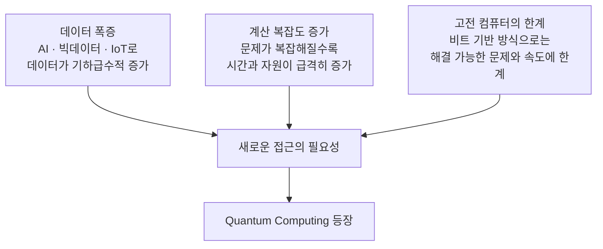

> [!abstract] 한 줄 요약
> 고전 컴퓨터는 느려서 한계가 오는 게 아니라, **정보를 표현하는 방식 자체가 0 또는 1 하나라서** 한계가 온다.

## AI 발전의 다섯 단계

> [!quote] 슬라이드 근거
> `pdf/day02_01_why_quantum_computing_lecture.pdf` p.2

```html preview
<div style="font-family:system-ui,sans-serif;padding:20px;color:var(--foreground)">
  <div id="stages" style="display:flex;gap:10px;flex-wrap:wrap;align-items:stretch"></div>
  <script>
    var s = [
      ['1단계', 'AI', '규칙 기반 시스템', 'var(--chart-1)'],
      ['2단계', 'Machine Learning', '데이터로 학습', 'var(--chart-2)'],
      ['3단계', 'Deep Learning', '신경망 기반 학습', 'var(--chart-4)'],
      ['4단계', 'Foundation Model', '대규모 사전학습 모델', 'var(--chart-3)'],
      ['5단계', 'Quantum AI', '새로운 가능성', 'var(--chart-5)']
    ];
    document.getElementById('stages').innerHTML = s.map(function (x) {
      return '<div style="flex:1;min-width:135px;padding:14px;background:var(--card);' +
        'color:var(--card-foreground);border:1px solid var(--border);' +
        'border-radius:var(--radius)">' +
        '<div style="display:inline-block;padding:2px 9px;border-radius:99px;' +
        'background:' + x[3] + ';color:var(--background);font-size:11px;font-weight:700">' +
        x[0] + '</div>' +
        '<div style="font-size:14px;font-weight:700;margin-top:8px">' + x[1] + '</div>' +
        '<div style="font-size:12px;color:var(--muted-foreground);margin-top:3px">' +
        x[2] + '</div></div>';
    }).join('');
  </script>
</div>
```

슬라이드는 5단계를 ==물음표== 로 표시한다 — 아직 오지 않은 단계라는 뜻이다.

## 고전 컴퓨터가 정보를 다루는 방식

> [!quote] 슬라이드 근거
> `pdf/day02_01_why_quantum_computing_lecture.pdf` p.3

Bit는 **Binary Digit**의 약자로, 고전 컴퓨터가 정보를 표현하는 가장 작은 단위다.

| 값 | 비유 | 컴퓨터 내부 |
| :--: | :-- | :-- |
| 0 | 전구가 꺼져 있음 (OFF) | 전압 없음 |
| 1 | 전구가 켜져 있음 (ON) | 전압 있음 |

> [!important] 한계가 여기서 생긴다
> Bit는 0 또는 1 중 **하나만** 가질 수 있으며, 동시에 여러 값을 가질 수 없다.
> 컴퓨터는 이 0과 1의 조합으로 모든 정보를 표현한다.

## 등장 배경

> [!quote] 슬라이드 근거
> `pdf/day02_01_why_quantum_computing_lecture.pdf` p.4

기존 컴퓨터의 한계가 세 방향에서 동시에 드러난다.



> [!tip] 슬라이드가 던진 질문
> 데이터를 전혀 다른 방식(양자 방식)으로 표현하고 처리한다면,
> **더 많은 정보를 동시에 다루고 복잡한 문제를 더 빨리 해결**할 수 있지 않을까?

그 답으로 나온 것이 0과 1을 동시에 표현하는 **양자 비트(큐비트)** 다.

> [!caution] "빠르다"로 요약하면 부족하다
> 슬라이드가 먼저 꼼는 것은 속도가 아니라 **표현 방식**이다.
> 속도는 표현이 바뀌어서 따라오는 결과지 출발점이 아니다.

## 핵심 정리

| 개념 | 정의 | 왜 중요한가 |
| :-- | :-- | :-- |
| Bit | Binary Digit — 0 또는 1 | 고전 컴퓨팅의 최소 단위이자 한계의 근원 |
| 데이터 폭증 | AI·빅데이터·IoT로 인한 증가 | 새 접근을 요구하는 외부 압력 |
| 계산 복잡도 | 문제가 복잡할수록 자원 급증 | 고전 방식이 부딪히는 지점 |
| Quantum AI | AI 발전의 5단계 | 이 과정이 향하는 지점 |

## 관련 개념

- **applies-to** — [03. Bit와 Qubit](<./03. Bit와 Qubit.md>) : 여기서 직후에 Bit와 Qubit을 정면으로 비교한다
- **contrasts** — [01. 표현력의 한계](<./01. 표현력의 한계.md>) : 같은 한계를 하드웨어가 아닌 모델 관점에서 다룬다
- **applies-to** — [09. Quantum Circuit](<./09. Quantum Circuit.md>) : 큐비트 수에 따른 $2^{n}$ 증가가 이 배경의 수치적 근거다

> [!question]- 스스로 점검
> **Q.** 고전 컴퓨터가 느려서 양자가 필요한 것인가?
>
> **A.** 정확히는 속도가 아니라 표현 방식의 문제다. Bit는 한 번에 한 값만 담을 수 있어, 문제가 커지면 필요한 Bit 수와 연산 횟수가 폭발적으로 늘어난다.

## 출처

- `pdf/day02_01_why_quantum_computing_lecture.pdf` (5p)
- 강의 인용 출처: Microsoft Azure Quantum; IBM Quantum Learning; Qiskit Documentation
