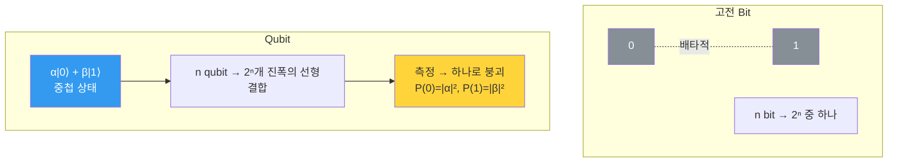

---
aliases:
  - Bit와 Qubit
  - Bit vs Qubit
  - 큐비트
authority: primary
course: quantum-ml
created: '2026-08-28'
date: '2026-08-28'
review_state: active
semester: summer
source: 01.quantum-foundations/02.bits-qubits-and-state/day02_02_bit_and_qubit_lecture.pdf
source_pages: 5
source_sha256: 59999076fc4711eb
source_type: lecture-slides
status: draft
tags:
  - type/lecture
  - cs/quantum
title: 03. Bit와 Qubit
type: lecture
updated: '2026-08-28'
---

domain:: [AI ML 데이터 인터페이스](<../AI ML 데이터 인터페이스.md>)
module:: [양자 ML 인터페이스](<../../00_graph-interfaces/courses/양자 ML 인터페이스.md>)
source:: [day02_02_bit_and_qubit_lecture.pdf](<01.quantum-foundations/02.bits-qubits-and-state/day02_02_bit_and_qubit_lecture.pdf>)
prerequisites:: [02. 왜 양자 컴퓨팅인가](<02. 왜 양자 컴퓨팅인가.md>)
next:: [04. Quantum Feature Space](<04. Quantum Feature Space.md>)

> [!abstract] 한 줄 요약
> 강의는 "Qubit이 신기하다"로 시작하지 않는다.
> **"단순히 Bit만 계속 늘리면 충분할까?"** 라는 질문을 먼저 던지고,
> 그 답이 아니라는 것을 네 가지 문제로 보인 뒤에야 Qubit을 꺼낸다.

## 출발 질문 — Bit를 늘리면 되지 않는가

가능은 하다. 다만 늘릴수록 네 방향에서 비용이 따라온다.

| # | 문제 | 강의의 설명 |
| :--: | :-- | :-- |
| 1 | **데이터 크기 증가** | 데이터가 복잡해질수록 저장해야 할 정보의 양이 **기하급수적으로** 늘어난다 |
| 2 | **계산량 증가** | Bit 수가 늘면 **모든 경우의 수**를 처리해야 해서 계산량이 급격히 증가한다 |
| 3 | **메모리 증가** | 많은 정보를 저장하기 위해 필요한 **메모리 용량**이 지속적으로 증가한다 |
| 4 | **복잡한 관계 표현 어려움** | 복잡한 데이터의 관계와 패턴을 **단순한 0과 1만으로** 표현하는 데 한계가 있다 |

앞의 셋이 **양**의 문제라면, 넷째는 **질**의 문제다.
[XOR에서 본 벽](<01. 표현력의 한계.md>)이 여기서 다시 등장한다 — 아무리 늘려도 표현 방식 자체가 그대로면 넘지 못하는 것이 있다.

> [!important] 강의의 결론
> 그래서 **정보 표현 방식 자체를 바꿀 필요**가 있다.
> 여기서 등장하는 개념이 **Qubit**이다.

[day02_02_bit_and_qubit_lecture p.3](<01.quantum-foundations/02.bits-qubits-and-state/day02_02_bit_and_qubit_lecture.pdf>)

## Qubit이란 무엇인가

> [!note] 정의
> **Qubit = Quantum Bit.**
> 양자역학의 원리를 이용하여 정보를 표현하는 **새로운 기본 단위**다.

표현 방법은 **켓 표기(ket notation)** 를 쓴다.

| 표기 | 대응 | 의미 |
| :--: | :-- | :-- |
| $\lvert 0 \rangle$ | 기존 Bit의 0 | 0 상태 |
| $\lvert 1 \rangle$ | 기존 Bit의 1 | 1 상태 |

핵심은 이 둘을 **동시에** 가질 수 있다는 점이다. 일반적인 Qubit 상태는 두 기저 상태의 **선형결합**으로 쓴다.

$$
\lvert \psi \rangle = \alpha \lvert 0 \rangle + \beta \lvert 1 \rangle,
\qquad \alpha, \beta \in \mathbb{C},
\qquad |\alpha|^2 + |\beta|^2 = 1
$$

$\alpha$ 와 $\beta$ 를 **진폭(amplitude)** 이라 하고, 측정했을 때 각 결과가 나올 확률은 진폭의 제곱이다.

$$
P(0) = |\alpha|^2, \qquad P(1) = |\beta|^2
$$

## Bit와 Qubit의 대비

| 관점 | Bit | Qubit |
| :-- | :-- | :-- |
| 한 순간의 값 | 0 **또는** 1 | 0 **과** 1 (중첩) |
| 상태 공간 | 이산 집합 $\{0,1\}$ | 연속 — 정규화된 복소 2차원 벡터 |
| $n$개일 때 | $2^n$ 상태 중 **하나** | $2^n$ 개 진폭을 **동시에** 보유 |
| 값 읽기 | 그대로 읽음 | **측정** 시 확률적으로 하나로 붕괴 |
| 복제 | 자유롭게 복사 | **복제 불가**(no-cloning) |

> [!warning] "동시에 가진다"의 정확한 뜻
> 중첩은 **0과 1을 둘 다 저장해 둔 상자**가 아니다.
> 측정하면 반드시 **하나의 값**만 나오고, 그 순간 중첩은 사라진다.
> 계산상의 이득은 "많이 담아서"가 아니라, 측정 전까지 **진폭을 간섭시켜**
> 원하는 답의 확률을 키울 수 있기 때문에 생긴다.

[day02_02_bit_and_qubit_lecture p.4](<01.quantum-foundations/02.bits-qubits-and-state/day02_02_bit_and_qubit_lecture.pdf>)

> [!tip] 다음 노트와의 연결
> 정보 단위를 바꿨으니, 이제 **그 단위로 데이터를 어떻게 놓을 것인가**가 문제가 된다.
> [04. Quantum Feature Space](<04. Quantum Feature Space.md>) 에서 이 질문을 특징 공간의 언어로 다시 만난다.

## 출처

- 원본: `01.quantum-foundations/02.bits-qubits-and-state/day02_02_bit_and_qubit_lecture.pdf` (5p)
- 강의 인용 출처: Microsoft Azure Quantum Documentation; Microsoft Learn Quantum Fundamentals; IBM Quantum Learning
