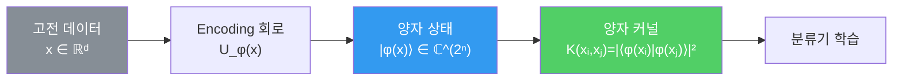

---
aliases:
  - Quantum Feature Space
  - 양자 특징 공간
authority: primary
course: quantum-ml
created: '2026-08-28'
date: '2026-08-28'
review_state: active
semester: summer
source: 02.circuits-and-encoding/02.feature-encoding/day02_03_quantum_feature_space_lecture.pdf
source_pages: 5
source_sha256: 50cd0da36202e554
source_type: lecture-slides
status: draft
tags:
  - type/lecture
  - cs/quantum
  - cs/ml
title: 04. Quantum Feature Space
type: lecture
updated: '2026-08-28'
---

domain:: [AI ML 데이터 인터페이스](<../AI ML 데이터 인터페이스.md>)
module:: [양자 ML 인터페이스](<../../00_graph-interfaces/courses/양자 ML 인터페이스.md>)
source:: [day02_03_quantum_feature_space_lecture.pdf](<02.circuits-and-encoding/02.feature-encoding/day02_03_quantum_feature_space_lecture.pdf>)
prerequisites:: [03. Bit와 Qubit](<03. Bit와 Qubit.md>)
next:: [05. QML에서 Quantum의 역할](<05. QML에서 Quantum의 역할.md>)
related:: [01. 표현력의 한계](<01. 표현력의 한계.md>)

> [!abstract] 한 줄 요약
> [첫 노트](<01. 표현력의 한계.md>)에서 미뤄 둔 **②번 길**— 표현 공간 자체를 바꾸는 접근 —이
> 여기서 이름을 얻는다. 데이터를 **양자 상태 공간으로 사상**하면 무엇이 달라지는가.

## Feature Space란 무엇인가

특징 공간은 **데이터가 놓이는 좌표계**다. 같은 데이터라도 어떤 공간에 놓느냐에 따라
분리 가능성이 완전히 달라진다.

$$
\phi: \mathcal{X} \rightarrow \mathcal{F}, \qquad
\mathbf{x} \mapsto \phi(\mathbf{x})
$$

XOR가 2차원에서 직선으로 안 갈렸지만 $x_1x_2$ 축을 하나 더하면 갈렸던 것 —
그게 바로 $\phi$ 를 바꾼 결과였다.

| 접근 | $\phi$ 를 누가 정하는가 | 비용 |
| :-- | :-- | :-- |
| Feature Engineering | **사람**이 설계 | 문제마다 재설계, 고차원에서 폭발 |
| 커널 트릭 | 커널 함수가 **암묵적으로** 정의 | 내적만 계산해 고차원 사상 우회 |
| **Quantum Feature Map** | **양자 회로**가 정의 | 지수적 차원을 자연스럽게 사용 |

> [!note] 커널 트릭의 요지
> 고차원 $\phi(\mathbf{x})$ 를 직접 만들지 않고 **내적만** 계산한다.
> $$K(\mathbf{x}_i, \mathbf{x}_j) = \langle \phi(\mathbf{x}_i), \phi(\mathbf{x}_j) \rangle$$
> 이 발상이 그대로 양자로 옮겨가면 **양자 커널**이 된다.

## Quantum Feature Space의 등장

$n$개 큐비트가 만드는 상태 공간은 $2^n$ 차원 복소 벡터 공간이다.
데이터를 이 공간의 한 점으로 올리면, 고전에서 만들기 힘든 고차원 사상을
**회로 하나로** 얻는다.

$$
\mathbf{x} \;\longmapsto\; \lvert \phi(\mathbf{x}) \rangle = U_{\phi(\mathbf{x})} \lvert 0 \rangle^{\otimes n}
\;\in\; \mathbb{C}^{2^n}
$$

## 왜 표현력이 중요한가

> [!important] 강의의 논지
> 모델의 성능은 종종 **알고리즘이 아니라 표현**에서 갈린다.
> 데이터가 적절한 공간에 놓이면 단순한 분류기로도 충분하고,
> 잘못 놓이면 아무리 복잡한 모델도 고전한다.

| 관점 | 고전 특징 공간 | 양자 특징 공간 |
| :-- | :-- | :-- |
| 차원 | 설계한 만큼 | $n$ 큐비트로 $2^n$ |
| 사상 방식 | 명시적 $\phi$ 또는 커널 | 인코딩 회로 $U_{\phi(\mathbf{x})}$ |
| 유사도 | $\langle \phi(\mathbf{x}_i), \phi(\mathbf{x}_j) \rangle$ | 상태 겹침 $\lvert\langle \phi(\mathbf{x}_i) \vert \phi(\mathbf{x}_j) \rangle\rvert^2$ |
| 제약 | 계산 비용 | 큐비트 수 · 노이즈 · 측정 횟수 |

> [!warning] 고차원이 곧 성능은 아니다
> 공간이 넓다고 항상 유리하지 않다. **데이터 구조에 맞는 사상**이어야 의미가 있다.
> 그래서 다음 노트에서 **어떤 회로로 인코딩할 것인가**(Feature Map)를 다룬다.

## 출처

- 원본: `02.circuits-and-encoding/02.feature-encoding/day02_03_quantum_feature_space_lecture.pdf` (5p)
- 강의 인용 출처: *Pattern Recognition and Machine Learning*; *The Elements of Statistical Learning*; IBM Quantum — Quantum Machine Learning; Nielsen & Chuang, *Quantum Computation and Quantum Information*
