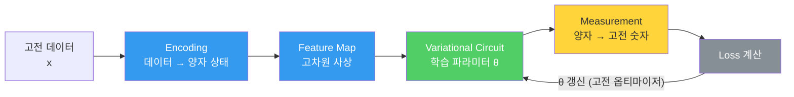

---
aliases:
  - QML에서 Quantum의 역할
  - Quantum Encoding
  - Feature Map
authority: primary
course: quantum-ml
created: '2026-08-28'
date: '2026-08-28'
review_state: active
semester: summer
source: 02.circuits-and-encoding/02.feature-encoding/day02_04_quantum_role_in_qml_lecture.pdf
source_pages: 11
source_sha256: e9d61cb2219f39c9
source_type: lecture-slides
status: seedling
tags:
  - type/lecture
  - cs/quantum
  - cs/ml
title: 05. QML에서 Quantum의 역할
type: lecture
updated: '2026-08-28'
---

domain:: [[ComputerScience/03_ai-ml-data/AI ML 데이터 인터페이스|AI ML 데이터 인터페이스]]
module:: [[ComputerScience/00_graph-interfaces/courses/양자 ML 인터페이스|양자 ML 인터페이스]]
source:: [[day02_04_quantum_role_in_qml_lecture.pdf]]
prerequisites:: [[04. Quantum Feature Space]]
next:: [[06. Hadamard Gate]]
related:: [[10. Quantum Circuit과 QML]]

# 05. QML에서 Quantum의 역할

> [!abstract] 한 줄 요약
> QML에서 양자가 맡는 자리는 **모델 전체**가 아니라 **한 구간**이다.
> 데이터를 양자 상태로 올리고(Encoding), 특징 공간으로 펼치고(Feature Map),
> 다시 고전 숫자로 내리는(Measurement) 구간 — 학습 자체는 여전히 고전 최적화가 돈다.

## QML 전체 구조



> [!important] 하이브리드라는 사실
> 화살표가 되돌아오는 구간(θ 갱신)은 **고전 컴퓨터**가 담당한다.
> 양자 회로는 매 반복마다 **함수 평가**를 해 주는 부품이다.

## 세 구간의 역할

| 구간 | 하는 일 | 파라미터 |
|:--|:--|:--|
| **Encoding** | 고전 값 $\mathbf{x}$ 를 회로의 회전각으로 주입 | 데이터 $\mathbf{x}$ (학습 대상 아님) |
| **Feature Map** | 얽힘·회전으로 고차원 특징 공간에 사상 | 없음 — **고정 회로** |
| **Variational** | 문제에 맞게 상태를 조정 | $\theta$ — **학습 대상** |
| **Measurement** | 상태를 관측해 고전 숫자로 환원 | 없음 |

$$
\lvert \psi(\mathbf{x}, \theta) \rangle = U_{\text{var}}(\theta)\, U_{\phi(\mathbf{x})} \lvert 0 \rangle^{\otimes n}
$$

> [!warning] 강의가 반복해 강조하는 구분
> **"방금 생성한 회로는 학습 회로가 아닙니다."**
> Feature Map은 **데이터를 변환하는 회로**이고, 학습되는 것은 그 뒤의 Variational Circuit이다.
> 둘을 섞어 이해하면 "무엇이 최적화되는가"가 흐려진다.

## 실습 — ZZFeatureMap 만들어 보기

```python
from qiskit.circuit.library import zz_feature_map

feature_map = zz_feature_map(feature_dimension=2, reps=1)
feature_map.decompose().draw("mpl")
```

회로를 그려 보면 맨 앞에 **H 게이트**가 놓인다.

> [!note] 왜 H가 먼저인가
> 데이터를 넣기 전에 **양자 상태를 준비**하기 위해서다.
> 균등 중첩을 만들어 두면 이어지는 회전이 모든 기저에 동시에 작용한다.
> 자세한 이유는 [[06. Hadamard Gate]] 참고.

## Measurement — 되돌아오는 길

측정은 중첩을 **하나의 결과로 붕괴**시킨다. 따라서 한 번 실행으로는 정보를 얻을 수 없고,
같은 회로를 여러 번(shots) 돌려 **분포**를 얻는다.

$$
P(\text{결과 } k) = \lvert \langle k \vert \psi \rangle \rvert^2
\qquad\Longrightarrow\qquad
\hat{P}(k) = \frac{\text{count}(k)}{\text{shots}}
$$

| 항목 | 의미 |
|:--|:--|
| `shots` | 회로 반복 실행 횟수 — 클수록 추정 분산 감소 |
| `counts` | `{'00': 583, '10': 279, ...}` 형태의 관측 빈도 |
| 통계 오차 | 대략 $O(1/\sqrt{\text{shots}})$ |

![[day02_04_quantum_role_in_qml_lecture.pdf#page=8]]

## 출처

- 원본: `02.circuits-and-encoding/02.feature-encoding/day02_04_quantum_role_in_qml_lecture.pdf` (11p)
- 강의 인용 출처: IBM Quantum Learning; Qiskit Machine Learning Documentation
