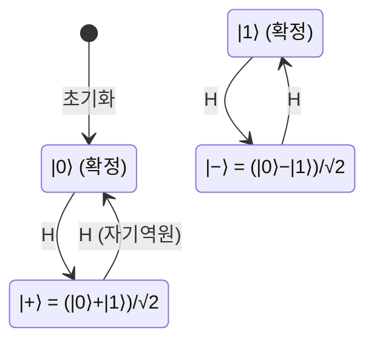

---
aliases:
  - Hadamard Gate
  - 아다마르 게이트
  - H 게이트
authority: primary
course: quantum-ml
created: '2026-08-28'
date: '2026-08-28'
review_state: active
semester: summer
source: 01.quantum-foundations/03.gates-measurement-and-entanglement/day05_03_hadamard_gate_concepts_lecture.pdf
source_pages: 6
source_sha256: ea9e1c4ef61adc52
source_type: lecture-slides
status: seedling
tags:
  - type/lecture
  - cs/quantum
title: 06. Hadamard Gate
type: lecture
updated: '2026-08-28'
---

domain:: [[ComputerScience/03_ai-ml-data/AI ML 데이터 인터페이스|AI ML 데이터 인터페이스]]
module:: [[ComputerScience/00_graph-interfaces/courses/양자 ML 인터페이스|양자 ML 인터페이스]]
source:: [[day05_03_hadamard_gate_concepts_lecture.pdf]]
prerequisites:: [[03. Bit와 Qubit]]
next:: [[07. 상태변화 분석]]
related:: [[08. Quantum Gate 개념]]

# 06. Hadamard Gate

> [!abstract] 한 줄 요약
> 중첩은 저절로 생기지 않는다. **만들어야** 한다.
> Hadamard Gate는 확정 상태 $\lvert 0 \rangle$ 을 **균등 중첩**으로 바꾸는,
> QML 회로에서 가장 먼저 등장하는 게이트다.

## Quantum Gate란

고전 논리 게이트가 비트를 바꾸듯, 양자 게이트는 큐비트의 상태를 바꾼다.
다만 조건이 하나 붙는다 — **유니터리(unitary)** 여야 한다.

$$
U^\dagger U = I \qquad\Longrightarrow\qquad \text{모든 양자 게이트는 가역이다}
$$

| 성질 | 고전 논리 게이트 | 양자 게이트 |
|:--|:--|:--|
| 가역성 | AND·OR은 **비가역** | 항상 **가역** |
| 표현 | 진리표 | 유니터리 행렬 |
| 입력 상태 | 확정값 | 중첩 가능 |
| 확률 보존 | 해당 없음 | 노름 보존 ($\lVert U\psi \rVert = \lVert \psi \rVert$) |

## Hadamard Gate의 정의

$$
H = \frac{1}{\sqrt{2}}
\begin{pmatrix}
1 & 1 \\
1 & -1
\end{pmatrix}
$$

기저 상태에 작용시키면 균등 중첩이 만들어진다.

$$
H\lvert 0 \rangle = \frac{\lvert 0 \rangle + \lvert 1 \rangle}{\sqrt{2}} \equiv \lvert + \rangle,
\qquad
H\lvert 1 \rangle = \frac{\lvert 0 \rangle - \lvert 1 \rangle}{\sqrt{2}} \equiv \lvert - \rangle
$$

두 경우 모두 측정 확률은 반반이다.

$$
P(0) = \left|\tfrac{1}{\sqrt{2}}\right|^2 = 0.5, \qquad P(1) = 0.5
$$

> [!warning] $\lvert + \rangle$ 와 $\lvert - \rangle$ 는 다르다
> 측정 확률은 둘 다 50:50이라 **측정만으로는 구분되지 않는다.**
> 차이는 $\lvert 1 \rangle$ 앞의 **부호(위상)** 에 있고, 이 위상이
> 뒤이은 간섭에서 결과를 가른다. [[07. 상태변화 분석]] 의 실습이 정확히 이 지점을 보여준다.

> [!note] H는 자기 자신이 역연산
> $H^2 = I$ 이므로 두 번 걸면 원래로 돌아온다.
> 중첩을 만들었다가 **되돌릴 수 있다**는 뜻이고, 이것이 간섭 설계의 기본 재료가 된다.

## QML 관점에서 Hadamard Gate

> [!important] 왜 회로 맨 앞에 H가 오는가
> 데이터를 인코딩하기 전에 큐비트를 **균등 중첩으로 펼쳐 두면**,
> 이어지는 회전 게이트들이 모든 기저 상태에 동시에 작용한다.
> [[05. QML에서 Quantum의 역할|Feature Map]] 회로에서 H가 선두에 배치되는 이유다.

| 역할 | 설명 |
|:--|:--|
| 중첩 생성 | 확정 상태를 $2^n$ 개 기저의 균등 분포로 |
| 기저 변환 | 계산 기저 $\{\lvert 0\rangle, \lvert 1\rangle\}$ ↔ 아다마르 기저 $\{\lvert +\rangle, \lvert -\rangle\}$ |
| 간섭 준비 | 위상 조작 후 다시 H를 걸어 확률로 되돌림 |

## 출처

- 원본: `01.quantum-foundations/03.gates-measurement-and-entanglement/day05_03_hadamard_gate_concepts_lecture.pdf` (6p)
- 강의 인용 출처: IBM Quantum Learning; Qiskit Machine Learning Documentation
