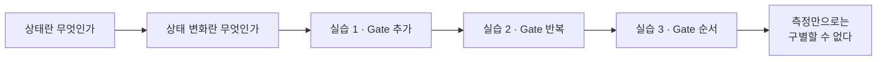
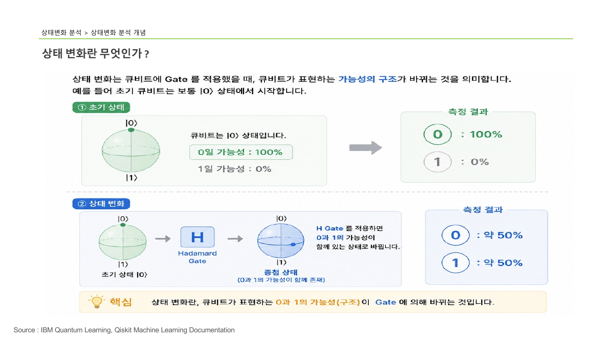

> [!abstract] 한 줄 요약
> Gate를 건다는 것은 큐비트의 값을 바꾸는 게 아니라 **가능성의 구조**를 바꾸는 일이다.
> 그리고 그 구조는 측정 결과만으로는 전부 드러나지 않는다.

## 이 노트의 지도



## 1. 상태란 무엇인가

> [!quote] 슬라이드 근거
> `pdf/day05_04_quantum_state_transition_analysis_lecture.pdf` p.2

양자컴퓨팅에서 ==상태==는 큐비트가 현재 어떤 정보를 표현하고 있는지를 뜻한다. 고전 Bit와 비교하면 차이가 선명해진다.

| | 고전 컴퓨터의 Bit | 양자 컴퓨터의 Qubit |
| :-- | :-- | :-- |
| 가지는 값 | 항상 0 또는 1 중 **하나** | 측정 전까지 0일 가능성과 1일 가능성을 **함께** |
| 측정하면 | 그대로 나온다 (0 → 0, 1 → 1) | 0 또는 1 중 하나로 **확률적으로** 결정 |

> [!important] 정의
> 큐비트의 상태는 단순히 값 하나가 아니라 **측정했을 때 어떤 결과가 나올 가능성의 구조**이다.

이 정의를 받아들이면 다음 질문이 자연스럽다 — 그러면 그 구조는 어떻게 바뀌는가.

## 2. 상태 변화란 무엇인가

> [!quote] 슬라이드 근거
> `pdf/day05_04_quantum_state_transition_analysis_lecture.pdf` p.3

초기 큐비트는 $\lvert 0 \rangle$ 에서 시작한다 — 0일 가능성 100%, 1일 가능성 0%. 여기에 Hadamard Gate를 걸면 구조가 바뀜다.

$$
H\lvert 0 \rangle = \frac{\lvert 0 \rangle + \lvert 1 \rangle}{\sqrt{2}}
\quad\Longrightarrow\quad
P(0) \approx P(1) \approx 50\%
$$



> [!tip] 슬라이드가 밑줄 친 핵심
> 상태 변화란 큐비트가 표현하는 **0과 1의 가능성(구조)이 Gate에 의해 바뀌는 것**이다.

## 3. 세 실습

> [!warning] 원본 슬라이드의 라벨이 뒤섞여 있다
> p.8은 "실습 3 : Gate 순서 변경"으로 라벨돼 있지만 내용은 H를 두 번 적용하는 **반복**이고,
> p.9~12는 "실습 2 : Gate 반복 적용"으로 라벨돼 있지만 내용은 회로 A/B의 **순서 비교**다.
> 이 노트는 라벨이 아닌
**내용 기준**으로 재구성했다.

### 실습 1 — Gate를 추가하면

먼저 아무 Gate도 없는 회로를 측정한다.

```python
from qiskit import QuantumCircuit
from qiskit_aer import AerSimulator

qc = QuantumCircuit(1)
qc.measure_all()

sim = AerSimulator()
job = sim.run(qc, shots=1000)
counts = job.result().get_counts()
print(counts)   # {'0': 1000}
```

초기 상태가 $\lvert 0 \rangle$ 이므로 1,000번 전부 `0` 이 나온다. 여기에 H Gate 하나를 추가한다.

```python
qc = QuantumCircuit(1)
qc.h(0)
qc.measure_all()

job = sim.run(qc, shots=100)
counts = job.result().get_counts()
print(counts)   # {'0': 48, '1': 52}
```

> [!note] shots 수가 다르다
> 이 실행만 `shots=100` 이다. 48:52는 100회 기준이므로 1,000회 실행보다 편차가 크게 보일 수 있다.

### 실습 2 — Gate를 반복하면

```python
qc = QuantumCircuit(1)
qc.h(0)
qc.h(0)
qc.measure_all()

job = sim.run(qc, shots=1000)
counts = job.result().get_counts()
print(counts)   # {'0': 1000}
```

중첩을 만들었는데 결과는 처음과 똑같다. 슬라이드의 설명은 이렇다 — 첫 번째 H가 중첩을 만들고, 두 번째 H가 그 중첩을 **제거**해 원래 상태를 복원한다.

<details>
<summary>왜 두 번 걸면 원래대로 돌아오는가</summary>

Hadamard 행렬은 자기 자신이 역행렬이다.

$$
H = \frac{1}{\sqrt{2}}\begin{pmatrix} 1 & 1 \\ 1 & -1 \end{pmatrix}
\qquad
H^{2} = I
$$

따라서 $H(H\lvert 0 \rangle) = \lvert 0 \rangle$ 이다. 중첩은 "섮이는 것"이 아니라 **되돌릴 수 있는 변환**이라는 점이 핵심이다.

</details>

### 실습 3 — Gate 순서를 바꾸면

> [!quote] 슬라이드 근거
> `pdf/day05_04_quantum_state_transition_analysis_lecture.pdf` p.9–13

같은 두 Gate를 순서만 바꿔 적용한다.

<Tabs>
  <Tab label="회로 A · H → X">

```python
qc1 = QuantumCircuit(1)
qc1.h(0)      # 먼저 중첩
qc1.x(0)      # 그 다음 비트 반전
qc1.measure_all()

job = sim.run(qc1, shots=1000)
counts1 = job.result().get_counts()
print(counts1)   # {'0': 492, '1': 508}
```

Hadamard가 먼저 적용돼 중첩이 되고, 이후 X Gate를 걸어도 측정 확률은 약 50:50으로 유지된다.

  </Tab>
  <Tab label="회로 B · X → H">

```python
qc2 = QuantumCircuit(1)
qc2.x(0)      # 먼저 |1⟩ 로 반전
qc2.h(0)      # 그 다음 중첩
qc2.measure_all()

job = sim.run(qc2, shots=1000)
counts2 = job.result().get_counts()
print(counts2)   # {'1': 492, '0': 508}
```

X Gate로 먼저 $\lvert 1 \rangle$ 을 만든 뒤 Hadamard로 중첩을 만든다. 결과는 역시 약 50:50.

  </Tab>
</Tabs>

## 데이터로 보기

다섯 회로의 측정 분포를 한 줄씩 놓고 보면 이 강의의 결론이 눈으로 보인다.

```html preview
<div style="font-family:system-ui,sans-serif;padding:20px;color:var(--foreground)">
  <h3 style="margin:0 0 4px;font-size:15px;font-weight:600">회로별 측정 분포</h3>
  <p style="margin:0 0 18px;font-size:13px;color:var(--muted-foreground)">
    아래 세 회로는 분포가 거의 같다 — 그런데 회로 안의 상태는 서로 다르다.
  </p>
  <div id="rows"></div>
  <div style="display:flex;gap:16px;margin-top:14px;font-size:12px;color:var(--muted-foreground)">
    <span><span style="display:inline-block;width:10px;height:10px;border-radius:2px;background:var(--chart-1)"></span> 0</span>
    <span><span style="display:inline-block;width:10px;height:10px;border-radius:2px;background:var(--chart-3)"></span> 1</span>
  </div>
  <script>
    var rows = [
      ['Gate 없음', 1000, 0],
      ['H', 48, 52],
      ['H → H', 1000, 0],
      ['H → X (회로 A)', 492, 508],
      ['X → H (회로 B)', 508, 492]
    ];
    document.getElementById('rows').innerHTML = rows.map(function (r) {
      var total = r[1] + r[2];
      var p0 = r[1] / total * 100;
      return '<div style="display:flex;align-items:center;gap:12px;margin-bottom:9px">' +
        '<span style="width:130px;font-size:13px;text-align:right">' + r[0] + '</span>' +
        '<div style="flex:1;display:flex;height:26px;border-radius:var(--radius);overflow:hidden;' +
        'border:1px solid var(--border)">' +
        '<div style="width:' + p0 + '%;background:var(--chart-1)"></div>' +
        '<div style="width:' + (100 - p0) + '%;background:var(--chart-3)"></div>' +
        '</div>' +
        '<span style="width:52px;font-size:12px;color:var(--muted-foreground)">' +
        p0.toFixed(0) + '%</span></div>';
    }).join('');
  </script>
</div>
```

막대 세 개가 거의 같은 모양이라는 것이 이 강의의 핵심이다.

> [!important] 측정 결과만으로는 모든 상태를 구별할 수 없다
> 회로 A와 회로 B는 **서로 다른 양자 상태**를 거치지만 측정 분포는 둘 다 약 50:50이다.
> Gate의 순서는 큐비트의 **표현 방식**을 바꾸며, 이것이 QML에서 ==Feature Transformation== 의 핵심 원리다.

이 지점이 이후 강의와 연결되는 곳이다.

> [!caution] 오해하기 쉬운 대목
> "분포가 같으니 같은 회로"라고 읽으면 반대로 이해한 것이다.
> 상태는 다르고, 다만 **지금 방식의 측정이 그 차이를 보여주지 못할 뿐**이다.

## 핵심 정리

| 개념 | 정의 | 왜 중요한가 |
| :-- | :-- | :-- |
| 상태 | 측정 결과의 가능성 구조 | 값이 아니라 구조라는 전환이 양자 사고의 출발점 |
| 상태 변화 | Gate가 그 구조를 바꾸는 것 | 회로 설계가 결국 이 구조를 다루는 일 |
| $H^2 = I$ | H를 두 번 걸면 원래대로 | 중첩은 되돌릴 수 있는 변환임을 보임 |
| Gate 순서 | 적용 순서가 상태를 결정 | 같은 부품으로 다른 변환을 만드는 근거 |
| 측정의 한계 | 분포가 같아도 상태는 다를 수 있음 | 결과만 보고 회로를 판단하면 안 되는 이유 |

## 관련 개념

- **prerequisite** — [06. Hadamard Gate](<./06. Hadamard Gate.md>) : H Gate의 동작을 알아야 세 실습이 읽힌다
- **uses** — [03. Bit와 Qubit](<./03. Bit와 Qubit.md>) : 여기서 세운 Bit · Qubit 대조를 그대로 가져온다
- **applies-to** — [05. QML에서 Quantum의 역할](<./05. QML에서 Quantum의 역할.md>) : Gate 순서가 Feature Transformation으로 이어지는 지점
- **generalizes** — [08. Quantum Gate 개념](<./08. Quantum Gate 개념.md>) : 개별 실습을 유니터리 연산이라는 일반 틀로 묶는다

> [!question]- 스스로 점검
> **Q1.** 실습 1에서 H를 건 결과가 정확히 50:50이 아니라 48:52였다. 오류인가?
>
> **A1.** 아니다. 측정은 확률적이므로 유한한 횟수에서는 편차가 생긴다. 이 실행은 `shots=100` 이라 더 크게 보인다.
>
> **Q2.** 회로 A와 B의 상태가 다르다면, 그 차이를 확인하려면 무엇이 필요한가?
>
> **A2.** 다른 기저(basis)로 측정하거나 상태벡터를 직접 살펴보아야 한다. 계산 기저에서의 확률분포만으로는 부족하다.

## 출처

- `pdf/day05_04_quantum_state_transition_analysis_lecture.pdf` (14p)
- 강의 인용 출처: IBM Quantum Learning; Qiskit Machine Learning Documentation
