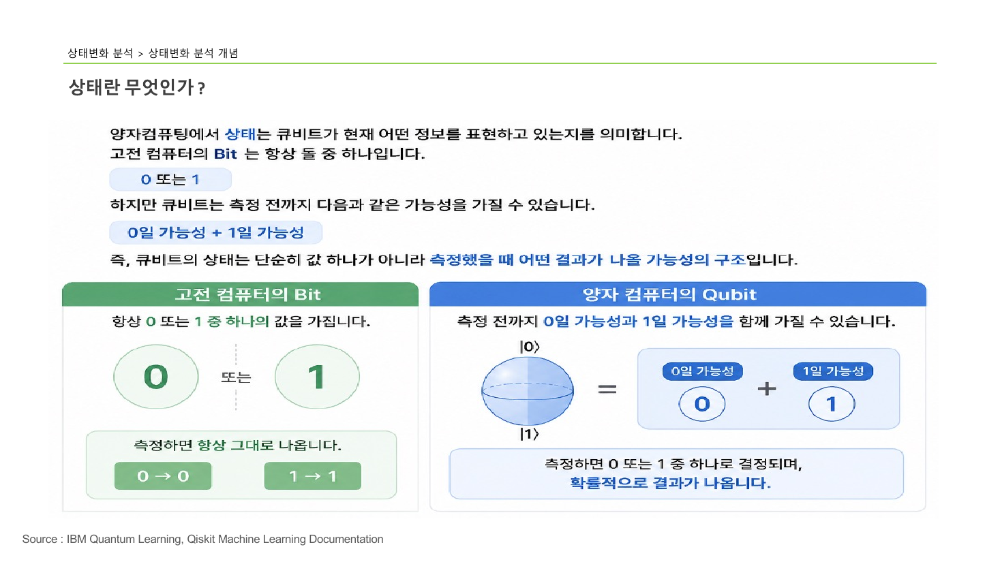
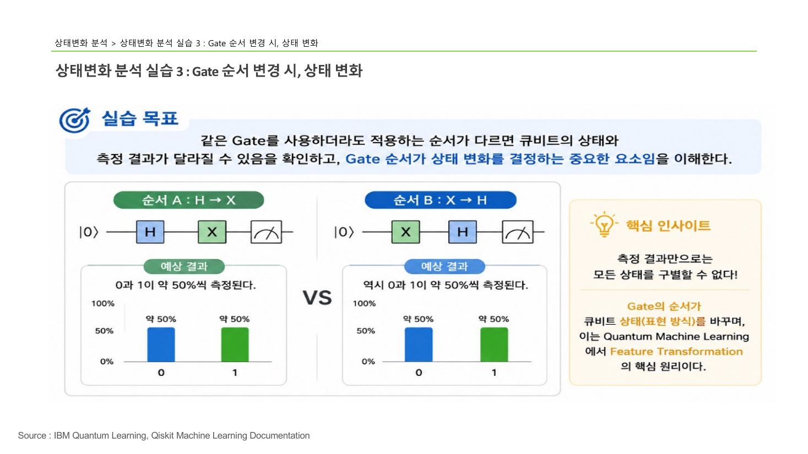

> [!abstract] 한 줄 요약
> Gate를 건다는 것은 큐비트의 값을 바꾸는 게 아니라 **가능성의 구조**를 바꾸는 일이다.
> 그리고 그 구조는 측정 결과만으로는 전부 드러나지 않는다.

## 이 노트의 지도


---

## 1. 상태란 무엇인가

> [!quote] 슬라이드 근거
> `pdf/day05_04_quantum_state_transition_analysis_lecture.pdf` p.2



양자컴퓨팅에서 ==상태==는 큐비트가 현재 어떤 정보를 표현하고 있는지를 뜻한다. 슬라이드는 이것을 고전 컴퓨터의 Bit와 나란히 놓고 설명한다.

고전 컴퓨터의 Bit는 **항상 둘 중 하나**의 값을 가진다.

$$
\text{Bit} \in \{0,\; 1\}
$$

그리고 측정하면 있던 값이 그대로 나온다 — $0 \to 0$, $1 \to 1$. 값과 관측 결과가 일치하므로 "상태"라는 말을 따로 쓸 필요가 없다.

큐비트는 다르다. 슬라이드의 표현을 그대로 옮기면 이렇다.

> 큐비트는 측정 전까지 다음과 같은 가능성을 가질 수 있습니다.
> **0일 가능성 + 1일 가능성**

| | 고전 컴퓨터의 Bit | 양자 컴퓨터의 Qubit |
| :-- | :-- | :-- |
| 가지는 값 | 항상 0 또는 1 중 **하나** | 측정 전까지 0일 가능성과 1일 가능성을 **함께** |
| 측정하면 | 그대로 나온다 ($0 \to 0$, $1 \to 1$) | 0 또는 1 중 하나로 **확률적으로** 결정 |
| 표현 대상 | 값(value) | 가능성의 구조(structure) |

> [!important] 슬라이드가 내린 정의
> 큐비트의 상태는 단순히 값 하나가 아니라 **측정했을 때 어떤 결과가 나올 가능성의 구조**다.

이 정의를 받아들이면 다음 질문이 자연스럽다 — 그러면 그 구조는 어떻게 바뀌는가.

---

## 2. 상태 변화란 무엇인가

> [!quote] 슬라이드 근거
> `pdf/day05_04_quantum_state_transition_analysis_lecture.pdf` p.3


슬라이드는 두 단계로 나누어 보여준다.

### 초기 상태

큐비트는 보통 $\lvert 0 \rangle$ 상태에서 시작한다. 이때 측정 결과는 완전히 확정적이다.

| 결과 | 확률 |
| :--: | --: |
| 0 | 100% |
| 1 | 0% |

블로흐 구에서는 북극($\lvert 0 \rangle$)에 화살표가 서 있는 모습이다.

### Gate를 적용한 뒤

여기에 Hadamard Gate를 걸면 화살표가 **적도로 눕는다.**

$$
H\lvert 0 \rangle = \frac{\lvert 0 \rangle + \lvert 1 \rangle}{\sqrt{2}}
$$

측정 확률은 진폭의 제곱이므로 각각 절반이 된다.

$$
P(0) = \left\lvert \frac{1}{\sqrt{2}} \right\rvert^{2} = \frac{1}{2}
\qquad
P(1) = \left\lvert \frac{1}{\sqrt{2}} \right\rvert^{2} = \frac{1}{2}
$$

| 결과 | 확률 |
| :--: | --: |
| 0 | 약 50% |
| 1 | 약 50% |

> [!tip] 슬라이드가 밑줄 친 핵심
> 상태 변화란 큐비트가 표현하는 **0과 1의 가능성(구조)이 Gate에 의해 바뀌는 것**이다.

바뀐 것은 "값"이 아니라 "어떤 값이 나올 가능성"이다. 이 구분이 이후 세 실습을 읽는 열쇠가 된다.

---

## 3. 세 실습

> [!warning] 원본 슬라이드의 라벨이 뒤섞여 있다
> p.8은 "실습 3 : Gate 순서 변경"으로 라벨돼 있지만 내용은 H를 두 번 적용하는 **반복**이고,
> p.9~12는 "실습 2 : Gate 반복 적용"으로 라벨돼 있지만 내용은 회로 A/B의 **순서 비교**다.

이 노트는 라벨이 아닌 **내용 기준**으로 재구성했다. 아래 번호는 실제 다루는 주제를 따른다.

### 실습 1 — Gate를 추가하면

> [!quote] 슬라이드 근거
> `pdf/day05_04_quantum_state_transition_analysis_lecture.pdf` p.5~6

#### 1단계 · 기본 상태 확인

먼저 아무 Gate도 없는 회로를 측정한다. 비교 기준을 만드는 단계다.

```python
from qiskit import QuantumCircuit
from qiskit_aer import AerSimulator

qc = QuantumCircuit(1)
qc.measure_all()
qc.draw("mpl")

sim = AerSimulator()
job = sim.run(qc, shots=1000)
result = job.result()
counts = result.get_counts()
print(counts)
```

실행 결과는 이렇다.

```text
{'0': 1000}
```

슬라이드의 설명은 한 줄이다 — **초기 상태가 $\lvert 0 \rangle$ 이기 때문에 0이 나옴.**

1,000번을 측정했는데 예외가 하나도 없다. 확률이 100%이므로 당연한 결과이고, 동시에 시뮬레이터가 제대로 동작한다는 확인이기도 하다.

#### 2단계 · 중첩 생성

이제 H Gate 하나를 추가한다.

```python
from qiskit import QuantumCircuit

qc = QuantumCircuit(1)
qc.h(0)
qc.measure_all()

job = sim.run(qc, shots=100)
result = job.result()
counts = result.get_counts()
print(counts)
```

```text
{'0': 48, '1': 52}
```

슬라이드의 설명 — H Gate는 **큐비트를 $\lvert 0 \rangle$ 상태에서 $\lvert 0 \rangle + \lvert 1 \rangle$ 형태의 중첩 상태로 바꾸는 역할**을 수행한다.

> [!note] shots 수가 다르다
> 이 실행만 `shots=100` 이다. 48:52는 100회 기준이므로, 1,000회 실행보다 편차가 크게 보일 수 있다.
> 이론값은 50:50이고 48:52는 그 주변의 정상적인 요동이다.

### 실습 2 — Gate를 반복하면

> [!quote] 슬라이드 근거
> `pdf/day05_04_quantum_state_transition_analysis_lecture.pdf` p.8

같은 Gate를 연달아 두 번 적용한다.

```python
from qiskit import QuantumCircuit

qc = QuantumCircuit(1)
qc.h(0)
qc.h(0)
qc.measure_all()

job = sim.run(qc, shots=1000)
result = job.result()
counts = result.get_counts()
print(counts)
```

```text
{'0': 1000}
```

중첩을 만들었는데 결과는 실습 1의 1단계와 똑같다. 슬라이드는 스스로 묻고 답한다.

> 왜 H Gate를 두 번 적용했는데 원래 상태로 돌아왔을까요?
> 첫 번째 H → 중첩 생성 → 두 번째 H → 중첩 제거 → 원래 상태 복원

<details>
<summary>왜 두 번 걸면 원래대로 돌아오는가 — 행렬로 확인</summary>

Hadamard 행렬은 자기 자신이 역행렬이다.

$$
H = \frac{1}{\sqrt{2}}\begin{pmatrix} 1 & 1 \\ 1 & -1 \end{pmatrix}
$$

직접 곱해 보면 항등행렬이 나온다.

$$
H^{2} = \frac{1}{2}\begin{pmatrix} 1 & 1 \\ 1 & -1 \end{pmatrix}\begin{pmatrix} 1 & 1 \\ 1 & -1 \end{pmatrix}
= \frac{1}{2}\begin{pmatrix} 2 & 0 \\ 0 & 2 \end{pmatrix}
= I
$$

따라서 $H(H\lvert 0 \rangle) = I\lvert 0 \rangle = \lvert 0 \rangle$ 이다.

중첩은 "섞이는 것"이 아니라 **되돌릴 수 있는 변환**이라는 점이 핵심이다. 정보가 사라진 게 아니라 다른 형태로 옮겨졌을 뿐이고, 같은 변환을 한 번 더 걸면 제자리로 온다.

</details>

> [!important] 여기서 얻는 통찰
> 양자 Gate는 **유니터리 연산**이라 되돌릴 수 있다. 고전 논리 게이트 중 AND나 OR는 입력 정보를 잃어버려 되돌릴 수 없다는 점과 대비된다.

### 실습 3 — Gate 순서를 바꾸면

> [!quote] 슬라이드 근거
> `pdf/day05_04_quantum_state_transition_analysis_lecture.pdf` p.9~13



슬라이드가 밝힌 실습 목표는 이렇다.

> 같은 Gate를 사용하더라도 적용하는 순서가 다르면 큐비트의 상태와 측정 결과가 달라질 수 있음을 확인하고, Gate 순서가 상태 변화를 결정하는 중요한 요소임을 이해한다.

<Tabs>
  <Tab label="회로 A · H → X">

```python
from qiskit import QuantumCircuit
from qiskit_aer import AerSimulator
from qiskit.visualization import plot_histogram
import matplotlib.pyplot as plt

# 회로 생성
qc1 = QuantumCircuit(1)

# H Gate
qc1.h(0)

# X Gate
qc1.x(0)

# 측정
qc1.measure_all()

# 회로 출력
print(qc1.draw())

# 시뮬레이터 실행
sim = AerSimulator()
job = sim.run(qc1, shots=1000)
result = job.result()
counts1 = result.get_counts()
print(counts1)

# Histogram
plot_histogram(counts1)
plt.show()
```

```text
{'0': 492, '1': 508}
```

슬라이드의 해석 세 줄:

- Hadamard Gate가 먼저 적용되어 큐비트가 중첩(Superposition) 상태가 된다
- 이후 X Gate를 적용해도 측정 확률은 약 50% : 50% 로 유지된다
- 즉, Gate를 추가해도 중첩 상태는 유지될 수 있음을 확인할 수 있다

  </Tab>
  <Tab label="회로 B · X → H">

```python
from qiskit import QuantumCircuit
from qiskit_aer import AerSimulator
from qiskit.visualization import plot_histogram
import matplotlib.pyplot as plt

qc2 = QuantumCircuit(1)

# X Gate
qc2.x(0)

# H Gate
qc2.h(0)

qc2.measure_all()
print(qc2.draw())

sim = AerSimulator()
job = sim.run(qc2, shots=1000)
result = job.result()
counts2 = result.get_counts()
print(counts2)

plot_histogram(counts2)
plt.show()
```

```text
{'1': 492, '0': 508}
```

슬라이드의 해석 세 줄:

- X Gate로 먼저 $\lvert 1 \rangle$ 상태를 만든 후 Hadamard Gate를 적용하여 중첩 상태로 변환한다
- 측정 결과는 역시 약 50% : 50% 로 나타난다
- 즉, Gate의 적용 순서는 상태 변화 과정에 영향을 주지만, **측정 결과만으로는 모든 상태의 차이를 구별할 수는 없다**

  </Tab>

</Tabs>

<details>
<summary>두 회로가 실제로 도달하는 상태 — 수식으로 비교</summary>

**회로 A** — H를 먼저, X를 나중에.

$$
H\lvert 0 \rangle = \frac{\lvert 0 \rangle + \lvert 1 \rangle}{\sqrt{2}}
\;\xrightarrow{\;X\;}\;
\frac{\lvert 1 \rangle + \lvert 0 \rangle}{\sqrt{2}}
= \frac{\lvert 0 \rangle + \lvert 1 \rangle}{\sqrt{2}}
$$

X는 $\lvert 0 \rangle$ 과 $\lvert 1 \rangle$ 을 맞바꾸므로, 둘의 계수가 같은 상태에서는 변화가 없다.

**회로 B** — X를 먼저, H를 나중에.

$$
X\lvert 0 \rangle = \lvert 1 \rangle
\;\xrightarrow{\;H\;}\;
\frac{\lvert 0 \rangle - \lvert 1 \rangle}{\sqrt{2}}
$$

**부호가 다르다.** 회로 A는 $+$, 회로 B는 $-$ 다.

그런데 측정 확률은 진폭의 **제곱**이므로 부호가 사라진다.

$$
\left\lvert \frac{1}{\sqrt{2}} \right\rvert^{2}
= \left\lvert -\frac{1}{\sqrt{2}} \right\rvert^{2}
= \frac{1}{2}
$$

두 상태는 분명히 다른데 계산 기저에서의 측정 확률은 같다. 이것이 슬라이드가 말한 "측정 결과만으로는 구별할 수 없다"의 정체다.

</details>

---

## 데이터로 보기

다섯 회로의 측정 분포를 한 줄씩 놓고 보면 이 강의의 결론이 눈으로 보인다.

```html preview
<div style="font-family:system-ui,sans-serif;padding:20px;color:var(--foreground)">
  <h3 style="margin:0 0 4px;font-size:15px;font-weight:600">회로별 측정 분포</h3>
  <p style="margin:0 0 18px;font-size:13px;color:var(--muted-foreground)">
    아래 세 회로는 분포가 거의 같다 — 그런데 회로 안의 상태는 서로 다르다.
  </p>
  <div id="rows"></div>
  <div style="display:flex;gap:16px;margin-top:14px;font-size:12px;color:var(--muted-foreground)">
    <span><span style="display:inline-block;width:10px;height:10px;border-radius:2px;background:var(--chart-1)"></span> 0</span>
    <span><span style="display:inline-block;width:10px;height:10px;border-radius:2px;background:var(--chart-3)"></span> 1</span>
  </div>
  <script>
    var rows = [
      ['Gate 없음', 1000, 0],
      ['H', 48, 52],
      ['H → H', 1000, 0],
      ['H → X (회로 A)', 492, 508],
      ['X → H (회로 B)', 508, 492]
    ];
    document.getElementById('rows').innerHTML = rows.map(function (r) {
      var total = r[1] + r[2];
      var p0 = r[1] / total * 100;
      return '<div style="display:flex;align-items:center;gap:12px;margin-bottom:9px">' +
        '<span style="width:130px;font-size:13px;text-align:right">' + r[0] + '</span>' +
        '<div style="flex:1;display:flex;height:26px;border-radius:var(--radius);overflow:hidden;' +
        'border:1px solid var(--border)">' +
        '<div style="width:' + p0 + '%;background:var(--chart-1)"></div>' +
        '<div style="width:' + (100 - p0) + '%;background:var(--chart-3)"></div>' +
        '</div>' +
        '<span style="width:52px;font-size:12px;color:var(--muted-foreground)">' +
        p0.toFixed(0) + '%</span></div>';
    }).join('');
  </script>
</div>
```

막대 세 개가 거의 같은 모양이라는 것이 이 강의의 핵심이다.

> [!important] 측정 결과만으로는 모든 상태를 구별할 수 없다
> 회로 A와 회로 B는 **서로 다른 양자 상태**를 거치지만 측정 분포는 둘 다 약 50:50이다.
> Gate의 순서는 큐비트의 **표현 방식**을 바꾸며, 이것이 QML에서 ==Feature Transformation== 의 핵심 원리다.

이 지점이 이후 강의와 연결되는 곳이다.

> [!caution] 오해하기 쉬운 대목
> "분포가 같으니 같은 회로"라고 읽으면 반대로 이해한 것이다.
> 상태는 다르고, 다만 **지금 방식의 측정이 그 차이를 보여주지 못할 뿐**이다.
> 차이를 보려면 다른 기저에서 측정하거나 상태벡터를 직접 살펴야 한다.

---

## 핵심 정리

| 개념 | 정의 | 왜 중요한가 |
| :-- | :-- | :-- |
| 상태 | 측정 결과의 가능성 구조 | 값이 아니라 구조라는 전환이 양자 사고의 출발점 |
| 상태 변화 | Gate가 그 구조를 바꾸는 것 | 회로 설계가 결국 이 구조를 다루는 일 |
| $H^2 = I$ | H를 두 번 걸면 원래대로 | 중첩은 되돌릴 수 있는 변환임을 보임 |
| Gate 순서 | 적용 순서가 상태를 결정 | 같은 부품으로 다른 변환을 만드는 근거 |
| 위상(phase) | 진폭의 부호 | 측정 확률에는 안 보이지만 상태에는 남아 있다 |
| 측정의 한계 | 분포가 같아도 상태는 다를 수 있음 | 결과만 보고 회로를 판단하면 안 되는 이유 |

## 관련 개념

- **prerequisite** — [06. Hadamard Gate](<./06. Hadamard Gate.md>) : H Gate의 동작을 알아야 세 실습이 읽힌다
- **uses** — [03. Bit와 Qubit](<./03. Bit와 Qubit.md>) : 여기서 세운 Bit · Qubit 대조를 그대로 가져온다
- **applies-to** — [05. QML에서 Quantum의 역할](<./05. QML에서 Quantum의 역할.md>) : Gate 순서가 Feature Transformation으로 이어지는 지점
- **generalizes** — [08. Quantum Gate 개념](<./08. Quantum Gate 개념.md>) : 개별 실습을 유니터리 연산이라는 일반 틀로 묶는다

> [!question]- 스스로 점검
> **Q1.** 실습 1에서 H를 건 결과가 정확히 50:50이 아니라 48:52였다. 오류인가?
>
> **A1.** 아니다. 측정은 확률적이므로 유한한 횟수에서는 편차가 생긴다. 이 실행은 `shots=100` 이라 더 크게 보인다. 1,000회로 늘리면 50:50에 더 가까워진다.
>
> **Q2.** H를 두 번 걸면 원래대로 돌아온다. 그럼 중첩을 만든 의미가 없는 것 아닌가?
>
> **A2.** 중간에 다른 Gate가 끼면 이야기가 달라진다. 회로 A(H→X)가 그 사례이고, 실제 알고리즘은 중첩 상태에서 연산을 수행한 뒤 다시 H로 되돌리며 결과를 뽑아낸다.
>
> **Q3.** 회로 A와 B의 상태가 다르다면, 그 차이를 확인하려면 무엇이 필요한가?
>
> **A3.** 다른 기저(예: X 기저)로 측정하거나 상태벡터를 직접 살펴보아야 한다. 계산 기저에서의 확률분포만으로는 부족하다.

## 출처

- `pdf/day05_04_quantum_state_transition_analysis_lecture.pdf` (14p)
- 슬라이드 이미지: `assets/day05_04-p002.png` · `p003.png` · `p013.png`
- 강의 인용 출처: IBM Quantum Learning; Qiskit Machine Learning Documentation
