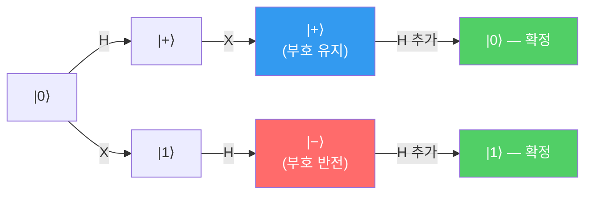

---
aliases:
  - 상태변화 분석
  - Gate 순서와 상태
  - State Transition Analysis
authority: primary
course: quantum-ml
created: '2026-08-28'
date: '2026-08-28'
review_state: active
semester: summer
source: 01.quantum-foundations/03.gates-measurement-and-entanglement/day05_04_quantum_state_transition_analysis_lecture.pdf
source_pages: 14
source_sha256: 5a5aefa1a9e19982
source_type: lecture-slides
status: seedling
tags:
  - type/lecture
  - cs/quantum
title: 07. 상태변화 분석
type: lecture
updated: '2026-08-28'
---

domain:: [[ComputerScience/03_ai-ml-data/AI ML 데이터 인터페이스|AI ML 데이터 인터페이스]]
module:: [[ComputerScience/00_graph-interfaces/courses/양자 ML 인터페이스|양자 ML 인터페이스]]
source:: [[day05_04_quantum_state_transition_analysis_lecture.pdf]]
prerequisites:: [[06. Hadamard Gate]]
next:: [[08. Quantum Gate 개념]]

# 07. 상태변화 분석

> [!abstract] 한 줄 요약
> 게이트를 **어떤 순서로** 거느냐에 따라 결과가 달라진다.
> 이 노트는 그 사실을 말로 설명하지 않고 **회로 A와 B를 실제로 돌려 비교**한다.
> 행렬 곱이 교환법칙을 따르지 않는다는 것이 실험으로 드러나는 자리다.

## 실습 1 — Gate를 추가하면 상태가 어떻게 변하는가

```python
from qiskit import QuantumCircuit
from qiskit_aer import AerSimulator

qc = QuantumCircuit(1, 1)
qc.measure_all()          # 1. 기본 상태 확인
```

아무 게이트도 걸지 않으면 큐비트는 $\lvert 0 \rangle$ 에 머문다. 측정은 항상 `0`이다.

$$
\lvert \psi \rangle = \lvert 0 \rangle
\quad\Longrightarrow\quad P(0) = 1,\; P(1) = 0
$$

여기에 **H를 걸면** 균등 중첩이 되고, 측정 결과가 반반으로 갈린다.

$$
H\lvert 0 \rangle = \frac{\lvert 0 \rangle + \lvert 1 \rangle}{\sqrt 2}
\quad\Longrightarrow\quad P(0) = P(1) = 0.5
$$

## 실습 2 — 순서를 바꾸면 결과가 달라지는가

강의의 핵심 실험이다. **같은 두 게이트를 순서만 바꿔** 두 회로를 만든다.

### 회로 A — H 먼저, X 나중

```python
qc = QuantumCircuit(1)
qc.h(0)
qc.x(0)
```

$$
X H \lvert 0 \rangle = X \frac{\lvert 0 \rangle + \lvert 1 \rangle}{\sqrt 2}
= \frac{\lvert 1 \rangle + \lvert 0 \rangle}{\sqrt 2} = \lvert + \rangle
$$

실행 결과: `{'0': 492, '1': 508}`

> Hadamard Gate가 먼저 적용되어 큐비트가 **중첩** 상태가 된다.
> 이후 X Gate는 $\lvert 0 \rangle$ 과 $\lvert 1 \rangle$ 을 맞바꾸지만,
> 이미 반반이므로 **분포는 그대로**다.

### 회로 B — X 먼저, H 나중

```python
qc = QuantumCircuit(1)
qc.x(0)
qc.h(0)
```

$$
H X \lvert 0 \rangle = H \lvert 1 \rangle
= \frac{\lvert 0 \rangle - \lvert 1 \rangle}{\sqrt 2} = \lvert - \rangle
$$

실행 결과: `{'1': 492, '0': 508}`

> X Gate로 먼저 $\lvert 1 \rangle$ 을 만든 후 Hadamard를 적용해 중첩으로 변환한다.

### 두 회로의 비교

| 회로 | 연산 순서 | 최종 상태 | 측정 분포 |
|:--:|:--|:--|:--|
| A | $H$ → $X$ | $\lvert + \rangle$ | 약 50:50 |
| B | $X$ → $H$ | $\lvert - \rangle$ | 약 50:50 |

> [!warning] 측정 분포가 같다고 상태가 같은 것은 아니다
> A는 $\lvert + \rangle$, B는 $\lvert - \rangle$ 로 **서로 다른 상태**다.
> 차이는 $\lvert 1 \rangle$ 앞의 **부호(위상)** 에 있고, 단일 측정으로는 드러나지 않는다.
> $$XH \neq HX$$
> 이 비가환성이 뒤에 게이트를 더 붙였을 때 **완전히 다른 결과**로 이어진다.



> [!tip] 위상이 드러나는 순간
> 두 회로 뒤에 **H를 한 번 더** 걸면 차이가 확정적으로 나타난다.
> $H\lvert+\rangle = \lvert0\rangle$, $H\lvert-\rangle = \lvert1\rangle$ —
> 반반이던 분포가 **한쪽으로 완전히 몰린다.** 이것이 간섭(interference)이다.

## 왜 이 실습이 중요한가

| 관찰 | QML에서의 의미 |
|:--|:--|
| 게이트 순서가 결과를 바꾼다 | 회로 **구조 설계**가 곧 모델 설계 |
| 측정만으로는 위상이 안 보인다 | 관측 가능한 양으로 **손실을 정의**해야 함 |
| 간섭으로 확률을 몰 수 있다 | 학습은 결국 **원하는 답의 진폭을 키우는 일** |

## 출처

- 원본: `01.quantum-foundations/03.gates-measurement-and-entanglement/day05_04_quantum_state_transition_analysis_lecture.pdf` (14p)
- 강의 인용 출처: IBM Quantum Learning; Qiskit Machine Learning Documentation
