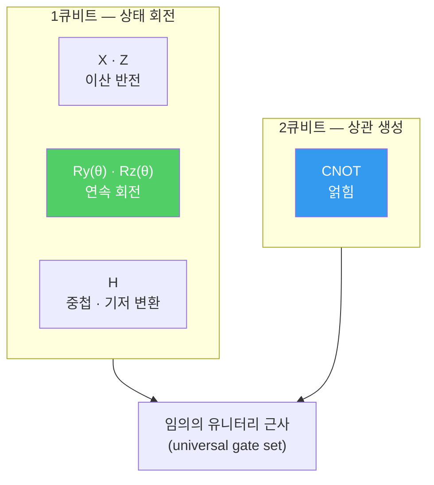

---
aliases:
  - Quantum Gate 개념
  - 양자 게이트
  - 유니터리 연산
authority: primary
course: quantum-ml
created: '2026-08-28'
date: '2026-08-28'
review_state: active
semester: summer
source: 01.quantum-foundations/03.gates-measurement-and-entanglement/day08_01_quantum_gate_concepts_lecture.pdf
source_pages: 7
source_sha256: be2b3ead15594917
source_type: lecture-slides
status: draft
tags:
  - type/lecture
  - cs/quantum
title: 08. Quantum Gate 개념
type: lecture
updated: '2026-08-28'
---

domain:: [AI ML 데이터 인터페이스](<../AI ML 데이터 인터페이스.md>)
module:: [양자 ML 인터페이스](<../../00_graph-interfaces/courses/양자 ML 인터페이스.md>)
source:: [day08_01_quantum_gate_concepts_lecture.pdf](<01.quantum-foundations/03.gates-measurement-and-entanglement/day08_01_quantum_gate_concepts_lecture.pdf>)
prerequisites:: [07. 상태변화 분석](<07. 상태변화 분석.md>)
next:: [09. Quantum Circuit](<09. Quantum Circuit.md>)
related:: [06. Hadamard Gate](<06. Hadamard Gate.md>)

> [!abstract] 한 줄 요약
> [H 게이트](<06. Hadamard Gate.md>)를 개별 사례로 봤다면, 여기서는 **게이트 일반**을 정리한다.
> 양자 게이트는 결국 **유니터리 행렬**이고, 그 제약이 고전 논리 게이트와의 차이를 전부 설명한다.

## Quantum Gate가 무엇인가

> [!note] 정의
> 큐비트의 상태 벡터에 작용하는 **유니터리 변환**이다.
> $$\lvert \psi' \rangle = U \lvert \psi \rangle, \qquad U^\dagger U = U U^\dagger = I$$

유니터리 조건이 함의하는 바가 세 가지다.

| 함의 | 설명 |
| :-- | :-- |
| **가역성** | $U^{-1} = U^\dagger$ 가 항상 존재 — 정보가 사라지지 않는다 |
| **확률 보존** | $\lVert U\psi \rVert = \lVert \psi \rVert$ — 확률 합이 1로 유지 |
| **선형성** | 중첩에 작용하면 각 성분에 동시에 작용 |

> [!warning] 고전 AND는 양자 게이트가 될 수 없다
> AND는 입력 2비트 → 출력 1비트라 **정보를 잃는다.** 되돌릴 수 없으므로 유니터리가 아니다.
> 양자에서 같은 일을 하려면 입력을 보존하는 형태(예: Toffoli)로 확장해야 한다.

## 대표 게이트

| 게이트 | 행렬 | 하는 일 |
| :--: | :-- | :-- |
| $X$ | $\begin{pmatrix}0&1\\1&0\end{pmatrix}$ | 비트 반전 — 고전 NOT에 대응 |
| $Z$ | $\begin{pmatrix}1&0\\0&-1\end{pmatrix}$ | 위상 반전 — $\lvert1\rangle$ 에 $-1$ |
| $H$ | $\tfrac{1}{\sqrt2}\begin{pmatrix}1&1\\1&-1\end{pmatrix}$ | 중첩 생성 · 기저 변환 |
| $R_y(\theta)$ | $\begin{pmatrix}\cos\frac\theta2 & -\sin\frac\theta2\\ \sin\frac\theta2 & \cos\frac\theta2\end{pmatrix}$ | 연속 회전 — **학습 파라미터가 들어가는 자리** |
| $CNOT$ | $2$큐비트 제어 반전 | **얽힘 생성** |

## QML에서 Gate의 의미

> [!important] 학습 가능한 게이트와 아닌 게이트
> QML 회로에서 **파라미터를 갖는 회전 게이트** $R_y(\theta)$ 가 학습의 대상이고,
> $H$ · $CNOT$ 같은 고정 게이트는 **구조**를 만든다.
> [Feature Map](<05. QML에서 Quantum의 역할.md>)이 고정, Variational Circuit이 학습인 이유가 여기 있다.

| 역할 | 게이트 | 학습 여부 |
| :-- | :-- | :--: |
| 상태 준비 | $H$ | ✗ |
| 데이터 주입 | $R_z(x_i)$ 등 | ✗ (데이터가 각도) |
| 얽힘 구조 | $CNOT$ | ✗ |
| 표현력 조정 | $R_y(\theta)$ | **✓** |

## 출처

- 원본: `01.quantum-foundations/03.gates-measurement-and-entanglement/day08_01_quantum_gate_concepts_lecture.pdf` (7p)
- 강의 인용 출처: IBM Quantum Learning; Qiskit Machine Learning Documentation
