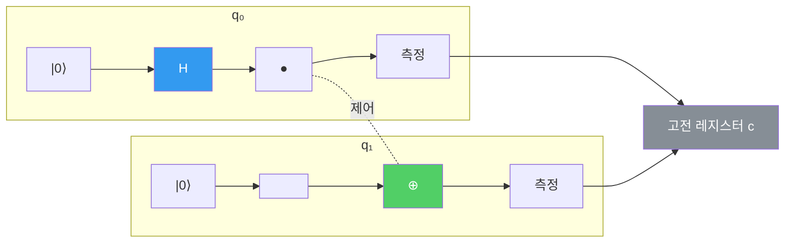

---
aliases:
  - Quantum Circuit
  - 양자 회로
authority: primary
course: quantum-ml
created: '2026-08-28'
date: '2026-08-28'
review_state: active
semester: summer
source: 02.circuits-and-encoding/01.quantum-circuits-and-qml/day10_01_quantum_circuit_lecture.pdf
source_pages: 7
source_sha256: b1eeffa4e6e7bf1e
source_type: lecture-slides
status: draft
tags:
  - type/lecture
  - cs/quantum
title: 09. Quantum Circuit
type: lecture
updated: '2026-08-28'
---

domain:: [AI ML 데이터 인터페이스](<../AI ML 데이터 인터페이스.md>)
module:: [양자 ML 인터페이스](<../../00_graph-interfaces/courses/양자 ML 인터페이스.md>)
source:: [day10_01_quantum_circuit_lecture.pdf](<02.circuits-and-encoding/01.quantum-circuits-and-qml/day10_01_quantum_circuit_lecture.pdf>)
prerequisites:: [08. Quantum Gate 개념](<08. Quantum Gate 개념.md>)
next:: [10. Quantum Circuit과 QML](<10. Quantum Circuit과 QML.md>)

> [!abstract] 한 줄 요약
> 게이트 하나하나를 봤으니 이제 **엮는 법**이다.
> 양자 회로는 큐비트라는 선 위에 게이트를 시간 순으로 배열하고,
> 마지막에 측정을 붙인 구조다.

## 구성 요소

| 요소 | 표기 | 역할 |
| :-- | :-- | :-- |
| **큐비트 레지스터** | 가로선 $q_0, q_1, \dots$ | 정보를 담는 선 |
| **고전 레지스터** | 이중선 $c$ | 측정 결과를 받는 곳 |
| **게이트** | 선 위의 상자 | 상태를 바꾸는 유니터리 연산 |
| **제어 연결** | 선 사이 세로줄 | 다중 큐비트 상호작용 (CNOT 등) |
| **측정** | 계기 기호 | 양자 → 고전으로 환원 |

## 동작 원리

회로는 **왼쪽에서 오른쪽으로** 읽지만, 수식으로 쓰면 **오른쪽에서 왼쪽으로** 곱해진다.

$$
\lvert \psi_{\text{out}} \rangle = U_n \cdots U_2 U_1 \lvert 0 \rangle^{\otimes n}
$$

> [!warning] 그림과 수식의 순서가 반대다
> 회로도에서 먼저 그린 게이트가 수식에서는 **가장 오른쪽**(먼저 작용)에 온다.
> [앞 노트](<07. 상태변화 분석.md>)에서 $XH$ 와 $HX$ 를 구분한 이유가 여기서도 그대로 적용된다.

전체 회로 역시 하나의 유니터리다.

$$
U_{\text{circuit}} = U_n \cdots U_1, \qquad U_{\text{circuit}}^\dagger U_{\text{circuit}} = I
$$

> [!note] 회로 깊이(depth)
> 순차적으로 쌓인 게이트 층의 수를 깊이라 한다.
> 실제 하드웨어에서는 깊이가 커질수록 **노이즈 누적**이 심해지므로,
> 같은 표현력이면 **얕은 회로**가 유리하다.

## QML로 넘어가기 위한 준비

| 회로의 부분 | QML에서의 이름 | 성격 |
| :-- | :-- | :-- |
| 앞단 고정 게이트 | Feature Map | 데이터에 의존, 학습 안 함 |
| 중간 파라미터 게이트 | Variational Circuit / Ansatz | **학습 대상** $\theta$ |
| 말단 측정 | Measurement | 고전 값 산출 |

> [!tip] 다음 노트
> [10. Quantum Circuit과 QML](<10. Quantum Circuit과 QML.md>) 에서 이 세 부분을 실제로 조립해
> **첫 QML 회로**를 만든다.

## 출처

- 원본: `02.circuits-and-encoding/01.quantum-circuits-and-qml/day10_01_quantum_circuit_lecture.pdf` (7p)
- 강의 인용 출처: IBM Quantum Learning; Qiskit Machine Learning Documentation
