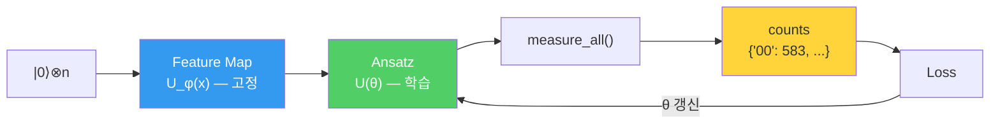

---
aliases:
  - Quantum Circuit과 QML
  - Variational Circuit
  - 첫 QML 회로
authority: primary
course: quantum-ml
created: '2026-08-28'
date: '2026-08-28'
review_state: active
semester: summer
source: 02.circuits-and-encoding/01.quantum-circuits-and-qml/day11_04_quantum_circuit_and_qml_lecture.pdf
source_pages: 17
source_sha256: 184e2037bc26c832
source_type: lecture-slides
status: draft
tags:
  - type/lecture
  - cs/quantum
  - cs/ml
title: 10. Quantum Circuit과 QML
type: lecture
updated: '2026-08-28'
---

domain:: [AI ML 데이터 인터페이스](<../AI ML 데이터 인터페이스.md>)
module:: [양자 ML 인터페이스](<../../00_graph-interfaces/courses/양자 ML 인터페이스.md>)
source:: [day11_04_quantum_circuit_and_qml_lecture.pdf](<02.circuits-and-encoding/01.quantum-circuits-and-qml/day11_04_quantum_circuit_and_qml_lecture.pdf>)
prerequisites:: [09. Quantum Circuit](<09. Quantum Circuit.md>)
related:: [05. QML에서 Quantum의 역할](<05. QML에서 Quantum의 역할.md>)

> [!abstract] 한 줄 요약
> 지금까지 만든 회로는 **어디에 쓰이는가**.
> 답은 Feature Map 뒤에 **학습되는 회로**를 붙이는 것 —
> 이 노트에서 8단계로 **첫 QML 회로**를 조립한다.

## Variational Circuit — 학습되는 회로

> [!important] 결정적 구분
> **Feature Map은 학습하지 않는다.** 데이터를 변환할 뿐이다.
> 학습되는 것은 파라미터 $\theta$ 를 가진 **Variational Circuit(ansatz)** 이다.

$$
\lvert \psi(\mathbf{x}, \theta) \rangle = U_{\text{ansatz}}(\theta)\; U_{\phi(\mathbf{x})} \lvert 0 \rangle^{\otimes n}
$$



## 실습 — 8단계로 조립하기

### 1) Feature Map 생성

```python
import numpy as np
from qiskit.circuit.library import zz_feature_map

feature_dimension = 2
feature_map = zz_feature_map(feature_dimension=feature_dimension, reps=1)
```

### 2) Variational Circuit 생성

```python
from qiskit.circuit.library import real_amplitudes

ansatz = real_amplitudes(num_qubits=feature_dimension, reps=1)
```

### 3) 두 회로 결합

```python
qml_circuit = feature_map.compose(ansatz)
```

> 앞은 **Feature Map** 이고 데이터를 변환하는 부분, 뒤는 학습되는 부분이다.

### 4) Measurement 추가

```python
qml_circuit.measure_all()
```

### 5) Simulator 실행

```python
from qiskit_aer import AerSimulator

sim = AerSimulator()      # AerSimulator → 양자 회로를 고전 컴퓨터에서 시뮬레이션
```

### 6) Parameter 확인

```python
print("Parameters", qml_circuit.parameters)
```

회로에 포함된 Parameter가 **두 종류**로 나뉜다는 점이 중요하다.

| 종류 | 출처 | 학습 여부 |
| :-- | :-- | :--: |
| $x[0], x[1]$ | Feature Map — **데이터** | ✗ |
| $\theta[0] \dots \theta[k]$ | Ansatz — **가중치** | **✓** |

### 7) Parameter 값 할당

```python
parameter_values = { p: np.random.rand() for p in qml_circuit.parameters }
bound = qml_circuit.assign_parameters(parameter_values)
```

### 8) Histogram 시각화

```python
from qiskit.visualization import plot_histogram
plot_histogram(counts)
```

## 실행 결과 읽기

```
{'01': 115, '00': 583, '11': 23, '10': 279}
```

| 상태 | 관측 횟수 | 상대 빈도 |
| :--: | --: | --: |
| `00` | 583 | 58.3% |
| `10` | 279 | 27.9% |
| `01` | 115 | 11.5% |
| `11` | 23 | 2.3% |

$$
\hat{P}(00) = \frac{583}{1000} = 0.583
$$

> [!note] 이 분포의 의미
> **랜덤 파라미터**가 적용된 현재 회로에서는 $\lvert 00 \rangle$ 이 가장 많이 나온다.
> 아직 학습 전이므로 이 분포는 **아무 의미가 없다.**
> 학습이란 손실이 줄어드는 방향으로 $\theta$ 를 갱신해 **이 분포를 정답 쪽으로 미는 일**이다.
>
> [!warning] 여기서 멈추면 절반이다
> 이 노트까지가 **회로 조립**이고, 실제 학습 루프(옵티마이저·손실·기울기)는
> 후속 모듈의 노트북에서 다룬다 — `03.variational-learning-and-kernels` 이후.

## 출처

- 원본: `02.circuits-and-encoding/01.quantum-circuits-and-qml/day11_04_quantum_circuit_and_qml_lecture.pdf` (17p)
- 강의 인용 출처: IBM Quantum Learning; Qiskit Machine Learning Documentation
