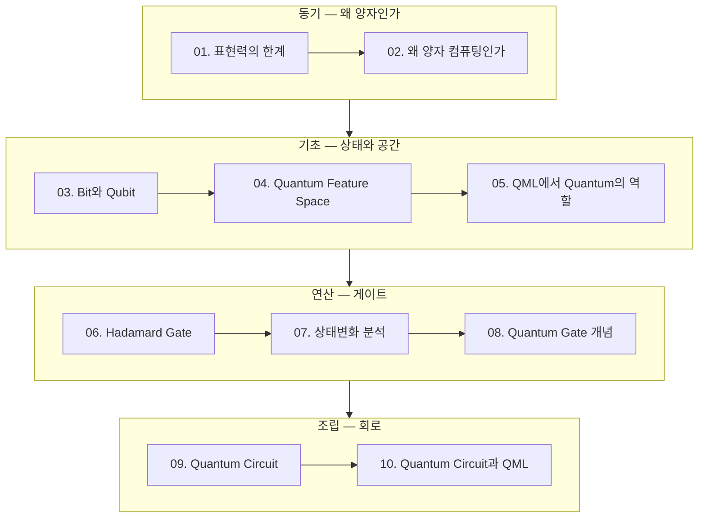

> [!abstract] 이 과정이 다루는 것
> 고전 머신러닝이 **표현력에서 막히는 지점**에서 출발해,
> 양자 상태·게이트·회로를 차례로 쌓고, 마지막에 처음으로 QML 회로를 조립한다.

## 학습 경로



## 노트 목록

| # | 노트 | 다루는 것 |
| :-- | :-- | :-- |
| 01 | [표현력의 한계](<./notes/01. 표현력의 한계.md>) | XOR 데이터로 선형 모델이 무너지는 것을 직접 확인 |
| 02 | [왜 양자 컴퓨팅인가](<./notes/02. 왜 양자 컴퓨팅인가.md>) | 고전 컴퓨팅과의 근본적 차이 |
| 03 | [Bit와 Qubit](<./notes/03. Bit와 Qubit.md>) | 값과 상태의 구분 |
| 04 | [Quantum Feature Space](<./notes/04. Quantum Feature Space.md>) | 데이터가 도착하는 고차원 공간 |
| 05 | [QML에서 Quantum의 역할](<./notes/05. QML에서 Quantum의 역할.md>) | Encoding → Feature Map → Variational → Measurement 4단계 |
| 06 | [Hadamard Gate](<./notes/06. Hadamard Gate.md>) | 중첩을 만드는 가장 기본 게이트 |
| 07 | [상태변화 분석](<./notes/07. 상태변화 분석.md>) | Gate 추가·반복·순서가 상태를 바꾸는 방식 |
| 08 | [Quantum Gate 개념](<./notes/08. Quantum Gate 개념.md>) | 유니터리 연산과 대표 게이트 5종 |
| 09 | [Quantum Circuit](<./notes/09. Quantum Circuit.md>) | 게이트를 순서대로 나열한 계산 구조 |
| 10 | [Quantum Circuit과 QML](<./notes/10. Quantum Circuit과 QML.md>) | Feature Map + Ansatz 로 첫 QML 회로 조립 |

## 원본 자료

모든 노트는 강의 PDF를 근거로 쓴다. 분량은 강의마다 크게 다르다.

```html preview
<div style="font-family:system-ui,sans-serif;padding:20px;color:var(--foreground)">
  <h3 style="margin:0 0 4px;font-size:15px;font-weight:600">강의별 슬라이드 분량</h3>
  <p style="margin:0 0 16px;font-size:13px;color:var(--muted-foreground)">
    10번과 07번이 가장 무겁다 — 둘 다 실습이 많은 회차다.
  </p>
  <div id="pg" style="display:flex;align-items:flex-end;gap:9px;height:150px"></div>
  <script>
    var d = [['01', 10], ['02', 5], ['03', 5], ['04', 5], ['05', 11],
             ['06', 6], ['07', 14], ['08', 7], ['09', 7], ['10', 17]];
    var mx = 17;
    document.getElementById('pg').innerHTML = d.map(function (x, i) {
      return '<div style="flex:1;display:flex;flex-direction:column;align-items:center;' +
        'gap:5px;height:100%;justify-content:flex-end">' +
        '<span style="font-size:12px;font-weight:600">' + x[1] + '</span>' +
        '<div style="width:100%;height:' + (x[1] / mx * 100) + '%;' +
        'background:var(--chart-' + ((i % 5) + 1) + ');' +
        'border-radius:var(--radius) var(--radius) 0 0"></div>' +
        '<span style="font-size:12px;color:var(--muted-foreground)">' + x[0] + '</span>' +
        '</div>';
    }).join('');
  </script>
</div>
```

<details>
<summary>노트–PDF 대응표</summary>

| 노트 | 원본 파일 | 페이지 |
| :-- | :-- | --: |
| 01 | `day01_02_expressive_power_limit_lecture.pdf` | 10 |
| 02 | `day02_01_why_quantum_computing_lecture.pdf` | 5 |
| 03 | `day02_02_bit_and_qubit_lecture.pdf` | 5 |
| 04 | `day02_03_quantum_feature_space_lecture.pdf` | 5 |
| 05 | `day02_04_quantum_role_in_qml_lecture.pdf` | 11 |
| 06 | `day05_03_hadamard_gate_concepts_lecture.pdf` | 6 |
| 07 | `day05_04_quantum_state_transition_analysis_lecture.pdf` | 14 |
| 08 | `day08_01_quantum_gate_concepts_lecture.pdf` | 7 |
| 09 | `day10_01_quantum_circuit_lecture.pdf` | 7 |
| 10 | `day11_04_quantum_circuit_and_qml_lecture.pdf` | 17 |

</details>

> [!warning] 원본 자료의 알려진 결함
> 재작성 과정에서 원본 슬라이드 자체의 문제를 발견했다. 각 노트에 명시해 둠.
>
> - **07번** — 실습 번호 라벨이 뒤바뀜 있다 (p.8은 "실습 3"인데 내용은 반복, p.9~12는 "실습 2"인데 내용은 순서 비교)
> - **05번** — p.9가 "Feature Map 이해" 라벨이지만 내용은 Variational Circuit
> - **01번** — 같은 실습의 정확도가 p.8은 0.5, p.9는 0.75로 다르게 적혀 있다

## 모듈 구성

원본 강의는 일곱 모듈로 나뉘어 있다. 이 인덱스가 다루는 10편은 그중 앞 두 모듈에 해당한다.

| 모듈 | 주제 | 이 인덱스 포함 |
| :-- | :-- | :--: |
| `01.quantum-foundations` | 양자 기초·상태·게이트 | ✓ |
| `02.circuits-and-encoding` | 회로와 인코딩 | ✓ |
| `03.variational-learning-and-kernels` | 변분 학습과 커널 | — |
| `04.quantum-kernel-classification` | 양자 커널 분류 | — |
| `05.quantum-neural-networks` | 양자 신경망 | — |
| `06.qaoa-and-combinatorial-optimization` | QAOA와 조합 최적화 | — |
| `07.capstone` | 종합 프로젝트 | — |

> [!note] 나머지 모듈은 왜 비어 있는가
> `03` 이후 모듈은 강의 PDF가 없고 **실습 노트북으로만** 구성돼 있다.
> 해당 구간의 정리문서는 노트북을 근거로 별도 작성한다.

## 이 과정이 연결되는 곳

- **prerequisite** — [신경망 인덱스](<../neural-networks/README.md>) : 고전 신경망의 학습 구조를 알면 Variational Circuit이 쉽게 읽힌다
- **uses** — [양자 ML 과정](<./notes/양자 ML 과정.md>) : 전체 과정 개요와 모듈 구성
