## 학습 경로

번호는 강의 진도 순이다. 앞 문서를 읽었다는 전제로 다음 문서가 쓰인다.

```mermaid
flowchart LR
    N0["01. 표현력의 한계"]
    N1["02. 왜 양자 컴퓨팅인가"]
    N2["03. Bit와 Qubit"]
    N3["04. Quantum Feature S…"]
    N4["05. QML에서 Quantum의 역할"]
    N5["06. Hadamard Gate"]
    N6["07. 상태변화 분석"]
    N7["08. Quantum Gate 개념"]
    N8["09. Quantum Circuit"]
    N9["10. Quantum Circuit과 …"]
    N0 --> N1
    N1 --> N2
    N2 --> N3
    N3 --> N4
    N4 --> N5
    N5 --> N6
    N6 --> N7
    N7 --> N8
    N8 --> N9
```

## 정리문서

모두 `notes/` 에 있다. 총 11편.

| 문서 | 다루는 내용 |
| :-- | :-- |
| [01. 표현력의 한계](<./notes/01. 표현력의 한계.md>) | XOR 데이터로 선형 모델의 한계를 직접 확인하고, Feature Engineering이 왜 필요해지는지를 실습으로 보인다. |
| [02. 왜 양자 컴퓨팅인가](<./notes/02. 왜 양자 컴퓨팅인가.md>) | AI 발전의 다음 단계로 양자가 거론되는 이유를, Bit의 물리적 한계와 데이터 폭증이라는 두 방향에서 정리한다. |
| [03. Bit와 Qubit](<./notes/03. Bit와 Qubit.md>) | Bit를 늘리는 것으로 해결되지 않는 네 가지 문제를 짚고, 그 대안으로 Qubit이 등장한 과정을 정리한다. |
| [04. Quantum Feature Space](<./notes/04. Quantum Feature Space.md>) | Feature Space의 정의에서 출발해, 고전 데이터를 양자 상태로 옮기는 3단계와 그것이 표현력을 높이는 이유를 정리한다. |
| [05. QML에서 Quantum의 역할](<./notes/05. QML에서 Quantum의 역할.md>) | QML을 Encoding → Feature Map → Variational Circuit → Measurement 네 단계로 분해하고, 각 단계가 맡는 일과 Classical ML과의 차이를 정리한다. |
| [06. Hadamard Gate](<./notes/06. Hadamard Gate.md>) | Quantum Gate가 값이 아니라 상태를 바꾸는 연산임을 세우고, H Gate가 왜 단순한 50/50 생성기가 아닌지를 설명한다. |
| [07. 상태변화 분석](<./notes/07. 상태변화 분석.md>) | Gate가 큐비트의 가능성 구조를 어떻게 바꾸는지를 세 실습으로 확인한다 — Gate 추가, 반복 적용, 순서 변경. |
| [08. Quantum Gate 개념](<./notes/08. Quantum Gate 개념.md>) | Quantum Gate를 유니터리 행렬 연산으로 정의하고, 대표 게이트 5종(X·Y·Z·H·CNOT)을 Logic Gate와 대조해 정리한다. |
| [09. Quantum Circuit](<./notes/09. Quantum Circuit.md>) | 게이트를 순서대로 나열해 회로를 만들고, 회로 구조의 다섯 요소가 왜 결과를 바꾸는지를 정리한다. |
| [10. Quantum Circuit과 QML](<./notes/10. Quantum Circuit과 QML.md>) | Feature Map 뒤에 학습되는 Variational Circuit을 붙여 첫 QML 회로를 8단계로 조립하고, 1,000회 측정 분포를 읽는다. |
| [양자 ML 과정](<./notes/양자 ML 과정.md>) | — |

## 원본 자료

교수가 배포한 자료다. `sources/` 에 있고 수정하지 않는다. 총 11건.

- `ICTIS_AI_Quantum_Computing_160H_Certificate.pdf`
- `day01_02_expressive_power_limit_lecture.pdf`
- `day02_01_why_quantum_computing_lecture.pdf`
- `day02_02_bit_and_qubit_lecture.pdf`
- `day02_03_quantum_feature_space_lecture.pdf`
- `day02_04_quantum_role_in_qml_lecture.pdf`
- `day05_03_hadamard_gate_concepts_lecture.pdf`
- `day05_04_quantum_state_transition_analysis_lecture.pdf`
- `day08_01_quantum_gate_concepts_lecture.pdf`
- `day10_01_quantum_circuit_lecture.pdf`
- `day11_04_quantum_circuit_and_qml_lecture.pdf`

## 실습

직접 만든 코드와 산출물이다. `work/` 에 있고 총 210건.

| 종류 | 개수 |
| :-- | --: |
| `.ipynb` | 174 |
| `.pkl` | 12 |
| `.csv` | 9 |
| `.npy` | 6 |
| `.png` | 4 |
| `.py` | 2 |

## 슬라이드 이미지

정리문서가 근거로 인라인 임베드하는 강의 슬라이드다. `assets/` 에 87장.

## 관련 과목

> [!note] 아직 비어 있다
> 다른 과목과의 관계는 지식그래프 4단계에서 관계 타입(`prerequisite` · `elaborates` · `contrasts` · `applies` · `evidences`)과 함께 채운다. 근거 없이 미리 이어두지 않는다.
