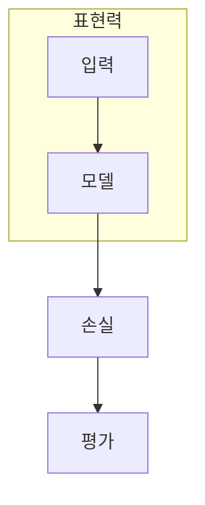

> [!abstract] 한 줄 요약
> 모델이 복잡해져도 데이터에 맞는 구조와 학습 가능성이 보장되지는 않는다.

## 이 노트의 지도



## 핵심 질문

표현력은 단순히 파라미터 수가 아니라, 어떤 함수를 어떤 자원으로 나타낼 수 있는지의 문제다. ==표현 공간==를 결과와 구분해 추적한다.

$$
\dim(\mathcal{H}_n)=2^n
$$

<details>
<summary>차원이 늘면 항상 좋은가?</summary>

차원이 커지면 가능한 표현은 늘지만, 데이터·최적화·일반화의 문제가 자동으로 풀리지는 않는다.

</details>

```html preview
<div style="font-family:system-ui,sans-serif;padding:20px;color:var(--foreground)">
  <label for="amt" style="font-size:14px;font-weight:600">특징 수 </label>
  <div id="out" style="font-size:30px;font-weight:700;color:var(--chart-1);margin:6px 0">4</div>
  <input id="amt" type="range" min="1" max="16" step="1" value="4"
    style="width:100%;accent-color:var(--primary)" />
  <p style="font-size:13px;color:var(--muted-foreground)">특징 수는 표현 설계에서 통제할 수 있는 입력 축이다.</p>
  <script>
    var amt = document.getElementById('amt');
    var out = document.getElementById('out');
    amt.addEventListener('input', function () {
      out.textContent = '' + Number(amt.value).toLocaleString() + '';
    });
  </script>
</div>
```

## 비교하거나 측정할 값

```html preview
<div style="font-family:system-ui,sans-serif;padding:20px;color:var(--foreground)">
  <h3 style="margin:0 0 14px;font-size:15px;font-weight:600">큐비트 수와 상태 공간 성분</h3>
  <div id="bars" style="display:flex;align-items:flex-end;gap:14px;height:170px"></div>
  <script>
    var data = [["1",2],["2",4],["3",8],["4",16]];
    var max = Math.max.apply(null, data.map(function (d) { return d[1]; }));
    document.getElementById('bars').innerHTML = data.map(function (d, i) {
      return '<div style="flex:1;display:flex;flex-direction:column;align-items:center;' +
        'gap:6px;height:100%;justify-content:flex-end">' +
        '<span style="font-size:12px;font-weight:600">' + d[1] + '</span>' +
        '<div style="width:100%;height:' + (d[1] / max * 100) + '%;' +
        'background:var(--chart-' + (i + 1) + ');' +
        'border-radius:var(--radius) var(--radius) 0 0"></div>' +
        '<span style="font-size:12px;color:var(--muted-foreground)">' + d[0] + '</span>' +
        '</div>';
    }).join('');
  </script>
</div>
```

<Tabs>
  <Tab label="표현">표현 가능한 함수의 범위를 본다.</Tab>
  <Tab label="학습">최적화 가능성을 따로 본다.</Tab>
  <Tab label="평가">검증 지표로 일반화를 확인한다.</Tab>
</Tabs>

> [!caution] 해석의 범위
> 막대는 상태 공간 성분 수이며 성능 점수가 아니다.

## 핵심 정리

| 요소 | 확인 질문 | 의미 |
| :-- | :-- | :-- |
| 입력 | 무엇을 넣는가 | 특징 설계 |
| 변환 | 무엇이 바뀌는가 | 회로 구조 |
| 관측 | 무엇을 읽는가 | 일반화 |

> [!question]- 스스로 점검
> **Q.** 표현력이 커도 학습이 실패할 수 있는 한 가지 이유는 무엇인가?
>
> **A.** 최적화가 어려워지거나 데이터에 맞지 않는 표현을 선택할 수 있기 때문이다.

## 출처

- 공개 노트에는 원본 강의 자료, 자산 이미지, 페이지 단위 근거를 포함하지 않는다.
