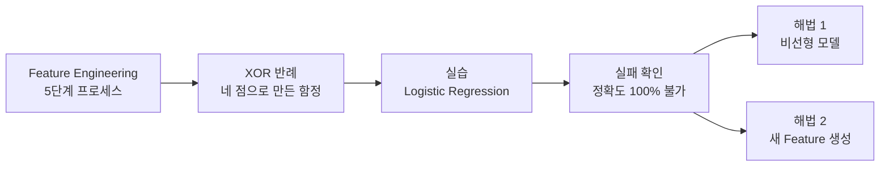

> [!abstract] 한 줄 요약
> 네 개뿐인 데이터에서 선형 모델이 무너진다.
> 이 실패가 이 과정 전체의 출발점이다 — **모델이 약해서가 아니라 표현 공간이 좁아서**다.

강의는 개념(Feature Engineering)에서 출발해 반례(XOR)를 던지고, 코드로 그 반례를 직접 재현한 뒤, 실패한 지점에서 두 갈래 해법을 제시하는 순서로 진행된다.



---

## 1. Feature Engineering이란

> [!quote] 슬라이드 근거
> `day01_02_expressive_power_limit_lecture.pdf` p.2

슬라이드는 이 개념을 한 문장으로 정의한다 — 원본 데이터를 이해하고 **새로운 Feature를 만들어 모델 성능을 향상시키는 일련의 과정**이다.


다섯 단계는 각각 다음을 맡는다.

| 단계 | 이름 | 하는 일 |
| :--: | :-- | :-- |
| 1 | 데이터 이해 | 문제와 데이터를 파악하고 기본 통계와 분포를 확인 |
| 2 | Feature 변환 | 스케일링·인코딩·로그 변환 등 적합한 형태로 변환 |
| 3 | Feature 생성 | 기존 Feature를 조합하거나 도메인 지식을 활용해 새로 생성 |
| 4 | Feature 선택 | 유용한 Feature는 남기고 불필요한 것은 제거 |
| 5 | Feature 검증 | 모델 성능을 평가하고 지속적으로 개선 |

이 노트가 파고드는 것은 3번 — ==Feature 생성== 이다. 나머지 네 단계는 데이터를 다듬는 일이지만, 3번만은 **없던 축을 만들어 낸다**. 그 차이가 왜 결정적인지를 가장 작은 예제로 확인한다.

---

## 2. XOR — 배타적 논리합

> [!quote] 슬라이드 근거
> `day01_02_expressive_power_limit_lecture.pdf` p.3

슬라이드는 XOR를 이렇게 정의한다 — **두 입력이 서로 다를 때만 1(참)이 되는 논리 연산**이다.


### 진리표

| $X_1$ | $X_2$ | XOR $(Y)$ |
| :--: | :--: | :--: |
| 0 | 0 | 0 |
| 0 | 1 | 1 |
| 1 | 0 | 1 |
| 1 | 1 | 0 |

### 슬라이드가 짚은 특징 세 가지

- 같은 값이면 0, 다른 값이면 1
- 선형적으로 구분할 수 없는 데이터
- 비선형 모델이 필요한 대표 예제

### 이번 실습의 목표

슬라이드는 목표를 두 개로 못 박는다.

1. XOR 데이터를 이용해 모델을 학습해 보기
2. 선형 모델의 한계와 비선형 모델의 필요성 이해하기

슬라이드 우측 하단에는 입력 2개 → 은닉 3개 → 출력 1개의 작은 신경망 그림이 함께 놓여 있다. 실습에서 직접 만들지는 않지만, **한계를 확인한 다음에 갈 방향**을 미리 보여주는 장치다.

---

## 3. 질문 — 직선 하나로 구분 가능한가

> [!quote] 슬라이드 근거
> `day01_02_expressive_power_limit_lecture.pdf` p.4

슬라이드는 답을 바로 주지 않고 먼저 묻는다. 네 점을 직선 하나로 '출력 Y=1(파란색)'과 '출력 Y=0(빨간색)'으로 완전히 구분할 수 있을까?


좌표에 찍어 보면 왜 어려운지가 눈에 들어온다.

```html preview
<div style="font-family:system-ui,sans-serif;padding:20px;color:var(--foreground)">
  <div style="display:flex;gap:24px;align-items:flex-start;flex-wrap:wrap">
    <div style="min-width:230px">
      <div style="font-size:13px;font-weight:600;margin-bottom:8px">XOR 데이터 배치</div>
      <svg viewBox="0 0 200 200" style="width:200px;height:200px">
        <line x1="35" y1="165" x2="180" y2="165" stroke-width="1.5" style="stroke: var(--border)" />
        <line x1="35" y1="165" x2="35" y2="25" stroke-width="1.5" style="stroke: var(--border)" />
        <text x="32" y="182" font-size="11" style="fill: var(--muted-foreground)">0</text>
        <text x="137" y="182" font-size="11" style="fill: var(--muted-foreground)">1</text>
        <text x="20" y="169" font-size="11" style="fill: var(--muted-foreground)">0</text>
        <text x="20" y="62" font-size="11" style="fill: var(--muted-foreground)">1</text>
        <text x="186" y="169" font-size="11" style="fill: var(--muted-foreground)">X1</text>
        <text x="22" y="18" font-size="11" style="fill: var(--muted-foreground)">X2</text>
        <circle cx="40" cy="160" r="7" style="fill: var(--chart-5)" />
        <circle cx="140" cy="58" r="7" style="fill: var(--chart-5)" />
        <circle cx="40" cy="58" r="7" style="fill: var(--chart-1)" />
        <circle cx="140" cy="160" r="7" style="fill: var(--chart-1)" />
        <line x1="25" y1="40" x2="175" y2="178" stroke-dasharray="5 4" stroke-width="2"
          style="stroke: var(--muted-foreground)" />
      </svg>
      <div style="display:flex;gap:14px;font-size:12px;color:var(--muted-foreground);margin-top:4px">
        <span><span style="display:inline-block;width:9px;height:9px;border-radius:50%;background:var(--chart-1)"></span> Y=1</span>
        <span><span style="display:inline-block;width:9px;height:9px;border-radius:50%;background:var(--chart-5)"></span> Y=0</span>
      </div>
    </div>
    <div style="flex:1;min-width:220px;padding:16px;background:var(--card);color:var(--card-foreground);
      border:1px solid var(--border);border-radius:var(--radius)">
      <div style="font-size:14px;font-weight:600;margin-bottom:8px">왜 직선으로 못 나누는가</div>
      <div style="font-size:13px;line-height:1.7;color:var(--muted-foreground)">
        같은 클래스가 <b style="color:var(--foreground)">대각선 방향</b>으로 마주보고 있다.<br />
        어떤 직선을 그어도 한쪽에 두 클래스가 섞인다.<br />
        점선은 시도해 본 경계 중 하나 — 어느 각도로 돌려도 결과는 같다.
      </div>
    </div>
  </div>
</div>
```

슬라이드의 결론은 ==선형 분리가 불가능한 문제(Non-linearly Separable)== 라는 것이다. 다만 슬라이드는 이것을 그림으로 보여줄 뿐 증명하지는 않는다. 아래는 그 빈자리를 채운 것이다.

<details>
<summary>선형 분리가 불가능함을 부등식으로 증명하기 (강의 범위 밖 보충)</summary>

선형 모델은 $w_1 x_1 + w_2 x_2 + b$ 의 부호로 클래스를 판정한다. 네 점을 모두 맞히려면 다음 네 조건이 **동시에** 성립해야 한다.

$$
\begin{aligned}
(0,0) \to 0 &: \quad b \le 0 \\
(0,1) \to 1 &: \quad w_2 + b > 0 \\
(1,0) \to 1 &: \quad w_1 + b > 0 \\
(1,1) \to 0 &: \quad w_1 + w_2 + b \le 0
\end{aligned}
$$

둘째와 셋째를 더하면

$$w_1 + w_2 + 2b > 0$$

넷째에서 $w_1 + w_2 \le -b$ 이므로 이를 대입하면

$$-b + 2b > 0 \quad \Longrightarrow \quad b > 0$$

그런데 첫째 조건은 $b \le 0$ 이었다. **모순**이다. 따라서 네 점을 모두 맞히는 $(w_1, w_2, b)$ 는 존재하지 않는다.

이것이 Minsky와 Papert가 1969년 『Perceptrons』에서 지적한 바로 그 한계이며, 이후 신경망 연구가 한동안 침체된 계기가 되었다.

</details>

---

## 4. 실습

> [!quote] 슬라이드 근거
> `day01_02_expressive_power_limit_lecture.pdf` p.5–7

슬라이드는 환경 준비부터 차례대로 짚는다.

### 사전 준비

```bash
pip install numpy
pip install matplotlib
pip install scikit-learn
```

설치 확인은 다음으로 한다.

```bash
pip show numpy
pip show matplotlib
pip show scikit-learn
```

### 1. 라이브러리 선언

```python
import numpy as np
import matplotlib.pyplot as plt

from sklearn.svm import SVC
from sklearn.linear_model import LogisticRegression
from sklearn.metrics import accuracy_score
```

> [!note] `SVC` 는 import 만 되고 쓰이지 않는다
> 이 강의 회차의 코드에서 `SVC` 는 선언만 하고 실제로 호출하지 않는다. 비선형 모델(RBF 커널 SVM)로 같은 데이터를 풀어 보는 것이 자연스러운 다음 단계인데, 슬라이드는 거기까지 가지 않고 선형 모델의 실패를 확인하는 데서 멈춘다. 원본 자료 그대로 옮긴 것이며 임의로 보충하지 않았다.

### 2. XOR 데이터 생성

```python
X = np.array([
    [0, 0],
    [0, 1],
    [1, 0],
    [1, 1]
])

y = np.array([0, 1, 1, 0])
```

### 3. XOR 데이터 시각화

```python
plt.figure(figsize=(5, 5))

for i in range(len(X)):
    if y[i] == 0:
        plt.scatter(X[i][0], X[i][1], marker='x', s=150,
                    label='Y=0' if i == 0 else "")
    else:
        plt.scatter(X[i][0], X[i][1], marker='o', s=150,
                    label='Y=1' if i == 1 else "")

plt.xlabel("X1")
plt.ylabel("X2")
plt.title("XOR Data")
plt.legend()
plt.grid(True)
plt.show()
```

`label` 에 조건식을 쓴 이유는 범례를 한 번만 그리기 위해서다. 반복문 안에서 매번 `label` 을 주면 같은 항목이 네 번 중복된다.

### 4. 실행 결과에 대한 슬라이드의 해석

슬라이드는 시각화 결과를 네 문장으로 정리한다.

- XOR 데이터를 시각화해 보면 같은 클래스(Y=1)가 대각선 방향에 위치하고, 다른 클래스(Y=0)도 대각선 방향에 위치함
- 따라서 두 클래스를 직선 하나로 완벽하게 구분할 수 없음
- XOR 데이터는 직선 하나로 분리할 수 없기 때문에 선형 모델의 한계를 보여주는 대표적인 문제임
- 이를 해결하기 위해서는 비선형 모델 또는 새로운 Feature가 필요함

---

## 5. 선형 모델 적용 — Logistic Regression

> [!quote] 슬라이드 근거
> `day01_02_expressive_power_limit_lecture.pdf` p.8–9

앞의 코드에 다음을 이어 붙인다.

```python
log_model = LogisticRegression()
log_model.fit(X, y)

y_pred = log_model.predict(X)

print("예측 결과:", y_pred)
print("정답:", y)
print("정확도:", accuracy_score(y, y_pred))
```

실행 결과 슬라이드는 결정 경계와 예측 영역을 함께 보여준다.


### 예측 결과 상세

| $X_1$ | $X_2$ | 실제 $Y$ | 예측 $Y$ | 판정 |
| :--: | :--: | :--: | :--: | :--: |
| 0 | 0 | 0 | 1 | 틀림 |
| 0 | 1 | 1 | 1 | 맞음 |
| 1 | 0 | 1 | 1 | 맞음 |
| 1 | 1 | 0 | 0 | 맞음 |

$$\text{정확도} = \frac{\text{정확한 예측 수}}{\text{전체 데이터 수}} = \frac{3}{4} = 0.75$$

> [!warning] 원본 강의자료 안에서 수치가 엇갈린다
> 같은 실습인데 두 페이지의 결과가 다르다. 어느 쪽이 맞다고 단정하지 않고 둘 다 기록해 둔다.
>
> | 출처 | 예측 | 정확도 |
> | :-- | :-- | --: |
> | p.8 본문 | `[0 0 0 0]` | 0.5 |
> | p.9 결과 표 | `[1 1 1 0]` | 0.75 |
>
> `LogisticRegression` 은 기본 설정에서 L2 정규화가 걸려 있고 최적해가 유일하게 결정되지 않는 경우가 있어, 수렴 지점에 따라 경계가 조금 달라질 수 있다. 둘 다 나올 수 있는 값이다.

수치는 갈려도 **결론은 바뀌지 않는다** — 네 샘플을 전부 맞히지 못한다.

```html preview
<div style="font-family:system-ui,sans-serif;padding:20px;color:var(--foreground)">
  <h3 style="margin:0 0 4px;font-size:15px;font-weight:600">선형 모델의 정확도</h3>
  <p style="margin:0 0 16px;font-size:13px;color:var(--muted-foreground)">
    원본의 두 수치 모두 100%에 닿지 못한다.
  </p>
  <div id="acc"></div>
  <script>
    var d = [['p.8 · [0 0 0 0]', 50], ['p.9 · [1 1 1 0]', 75], ['필요한 수준', 100]];
    document.getElementById('acc').innerHTML = d.map(function (x, i) {
      return '<div style="display:flex;align-items:center;gap:12px;margin-bottom:10px">' +
        '<span style="width:150px;font-size:13px;text-align:right">' + x[0] + '</span>' +
        '<div style="flex:1;height:24px;border-radius:var(--radius);overflow:hidden;' +
        'background:var(--border)">' +
        '<div style="width:' + x[1] + '%;height:100%;background:var(--chart-' +
        (i === 2 ? '2' : '5') + ')"></div></div>' +
        '<span style="width:46px;font-size:13px;font-weight:600">' + x[1] + '%</span></div>';
    }).join('');
  </script>
</div>
```

> [!important] 슬라이드의 진단
> Logistic Regression은 **직선(선형 경계) 하나로** 두 클래스를 나누려 한다.
> 그런데 XOR는 ==선형 분리 불가능(Non-linearly Separable)== 문제라 일부 샘플을 잘못 예측할 수밖에 없다.

---

## 6. 열리는 두 갈래

슬라이드가 제시한 해결 방향은 둘이다 — **비선형 모델**을 쓰거나, **새로운 Feature**를 만들거나.

| 해법 | 방식 | 대표 예 |
| :-- | :-- | :-- |
| 비선형 모델 | 경계 자체를 곡선으로 | RBF 커널 SVM, 다층 신경망 |
| 새 Feature 생성 | 축을 늘려 데이터를 재배치 | 다항 Feature, 커널 트릭, 양자 인코딩 |

두 번째 길이 실제로 통한다는 것은 손으로 확인할 수 있다.

<details>
<summary>Feature 하나를 추가하면 XOR가 선형 분리 가능해진다 (강의 범위 밖 보충)</summary>

$x_3 = x_1 x_2$ 라는 축을 하나 추가해 3차원으로 올려 보자.

| $x_1$ | $x_2$ | $x_3 = x_1x_2$ | $Y$ |
| :--: | :--: | :--: | :--: |
| 0 | 0 | 0 | 0 |
| 0 | 1 | 0 | 1 |
| 1 | 0 | 0 | 1 |
| 1 | 1 | 1 | 0 |

이 공간에서는 다음 선형식이 XOR를 정확히 재현한다.

$$f(x) = x_1 + x_2 - 2x_1x_2$$

네 점을 대입해 보면 각각 $0,\ 1,\ 1,\ 0$ 으로 정답과 완전히 일치한다. 즉 임계값 $0.5$ 로 자르는 **평면 하나**로 분리된다.

달라진 것은 모델이 아니라 **데이터가 놓인 공간**이다. 2차원에서 불가능하던 일이 3차원에서 가능해졌다. 이것이 Feature 생성이 하는 일의 본질이다.

</details>

> [!tip] 이 과정이 가는 방향
> 양자머신러닝은 두 번째 길을 극단까지 밀어붙인다. $n$개의 큐비트는 $2^n$ 차원 복소 벡터 공간을 이루므로, 데이터를 그곳으로 보내면 축을 손으로 하나씩 설계할 필요가 없어진다. 그 구체적인 방법은 [04. Quantum Feature Space](<./04. Quantum Feature Space.md>) 에서 다룬다.

---

## 핵심 정리

| 개념 | 정의 | 왜 중요한가 |
| :-- | :-- | :-- |
| Feature Engineering | 새 Feature를 만들어 성능을 올리는 5단계 과정 | 모델을 바꾸지 않고 성능을 올리는 길 |
| XOR | 두 입력이 서로 다를 때만 1이 되는 논리 연산 | 네 점만으로 선형 모델을 무너뜨리는 최소 반례 |
| 선형 분리 불가능 | 단일 초평면으로 구분할 수 없는 상태 | 비선형 모델·새 Feature가 필요해지는 조건 |
| 표현력 | 모델이 구분해낼 수 있는 패턴의 범위 | QML이 확장하려는 바로 그것 |

## 관련 개념

- **applies-to** — [04. Quantum Feature Space](<./04. Quantum Feature Space.md>) : 여기서 막힌 문제를 고차원 공간으로 푸는 시도
- **contrasts** — [05. QML에서 Quantum의 역할](<./05. QML에서 Quantum의 역할.md>) : 고전 방식과 양자 방식의 표현력 비교
- **contrasts** — [02. 왜 양자 컴퓨팅인가](<./02. 왜 양자 컴퓨팅인가.md>) : 고전 컴퓨팅이 부딪히는 지점을 하드웨어 관점에서 다룬다

> [!question]- 스스로 점검
> **Q1.** XOR에 신경망을 쓰면 풀린다. 그럼 왜 굳이 Feature 생성을 이야기하는가?
>
> **A1.** 신경망은 은닉층에서 **새 Feature를 스스로 만드는** 장치다. 은닉 노드 하나하나가 학습으로 얻어진 Feature다. 둘은 대립하는 방법이 아니라 같은 문제의 두 해법이며, 차이는 Feature를 사람이 설계하느냐 모델이 학습하느냐에 있다.
>
> **Q2.** 샘플이 네 개뿐인데 정확도 50%와 75%가 왜 둘 다 가능한가?
>
> **A2.** 네 개 중 둘만 맞히면 50%, 셋이면 75%다. 결정 경계가 어디에 놓이느냐에 따라 달라지며, 어느 경우든 100%는 불가능하다. 불가능하다는 사실 자체는 위의 부등식 증명으로 확정된다.
>
> **Q3.** $x_3 = x_1 x_2$ 를 추가하면 풀린다면, 애초에 그 Feature를 어떻게 찾는가?
>
> **A3.** 이 예제에서는 XOR의 정의를 알고 있으니 손으로 찾을 수 있었다. 하지만 현실 데이터에서는 어떤 조합이 유효한지 알 수 없다. 그래서 커널 트릭(모든 다항 조합을 암묵적으로 사용)이나 신경망(조합을 학습)이 필요해지고, 양자 인코딩은 여기에 또 하나의 답을 제시한다.

## 출처

- `01.quantum-foundations/01.why-quantum-and-qml/day01_02_expressive_power_limit_lecture.pdf` (10p)
- 강의 인용 출처: Google Machine Learning Crash Course — Feature Engineering; Christopher M. Bishop
- 슬라이드 이미지: `assets/day01_02-p002.png`, `p003`, `p004`, `p009`
