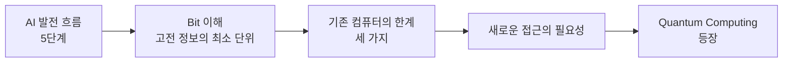

> [!abstract] 한 줄 요약
> 양자 컴퓨팅은 더 빠른 컴퓨터를 만들려는 시도가 아니라, **정보를 담는 방식 자체를 바꾸려는 시도**다.
> 그 동기는 데이터 폭증과 Bit의 구조적 제약 두 방향에서 동시에 온다.

이 강의는 AI가 어디까지 왜는지를 먼저 보여주고, 그 밑바닥에 깔려 있는 Bit를 들여다본 뒤, 그 Bit가 왜 모자라는지로 마무리한다.



---

## 1. AI 발전 흐름 — 다음 단계는 어디인가

> [!quote] 슬라이드 근거
> `day02_01_why_quantum_computing_lecture.pdf` p.2

슬라이드는 AI의 발전을 다섯 단계로 줄세운다.


| 단계 | 이름 | 핵심 |
| :--: | :-- | :-- |
| 1 | AI | 규칙 기반 시스템 |
| 2 | Machine Learning | 데이터로 학습 |
| 3 | Deep Learning | 신경망 기반 학습 |
| 4 | Foundation Model | 대규모 사전학습 모델 |
| 5 | Quantum AI | 새로운 가능성 |

슬라이드는 마지막 단계를 물음표로 표시한다. 단정하지 않고 **주목받고 있다**고만 쓴 것이 이 강의의 자세다.

> [!note] 앞 단계와 5단계는 성격이 다르다
> 1→4단계는 모두 같은 하드웨어 위에서 **알고리즘과 규모**를 바꿔 온 과정이다. 반면 5단계는 연산의 물리적 토대를 바꾸자는 제안이라, 앞의 네 단계와 같은 축에 놓이는 변화가 아니다.

---

## 2. Bit — 고전 컴퓨터가 정보를 담는 방식

> [!quote] 슬라이드 근거
> `day02_01_why_quantum_computing_lecture.pdf` p.3

양자를 이야기하기 전에 대조군을 먼저 세우는 순서다. 비트(Bit)는 ==Binary Digit== 의 약자로, 고전 컴퓨터가 정보를 표현하는 가장 작은 단위다.


### Bit가 가질 수 있는 값

| 값 | 상태 | 컴퓨터 내부 |
| :--: | :-- | :-- |
| 0 | OFF / 꺼짐 | 전압 없음 |
| 1 | ON / 켜짐 | 전압 있음 |

슬라이드가 들어 준 비유는 전구다 — 꺼져 있으면 0, 켜져 있으면 1. 컴퓨터는 이 0과 1의 조합으로 **모든 정보**를 표현한다.

그런데 이 그림에서 정말 중요한 것은 맨 아래 한 줄이다.

> [!important] Bit의 구조적 제약
> Bit는 0 또는 1 중 **하나만** 가질 수 있으며, 동시에 여러 값을 가질 수 없다.

이 한 문장이 이후 모든 논의의 출발점이다. 속도가 느리다거나 메모리가 작다는 것이 아니라, 한 시점에 **하나의 값만** 담을 수 있다는 것이 고전 정보 단위의 성질이다.

---

## 3. Quantum Computing 등장 배경

> [!quote] 슬라이드 근거
> `day02_01_why_quantum_computing_lecture.pdf` p.4

슬라이드는 등장 배경을 한 문장으로 요약한다 — **더 많은 데이터를 더 빠르고 효율적으로 처리해야 하는 시대가 도래했기 때문**이다.


### 기존 컴퓨터의 한계 세 가지

| 한계 | 내용 |
| :-- | :-- |
| 데이터 폭증 | AI, 빅데이터, IoT 등으로 데이터 양이 기하급수적으로 증가 |
| 계산 복잡도 증가 | 문제가 복잡해질수록 필요한 계산 시간과 자원이 급격히 증가 |
| 고전 컴퓨터의 한계 | 비트(0 또는 1) 기반 방식으로는 해결 가능한 문제와 속도에 한계 |

앞의 둘은 수요가 늘어난 쌍이고, 셋째는 공급 쪽의 문제다. 수요가 지수적으로 늘고 공급이 선형적으로만 늘면 격차는 벌어질 수밖에 없다.

### 새로운 접근의 필요성

슬라이드는 여기서 직접 답을 주지 않고 가설을 던진다.

> [!question] 슬라이드의 질문
> 데이터를 전혀 다른 방식(양자 방식)으로 표현하고 처리한다면,
> 더 많은 정보를 동시에 다루고 복잡한 문제를 더 빠르게 해결할 수 있지 않을까?

그 가설에 대한 실제 시도가 Quantum Computing이다. 0과 1을 동시에 표현하는 ==양자 비트(큐비트)== 등 양자역학의 원리를 활용해, 기존 컴퓨터로는 어려웠던 문제를 새로운 방식으로 해결하고자 등장했다.

---

## 4. 왜 Bit를 늘리는 것으로는 안 되는가

슬라이드는 "한계가 있다"까지만 말하고 수치를 들지 않는다. 그 규모를 한 번 보면 왜 "더 많은 비트"가 답이 될 수 없는지가 드러난다.

```html preview
<div style="font-family:system-ui,sans-serif;padding:20px;color:var(--foreground)">
  <h3 style="margin:0 0 4px;font-size:15px;font-weight:600">n개 입자의 상태를 고전적으로 저장하려면</h3>
  <p style="margin:0 0 16px;font-size:13px;color:var(--muted-foreground)">
    필요한 복소수의 개수 = 2<sup>n</sup>. 막대는 로그 스케일이다.
  </p>
  <div id="exp"></div>
  <script>
    var d = [[10, '1,024'], [20, '약 100만'], [30, '약 10억'],
             [40, '약 1조'], [50, '약 1000조']];
    document.getElementById('exp').innerHTML = d.map(function (x, i) {
      var w = (i + 1) * 20;
      return '<div style="display:flex;align-items:center;gap:12px;margin-bottom:10px">' +
        '<span style="width:64px;font-size:13px;text-align:right">n = ' + x[0] + '</span>' +
        '<div style="flex:1;height:24px;border-radius:var(--radius);overflow:hidden;' +
        'background:var(--border)">' +
        '<div style="width:' + w + '%;height:100%;background:var(--chart-' + (i % 5 + 1) + ')"></div></div>' +
        '<span style="width:96px;font-size:13px;font-weight:600">' + x[1] + '</span></div>';
    }).join('');
  </script>
</div>
```

<details>
<summary>지수 폭발이 의미하는 것 (강의 범위 밖 보충)</summary>

분자나 재료를 시뮬레이션할 때, 전자 $n$ 개가 얽힌 상태를 정확히 기술하려면 $2^n$ 개의 복소수 진폭이 필요하다.

$n = 50$ 이면 $2^{50} \approx 1.1 \times 10^{15}$ 개이고, 각각을 16바이트 복소수로 저장하면 약 $1.8 \times 10^{16}$ 바이트 — **18페타바이트**다. 전자 하나를 더 추가할 때마다 이 수치가 두 배가 된다.

이것이 바로 문제의 성격이다. 메모리를 두 배로 늘려도 다룰 수 있는 입자는 **하나** 늘어난다. 선형적인 자원 증가로 지수적인 문제를 따라잡을 수는 없다.

파인만(Richard Feynman)은 1982년에 이 관찰을 뒤집어 제안했다 — 양자계를 시뮬레이션하기 어렵다면, 시뮬레이터 자체를 양자계로 만들면 되지 않는가.

</details>

> [!tip] 다음 노트로 이어지는 지점
> 여기까지는 "왜 필요한가"에 대한 답이다. 그러면 큐비트는 구체적으로 Bit와 무엇이 다른가 — [03. Bit와 Qubit](<./03. Bit와 Qubit.md>) 이 바로 그 비교를 다룬다.

---

## 핵심 정리

| 개념 | 정의 | 왜 중요한가 |
| :-- | :-- | :-- |
| Bit | Binary Digit의 약자, 고전 정보의 최소 단위 | 0 또는 1 하나만 담는다는 제약이 모든 논의의 출발점 |
| 데이터 폭증 | AI·빅데이터·IoT로 인한 기하급수적 증가 | 새로운 계산 방식을 요구하는 수요 측 압력 |
| 계산 복잡도 | 문제 크기에 따른 자원 증가율 | 지수적 증가는 선형적 자원으로 따라잡을 수 없다 |
| Quantum Computing | 양자역학 원리로 정보를 표현·처리하는 방식 | 빠른 컴퓨터가 아니라 **다른 방식의** 컴퓨터 |

## 관련 개념

- **applies** — [03. Bit와 Qubit](<./03. Bit와 Qubit.md>) : 여기서 직후에 Bit와 Qubit을 정면으로 비교한다
- **contrasts** — [01. 표현력의 한계](<./01. 표현력의 한계.md>) : 같은 한계를 하드웨어가 아닌 모델 관점에서 다룬다
- **applies** — [09. Quantum Circuit](<./09. Quantum Circuit.md>) : 큐비트 수에 따른 $2^{n}$ 증가가 이 배경의 수치적 근거다

> [!question]- 스스로 점검
> **Q1.** "Bit는 동시에 여러 값을 가질 수 없다"는 것은 기술적 한계인가, 정의상의 성질인가?
>
> **A1.** 정의상의 성질이다. Bit는 이진 값 하나를 담는 단위로 정의된다. 따라서 공정을 개선해도 이 성질은 바뀌지 않으며, 바꾸려면 **단위 자체를 바꿔야 한다**. 그것이 큐비트다.
>
> **Q2.** 양자 컴퓨터는 모든 계산을 더 빠르게 하는가?
>
> **A2.** 아니다. 슬라이드도 "기존 컴퓨터로는 어려웠던 문제"라고 범위를 제한해 쓴다. 문서 편집이나 웹 서핑 같은 일상적 작업은 고전 컴퓨터가 훨씬 빠르고 저렴하다. 양자가 유리한 것은 상태 공간이 지수적으로 커지는 특정 문제들이다.
>
> **Q3.** 5단계가 물음표로 표시된 것은 무엇을 뜻하는가?
>
> **A3.** Quantum AI는 아직 확립된 단계가 아니라 탐색 중인 방향이라는 뜻이다. 앞의 네 단계는 이미 산업에서 작동하고 있지만 5단계는 연구 단계에 가깝다.

## 출처

- `01.quantum-foundations/01.why-quantum-and-qml/day02_01_why_quantum_computing_lecture.pdf` (5p)
- 강의 인용 출처: Microsoft Azure Quantum; IBM Quantum Learning; Quantum Computing Introduction; Computer Architecture; Qiskit Documentation
- 슬라이드 이미지: `assets/day02_01-p002.png`, `p003`, `p004` (p.1 표지·p.5 마무리는 내용 없음)
