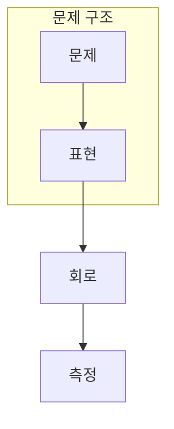

> [!abstract] 한 줄 요약
> 양자 컴퓨팅은 모든 계산을 대체하는 답이 아니라, 특정 정보 구조를 다른 방식으로 다루는 계산 모델이다.

## 이 노트의 지도



## 핵심 질문

고전 비트의 집적 한계와 데이터 규모 증가는 새로운 계산 모델을 탐색하는 배경이지만, 알고리즘 적합성은 별도 질문이다. ==적합성==를 결과와 구분해 추적한다.


<details>
<summary>양자 계산이 필요한 문제를 어떻게 고를까?</summary>

문제의 입력·출력·알고리즘·오류 비용을 고전 기준선과 함께 비교해야 한다.

</details>


## 비교하거나 측정할 값

```html preview
<div style="font-family:system-ui,sans-serif;padding:20px">
  <div id="cards" style="display:flex;gap:14px;flex-wrap:wrap"></div>
  <script>
    var stats = [["물리","한계","집적 제약","var(--chart-1)"],["구조","알고리즘","문제 적합성","var(--chart-2)"],["평가","기준선","공정 비교","var(--chart-3)"]];
    document.getElementById('cards').innerHTML = stats.map(function (s) {
      return '<div style="flex:1;min-width:150px;padding:16px;background:var(--card);' +
        'color:var(--card-foreground);border:1px solid var(--border);' +
        'border-radius:var(--radius)">' +
        '<div style="font-size:13px;color:var(--muted-foreground)">' + s[0] + '</div>' +
        '<div style="font-size:26px;font-weight:700;margin-top:4px">' + s[1] + '</div>' +
        '<div style="font-size:12px;font-weight:600;margin-top:4px;color:' + s[3] + '">' +
        s[2] + '</div>' +
        '</div>';
    }).join('');
  </script>
</div>
```

<Tabs>
  <Tab label="배경">기술 배경을 구분한다.</Tab>
  <Tab label="알고리즘">문제 구조를 확인한다.</Tab>
  <Tab label="평가">고전 기준선과 비교한다.</Tab>
</Tabs>

> [!caution] 해석의 범위
> 카드는 장점의 순위가 아니라 판단 항목의 구분이다.

## 핵심 정리

| 요소 | 확인 질문 | 의미 |
| :-- | :-- | :-- |
| 입력 | 무엇을 넣는가 | 배경 |
| 변환 | 무엇이 바뀌는가 | 구조 |
| 관측 | 무엇을 읽는가 | 검증 |

> [!question]- 스스로 점검
> **Q.** 양자라는 단어만으로 계산상 이점을 주장할 수 없는 이유는?
>
> **A.** 문제 구조와 고전 대비 비용이 맞는지 별도로 검증해야 하기 때문이다.

## 출처

- 공개 노트에는 원본 강의 자료, 자산 이미지, 페이지 단위 근거를 포함하지 않는다.
