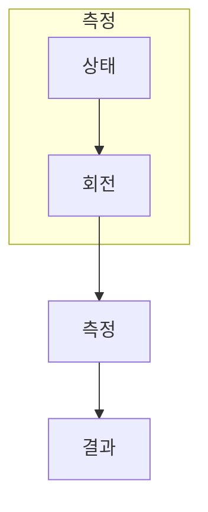

> [!abstract] 한 줄 요약
> 큐비트는 두 값을 동시에 읽는 저장소가 아니라, 측정 전 상태를 확률적으로 표현하는 물리 계다.

## 이 노트의 지도



## 핵심 질문

큐비트는 계산 기저에서 확률 분포를 만들며, 측정하면 하나의 결과가 나온다. ==상태 벡터==를 결과와 구분해 추적한다.

$$
|\psi\rangle=\alpha|0\rangle+\beta|1\rangle,\quad |\alpha|^2+|\beta|^2=1
$$

<details>
<summary>중첩을 두 값의 복사본으로 보면 왜 틀릴까?</summary>

측정은 한 결과를 내며, 임의의 미지 상태를 완벽히 복제하는 일반 연산도 허용되지 않는다.

</details>

```html preview
<div style="font-family:system-ui,sans-serif;padding:20px;color:var(--foreground)">
  <label for="amt" style="font-size:14px;font-weight:600">상태 1 확률 </label>
  <div id="out" style="font-size:30px;font-weight:700;color:var(--chart-1);margin:6px 0">50%</div>
  <input id="amt" type="range" min="0" max="100" step="1" value="50"
    style="width:100%;accent-color:var(--primary)" />
  <p style="font-size:13px;color:var(--muted-foreground)">확률은 측정 전 상태의 분포를 설명하는 값이다.</p>
  <script>
    var amt = document.getElementById('amt');
    var out = document.getElementById('out');
    amt.addEventListener('input', function () {
      out.textContent = '' + Number(amt.value).toLocaleString() + '%';
    });
  </script>
</div>
```

## 비교하거나 측정할 값


<Tabs>
  <Tab label="상태">진폭으로 상태를 표현한다.</Tab>
  <Tab label="측정">확률적으로 한 결과를 얻는다.</Tab>
  <Tab label="복제">임의 상태를 일반적으로 복제할 수 없다.</Tab>
</Tabs>

> [!caution] 해석의 범위
> 50 대 50 막대는 한 특정 상태의 예시이며 모든 큐비트의 기본값이 아니다.

## 핵심 정리

| 요소 | 확인 질문 | 의미 |
| :-- | :-- | :-- |
| 입력 | 무엇을 넣는가 | 진폭 |
| 변환 | 무엇이 바뀌는가 | 측정 |
| 관측 | 무엇을 읽는가 | 제약 |

> [!question]- 스스로 점검
> **Q.** 큐비트를 ‘0과 1을 동시에 읽는다’고 말하면 무엇이 빠지는가?
>
> **A.** 측정하면 하나의 결과만 얻고, 그 전에는 확률 진폭으로 상태를 설명한다는 점이다.

## 출처

- 공개 노트에는 원본 강의 자료, 자산 이미지, 페이지 단위 근거를 포함하지 않는다.
