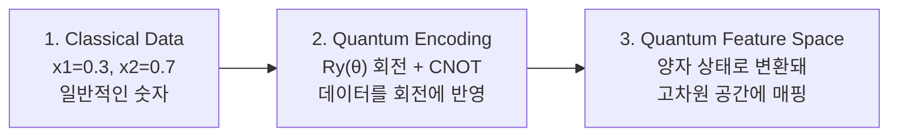

> [!abstract] 한 줄 요약
> 머신러닝은 **Feature Space 안에서 데이터를 구분하는 문제**다.
> 그렇다면 공간을 바꾸면 문제가 쉬워진다 — 그것이 Quantum Feature Space의 발상이다.

## Feature Space란

데이터의 특징(Feature)들을 **축으로 삼아** 표현하는 공간이다. 슬라이드의 예시는 공부시간과 출석률로 합격 여부를 가르는 문제다.

```html preview
<div style="font-family:system-ui,sans-serif;padding:20px;color:var(--foreground)">
  <div style="display:flex;gap:24px;align-items:flex-start;flex-wrap:wrap">
    <div style="min-width:240px">
      <div style="font-size:13px;font-weight:600;margin-bottom:10px">Feature Space (2차원)</div>
      <svg viewBox="0 0 240 190" style="width:240px;height:190px">
        <line x1="40" y1="160" x2="225" y2="160" stroke-width="1.5" style="stroke: var(--border)" />
        <line x1="40" y1="160" x2="40" y2="20" stroke-width="1.5" style="stroke: var(--border)" />
        <text x="36" y="175" font-size="10" style="fill: var(--muted-foreground)">0</text>
        <text x="126" y="175" font-size="10" style="fill: var(--muted-foreground)">5</text>
        <text x="212" y="175" font-size="10" style="fill: var(--muted-foreground)">10</text>
        <text x="148" y="188" font-size="10" style="fill: var(--muted-foreground)">공부시간</text>
        <text x="18" y="96" font-size="10" style="fill: var(--muted-foreground)">50</text>
        <text x="14" y="34" font-size="10" style="fill: var(--muted-foreground)">100</text>
        <text x="30" y="14" font-size="10" style="fill: var(--muted-foreground)">출석률</text>
        <line x1="70" y1="36" x2="200" y2="140" stroke-dasharray="5 4" stroke-width="1.8"
          style="stroke: var(--muted-foreground)" />
        <circle cx="77" cy="104" r="6" style="fill: var(--chart-5)" />
        <circle cx="114" cy="84" r="6" style="fill: var(--chart-5)" />
        <circle cx="151" cy="54" r="6" style="fill: var(--chart-1)" />
        <circle cx="188" cy="44" r="6" style="fill: var(--chart-1)" />
        <circle cx="216" cy="34" r="6" style="fill: var(--chart-1)" />
      </svg>
      <div style="display:flex;gap:14px;font-size:12px;color:var(--muted-foreground)">
        <span><span style="display:inline-block;width:9px;height:9px;border-radius:50%;background:var(--chart-1)"></span> 합격</span>
        <span><span style="display:inline-block;width:9px;height:9px;border-radius:50%;background:var(--chart-5)"></span> 불합격</span>
      </div>
    </div>
    <div style="flex:1;min-width:210px">
      <div style="font-size:13px;font-weight:600;margin-bottom:10px">예시 데이터</div>
      <table style="border-collapse:collapse;font-size:13px;width:100%">
        <tr style="background:var(--card)">
          <th style="padding:6px 10px;border:1px solid var(--border);text-align:left">공부시간</th>
          <th style="padding:6px 10px;border:1px solid var(--border);text-align:left">출석률</th>
          <th style="padding:6px 10px;border:1px solid var(--border);text-align:left">결과</th>
        </tr>
        <tr><td style="padding:6px 10px;border:1px solid var(--border)">2</td><td style="padding:6px 10px;border:1px solid var(--border)">60</td><td style="padding:6px 10px;border:1px solid var(--border);color:var(--chart-5)">불합격</td></tr>
        <tr><td style="padding:6px 10px;border:1px solid var(--border)">4</td><td style="padding:6px 10px;border:1px solid var(--border)">70</td><td style="padding:6px 10px;border:1px solid var(--border);color:var(--chart-5)">불합격</td></tr>
        <tr><td style="padding:6px 10px;border:1px solid var(--border)">6</td><td style="padding:6px 10px;border:1px solid var(--border)">85</td><td style="padding:6px 10px;border:1px solid var(--border);color:var(--chart-1)">합격</td></tr>
        <tr><td style="padding:6px 10px;border:1px solid var(--border)">8</td><td style="padding:6px 10px;border:1px solid var(--border)">90</td><td style="padding:6px 10px;border:1px solid var(--border);color:var(--chart-1)">합격</td></tr>
        <tr><td style="padding:6px 10px;border:1px solid var(--border)">10</td><td style="padding:6px 10px;border:1px solid var(--border)">95</td><td style="padding:6px 10px;border:1px solid var(--border);color:var(--chart-1)">합격</td></tr>
      </table>
    </div>
  </div>
</div>
```

> [!important] 머신러닝을 한 문장으로
> 머신러닝은 **Feature Space 안에서 데이터를 구분(분류)하는 문제**다.

이 예시는 직선 하나로 깔끔하게 나뉜다. 문제는 그렇지 않은 경우다.

## 왜 표현력이 중요한가

슬라이드는 [01. 표현력의 한계](<./01. 표현력의 한계.md>) 에서 봤던 XOR을 다시 가져온다.

| 단계 | 상황 |
| :-- | :-- |
| 2차원 공간 | 직선(선형 경계)으로는 두 클래스를 구분할 수 없음 |
| 더 높은 차원 | $x_3$ 축을 더하면 **간단한 평면으로 분리 가능** |

> [!tip] 핵심 메시지
> 좋은 Feature Space는 ==복잡한 문제를 단순하게== 만들어, 모델의 성능을 크게 향상시킨다.

모델을 더 복잡하게 만드는 대신 **문제를 쉬운 공간으로 옮기는** 접근이다.

## Quantum Feature Space의 등장

고전 데이터를 **양자 상태로 변환하여 표현하는 새로운 데이터 공간**이다. 세 단계를 거친다.



| 단계 | 하는 일 |
| :-- | :-- |
| Classical Data | 입력 데이터 — 평범한 숫자 |
| Quantum Encoding | 데이터를 **회전각에 반영**해 양자 회로에 입력 |
| Quantum Feature Space | 양자 상태(벡터)로 변환돼 **더 높은 차원의 공간에 매핑** |

> [!important] 슬라이드의 결론
> QML은 데이터를 양자 회로를 통해 양자 상태로 변환하고, 그 상태를 **고차원 Quantum Feature Space에서 표현**한다.

```html preview h=180
<div style="font-family:system-ui,sans-serif;padding:14px;color:var(--foreground);background:var(--card);border:1px solid var(--border);border-radius:var(--radius)">
<svg viewBox="0 0 720 132" width="100%" role="img" aria-label="원래 공간에서 섞인 두 클래스를 변환 뒤 더 쉽게 나누는 독자 제작 도식">
<text x="18" y="23" font-size="15" font-weight="700" fill="currentColor">특징 공간의 목적은 데이터를 더 쉽게 구분되는 좌표로 옮기는 것이다</text>
<g transform="translate(66 49)" font-family="system-ui,sans-serif"><g><rect width="178" height="66" rx="11" fill="var(--card)" stroke="var(--border)"/><circle cx="45" cy="44" r="8" fill="var(--chart-1)"/><circle cx="73" cy="27" r="8" fill="var(--chart-5)"/><circle cx="106" cy="43" r="8" fill="var(--chart-1)"/><circle cx="139" cy="23" r="8" fill="var(--chart-5)"/><text x="89" y="89" text-anchor="middle" font-size="12" fill="var(--muted-foreground)">원래 좌표</text></g><path d="M263 33h92" stroke="var(--muted-foreground)" stroke-width="3"/><path d="M355 33l-10-7v14z" fill="var(--muted-foreground)"/><text x="281" y="19" font-size="12" fill="var(--muted-foreground)">feature map</text><g transform="translate(374)"><rect width="178" height="66" rx="11" fill="var(--card)" stroke="var(--border)"/><line x1="88" y1="7" x2="88" y2="58" stroke="var(--border)" stroke-width="2"/><circle cx="48" cy="44" r="8" fill="var(--chart-1)"/><circle cx="46" cy="22" r="8" fill="var(--chart-1)"/><circle cx="132" cy="44" r="8" fill="var(--chart-5)"/><circle cx="134" cy="22" r="8" fill="var(--chart-5)"/><text x="89" y="89" text-anchor="middle" font-size="12" fill="var(--muted-foreground)">변환된 좌표</text></g></g></svg>
</div>
```

```html preview h=175
<div style="font-family:system-ui,sans-serif;padding:14px;color:var(--foreground);background:var(--card);border:1px solid var(--border);border-radius:var(--radius)">
<svg viewBox="0 0 720 128" width="100%" role="img" aria-label="고전 입력값이 회전각을 거쳐 양자 상태 표현으로 연결되는 독자 제작 인코딩 도식">
<text x="18" y="23" font-size="15" font-weight="700" fill="currentColor">인코딩은 데이터 값을 회로가 조작할 수 있는 파라미터로 번역한다</text>
<g transform="translate(58 50)" font-family="system-ui,sans-serif"><g><rect width="152" height="52" rx="11" fill="var(--card)" stroke="var(--border)"/><text x="76" y="22" text-anchor="middle" font-size="14" font-weight="700" fill="currentColor">입력 x</text><text x="76" y="41" text-anchor="middle" font-size="12" fill="var(--muted-foreground)">정규화된 특징</text></g><path d="M169 26h61" stroke="var(--muted-foreground)" stroke-width="3"/><path d="M230 26l-10-7v14z" fill="var(--muted-foreground)"/><g transform="translate(245)"><rect width="152" height="52" rx="11" fill="var(--chart-3)"/><text x="76" y="22" text-anchor="middle" font-size="14" font-weight="700" fill="white">회전각 θ(x)</text><text x="76" y="41" text-anchor="middle" font-size="12" fill="white">회로 파라미터</text></g><path d="M406 26h61" stroke="var(--muted-foreground)" stroke-width="3"/><path d="M467 26l-10-7v14z" fill="var(--muted-foreground)"/><g transform="translate(482)"><rect width="152" height="52" rx="11" fill="var(--chart-4)"/><text x="76" y="22" text-anchor="middle" font-size="14" font-weight="700" fill="white">|ψ(x)⟩</text><text x="76" y="41" text-anchor="middle" font-size="12" fill="white">양자 특징 표현</text></g></g></svg>
</div>
```

## 핵심 정리

| 개념 | 정의 | 왜 중요한가 |
| :-- | :-- | :-- |
| Feature Space | 특징을 축으로 삼는 데이터 공간 | 분류란 이 공간을 가르는 일 |
| 표현력 | 공간이 문제를 쉬운 모양으로 만드는 정도 | 모델을 바꾸지 않고 성능을 올리는 길 |
| Quantum Encoding | 데이터를 회전각으로 바꿔 회로에 입력 | 고전과 양자를 잇는 다리 |
| Quantum Feature Space | 양자 상태로 표현된 고차원 공간 | QML이 기대는 표현력의 무대 |

## 관련 개념

- **prerequisite** — [03. Bit와 Qubit](<./03. Bit와 Qubit.md>) : 양자 상태 표기를 먼저 알아야 한다
- **applies** — [01. 표현력의 한계](<./01. 표현력의 한계.md>) : 여기서 막힌 XOR을 고차원으로 푸는 것이 이 노트의 주제다
- **applies** — [05. QML에서 Quantum의 역할](<./05. QML에서 Quantum의 역할.md>) : Encoding과 Feature Map을 4단계 구조 안에 배치한다
- **applies** — [10. Quantum Circuit과 QML](<./10. Quantum Circuit과 QML.md>) : 이 공간으로 보내는 회로를 직접 조립한다

> [!question]- 스스로 점검
> **Q.** 고차원으로 올리는 것은 고전 머신러닝에도 있는 기법 아닌가?
>
> **A.** 맞다 — 커널 트릭이 그것이고, 슬라이드의 출처에도 Kernel Trick 이 적혀 있다. 양자가 기대받는 지점은 $n$ 큐비트로 $2^{n}$ 차원을 다룬다는 규모의 차이다.

## 출처


- 강의 인용 출처: Pattern Recognition and Machine Learning; The Elements of Statistical Learning; IBM Quantum — Quantum Machine Learning; Kernel Trick
