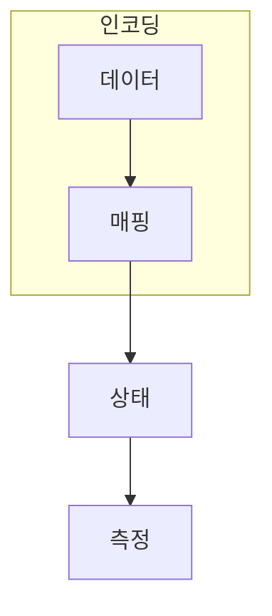

> [!abstract] 한 줄 요약
> Feature map은 입력을 더 큰 공간으로 던지는 마술이 아니라, 측정 가능한 구분 구조를 설계하는 선택이다.

## 이 노트의 지도



## 핵심 질문

입력 $x$를 상태로 옮긴 뒤 어떤 회로를 적용하고 무엇을 측정할지까지가 하나의 특징 공간 설계다. ==매핑==를 결과와 구분해 추적한다.

$$
x\mapsto|\phi(x)\rangle
$$

<details>
<summary>특징 공간이 커지면 무엇을 잃을 수 있을까?</summary>

회로 깊이와 측정 비용이 늘고, 실제 데이터 분류에 유용한 차이가 생기지 않을 수도 있다.

</details>


## 비교하거나 측정할 값

```html preview
<div style="font-family:system-ui,sans-serif;padding:20px">
  <div id="cards" style="display:flex;gap:14px;flex-wrap:wrap"></div>
  <script>
    var stats = [["입력","x","특징 선택","var(--chart-1)"],["매핑","φ(x)","상태 준비","var(--chart-2)"],["측정","값","학습 신호","var(--chart-3)"]];
    document.getElementById('cards').innerHTML = stats.map(function (s) {
      return '<div style="flex:1;min-width:150px;padding:16px;background:var(--card);' +
        'color:var(--card-foreground);border:1px solid var(--border);' +
        'border-radius:var(--radius)">' +
        '<div style="font-size:13px;color:var(--muted-foreground)">' + s[0] + '</div>' +
        '<div style="font-size:26px;font-weight:700;margin-top:4px">' + s[1] + '</div>' +
        '<div style="font-size:12px;font-weight:600;margin-top:4px;color:' + s[3] + '">' +
        s[2] + '</div>' +
        '</div>';
    }).join('');
  </script>
</div>
```

<Tabs>
  <Tab label="입력">고전 특징을 고른다.</Tab>
  <Tab label="매핑">상태로 옮기는 회로를 정한다.</Tab>
  <Tab label="측정">학습에 쓸 값을 꺼낸다.</Tab>
</Tabs>

> [!caution] 해석의 범위
> 카드는 인코딩의 순서를 요약하며 성능 우위를 뜻하지 않는다.

## 핵심 정리

| 요소 | 확인 질문 | 의미 |
| :-- | :-- | :-- |
| 입력 | 무엇을 넣는가 | 선택 |
| 변환 | 무엇이 바뀌는가 | 변환 |
| 관측 | 무엇을 읽는가 | 관측 |

> [!question]- 스스로 점검
> **Q.** 좋은 feature map의 최소 조건은 무엇인가?
>
> **A.** 데이터에 유용한 차이를 만들고 측정·학습 비용 안에서 평가 가능해야 한다.

## 출처

- 공개 노트에는 원본 강의 자료, 자산 이미지, 페이지 단위 근거를 포함하지 않는다.
