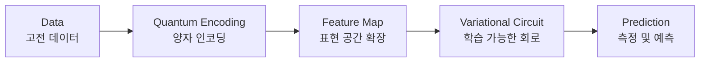

> [!abstract] 한 줄 요약
> QML의 핵심 가치는 **계산 속도가 아니라 데이터를 표현하는 방식의 확장**에 있다.
> 이 노트는 그 확장이 어느 단계에서 일어나는지를 네 가지로 나누어 본다.

## QML의 네 단계

> [!quote] 슬라이드 근거
> `pdf/day02_04_quantum_role_in_qml_lecture.pdf` p.2



| 단계 | 역할 |
| :-- | :-- |
| Quantum Encoding | 고전 데이터를 양자 상태로 변환 |
| Feature Map | 표현 공간을 확장하여 데이터 표현력 향상 |
| Variational Circuit | 학습 가능한 양자 모델 (파라미터 최적화) |
| Measurement | 양자 상태 측정 → 예측 결과 반환 |

> [!important] 슬라이드가 밑줄 친 문장
> QML의 핵심 가치는 계산 속도가 아니라 ==데이터를 표현하는 방식의 확장== 에 있다.

이 문장이 이 과정 전체를 관통한다. "양자라서 빠르다"가 아니라 "양자라서 다르게 표현한다"다.

## 단계별로 보기

<Tabs>
  <Tab label="1 · Encoding">

> 슬라이드 p.4

**Quantum Encoding은 고전 데이터를 양자 상태(큐비트의 상태)로 변환하는 과정**이다.

슬라이드의 예시는 숫자 두 개를 회전각으로 바꾸는 것이다.

$$
[0.2,\; 0.8] \;\xrightarrow{\;R_y(\theta_1),\, R_y(\theta_2)\;}\; \lvert \psi \rangle
$$

일반 컴퓨터가 이해하는 숫자 데이터가 회로 연산을 거쳐 양자 컴퓨터가 이해하는 큐비트 상태가 된다.

> [!tip] 핵심 포인트
> Encoding은 QML의 첫 단계이자, 고전 데이터를 양자 세계로 전달하는 **다리** 역할을 한다.

  </Tab>
  <Tab label="2 · Feature Map">

> 슬라이드 p.5

**Feature Map은 데이터를 더 풍부한 표현 공간(특징 공간)으로 이동시켜주는 과정**이다.

저차원에서는 경계가 구불가능해도, 차원을 올리면 나누어질 수 있다.

> [!tip] 핵심 메시지
> Feature Map은 계산 속도보다 **데이터의 표현력(구분 능력)을 확장**하는 것이 핵심이다.

  </Tab>
  <Tab label="3 · Variational">

> 슬라이드 p.9

**Variational Circuit은 파라미터 $\theta$ 를 가진 양자 회로로, 파라미터 값을 조절하면서 모델의 성능을 최적화**한다.

| 구성요소 | 설명 |
| :-- | :-- |
| 파라미터 $\theta$ | 회로의 회전 각도 등을 결정하는 값 |
| 가변(Variational) | 파라미터 값을 바꾸어가며 최적값을 탐색 |
| 측정 | 회로의 출력(확률 분포 등)을 얻음 |

역할은 세 가지다 — 모델 표현력 향상(Feature Map만으로는 어려운 패턴 학습), 손실 함수 최소화의 최적화 대상, 그리고 모델 성능을 좌우하는 핵심 요소.

  </Tab>
  <Tab label="4 · Measurement">

> 슬라이드 p.10

**Measurement는 양자 회로의 최종 단계에서 양자 상태를 고전적 비트 값(0 또는 1)으로 변환하는 과정**이다.

1. 회로를 통과한 뒤 양자 상태 $\lvert \psi \rangle$ 가 만들어진다
2. 각 큐비트를 측정해 0 또는 1을 얻는다
3. 결과는 비트열(`01011...`)로 변환돼 후속 처리나 손실 함수 계산에 쓰인다

> [!note] 끝이 아니라 시작점
> 측정은 모델의 예측·손실 계산·파라미터 업데이트의 **시작점**이 된다.

  </Tab>
</Tabs>

## 데이터로 보기 — 차원을 올리면 왜 나눠지는가

Feature Map의 핵심을 그림 하나로 율이면 이렇다.

```html preview
<div style="font-family:system-ui,sans-serif;padding:20px;color:var(--foreground)">
  <div style="display:flex;gap:20px;align-items:center;flex-wrap:wrap">
    <div style="flex:1;min-width:220px">
      <div style="font-size:13px;font-weight:600;margin-bottom:8px">기존 표현 공간 (저차원)</div>
      <svg viewBox="0 0 200 160" style="width:100%;height:auto;border:1px solid var(--border);border-radius:var(--radius)">
        <circle cx="55" cy="45" r="5" style="fill: var(--chart-1)" />
        <circle cx="40" cy="80" r="5" style="fill: var(--chart-1)" />
        <circle cx="70" cy="105" r="5" style="fill: var(--chart-1)" />
        <circle cx="85" cy="65" r="5" style="fill: var(--chart-1)" />
        <circle cx="110" cy="50" r="5" style="fill: var(--chart-5)" />
        <circle cx="135" cy="85" r="5" style="fill: var(--chart-5)" />
        <circle cx="115" cy="110" r="5" style="fill: var(--chart-5)" />
        <circle cx="150" cy="55" r="5" style="fill: var(--chart-5)" />
        <path d="M100,15 C88,55 112,105 98,145" stroke-dasharray="5 4" stroke-width="2"
          style="fill: none; stroke: var(--muted-foreground)" />
      </svg>
      <div style="font-size:12px;color:var(--muted-foreground);margin-top:6px">
        경계가 휘어져 있어 직선으로 가를 수 없다
      </div>
    </div>
    <div style="font-size:24px;color:var(--chart-2);font-weight:700">&rarr;</div>
    <div style="flex:1;min-width:220px">
      <div style="font-size:13px;font-weight:600;margin-bottom:8px">확장된 표현 공간 (고차원)</div>
      <svg viewBox="0 0 200 160" style="width:100%;height:auto;border:1px solid var(--border);border-radius:var(--radius)">
        <polygon points="20,95 180,60 180,80 20,115" style="fill: var(--chart-2); opacity:0.25" />
        <circle cx="50" cy="45" r="5" style="fill: var(--chart-1)" />
        <circle cx="85" cy="38" r="5" style="fill: var(--chart-1)" />
        <circle cx="120" cy="30" r="5" style="fill: var(--chart-1)" />
        <circle cx="70" cy="58" r="5" style="fill: var(--chart-1)" />
        <circle cx="60" cy="128" r="5" style="fill: var(--chart-5)" />
        <circle cx="95" cy="120" r="5" style="fill: var(--chart-5)" />
        <circle cx="130" cy="112" r="5" style="fill: var(--chart-5)" />
        <circle cx="155" cy="105" r="5" style="fill: var(--chart-5)" />
      </svg>
      <div style="font-size:12px;color:var(--muted-foreground);margin-top:6px">
        평면 하나로 깔끔하게 나뉘어진다
      </div>
    </div>
  </div>
</div>
```

같은 데이터다. 바뀐 것은 **보는 공간**이다.

## Classical ML 과 어떻게 다른가

<details>
<summary>일곱 항목 전체 비교 (슬라이드 p.3)</summary>

| 비교 항목 | Classical ML | QML |
| :-- | :-- | :-- |
| 데이터 표현 | 고전 비트(0 또는 1) | 큐비트의 중첩 상태 (0과 1을 동시에) |
| 연산 방식 | 행렬 연산 등 순차적 연산 | 양자 중첩과 얽힘을 이용한 병렬적 연산 |
| 모델 구성 | 다층 신경망 등 고전적 모델 | 양자 회로(파라미터화 회로) 이용 모델 |
| 학습 방식 | 경사하강법 등 고전적 최적화 | 파라미터를 조절하며 손실 함수 최소화 (Variational) |
| 계산 자원 | 일반 CPU / GPU | 양자 컴퓨터(큐비트) |
| 강점 | 성숙한 기술, 다양한 분야 적용, 데이터가 많을 때 강력 | 특정 문제에서 지수적 속도 향상 가능성, 복잡한 패턴을 효율적으로 표현 |
| 한계 | 데이터 차원의 저주, 복잡한 문제에서 연산 비용 증가 | 양자 하드웨어의 제약, 노이즈에 민감, 아직 초기 연구 단계 |

</details>

> [!caution] 과장해서 읽지 말 것
> 슬라이드는 QML의 한계를 명시한다 — **하드웨어 제약, 노이즈 민감, 아직 초기 연구 단계**.
> "지수적 속도 향상"도 모든 문제가 아니라 **특정 문제에서의 가능성**으로 적혀 있다.

## 실습 — Feature Map 만들어 보기

> [!quote] 슬라이드 근거
> `pdf/day02_04_quantum_role_in_qml_lecture.pdf` p.6–8

```bash
pip install pylatexenc matplotlib
```

```python
from qiskit.circuit.library import zz_feature_map
import matplotlib.pyplot as plt

feature_map = zz_feature_map(feature_dimension=2)
print(feature_map)
```

출력된 회로는 다음 모양이다.

```text
q_0: ─H──P(x[0])──■────────
        │
q_1: ─H──P(x[1])──■────────
```

게이트 하나하나가 맡은 일이 있다.

| 게이트 | 역할 |
| :-- | :-- |
| `H` | 데이터를 넣기 전 양자 상태를 준비 |
| `P(x[i])` | 데이터를 회로 안에 넣어줌 |
| `CNOT` (`■`) | 각 특징이 서로 **관계**를 가지도록 만드는 과정 |

> [!important] 이 회로는 학습하지 않는다
> 슬라이드가 따옴표까지 붙여 강조한 문장이다 — *"방금 생성한 회로는 학습 회로가 아닙니다. 이 회로는 데이터를 양자 공간으로 보내기 위한 회로입니다."*
> 즉 Data → Feature Map 단계만 수행한다.

회로를 그림으로 보려면 `draw` 를 쓴다.

```python
feature_map.draw("mpl")
plt.show()
```

> [!note] 반복이 표현력을 늘린다
> 같은 변환을 여러 번 반복하면 더 복잡한 표현 공간을 구성할 수 있다. `reps` 인자가 그 횟수다.

## 핵심 정리

| 개념 | 정의 | 왜 중요한가 |
| :-- | :-- | :-- |
| QML 4단계 | Encoding → Feature Map → Variational → Measurement | 이후 모든 노트가 이 네 칸 중 어딘가를 다룬다 |
| Quantum Encoding | 고전 데이터 → 양자 상태 | 양자 세계로 들어가는 유일한 입구 |
| Feature Map | 표현 공간 확장 | QML의 가치가 속도가 아니라 표현이라는 근거 |
| Variational Circuit | 파라미터 $\theta$ 를 가진 가변 회로 | 유일하게 학습되는 부분 |
| Measurement | 양자 상태 → 고전 비트열 | 예측·손실·갱신의 시작점 |

## 관련 개념

- **prerequisite** — [04. Quantum Feature Space](<./04. Quantum Feature Space.md>) : 표현 공간이 왜 고차원이 되는지의 근거
- **applies** — [06. Hadamard Gate](<./06. Hadamard Gate.md>) : Feature Map 회로 먼 앞에 서는 H 게이트
- **applies** — [10. Quantum Circuit과 QML](<./10. Quantum Circuit과 QML.md>) : 여기서 만든 Feature Map 뒤에 Ansatz를 붙여 실제 QML 회로를 완성한다
- **contrasts** — [01. 표현력의 한계](<./01. 표현력의 한계.md>) : 고전 모델의 표현력 한계가 이 네 단계의 출발 동기다

> [!question]- 스스로 점검
> **Q1.** 네 단계 중 학습되는 것은 어느 단계인가?
>
> **A1.** Variational Circuit 하나뿐이다. Encoding과 Feature Map은 고정된 변환이고, Measurement는 결과를 꺼내는 연산이다.
>
> **Q2.** "QML은 빠르다"는 설명이 왜 부정확한가?
>
> **A2.** 슬라이드가 명시한 핵심 가치는 속도가 아니라 표현 방식의 확장이다. 속도 향상은 특정 문제에 한정된 가능성으로 적혀 있다.

## 출처

- `pdf/day02_04_quantum_role_in_qml_lecture.pdf` (11p)
- 강의 인용 출처: IBM Quantum Learning; Qiskit Machine Learning Documentation
