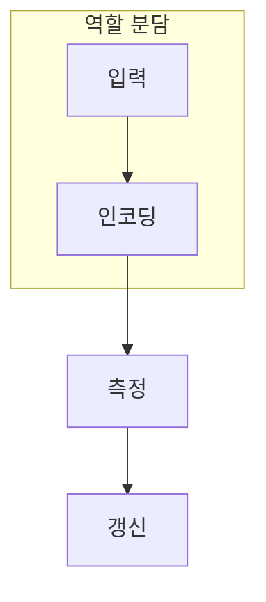

> [!abstract] 한 줄 요약
> 양자 부분은 특징 변환을 맡고, 학습 목표와 파라미터 갱신은 고전 계산과 연결되어 완성된다.

## 이 노트의 지도



## 핵심 질문

QML은 양자와 고전을 분리하는 것이 아니라, 어느 단계가 어떤 값을 만들고 소비하는지 명시하는 설계다. ==측정값==를 결과와 구분해 추적한다.

$$
f_\theta(x)=\langle\psi(x,\theta)|O|\psi(x,\theta)\rangle
$$

<details>
<summary>측정값이 없으면 무엇이 끊길까?</summary>

고전 손실 함수가 받을 수치가 없어져 회로 매개변수와 학습 목표를 연결할 수 없다.

</details>

```html preview
<div style="font-family:system-ui,sans-serif;padding:20px;color:var(--foreground)">
  <label for="amt" style="font-size:14px;font-weight:600">회로 층 </label>
  <div id="out" style="font-size:30px;font-weight:700;color:var(--chart-1);margin:6px 0">2</div>
  <input id="amt" type="range" min="1" max="8" step="1" value="2"
    style="width:100%;accent-color:var(--primary)" />
  <p style="font-size:13px;color:var(--muted-foreground)">회로 층 수는 표현력과 실행 부담을 함께 바꾼다.</p>
  <script>
    var amt = document.getElementById('amt');
    var out = document.getElementById('out');
    amt.addEventListener('input', function () {
      out.textContent = '' + Number(amt.value).toLocaleString() + '';
    });
  </script>
</div>
```

## 비교하거나 측정할 값

```html preview
<div style="font-family:system-ui,sans-serif;padding:20px;color:var(--foreground)">
  <h3 style="margin:0 0 14px;font-size:15px;font-weight:600">역할별 설계 항목</h3>
  <div id="bars" style="display:flex;align-items:flex-end;gap:14px;height:170px"></div>
  <script>
    var data = [["인코딩",3],["회로",4],["측정",2],["갱신",3]];
    var max = Math.max.apply(null, data.map(function (d) { return d[1]; }));
    document.getElementById('bars').innerHTML = data.map(function (d, i) {
      return '<div style="flex:1;display:flex;flex-direction:column;align-items:center;' +
        'gap:6px;height:100%;justify-content:flex-end">' +
        '<span style="font-size:12px;font-weight:600">' + d[1] + '</span>' +
        '<div style="width:100%;height:' + (d[1] / max * 100) + '%;' +
        'background:var(--chart-' + (i + 1) + ');' +
        'border-radius:var(--radius) var(--radius) 0 0"></div>' +
        '<span style="font-size:12px;color:var(--muted-foreground)">' + d[0] + '</span>' +
        '</div>';
    }).join('');
  </script>
</div>
```

<Tabs>
  <Tab label="인코딩">고전 입력을 상태로 옮긴다.</Tab>
  <Tab label="회로">매개변수 변환을 적용한다.</Tab>
  <Tab label="측정">고전 손실이 쓸 수치를 만든다.</Tab>
</Tabs>

> [!caution] 해석의 범위
> 막대는 학습 설계에서 점검할 역할의 상대 수이며 성능 지표가 아니다.

## 핵심 정리

| 요소 | 확인 질문 | 의미 |
| :-- | :-- | :-- |
| 입력 | 무엇을 넣는가 | 입력 |
| 변환 | 무엇이 바뀌는가 | 변환 |
| 관측 | 무엇을 읽는가 | 신호 |

> [!question]- 스스로 점검
> **Q.** QML에서 양자 회로만으로 학습이 끝나지 않는 이유는?
>
> **A.** 측정값을 고전 손실과 최적화 루프에 연결해야 하기 때문이다.

## 출처

- 공개 노트에는 원본 강의 자료, 자산 이미지, 페이지 단위 근거를 포함하지 않는다.
