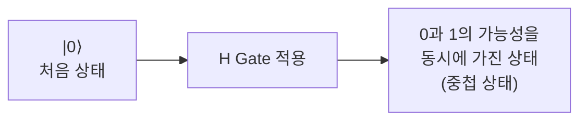
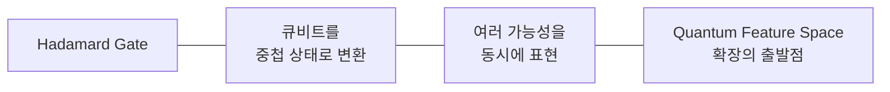

> [!abstract] 한 줄 요약
> H Gate는 "50 대 50을 만드는 게이트"가 **아니다.**
> 큐비트를 새로운 표현 공간으로 보내는 **첫 번째 변환 도구**다.

## 왜 Quantum Gate가 필요한가

> [!quote] 슬라이드 근거
> `pdf/day05_03_hadamard_gate_concepts_lecture.pdf` p.2

질문은 단순하다 — 고전 컴퓨터는 Bit를 $0 \leftrightarrow 1$ 로 바꿀 수 있는데, 양자 컴퓨터에서는 큐비트를 어떻게 바꾸는가.

| | Classical Computer | Quantum Computer |
| :-- | :-- | :-- |
| 다루는 것 | Bit — 하나의 **값(Value)** | Qubit — **상태(State)** |
| 변경 방식 | 0 → 1 또는 1 → 0 | Quantum Gate를 적용 |
| 결과 | 값을 명확하게 변경 | 0·1·중첩·얽힘 중 무엇이든 될 수 있음 |

바로 그것이 ==Quantum Gate== 다.

## Quantum Gate란

> [!important] 가장 중요한 한 줄
> Quantum Gate는 큐비트의 **값을 바꾸는 것이 아니라 상태를 변화시키는 연산**이다.

$\lvert 0 \rangle$ 에 Gate를 걸면 네 가지 중 어느 것이든 될 수 있다.

| 결과 상태 | 표기 | 의미 |
| :-- | :-- | :-- |
| 0 상태 | $\lvert 0 \rangle$ | 측정 시 항상 0 |
| 1 상태 | $\lvert 1 \rangle$ | 측정 시 항상 1 |
| 중첩 상태 | $\alpha \lvert 0 \rangle + \beta \lvert 1 \rangle$ | 0과 1의 가능성을 동시에 가짐 |
| 얽힌 상태 | — | 여러 큐비트가 서로 연결된 상태 (2큐비트 이상) |

> [!tip] 슬라이드의 정의
> Quantum Gate는 **양자 상태를 설계하는 도구**이다.

## Hadamard Gate의 개념

> [!quote] 슬라이드 근거
> `pdf/day05_03_hadamard_gate_concepts_lecture.pdf` p.4

H Gate는 큐비트의 상태를 변화시켜 **중첩 상태(Superposition)를 만드는 가장 기본적인 양자 게이트**다.

$$
\lvert 0 \rangle \;\xrightarrow{\;H\;}\; \frac{\lvert 0 \rangle + \lvert 1 \rangle}{\sqrt{2}}
$$



<details>
<summary>행렬로 보기</summary>

$$
H = \frac{1}{\sqrt{2}}\begin{pmatrix} 1 & 1 \\ 1 & -1 \end{pmatrix}
$$

$\lvert 0 \rangle = \begin{pmatrix} 1 \\ 0 \end{pmatrix}$ 을 넣으면

$$
H\lvert 0 \rangle = \frac{1}{\sqrt{2}}\begin{pmatrix} 1 \\ 1 \end{pmatrix}
= \frac{\lvert 0 \rangle + \lvert 1 \rangle}{\sqrt{2}}
$$

측정 확률은 진폭의 제곱이므로 $\left(\tfrac{1}{\sqrt{2}}\right)^2 = \tfrac{1}{2}$ — 각각 50%다.

</details>

## 데이터로 보기

```html preview
<div style="font-family:system-ui,sans-serif;padding:20px;color:var(--foreground)">
  <h3 style="margin:0 0 4px;font-size:15px;font-weight:600">H Gate 전후의 가능성 구조</h3>
  <p style="margin:0 0 18px;font-size:13px;color:var(--muted-foreground)">
    값이 바뀐 게 아니라, 가능성의 분포가 바뀜다.
  </p>
  <div id="hg"></div>
  <div style="display:flex;gap:16px;margin-top:12px;font-size:12px;color:var(--muted-foreground)">
    <span><span style="display:inline-block;width:10px;height:10px;border-radius:2px;background:var(--chart-1)"></span> 0일 가능성</span>
    <span><span style="display:inline-block;width:10px;height:10px;border-radius:2px;background:var(--chart-3)"></span> 1일 가능성</span>
  </div>
  <script>
    var rows = [['|0⟩ · H 적용 전', 100], ['(|0⟩+|1⟩)/√2 · H 적용 후', 50]];
    document.getElementById('hg').innerHTML = rows.map(function (r) {
      return '<div style="display:flex;align-items:center;gap:12px;margin-bottom:11px">' +
        '<span style="width:190px;font-size:13px;text-align:right">' + r[0] + '</span>' +
        '<div style="flex:1;display:flex;height:30px;border-radius:var(--radius);overflow:hidden;' +
        'border:1px solid var(--border)">' +
        '<div style="width:' + r[1] + '%;background:var(--chart-1);display:flex;' +
        'align-items:center;justify-content:center;font-size:12px;font-weight:600;' +
        'color:var(--background)">' + r[1] + '%</div>' +
        '<div style="width:' + (100 - r[1]) + '%;background:var(--chart-3);display:flex;' +
        'align-items:center;justify-content:center;font-size:12px;font-weight:600;' +
        'color:var(--background)">' + (100 - r[1] || '') + (r[1] === 100 ? '' : '%') + '</div>' +
        '</div></div>';
    }).join('');
  </script>
</div>
```

## QML 관점에서의 H Gate

> [!quote] 슬라이드 근거
> `pdf/day05_03_hadamard_gate_concepts_lecture.pdf` p.5

이 강의의 결론이고, 이 노트에서 가장 중요한 부분이다.

> [!important] 오해 교정
> Hadamard Gate는 단순히 **50% / 50% 확률 상태를 만드는 게이트가 아니다.**
> 큐비트를 새로운 표현 공간으로 보내는 ==첫 번째 변환 도구== 다.

슬라이드는 네 가지를 등호로 이어 붙인다.



즉 H Gate는 결과가 아니라 **입구**다. 이후 Feature Map이 그 공간을 더 확장한다.

> [!note] 앞뒤 강의와의 연결
> Feature Map 회로를 출력해 보면 맨 앞에 `H` 가 서 있다. 그것이 바로 이 역할이다 — 데이터를 넣기 전에 양자 상태를 준비하는 단계.

## 핵심 정리

| 개념 | 정의 | 왜 중요한가 |
| :-- | :-- | :-- |
| Quantum Gate | 큐비트의 상태를 변화시키는 연산 | 값이 아니라 상태라는 구분이 출발점 |
| Hadamard Gate | 중첩 상태를 만드는 가장 기본 게이트 | 거의 모든 회로가 여기서 시작한다 |
| 중첩 상태 | $(\lvert 0 \rangle + \lvert 1 \rangle)/\sqrt{2}$ | 0과 1의 가능성을 동시에 가짐 |
| 표현 공간 입구 | H가 열어주는 양자 공간 | QML의 Feature Space 확장이 여기서 시작 |

## 관련 개념

- **prerequisite** — [03. Bit와 Qubit](<./03. Bit와 Qubit.md>) : 값과 상태의 차이를 먼저 세워야 한다
- **elaborates** — [08. Quantum Gate 개념](<./08. Quantum Gate 개념.md>) : H를 포함한 게이트 일반을 다룬다
- **applies** — [07. 상태변화 분석](<./07. 상태변화 분석.md>) : 여기 개념을 실제 코드로 확인하는 노트
- **applies** — [04. Quantum Feature Space](<./04. Quantum Feature Space.md>) : H가 열어준 공간을 본격적으로 다룬다

> [!question]- 스스로 점검
> **Q1.** "H Gate는 주사위처럼 50 대 50을 만드는 것"이라는 설명은 왜 부족한가?
>
> **A1.** 50:50은 측정했을 때 나타나는 결과일 뿐이다. 실제로 일어난 일은 큐비트가 새로운 표현 공간으로 옮겨간 것이고, 그 공간이 이후 Feature Map이 확장할 토대가 된다.
>
> **Q2.** Gate를 걸었는데 측정 결과가 그대로일 수도 있는가?
>
> **A2.** 있다. 상태는 바뀌었지만 해당 기저에서의 확률 분포가 같을 수 있다. [07. 상태변화 분석](<./07. 상태변화 분석.md>) 의 회로 A·B 비교가 그 사례다.

## 출처

- `pdf/day05_03_hadamard_gate_concepts_lecture.pdf` (6p)
- 강의 인용 출처: IBM Quantum Learning; Qiskit Machine Learning Documentation
